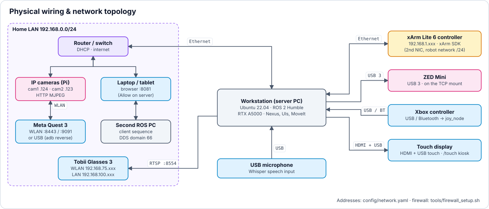

<a name="top"></a>

# 📦 Installation & Voraussetzungen

[🏠 Übersicht](../readme-de.html) · [🇬🇧 English](../en/installation.html) · Kapitel 6

**Inhalt:** [6. 📦 Abhängigkeiten & Voraussetzungen](#6--abhängigkeiten--voraussetzungen)

> [!TIP]
> **Neuer Arbeitsplatz?** Der [Setup-Guide](../operate_setup_guide.html) (DE/EN, verlinkt in der Projekt-Doku – Footer-Knopf **Projekt-Doku** der UX | Nexus Launcher, früher „Nexus Webapp“) führt als Checkliste durch alle Schritte – Hardware, Ubuntu, ROS 2, Workspace, Netzwerk, Abnahme – wahlweise für einen vorinstallierten PC.

---

## 6. 📦 Abhängigkeiten & Voraussetzungen

<br>

### Systemanforderungen

<details>
<summary><b>🔽 Tabelle anzeigen</b> · 11 Komponenten · OS · ROS 2 · MoveIt 2 · Python · ZED SDK · CUDA</summary>

| Komponente | Version / Details |
|------------|-----------------|
| **Betriebssystem** | *Ubuntu 22.04.5 LTS (Jammy)* |
| **ROS 2** | *Humble Hawksbill (LTS)* |
| **MoveIt 2** | *v2.5.9* |
| **Python** | *v3.10.12* |
| **OpenCV** | *v4.9.0* |
| **YOLO / Ultralytics** | *v8.4.61* |
| **ZED SDK** | *v4.1.2 (ZED M Firmware 1523)* |
| **CUDA** | *12.1 (nur Toolkit, siehe `tools/install_zed.sh`)* |
| **Pygame** | *v2.6.1* |
| **Build-System** | *`colcon`* |
| **Compiler** | *GCC 11+ (C++17)* |

</details>

<br>

### ⚠️ Kritische Systemkonfigurationen (Troubleshooting)

> [!WARNING]
> **1. `.bashrc` Konfiguration (CUDA & Kompatibilität mit der UX | Nexus Launcher)**
> Wenn du die ZED Kamera (CUDA) über die UX | Nexus Launcher startest, öffnet das Backend die Terminals als *non-interactive shell*. Das bedeutet, Ubuntu bricht das Laden der `~/.bashrc` extrem früh ab. Um zu verhindern, dass die ZED auf die CPU zurückfällt (massives Ruckeln!), **müssen** alle CUDA- und ROS-Pfade **ganz oben** in der `~/.bashrc` stehen (noch vor dem `case $- in *i*) ;; *) return;; esac` Block!). Beispiel für den korrekten Header der `.bashrc`:
> ```bash
> source /opt/ros/humble/setup.bash
> source ~/dev_ws/install/setup.bash
> export RMW_IMPLEMENTATION=rmw_cyclonedds_cpp
> export PATH=/usr/local/cuda/bin${PATH:+:${PATH}}
> export LD_LIBRARY_PATH=/usr/local/cuda/lib64${LD_LIBRARY_PATH:+:${LD_LIBRARY_PATH}}
> export ROS_LOCALHOST_ONLY=0 # Set to 0 for distributed network, 1 for local only
> ```
>
> **2. Display Server: X11 vs. Wayland (RViz2 Performance)**
> Ubuntu 22.04 nutzt standardmäßig Wayland. In Kombination mit NVIDIA-Karten und RViz2 führt Wayland oft zu katastrophalen Frameraten und stark stotternden 3D-Punktwolken. 
> Prüfe dein System im Terminal: `echo $XDG_SESSION_TYPE`
> Wenn die Ausgabe `wayland` lautet, logge dich aus (Logout), klicke unten rechts auf das Zahnrad-Symbol und wähle **Ubuntu on Xorg (X11)**, bevor du dich wieder einloggst.
> **Um dies dauerhaft einzustellen:** Bearbeite `sudo nano /etc/gdm3/custom.conf`, entferne das `#` vor `WaylandEnable=false` im Bereich `[daemon]` und starte den PC neu.

<br>

### Basis-System (Grundvoraussetzung)

Die absolute Grundvoraussetzung für diesen Workspace ist das offizielle UFactory ROS 2 Paket. Da dieses Repository eine Erweiterung darstellt, müssen alle Abhängigkeiten des Haupt-Repositories erfüllt sein:
- **Repository:** [UFactory xarm_ros2 (Humble)](https://github.com/xArm-Developer/xarm_ros2/tree/humble)
- Alle offiziellen UFactory Installationsschritte und Treiber (z.B. xArm-C++-API) müssen funktionsfähig im Hintergrund vorhanden sein.

<br>

### Kern-ROS-2-Pakete
<details>
<summary><b>🛠️ Kern-ROS-2-Pakete anzeigen</b></summary>

```bash
# Build Tools & Audio (Zwingend für PyAudio & Whisper-Mikrofon)
sudo apt update && sudo apt install -y python3-pip python3-pyaudio portaudio19-dev

# Whisper-Modell "small" Download (multilingual EN/DE, zwingend für Sprachsteuerung;
# sonst wird es beim ersten Start automatisch geladen)
mkdir -p ~/.cache/whisper.cpp && wget --show-progress -O ~/.cache/whisper.cpp/ggml-small.bin https://huggingface.co/ggerganov/whisper.cpp/resolve/main/ggml-small.bin

# MoveIt 2 & Servo
sudo apt install ros-humble-moveit ros-humble-moveit-servo

# Joystick driver
sudo apt install ros-humble-joy ros-humble-teleop-twist-joy

# rosbridge (Web-UIs) & CV
sudo apt install ros-humble-rosbridge-server ros-humble-rosbridge-suite ros-humble-cv-bridge

# TF2 & visualization
sudo apt install ros-humble-tf2-ros ros-humble-rviz2

# RViz 2D Overlay Plugins
sudo apt install ros-humble-rviz-2d-overlay-plugins ros-humble-rviz-2d-overlay-msgs

# Web UI & Gaze Control Abhängigkeiten
sudo apt install python3-pyqt5.qtwebengine python3-opencv python3-av
```
</details>

<br>

### Python-Abhängigkeiten
<details>
<summary><b>🛠️ Python-Abhängigkeiten anzeigen</b></summary>

```bash
# Kritische Basis-Pakete
pip install "numpy<2" # KRITISCH: Muss < 2.0 sein (getestet: 1.26.4), sonst brechen ROS 2 cv_bridge und tf2
pip install "scipy>=1.8.0" # Mathematik und Transformationen

# Hardware & Audio
pip install pygame==2.6.1 # Haptisches Feedback (Controller-Vibration)
pip install PyAudio==0.2.14 # Mikrofon-Stream für Whisper

# Web Backend & UI
pip install "Flask>=2.2.0" # Backend der UX | Nexus Launcher
pip install "PyQt5>=5.15.6" # Python UI (Gaze-Control & Pointcloud Tuner)
pip install mss==10.2.0 # Screen Recording für Window Capture

# Computer Vision & Perception
pip install "opencv-python>=4.9.0" # Computer Vision
pip install "ultralytics>=8.0.0" # YOLO 3D Objekterkennung
```
</details>

<br>

### 6.1 🛠️ Hardware-Stückliste (BOM) & Physischer Verkabelungsplan

#### Stückliste (Bill of Materials - BOM)

<details>
<summary><b>🔽 Tabelle anzeigen</b> · 9 Komponenten · Roboter · Greifer · Sensoren · Eingabegeräte · PC · Netzwerk</summary>

| Komponente | Modell / Spezifikation | Schnittstelle / Protokoll | Primäre Rolle |
|---|---|---|---|
| **Roboter-Manipulator** | UFactory xArm Lite 6 | Ethernet (Modbus TCP) | 6-DOF leichter kollaborativer Roboterarm |
| **Endeffektor** | xArm Lite 6 Vakuumgreifer | Tool Digital I/O (TGPIO) | Vakuum-Sauggreifer für Pick-and-Place-Aufgaben |
| **Laser-Zielführung** | 5V Rote Linien-/Punkt-Laserdiode | TGPIO Pin 0 | Automatische optische Zielhilfe unter 50 mm Z-Höhe |
| **Stereo-Tiefensensor** | Stereolabs ZED Mini | USB 3.0 (Type-C) | Hochauflösende stereoskopische Tiefe & 3D-Punktwolken |
| **Eye-Tracking System** | Tobii Pro Glasses 3 | RTSP (WLAN / Ethernet) | 50/100 Hz binokulares Eye-Tracking zur Intentionserkennung |
| **Gamepad-Controller** | Xbox One Elite Series 2 | USB / Bluetooth | Latenzarmes manuelles kartesisches Jogging & Speed-Scaling |
| **VR-Headset** | Meta Quest 3 | HTTPS / WebXR (WLAN) | Immersive stereoskopische 6-DoF Fern-Teleoperation |
| **Host-Workstation** | Intel i9-12900K, RTX A5000 | Ubuntu 22.04 / CUDA | Echtzeit-MoveIt-Servo, YOLO-Inferenz & ROS 2 Core |
| **Netzwerk-Switch** | Unmanaged Gigabit Switch | RJ45 Ethernet | Latenzarme lokale Netzwerk-Backplane für Controller & PC |

</details>

#### Physischer Verkabelungsplan & Netzwerktopologie
<p align="center"></p>

*Verkabelung und Netzwerktopologie · Quelle: `tools/make_diagrams.py`*

**Firewall (Roboter-PC):** rosbridge (9090/9091) hat keine eigene Zugriffskontrolle → `tools/firewall_setup.sh` lässt nur das Heimnetz und die /24-Netze aus `config/network.yaml` herein (ufw). Ohne Option zeigt es nur den Plan; `--apply` setzt die Regeln (sudo), `--net <cidr> --apply` erlaubt ein weiteres Netz, `--status`, `--undo`.

<br>

### Tobii Pro Glasses 3 Setup & Kalibrierung

**Netzwerk:** Je nach Verbindungsart hat die Brille eine andere IP: **Ethernet (LAN) `192.168.100.xxx`**, **WLAN `192.168.75.xxx`**. Beide stehen in `config/network.yaml` (`tobii.wlan_ip`, `tobii.lan_ip`); `tobii.connection` wählt die genutzte: `auto` (Standard) nimmt die Adresse, deren /24-Netz an einem Interface dieses PCs anliegt, sonst WLAN; `wlan`/`lan` erzwingen eine. Gaze-UI (`gaze_ui`, `gaze_ui_zedm`), `gaze_grasp_routine_tobii_glasses` (Parameter `tobii_ip`, Standard aus derselben Abfrage), Header der UX | Control Interface (früher „Robot Control UI“), UX | Compact Interface (früher „Touch Panel“) und UX | Nexus Launcher lesen sie über `net_get('tobii.ip')`.

Um das Tobii Pro Glasses 3 Setup (mit der Brille, der Kalibrierungskarte und den 4 ArUco-Markern) korrekt zu kalibrieren, müssen zwei separate Schritte durchgeführt werden:

1. **Brillen-Kalibrierung (mit der Kalibrierungskarte):** Dieser Schritt stellt sicher, dass die Kameras in der Brille genau wissen, wohin die Pupillen des Trägers im Raum schauen.
   - **Brille aufsetzen:** Setze die Brille auf und schließe sie an die Recording-Unit an. Stelle sicher, dass die Tobii Pro Controller Software läuft.
   - **Karte positionieren:** Halte die kleine Tobii-Kalibrierungskarte (mit dem markanten Muster) in natürlichem Abstand (ca. 50 bis 80 cm) vor dich.
   - **Blick fixieren:** Schau konzentriert genau auf den **Punkt/das Loch in der Mitte** der Karte. Halte die Karte und den Kopf dabei ruhig.
   - **Kalibrierung starten:** Klicke in der Tobii Software auf "Kalibrieren" und halte den Blick fixiert, bis die Software ein "Erfolgreich" meldet.
   - *Tipp:* Wenn die Brille verrutscht oder abgesetzt wird, sollte dieser Schritt wiederholt werden.

2. **Display-Mapping (mit 4 ArUco-Markern):** Da die Brille jetzt weiß, wohin du im Raum schaust, muss das System noch verstehen, wo sich dein Monitor befindet.
   - **Marker anzeigen:** Starte die Gaze-UI (`gaze_ui_node_tobii_glasses.py`). Die 4 ArUco-Marker werden in den Ecken des UI-Fensters platziert.
   - **Blick zum Monitor:** Setz dich vor den Monitor. Achte darauf, dass die Frontkamera (Szenenkamera) der Brille **alle 4 ArUco-Marker gleichzeitig** im Blickfeld hat.
   - **Erfassung:** Sobald die Szenenkamera alle 4 Marker sieht, berechnet das System automatisch eine perspektivische Transformation (Homographie).
   - **Tracking:** Das System übersetzt nun deinen 3D-Blickvektor aus der Brille in exakte 2D-Mauskoordinaten auf dem Bildschirm. Wenn du zu nah am Bildschirm bist und die Kamera Marker verliert, wird das Tracking pausiert.

<br>

### ZED SDK & Kamera Setup (ZED Mini)

Die ZED Mini Kamera erfordert das offizielle ZED SDK und eine passende CUDA-Version. Für eine saubere Installation unter Ubuntu 22.04 mit ROS 2 Humble (ohne bestehende NVIDIA-Treiber zu beschädigen), folge exakt diesem Ablauf:

1. **CUDA 12.1 Toolkit installieren**: Das hier genutzte ZED SDK (4.1.2) ist für CUDA 12.1 gebaut. Nur das Toolkit installieren, nicht den gesamten Treiber. Das Hilfsskript `tools/install_zed.sh` erledigt die Schritte 1, 2 und 5: CUDA-12.1-Toolkit über `cuda-keyring`, ZED SDK 4.1.2 im Silent-Modus, `rosdep install` und Build des **gesamten** Workspace (`colcon build --symlink-install --cmake-args=-DCMAKE_BUILD_TYPE=Release`); `zed-ros2-wrapper`/`zed-ros2-interfaces` klont es nur, wenn sie fehlen (liegen schon im Repo). Die PATH-Einträge (`/usr/local/cuda-12.1/…`) hängt es ans **Ende** von `~/.bashrc` → danach nach oben verschieben (siehe **⚠️ Kritische Systemkonfigurationen** oben).
2. **ZED SDK installieren**: ZED SDK **4.1.2** für Ubuntu 22.04 / CUDA 12.1 (`ZED_SDK_Ubuntu22_cuda12.1_v4.1.2.zstd.run`), Installer im Silent-Modus. Neuere SDK-Versionen passen nicht zum eingebetteten ROS-2-Wrapper (4.1.0).
 * *Wichtig:* Der Installer richtet Python-API-Pakete als Root ein. Korrigiere anschließend die Berechtigungen, damit `rosdep` fehlerfrei durchläuft:
 ```bash
 sudo chmod -R a+rX /usr/local/lib/python3.10/dist-packages/
 ```
3. **ROS Abhängigkeiten**: Installiere das benötigte Point-Cloud-Transport-Paket:
 ```bash
 sudo apt install ros-humble-point-cloud-transport
 sudo apt install ros-humble-octomap-server
 ```
4. **ZED SDK Source Code [KRITISCH]**: Der ROS 2 Wrapper Quellcode muss exakt zur installierten SDK-Version passen, um Kompilierungsfehler zu vermeiden. In diesem Repository ist der passende Quellcode bereits fest integriert: `zed-ros2-wrapper` und `zed-ros2-interfaces` deklarieren in ihrer `package.xml` jeweils Version `4.1.0` und zielen auf ZED SDK `4.1.x`. Du musst **keine** weiteren ZED-Repositories manuell clonen oder auschecken!
5. **Wrapper kompilieren**: 
 ```bash
 cd ~/dev_ws
 rm -rf build/zed_* install/zed_* # Alte Fragmente zwingend löschen!
 source /opt/ros/humble/setup.bash
 colcon build --packages-select zed_interfaces zed_components zed_wrapper robot_vision_cameras_bringup --symlink-install
 ```
6. **Ausführungs-Workflow & RViz Integration**:
 * Starte zunächst die Roboter-Basis (z. B. **Fake Arm** oder **Real Arm**) über die UX | Nexus Launcher. Dies öffnet automatisch **RViz** mit dem vorkonfigurierten Layout (`servo.rviz`).
 * Starte im Anschluss **Robot Vision Cameras Bringup (cam, tf, yolo3d, pc_opt, grasp, status/warn)** (Karte im DEV-SETUP-Popup) (oder im Terminal: `ros2 launch robot_vision_cameras_bringup robot_vision_cameras_bringup.launch.py`, mit IP-Kameras zusätzlich `ip_cams:=true`). Dies führt das `robot_vision_cameras_bringup` Paket aus, welches simultan den ZED-Treiber initialisiert, die statische TF-Transformation sendet (um die Kamera relativ zum `link_base` des Roboters auszurichten) und das dynamisch generierte 3D-Stativ publiziert.
 * Die Live-Punktwolke (`PointCloud2`) sowie die Kamera-Achsen erscheinen daraufhin sofort und vollautomatisch in der bereits laufenden RViz-Instanz, ohne dass weitere manuelle Einstellungen nötig sind.

<br>

### Setup & Build
<details>
<summary><b>🛠️ Setup & Build anzeigen</b></summary>

```bash
git clone <repo-url> ~/dev_ws && cd ~/dev_ws

# Installiert alle Basis-Abhängigkeiten des offiziellen xarm_ros2 Repos 
# sowie die unserer eigenen multimodalen Pakete:
rosdep install --from-paths src --ignore-src -r -y

colcon build --symlink-install
source install/setup.bash
```
</details>

<br>

### Mehrere Rechner (Laptop, Labor-PC, Home-PC)
GitHub ist die einzige Quelle; jeder Rechner hat einen eigenen Klon in `~/dev_ws` (Ubuntu 22.04 + ROS 2 Humble, eigener SSH-Key bei GitHub).

| Wann | Befehl / Schritt | Was passiert |
|---|---|---|
| Einmal nach `git clone` | `tools/ws_sync.sh --setup` | Claude-Memory aus `.claude/memory/` (setzt `autoMemoryDirectory` in `.claude/settings.local.json`, alter Pfad `~/.claude/projects/<ws>/memory` wird Symlink), fehlende Werte in `~/.claude/settings.json` aus `.claude/user-settings.json` (Modell, Effort, Mods `answer-cards` + `ros-safety-status` über `CLAUDE_CODE_PLUGIN_DIRS`; Abweichungen werden nur gemeldet), Git-Hooks (`tools/install_hooks.sh`, entfernen mit `--remove`): pre-commit prüft, pre-push veröffentlicht die Projektseiten nach `~/lu4k87.github.io` und pusht dort, post-merge/post-rewrite pullen diesen Checkout mit; klont `~/lu4k87.github.io`, falls er fehlt, meldet fehlendes/veraltetes Blender (→ `tools/install_blender.sh`) |
| Bei jedem Start an einem Rechner | `tools/ws_sync.sh` | Einrichten wie oben, `git pull --rebase --autostash`, baut geänderte ROS-Pakete (`colcon build --symlink-install --packages-select …`), nennt uncommittete Dateien und ungepushte Commits |
| Pull ohne Bauen | `tools/ws_sync.sh --no-build` | wie oben, ohne `colcon build` |
| Vor dem Rechnerwechsel | committen + `git push` | sonst bleibt die Arbeit auf diesem Rechner |

- **Über Git geteilt:** `AGENTS.md`, `.claude/` (Skills, Agents, Hooks, Mods, Memory, Vorlage `user-settings.json`), Karten-Definitionen in `ros2_nexus/launcher_config.json`.
- **Je Rechner, nicht im Git:** `build/`, `install/`, `log/`, `~/.config/ros2_nexus/` (Nexus-Auswahlen `launcher_state.json`, Sicherungen, Einstellungen), `.claude/settings.local.json`, Claude-Chatverläufe (`claude --resume`), Ollama-Modelle, ZED SDK, `isaacsim/`.
- **Blender + MCP-Server:** `tools/install_blender.sh` installiert/aktualisiert die gepinnte Version ohne sudo (`--check` zeigt installierte, gepinnte und neueste Version); Details: Skill `.claude/skills/blender`.
- **Claude Code:** ein neuer Chat warnt, wenn `origin` voraus ist (Hook `session_overview.py`) → zuerst `tools/ws_sync.sh`.
- **Außerhalb des Labors:** Roboter, Kameras und Tobii (`config/network.yaml`) sind nicht erreichbar → nur FAKE; REAL nur vor Ort mit jemandem am Not-Halt.

---

[⬅ Zurück: Konzept & Architektur](concept.html) · [🏠 Übersicht](../readme-de.html) · [⬆ Nach oben](#top) · [Weiter: System starten & betreiben ➡](running.html)
