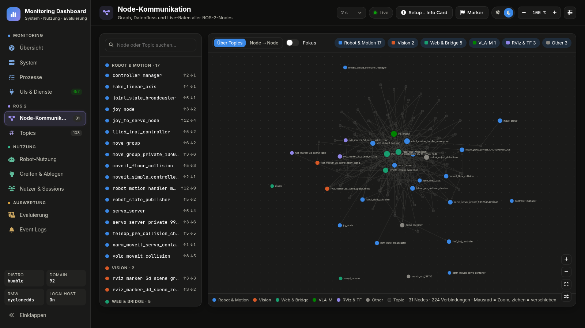
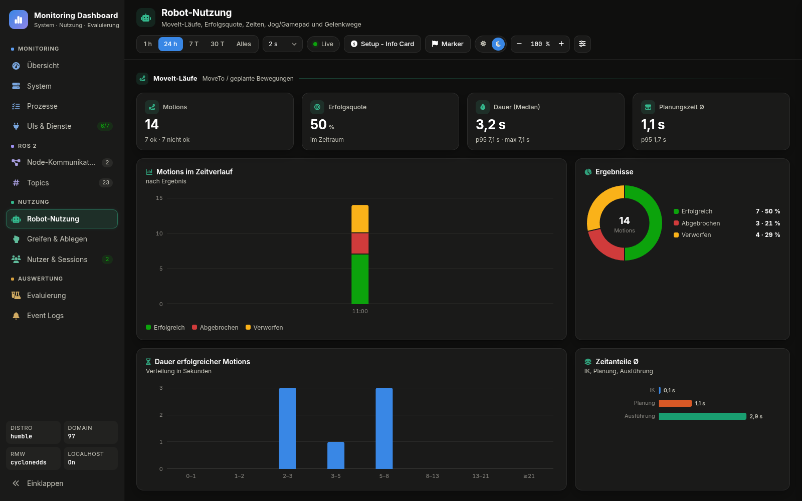
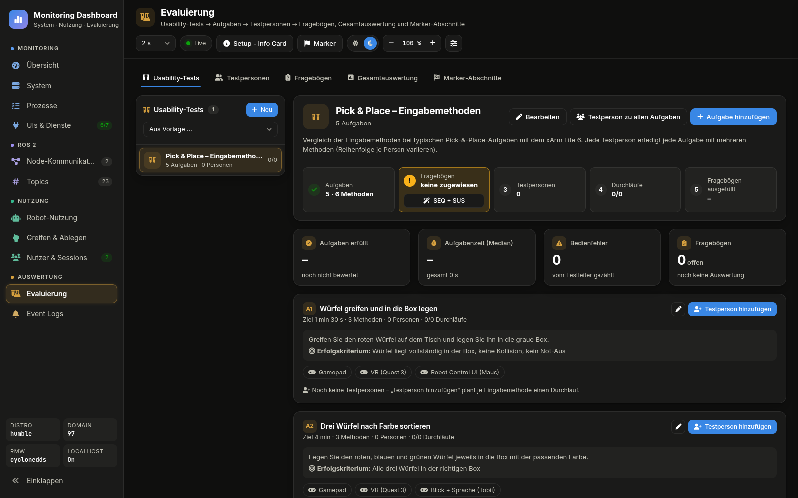

<a name="top"></a>

# 📊 Monitoring: Monitoring Dashboard

[🏠 Übersicht](../readme-de.html) · [🇬🇧 English](../en/monitoring.html) · Kapitel 8

**Inhalt:** [8. 📊 Monitoring Dashboard](#8--monitoring-dashboard)

---

## 8. 📊 Monitoring Dashboard

Das **Monitoring Dashboard** (Port 8083) ist das Dashboard der Plattform für System, Nutzung und Evaluierung. Es ersetzt die ältere Dashboard Monitoring UI (Port 8084, statische Code-Analyse + Node-Monitor), die am 2026-09-28 entfernt wurde (im Git-Verlauf erhalten).

### 📈 Monitoring Dashboard (Port 8083)
Web-Dashboard für Systemlast, ROS-2-Kommunikation, Roboter-Nutzung und Nutzer-Sessions – und die Datengrundlage für die Auswertung von Nutzerstudien (Paket `http_monitoring_dashboard_p8083`).

<p align="center">
  
  
</p>

<p align="center">
  
  
</p>

*Oben: **Übersicht** – Gesundheitszeile, Kacheln CPU/RAM/GPU/ROS 2, Systemlast, *Heute* (Motions, Griffe, UI-Klicks), *Robot jetzt* und *UIs & Dienste*; **ROS-Graph** – Nodes über Topics mit Live-Raten und Node-Liste je Gruppe (31 Nodes des FAKE-Stacks). Unten: **Robot-Nutzung** – MoveIt-Läufe, Erfolgsquote, Dauer und Planungszeit, Ergebnisse und Zeitanteile; **Evaluierung** – Usability-Test *Pick & Place – Eingabemethoden* aus der Vorlage mit Ablaufleiste, KPI-Zeile und Aufgabe A1 mit ihren Eingabemethoden.*

- **Monitoring:** Übersicht (N18.2/N18.14: oben eine Gesundheitszeile, die nur Abweichungen nennt – Not-Halt, ausgefallene Dienste, CPU/RAM über den Schwellen; nie gestartete Dienste sind ein grauer Hinweis, grün nur, wenn nichts abweicht – darunter vier Kacheln CPU, RAM, GPU, ROS 2 und ein Raster 8 + 4: links Last, *Heute* (Bewegungen, Griffe, Klicks, VLA-M-Aufträge der letzten 24 h, mit Leerzustand statt Nullen), Netzwerk, Events, rechts *Robot jetzt* und die 5 wichtigsten Dienste mit „+ n weitere“), System (CPU, RAM, GPU/VRAM, Temperaturen, Netzwerk), Prozesse, UIs & Dienste (Erreichbarkeit aller Web-UI-Ports).
- **ROS 2:** ROS-Graph – Nodes und Topics als Graph mit Live-Raten (über Topics oder Node → Node, Fokus-Modus; geordnet: je Node-Gruppe ein Rahmen, Gruppen nach Datenfluss von links nach rechts, Topics in der Gasse zwischen Sender und Empfänger, Linienfarbe = sendende Gruppe, Knopf *Neu anordnen* setzt verschobene Nodes zurück, `js/graph.js`) und Topics mit Hz und Bandbreite ausgewählter Topics (roh gemessen, ohne Deserialisieren).
- **Nutzung:** Roboter-Nutzung (MoveIt-Läufe, Jog- und Gamepad-Zeit, Greifer, Not-Aus, Greif- und VLA-Befehle, Gelenkwege, **Blackbox-Vorfälle**: je gesicherter rosbag2 aus `~/.ros/blackbox` Zeit, Auslöser, Zeitfenster, Nachrichten, Topics und Größe, Knopf kopiert `ros2 bag play <Ordner>`; API `/api/blackbox?range=`), Greifen & Ablegen, Nutzer & Sessions (UI-Clients über `/remote/heartbeat`, Besitzer über `/remote/control_state`, WebSocket-Clients von rosbridge).
- **VLA-M** (Menü *Nutzung*, `js/views/vla.js`, Backend `vla.py`, API `/api/vla?range=&mode=all|fake|real`): eine Zeile je Auftrag an `vla_bridge` in der Tabelle `vla_tasks` – Start/Ende, Text, Quelle (Chat, Sprache = diktiert, Ein-Klick Pick/Place, Palettieren, Fliesenlegen), Modell, Backend, lokal/Cloud, FAKE/REAL, Dry Run, Sandbox, Ausgang + Grund, Zeit bis Plan, Ausführungszeit, Schritte geplant/erledigt, Replans, LLM-Runden, Korrekturen, ungültige Pläne, Tokens, Nutzer, dazu die Roboterdaten im Zeitfenster des Auftrags (Motions ok/fehlgeschlagen, VLA-Griffe, E-Stop). Quellen: `/vla/instruction`, `/vla/skill`, `/vla/execute`, `/vla/response`, `/vla/status` und `/vla/metrics` (vla_bridge veröffentlicht je LLM-Runde und je Ausgang dasselbe wie im Sitzungsprotokoll). Seite: Filter *FAKE + REAL / nur FAKE / nur REAL*, KPI-Zeile (Aufträge, Erfolgsquote mit 95-%-KI nach Wilson, Zeit bis Plan und Ausführung als Median (IQR), Selbstkorrektur, Abbrüche), **Modellvergleich** (je Modell: Erfolg [95-%-KI], Zeit bis Plan Md (IQR), LLM-Runden, Korrekturen, ungültige Pläne, Rückfragen, Motions ok, Tokens; Direktbefehle ohne Sprachmodell als eigene Zeile) mit χ²-Test über die Modelle (Erfolg, Cramérs V) und Kruskal-Wallis (Zeit bis Plan, ε²), Ausgänge, Fehlerursachen (aus dem Grund gruppiert: E-Stop, Sperre, Sprachmodell, Bediener, Plan ungültig, IK, Greifen, Ablageplatz, MoveIt, Dienst), Ausgelöst über, **Offline-Benchmark** (`~/.ros/vla_eval/*.json` aus `tools/vla_eval.py`, nur lesend: Treffer mit KI, LLM-Aufrufe, Dauer, schwächste Kategorie) und Auftrags-Protokoll mit CSV-Export (`/api/export?what=vla`). Erfolgsquote = erledigt / bewertbare Aufträge; Sperren (abgelehnt, nur Vorschau) zählen nicht. Altprotokolle `~/.ros/vla_logs/*.jsonl` werden beim Serverstart je Datei einmal übernommen (Tabelle `vla_imports`, Server-Optionen `--vla-logs`, `--vla-eval`).
- **Evaluierung – Usability-Tests:** Hierarchie *Usability-Test → Aufgaben → Testpersonen → Fragebögen*.
  - **Usability-Tests:** Ein Test bündelt Aufgaben (z.B. verschiedene Pick-&-Place-Aufgaben); jede Aufgabe hat Anweisung, Erfolgskriterium, Zielzeit und **Eingabemethoden** (z.B. Gamepad, VR (Quest 3), Robot Control UI, Blick + Sprache, VLA-M). *Testperson hinzufügen* (vorhandene oder neue mit ID + Name) plant je Methode einen **Durchlauf** mit eigener Evaluierungs-ID (`P01-E03`); die Reihenfolge der Methoden wird je Testperson **ausbalanciert** (balanciertes Lateinisches Quadrat / Williams-Design nach Nummer der Testperson: jede Methode gleich oft zuerst und gleich oft nach jeder anderen) gegen Reihenfolge-Effekte. Vorlage *Pick & Place – Eingabemethoden* mit fünf Beispielaufgaben.
  - **Kopf eines Tests:** Ablauf-Leiste mit fünf Schritten (*Aufgaben → Fragebögen → Testpersonen → Durchläufe → Fragebögen ausgefüllt*; Häkchen = erledigt, gelb = fehlt). Fehlen Fragebögen, legt *SEQ + SUS* aus den Vorlagen SEQ nach jeder Aufgabe und SUS einmal je Testperson an (`POST /api/study/test_questionnaires_default {study_id}`). Die KPI-Reihe darunter zeigt nur Ergebnisse: Aufgaben erfüllt, Aufgabenzeit (Median), Bedienfehler, Fragebogen-Score Ø.
  - **Durchlauf:** *Start* / *Beenden* setzen Marker; Motions (Erfolg, Planungszeit), Griffe, UI-Klicks, Gamepad-Tasten, Jog-/Bewegungszeit, Warnungen und verbundene Clients werden dem Durchlauf zugeordnet und beim Beenden gespeichert (bleiben über die 30-Tage-Aufbewahrung hinaus). Der Testleiter trägt *erfüllt / nicht erfüllt*, Bedienfehler und Notizen ein. Es läuft immer nur ein Durchlauf gleichzeitig (Kennzahlen gelten fürs ganze System). *Gerät der Testperson* beim Start: UI-Klicks und Griffe zählen dann nur von diesem Client (Motions, Gamepad-Tasten und Jog-Zeit tragen keinen Absender und zählen weiter für alle); der Durchlauf zeigt „zählt nur …“. *Start* in den Tabellen wählt automatisch das gerade steuernde Gerät (Robot Control UI mit Control-Lock), sonst zählen alle Geräte. Die Leiste **Test läuft** nennt das gezählte Gerät („zählt <Gerät>“ / „zählt alle Geräte“) und zeigt live Motions · Griffe · UI-Klicks · Gamepad-Tasten (~6 s); Live-Werte und Endergebnis nutzen denselben Gerätefilter. Tab *Testpersonen*: die Durchlauf-Tabelle hat *Start* / *Beenden* / Ergebnis, ein Klick öffnet das Durchlauf-Detail; ist keine Robot Control UI verbunden, erscheint ein Warnhinweis. Während ein Durchlauf läuft, meldet das Monitoring Dashboard ihn latched auf `/dashboard/eval_run` (JSON `eval_id`, Aufgabe, Methode, Gerät; danach `{}`), und die Robot Control UI zeigt im Header einen **Eval**-Chip mit der ID; in VR zeigt das HUD sie als Badge `TEST <id>` auf der TELEMETRY-Karte. Beim Start zeigt jede Robot Control UI das Popup **Usability test starts** (Testperson Code + Name, Aufgabe x/y, Durchlauf x/y mit Methode, Zielzeit, Kurzbeschreibung, Kriterien) mit *Confirm*; *Confirm* meldet den Tab als Testperson des Durchlaufs an, wenn noch niemand angemeldet ist und der Durchlauf für dieses Gerät zählt. Testpersonen können sich auch selbst über die Pill **Participant** in der Statusleiste anmelden (ID wie `P01`, gilt je Tab); der Code geht als `participant` im Heartbeat mit, und das Monitoring Dashboard beginnt eine neue Session für diese Person.
  - **Fragebögen:** eigene Bögen mit sieben Fragetypen (Likert-Skala, Schieberegler, Einfach-/Mehrfachauswahl, Ja/Nein, Zahl, Freitext) oder Vorlagen SUS, NASA-TLX (Raw), UEQ-S, SEQ, Angaben zur Person (validierte Bögen mit festen Items). Zuordnung *je Durchlauf* (je Aufgabe vorausgewählt) oder *einmal je Testperson* (je Test); spätere Änderungen gelten auch für schon geplante Durchläufe (abgewählte offene Bögen werden entfernt, begonnene bleiben). Ausfüllen in einer Fokus-Ansicht ohne Menü – am PC oder per Link auf einem Tablet (`#fill/<id>`); danach geht es direkt zum nächsten offenen Bogen. **Tablet-Link** im Kopf der Testperson (`#fill/p<id>`, Kiosk): zeigt nur die offenen Bögen dieser Testperson nacheinander, ohne Weg zurück in die Evaluierung; ist keiner offen, wartet die Seite und schaut alle 5 s nach. Scores (SUS 0–100, TLX, UEQ-S pragmatisch/hedonisch, SEQ, Mittelwert 0–100 %) werden automatisch berechnet.
  - **Prüfungen im Ablauf:** Die Ablauf-Leiste eines Tests warnt, wenn ein Fragebogen je Aufgabe **und** je Testperson zugewiesen ist (*Doppelte entfernen* nimmt ihn aus „je Person“ und löscht nur die noch offenen Zuweisungen) und wenn Durchläufe ohne Gerät gestartet wurden (*Gerät nachtragen*: Gerät aus den Sessions im Zeitraum wählen → Kennzahlen werden neu berechnet, die Session wird der Testperson zugeordnet).
  - **Nutzungsdaten je Testperson:** Card *Nutzungsdaten* im Detail einer Testperson. Zugeordnet werden alle Sessions (Robot Control UI, Touch Panel …): automatisch über das Gerät eines Durchlaufs (Start/Ende), über die Anmeldung mit der Testperson-ID in der Robot Control UI (Heartbeat `participant` → `sessions.participant`) oder von Hand. *Vorgeschlagen* listet nicht zugeordnete Sessions am Testtag (gleiches Gerät oder bis 2 h vor dem 1. Durchlauf, z.B. Einweisung, Übung) – Zuordnen nur per Klick. Zeigt Nutzungs-, Übungs- und Steuerzeit, Klicks, Gamepad-Tasten, Motions, Griffe, Zeitleiste des Testtags (Übung · Sessions · Durchläufe) und genutzte Bereiche. Gespeichert in `participant_sessions`; Sessions bleiben über die 30-Tage-Aufbewahrung hinaus erhalten.
  - **Auswertung (Bericht):** Tab *Auswertung* je Usability-Test, gegliedert nach ISO 9241-11: KPI-Reihe (Testpersonen, Durchläufe, Aufgaben erfüllt, Aufgabenzeit, SUS, Datenqualität = offene Bögen, Durchläufe ohne Gerät oder Bewertung), Sprungleiste und sieben Kapitel (acht mit VLA-M-Aufträgen) – *1 Effektivität* (Erfolgsquote je Methode, Matrix Aufgabe × Methode), *2 Effizienz* (Aufgabenzeit je Methode als Box mit Punkten und Zielzeit, Bedienfehler und fehlgeschlagene Motions, Median-Zeit je Aufgabe im Verhältnis zur Zielzeit), *3 Zufriedenheit* (SUS je Methode auf der Bangor-Skala mit 95-%-Konfidenzintervall, NASA-TLX-Profil, UEQ-S, SEQ je Aufgabe), *4 Lernen* (Reihenfolge-Effekt nach Position der Methode, Übungszeit ↔ Aufgabenzeit), *5 Nutzungsdaten* (UI-Klicks, Gamepad-Tasten, Jog-Zeit, Griffe je Methode, genutzte Bereiche), *6 VLA-M* (nur wenn die Durchläufe VLA-Aufträge enthalten: Erfolg je Methode × Modell mit Wilson-KI, Interaktion je Durchlauf = Aufträge, Umformulierungen, Rückfragen, Abbrüche, Anteil der Aufgabenzeit Warten auf das Modell vs. Ausführung vs. Mensch, Fehlerursachen; je Durchlauf listet das Detail die VLA-Aufträge, der Export `what=vla` liefert eine Zeile je Auftrag mit Durchlauf, Testperson und Methode), *6 Testpersonen* (Matrix Person × Aufgabe mit Fragebögen, Übungs- und Nutzungszeit, Freitexte und Notizen, Export), *7 Methodenvergleich* (je Kennzahl – Aufgabenzeit, jeder Fragebogen-Score, die sechs NASA-TLX-Dimensionen, mit VLA-Aufträgen auch VLA-Erfolgsquote, Zeit bis Plan und Umformulierungen je Durchlauf (fett) – M ± SD je Methode, je Testperson gemittelt; Signifikanztest über die Testpersonen mit Werten für alle Methoden: Wilcoxon-Vorzeichen-Rang-Test bei 2 Methoden mit Effektstärke r = |Z|/√n, Friedman-Test ab 3 Methoden mit Kendalls W; ab 3 vollständigen Testpersonen; Export der Tabelle als CSV oder LaTeX (booktabs, APA) über `GET /api/study/export?what=paper&format=csv|json|tex&study=<id>`). *Bericht drucken / PDF* druckt hell ohne Navigation. Daten: `GET /api/study/report?study=<id>`. Je Testperson zusätzlich Durchläufe, Sitzungen, Lernkurve und Aufgabenzeit. Export als CSV/JSON (Antworten je Fragebogen mit einer Spalte je Frage; Durchläufe mit Nutzungsdaten der Testperson `person_*`).
  - **Marker-Abschnitte:** Der Button *Marker* teilt die Aufzeichnung frei in Abschnitte; der Tab vergleicht sie nebeneinander – Erfolgsquote, Motion- und Planungszeit, Griffe, Haltedauer, UI-Klicks, Gamepad-Tasten, Jog- und Bewegungszeit, Warnungen, CPU.
  - Daten liegen in derselben SQLite-Datei (Tabellen `studies`, `eval_tasks`, `participants`, `eval_runs`, `questionnaires`, `responses`) und werden von *Statistik leeren* nicht gelöscht.
- **Setup:** Der Button *Setup* öffnet mittig eine Übersichtskarte (Hintergrund unscharf, Esc schließt, oben Sprungmarken zu den Abschnitten und Umschalter **DE / EN**, wird gemerkt): zuerst die Systemübersicht Clients → Server → Roboter (Touch Panel, Laptop/Tablet, Quest mit Adresse; Server = dieser PC, im Labor oder zu Hause, mit den Nexus-Schaltern *Remote access* und *Localhost only* und `tools/firewall_setup.sh`; xArm mit REAL und FAKE), dann IP-Vergabe je Netz (Heimnetz, Robot-LAN mit fester Roboter-IP, Tobii), Web-Adressen aller Oberflächen als Links (mit der aktuellen Server-IP), Ports mit Protokoll, Touch-Display (Touch Panel: gemerkter Bildschirm-Ausgang live, Labor-Setup `DP-5`/`DP-6`, Touch-Controller, `--list`/`--output`, Hinweis bei Touch auf dem Hauptmonitor), HTTP vs. HTTPS/SSL für VR und Gamepad (Zertifikat freigeben), VLA-M (Datenfluss UI → rosbridge → `vla_bridge` → MoveIt/Greifer, `/vla/*`-Topics, Policies, REAL-Sperre, live ob Ollama und `qwen3.8:27b` auf diesem PC installiert sind, sonst Warnung mit dem Installbefehl). Netze sind überall gleich gekennzeichnet (Heimnetz, Robot-LAN, Tobii, localhost), bei den Web-Adressen steht vor dem Port *IP oder localhost*. Live aus `/api/network`: Adressen aus `config/network.yaml` und die IPs dieses PCs – fehlt eine Netzwerkkarte im Robot-LAN, steht dort eine Warnung. *Als PDF exportieren* öffnet den Druckdialog des Browsers (Ziel „Als PDF speichern“, auf eine Seite A4 hoch verkleinert, hell, ohne Knöpfe, in der gewählten Sprache). Dieselbe Karte (`ui_shared/net_info.js`) gibt es in der Nexus Webapp.
- **UI-Klicks:** Die Robot Control UI zählt Klicks auf Buttons und Chips sowie geänderte Eingaben und sendet sie alle 3 s auf `/ui/interaction_events` (`js/usage_stats.js`) – nur Bezeichnung und Bereich, nie Eingabewerte.
- **Speicherung:** 1-s-Werte der letzten Stunde im Speicher; Minutenmittel (30 Tage), Motions, Sessions, Nutzungszähler, Events und VLA-M-Aufträge (`vla_tasks`, nicht ausgedünnt) in SQLite (`~/.local/share/monitoring_dashboard/monitoring.db`). Alle Topics sind optional – ohne Publisher bleibt ein Zähler einfach bei 0.
- **Darstellung:** Zeitraum 5 min – 24 h, Aktualisierungsrate (Evaluierung fest 1 s, Auswahl dort ausgeblendet), Live-Modus, **Theme** (Knopf *Dark / Light / Jarvis / Nord Blue ▾* in der Kopfleiste oder überall **Alt+T**: Liste mit Live-Vorschau – ↑↓ Vorschau, Enter übernehmen, Esc abbrechen, 1–4 direkt; *Jarvis* = dunkler HUD-Look mit Cyan-Leuchten, Raster und Orbitron-Überschriften; *Nord Blue* = ruhiges Schiefergrau mit Frostblau, matt, ohne Leuchten; gleiche Liste wie Robot Control UI und Nexus Webapp, nur dieser Browser), Seitenzoom − / Wert / + (70–150 %, Klick auf den Wert = 100 %, nur dieser Browser), **Sprache** Deutsch / Englisch (Zeile *Language DE | EN* unten in der Theme-Liste oder dort Taste **L**; wechselt live, Zahlen und Datum folgen; ohne gespeicherte Wahl die Browsersprache; nur dieser Browser, Wörterbuch `i18n/en.json`).

```bash
ros2 launch http_monitoring_dashboard_p8083 monitoring_dashboard.launch.py   # port:=8083 open_browser:=true db:=<SQLite-Datei>
# → http://localhost:8083/ · Nexus Webapp: Karte „Monitoring Dashboard“ im RUN DEV SETUP und SERVER SETUP
```

---

[⬅ Zurück: VLA-M: Vision-Language-Action-Chat](vla.html) · [🏠 Übersicht](../readme-de.html) · [⬆ Nach oben](#top) · [Weiter: Repository-Struktur ➡](repository_structure.html)
