<a name="top"></a>

# 🖥️ UX | Control Interface & Motion-Backend

[🏠 Übersicht](../readme-de.html) · [🇬🇧 English](../en/robot_control_ui.html) · Kapitel 3.6

---

## 3.6 Funktion: GUI - Grafische Robotersteuerung & Visuelles Feedback
*Werkzeuge für den Operator zur manuellen Positionierung und für visuelles Monitoring in RViz und Web.*

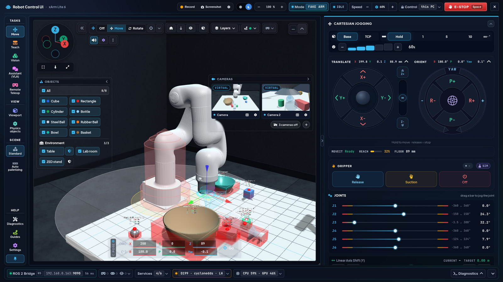

*Bereich **Move** im FAKE-Modus (1920 × 1080): Header mit Record/Screenshot, Theme, Zoom und der Sicherheitsgruppe Mode · Zustand · Speed · Control · E-STOP; links die Bereichs-Leiste (angeheftet: Operate, World, Scene, Help, System); Viewport mit Navigations-Gizmo, Leiste und den Tabs OBJECTS, CAMERAS und POSE; rechte Spalte Cartesian Jogging, Greifer und Gelenke; unten die Statusleiste.*

<p align="center">
  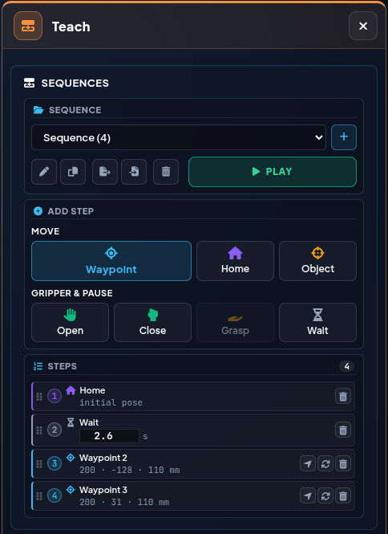
  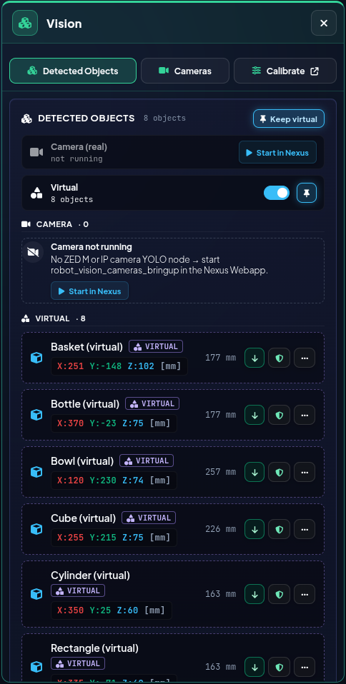
  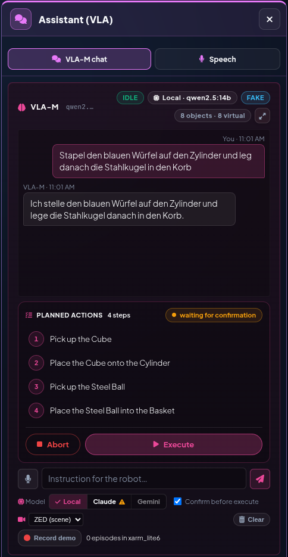
  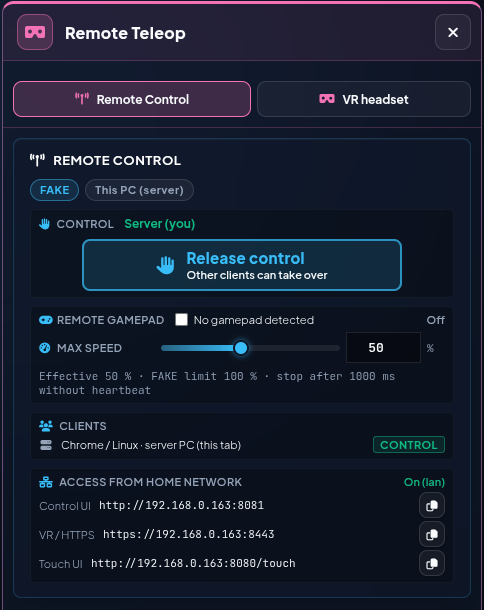
</p>

*Jeder Task-Button der Bereichs-Leiste öffnet sein Fenster neben der Leiste – von links: **Teach** (Sequenzen), **Vision** (erkannte Objekte), **Assistant (VLA)** (VLA-M-Chat mit vier geplanten Schritten), **Remote Teleop** (Control-Lock, Remote-Gamepad, Clients). Screenshots der einzelnen Funktionen stehen direkt bei ihrer Beschreibung in den Details zu `http_robot_control_ui.launch.py` (*Details anzeigen*) und in den Bedienhinweisen darunter.*

---

<br>

###  `standalone_move_group.launch.py` &nbsp;&nbsp; <sub><i>`/src/robot_motion_handler_movegroup/launch/standalone_move_group.launch.py`</i></sub>

**Zweck & Aufgabe:** Dient als "headless" Backend für die Web-UI. Startet den `move_group` Node von MoveIt 2 ohne ressourcenhungrige grafische Oberflächen wie RViz. Er stellt alle Planungs- und Ausführungsdienste bereit (Inverse Kinematik, Kollisionsvermeidung, Action Server), die die UX | Nexus Launcher (früher „Nexus Webapp“) oder andere Remote-Control-Clients für Bahnplanung und komplexe Trajektorien benötigen. Die Entkopplung von RViz verhindert Synchronisationsfehler beim Start (z.B. fehlschlagendes Laden von MotionPlanning).

<details>
<summary><b>🔽 Details anzeigen</b> · Publishes · Services</summary>

> [!NOTE]
> 💻 **Startbefehl:** *(Wird von `RUN DEV SETUP (FAKE)` und `RUN DEV SETUP (REAL)` automatisch mitgestartet)*
>
>
>  / 
>
>> | Topic / Interface | Msg Type | Beschreibung |
>> |---|---|---|
>> | **`/move_action`** | Action Server | *Stellt Bahnplanung und Ausführung bereit.* |
>> | **`/planning_scene`** | `moveit_msgs/PlanningScene` | *Pflegt die Kollisionsumgebung und den Roboterzustand.* |

</details>

---

<br>

###  `robot_motion_handler_movegroup.py` &nbsp;&nbsp; <sub><i>`/src/robot_motion_handler_movegroup/robot_motion_handler_movegroup/robot_motion_handler_movegroup.py`</i></sub>

**Zweck & Aufgabe:**

<details>
<summary><b>🔽 Details anzeigen</b> · Run Command · Subscribes · Publishes · Services · Parameters</summary>

> [!NOTE]
> 💻 **Run Command:**
> ```bash
> ros2 run robot_motion_handler_movegroup robot_motion_handler_movegroup
> ```
>
> - **Zentrale Schaltzentrale:** Dient als Brücke zwischen allen Benutzeroberflächen (UIs/Scripts) und der eigentlichen Roboter-Hardware/MoveIt 2. Andere Skripte müssen keine komplexe Kinematik berechnen, sondern rufen einfach die Services dieses Skripts auf.
> - **Service-Bereitstellung:** Öffnet wichtige ROS2-Services wie `/ui/execute_initial_pose`, `/ui/execute_move_to_pose`, `/ui/approach_from_above`, `/ui/execute_move_joint` und `/ui/start_octomap_scan`.
> - **Ressourcen-Management:** Stoppt automatisch die manuelle Teleop-Steuerung (`MoveIt Servo` / Gamepad), bevor eine automatische Trajektorie gefahren wird, und reaktiviert sie danach.
> - **Trajektorien-Planung & Scans:** Generiert flüssige Spline-Bewegungen und komplexe Bahnen (z.B. wellenförmige Octomap-Scans) inkl. sanftem Beschleunigen/Abbremsen, gesteuert über globale Action-Speed-Ratios (Slow/Normal/Fast).
> - **Kollisionsbewusstes MoveTo:** `/ui/execute_move_to_pose` bestimmt zuerst per `/compute_ik` (`avoid_collisions`) ein kollisionsfreies Ziel und lässt dann `move_group` (`/move_action`, OMPL) eine Bahn planen und abfahren, die allen Kollisionsobjekten (erkannte YOLO-Objekte, Boden) ausweicht. Gibt es keinen kollisionsfreien Weg, fährt der Arm nicht los. Ist `move_group` nicht erreichbar, gibt es bewusst keinen ungeprüften Fallback. Die Geschwindigkeit folgt der Stufe Slow/Normal/Fast (`moveto_velocity_scaling`, `moveto_acceleration_scaling`); ein E-STOP bricht auch das laufende `move_group`-Ziel ab.
> - **Keine feste Sperrzone um die Achse:** MoveTo lehnt Ziele nicht über eine feste Zone ab; es entscheiden allein die IK mit Kollisionsprüfung (Eigenkollision) und die Planung. Ein wirklich unmögliches Ziel scheitert mit „IK calculation failed … out of reach or in collision“.
> - **Bahnvorschau (optional):** Ist sie über `/ui/set_moveto_preview` eingeschaltet (Parameter `moveto_preview`, Standard aus), plant MoveTo nur (`plan_only`), schickt die Bahn latched auf `/ui/moveto_preview_path` (die UX | Control Interface (früher „Robot Control UI“) zeigt ihn als Geisterroboter) und wartet auf `/ui/confirm_moveto_preview`. Bestätigt fährt der Arm genau diese Bahn über `/execute_trajectory`; verworfen oder nach `moveto_preview_timeout` (15 s) ohne Antwort bleibt er stehen. MoveIt Servo bleibt während der Wartezeit pausiert, der E-STOP bricht auch hier ab. Denselben Bestätigungsschritt gibt es auch ohne Geist: `/ui/plan_move_to_pose_confirm` und `/ui/approach_from_above_confirm` (Gizmo bzw. *Approach from above* bei ausgeschaltetem Auto-Move) planen sofort und warten auf `/ui/confirm_moveto_preview`, ohne eine Geist-Bahn zu senden (bei *Approach from above* gilt die Bestätigung der Vorposition, das gerade Absenken folgt ohne zweite Rückfrage). Kommt ein neues MoveTo oder Approach, während eine Bahn wartet, wird diese verworfen und das neue Ziel geplant, statt „Already executing“ zu melden.
> - **IK nächst zur aktuellen Stellung & volle Gelenkbereiche:** Die Lite-6-Launches starten jetzt standardmäßig mit `limited:=false`, also mit den echten Hardware-Bereichen (J1/J4/J6 ±360°). Mit `limited:=true` begrenzte das URDF J1 auf ±178,2°, und Ziele direkt hinter dem Roboter (z. B. X = −300, Y = 0) waren per IK unerreichbar. Weil J1/J4/J6 damit mehrdeutig sind, probiert MoveTo mehrere IK-Seeds (einen davon mit J1 schon in Zielrichtung), verschiebt J1/J4/J6 um ±2π auf den kürzesten Weg und nimmt die Lösung mit der kleinsten Gelenkbewegung - ohne unnötige volle Handgelenkdrehungen.
> - **Inverse Kinematik (IK) & Unwrapping:** Rechnet Ziel-Koordinaten (X, Y, Z) in entsprechende Gelenkwinkel für alle 6 Achsen um (`/compute_ik`). Ein aktiver *Joint Unwrapping Algorithmus* fängt >180° Sprünge ab, was das Aufwickeln von Kabeln und 360-Grad-Flips physisch ausschließt.
> - **Dynamische Safety Zone:** Abonniert die Live-Sicherheitsgrenzen und stoppt den Arm automatisch davor, während die Kamera nachkorrigiert, um das Objekt weiterhin im Blick zu behalten.
> - **Emergency Stop:** Behandelt den E-STOP (`/ui/emergency_stop`). Stoppt sofort die Hardware und zwingt die Gelenke auf 0-Geschwindigkeit. Eine schon berechnete Bahn wird nach einem E-STOP nicht mehr gesendet (z. B. der Abstieg von *Approach from above* während der 0,5-s-Servo-Pause); kommt der Stopp, während move_group eine Bahn gerade startet, schickt der Handler zusätzlich die Halte-Trajektorie erneut an den Controller (ein Abbruch geht in diesem Moment verloren). Vor dem 2026-09-28 konnte der Arm nach einem E-STOP den ganzen Abstieg fahren und wäre in REAL nach dem Quittieren weitergefahren. Regressionstest: `tools/grasp_e2e.py` (E-STOP in der Lücke vor dem Abstieg).
> - **Audio-Feedback:** Spielt Status-Sounds (wie Initial Pose oder Absolute Pose) ab, wenn bestimmte Posen angefahren werden.
>
> **Welche Skripte nutzen das (Clients der `/ui/...` Services)?**
> - **`gaze_grasp_routine_tobii_glasses.py`**: Ruft den Move-To-Pose Service für den Scan-Modus und das exakte Hovern über dem Objekt auf.
> - **`http_robot_control_ui_p8081/js/`** (v. a. `motion.js`, `safety.js`): Das Browser-Frontend (roslibjs, ES-Module) der UX | Control Interface steuert hierüber Initial Pose, Scans, absolute XYZ-Fahrten und den E-STOP.
> - **`yolo_grasp_executor.py`** & **`yolo_planned_grasp_executor.py`**: Nutzen den Move-To-Pose Service als Fallback, wenn die eigene Bewegungsplanung nicht greift.
> - **`gaze_ui_node_tobii_glasses.py`** & **`..._zedm.py`**: Steuern hierüber den Initial-Pose-Reset.
> - **`xarm_joystick_input.cpp`**: Das Gamepad-Skript nutzt es, um auf Knopfdruck (Y-Taste) in die Initial Pose zu fahren.
>
>
> 
>
>> | Parameter | Standardwert | Beschreibung |
>> |---|---|---|
>> | `moveto_planning_time` | `5.0` | *Planungszeit pro MoveTo [s].* |
>> | `moveto_planning_attempts` | `10` | *Planungsversuche pro MoveTo.* |
>> | `moveto_timeout` | `120.0` | *Maximale Zeit für Planung + Ausführung [s].* |
>> | `moveto_velocity_scaling` / `moveto_acceleration_scaling` | `[0.15, 0.3, 0.6]` | *Skalierung je Geschwindigkeitsstufe Slow / Normal / Fast.* |
>> | `moveto_preview` | `false` | *Bahnvorschau beim Start aktiv.* |
>> | `moveto_preview_timeout` | `15.0` | *Sekunden bis zum automatischen Verwerfen einer unbestätigten Vorschau.* |
>> | `approach_pre_height` | `0.07` | *Höhe der Vorposition über dem Ziel [m] („Approach from above“).* |
>> | `approach_descent_scaling` | `0.15` | *Tempo des senkrechten Absenkens.* |
>> | `approach_object_match_radius` | `0.03` | *Max. XY-Abstand [m] zwischen Ziel und Greifkugel, um das Objekt zuzuordnen.* |
>> | `moveit_controller_status_topic` | `/lite6_traj_controller/follow_joint_trajectory/_action/status` | *Status-Topic, an dem der Start der Ausführung erkannt wird.* |
>> | `auto_initial_pose` | `true` | *Beim Start in die Initialpose fahren – kollisionsfrei über MoveIt geplant (wartet bis zu 30 s auf `/move_action`, mit Bahnvorschau auf Bestätigung); `false` lässt den Arm stehen.* |
>
>
> 
>
>> | Topic / Interface | Msg Type | Beschreibung |
>> |---|---|---|
>> | **`/ui/robot_control/current_speed`** | `std_msgs/Float32` | *Skaliert die Geschwindigkeit von Gelenkbewegungen synchron zur UI.* |
>> | **`/ui/scan_speed`** | `std_msgs/Int32` | *Skaliert die Geschwindigkeit von Scan-Trajektorien (0: Langsam, 1: Normal, 2: Schnell).* |
>> | **`/ui/emergency_stop_topic`** | `std_msgs/Empty` | *Hört auf sofortige Software-E-STOP-Befehle (blockierungsfreier Bypass).* |
>> | **`/joint_states`** | `sensor_msgs/JointState` | *Liest aktuelle Gelenkwinkel aus.* |
>> | **`/ui/safety_zone_params`** | `std_msgs/Float32MultiArray` | *Empfängt dynamische Safety-Zone Parameter `[x, y, radius]` zur Bewegungsbegrenzung.* |
>> | **`/zed/bboxes_3d`** | `visualization_msgs/MarkerArray` | *Rote Greifkugeln (`yolo_object_grasp_center_point`) und Klassen-Labels - ordnen das Zielobjekt für *Approach from above* zu.* |
>> | **`/display_planned_path`** | `moveit_msgs/DisplayTrajectory` | *Kandidatenpfade von `move_group` für MoveTo (Wegpunkte, geschätzte Dauer, verworfene Kandidaten).* |
>> | **`/lite6_traj_controller/follow_joint_trajectory/_action/status`** | `action_msgs/GoalStatusArray` | *Erkennt, wann `move_group` eine MoveTo-Bahn tatsächlich abzufahren beginnt (Parameter `moveit_controller_status_topic`).* |
>
>
> 
>
>> | Topic / Interface | Msg Type | Beschreibung |
>> |---|---|---|
>> | **`/servo_server/delta_twist_cmds`** | `geometry_msgs/TwistStamped` | *Sendet Null-Geschwindigkeitsbefehle zum Anhalten von Servo.* |
>> | **`/lite6_traj_controller/joint_trajectory`** | `trajectory_msgs/JointTrajectory` | *Direkte Gelenktrajektorien für Initial Pose, MoveJoint und Scan-Fahrten (ohne MoveIt-Kollisionsprüfung) sowie das Halten beim E-STOP. MoveTo läuft stattdessen über `move_group`.* |
>> | **`/ui/motion_status`** | `std_msgs/String` | *Publiziert UI-Statusmeldungen für den Logger.* |
>> | **`/ui/moveit_motion_state`** | `std_msgs/String` (JSON) | *Live-Fortschritt von MoveTo (IK → Planung → Ausführung, Zeiten, Kandidatenpfade, Ergebnis) für das MoveIt-Popup.* |
>> | **`/ui/moveto_preview_enabled`** | `std_msgs/Bool` (latched) | *Ob die Bahnvorschau aktiv ist.* |
>> | **`/ui/moveto_preview_path`** | `std_msgs/String` (JSON, latched) | *Geplante Bahn (Gelenknamen, Wegpunkte, Zeiten) bzw. `{"clear": true}`.* |
>> | **`/ui/emergency_stop_active`** | `std_msgs/Bool` (latched) | *E-STOP verriegelt oder nicht.* |
>> | **`/ui/motion_busy`** | `std_msgs/Bool` (latched) | *Eine Fahrt dieses Nodes läuft (MoveIt, Scan, Gelenkziel); `vr_quest3_teleop_node` startet solange keine Servo-Bewegung, UX \| Control Interface und UX \| Compact Interface sperren andere Fahrten (Header *BUSY*), `vla_bridge` startet keinen Skill.* |
>> | **`/ui/ignore_collision_object`** | `std_msgs/String` | *Nimmt das Zielobjekt für das Absenken bei „Approach from above“ aus der Kollisionswelt.* |
>
>
> 
>
>> | Topic / Interface | Msg Type | Beschreibung |
>> |---|---|---|
>> | **`/ui/execute_initial_pose`** | `std_srvs/srv/Trigger` (Server) | *Fährt den Arm in die Home-Pose. Mit Bahnvorschau wird sie über `move_group` geplant und zuerst als Geist gezeigt (Bestätigen/Verwerfen wie bei MoveTo).* |
>> | **`/ui/execute_move_to_pose`** | `xarm_msgs/srv/MoveCartesian` (Server) | *Fährt eine absolute kartesische Pose auf einer von `move_group` geplanten, kollisionsfreien Bahn an.* |
>> | **`/ui/execute_move_to_pose_silent`** | `xarm_msgs/srv/MoveCartesian` (Server) | *Wie oben, aber ohne die Ansage „robot moves to absolute pose“ (genutzt vom TCP-Gizmo im Viewport).* |
>> | **`/ui/approach_from_above`** | `xarm_msgs/srv/MoveCartesian` (Server) | *„Approach from above“: kollisionsfrei auf `approach_pre_height` über das Ziel, dann senkrecht nach unten. Der Abstieg wird abgelehnt, wenn der Arm unterwegs in eine andere Stellung umklappen würde (Gelenk 1 bleibt stehen, kein Gelenk dreht mehr als ~57°); ein blockierter Abstieg nennt das Hindernis. Objektziele dürfen unter dem Z Collision Level liegen (innerer Boden von Schale/Korb).* |
>> | **`/ui/plan_move_to_pose_confirm`** | `xarm_msgs/srv/MoveCartesian` (Server) | *MoveTo, das sofort plant und auf `/ui/confirm_moveto_preview` wartet (ohne Geist-Bahn) - TCP-Gizmo bei Auto-Move aus.* |
>> | **`/ui/approach_from_above_confirm`** | `xarm_msgs/srv/MoveCartesian` (Server) | *„Approach from above“, das zweimal auf `/ui/confirm_moveto_preview` wartet (Auto-Move aus): vor der Fahrt zur Vorposition und erneut vor dem Absenken auf den Greifpunkt.* |
>> | **`/ui/execute_move_joint`** | `xarm_msgs/srv/MoveJoint` (Server) | *Setzt Gelenkziele um – kollisionsfrei über MoveIt geplant wie die Initial Pose, nie als direkte Controller-Trajektorie.* |
>> | **`/ui/start_octomap_scan`** | `std_srvs/srv/Trigger` (Server) | *Startet eine 3D-Scan-Trajektorie (Alias: `/ui/execute_scan_trajectory`).* |
>> | **`/ui/set_moveto_preview`** | `std_srvs/srv/SetBool` (Server) | *Bahnvorschau an/aus.* |
>> | **`/ui/confirm_moveto_preview`** | `std_srvs/srv/SetBool` (Server) | *`true` = wartende Bahn ausführen, `false` = verwerfen.* |
>> | **`/ui/emergency_stop`** | `std_srvs/srv/Trigger` (Server) | *Bricht die aktuelle Trajektorie sofort ab (Alias: `/ui/stop_motion`).* |
>> | **`/ui/halt_motion`** | `std_srvs/srv/Trigger` (Server) | *Hält die laufende Fahrt dieses Nodes an (Abbruch + Halte-Trajektorie), **ohne** den E-STOP zu verriegeln; die nächste Fahrt startet ohne Quittieren. Nutzt `vla_bridge` für *Abort* beim Palettieren und *Stop* neben *BUSY* im Header der UX \| Control Interface.* |
>> | **`/ui/reset_emergency_stop`** | `std_srvs/srv/Trigger` (Server) | *Quittiert den verriegelten E-STOP.* |
>> | **`/compute_ik`** | `moveit_msgs/srv/GetPositionIK` (Client) | *Nutzt MoveIt zur kinematischen Vorwärts-/Rückwärtsrechnung.* |
>> | **`/compute_fk`** / **`/compute_cartesian_path`** | `moveit_msgs/srv/GetPositionFK` / `GetCartesianPath` (Client) | *Vorwärtskinematik und kartesische Bahnberechnung.* |
>> | **`/move_action`** | `moveit_msgs/action/MoveGroup` (Action Client) | *Plant und fährt die kollisionsfreie MoveTo-Bahn.* |
>> | **`/execute_trajectory`** | `moveit_msgs/action/ExecuteTrajectory` (Action Client) | *Führt eine bestätigte Bahnvorschau aus.* |
>> | **`/servo_server/stop_servo`** | `std_srvs/srv/Trigger` (Client) | *Pausiert MoveIt Servo während der Trajektorienfahrt.* |
>> | **`/servo_server/start_servo`** | `std_srvs/srv/Trigger` (Client) | *Setzt MoveIt Servo nach Abschluss der Fahrt fort.* |
>> | **`/ufactory/set_state`** | `xarm_msgs/srv/SetInt16` (Client) | *Setzt Hardware-Zustände auf dem physischen Controller.* |
>> | **`/xarm/set_state`** | `xarm_msgs/srv/SetInt16` (Client) | *Setzt Hardware-Zustände auf dem xArm-Controller.* |

</details>

---

<br>

###  `moveit_floor_collision.py` &nbsp;&nbsp; <sub><i>`/src/robot_motion_handler_movegroup/robot_motion_handler_movegroup/moveit_floor_collision.py`</i></sub>

**Zweck & Aufgabe:** Legt die Tischplatte als flache Kollisionsbox (2 × 2 m) in die MoveIt-Planungsszene. Ihre Höhe folgt dem einstellbaren **Z Collision Level** (TCP-Höhe in mm, Standard 10, live über `/ui/set_ground_collision_level`): Die Box liegt `servo_margin` darunter, höchstens aber bei `floor_z` (1 mm unter `link_base`) – höher würde sie `link_base` schneiden und jede Planung mit `START_STATE_IN_COLLISION` abbrechen. Die Box geht als `/planning_scene`-Diff raus, den sowohl `move_group` als auch `servo_server` empfangen. Sie blockiert MoveIt Servo beim Jogging (`HALT_FOR_COLLISION`), `/compute_ik` mit `avoid_collisions` und jede `move_group`-Planung (MoveTo, Greifablauf). Alle 2 s wird sie erneut gesendet, damit ein neu gestarteter `move_group`/`servo_server` sie wieder bekommt. Die UX | Control Interface kann sie über `/ui/set_moveit_collision_ground` aus- und einschalten. Nach einem Neustart des Nodes ist sie immer wieder AN.

<details>
<summary><b>🔽 Details anzeigen</b> · Subscribes · Publishes · Services · Parameters</summary>

> [!NOTE]
> 💻 **Startbefehl:**
> ```bash
> ros2 run robot_motion_handler_movegroup moveit_floor_collision
> ```
> *Wird automatisch von den `xarm_moveit_servo`-Launch-Dateien gestartet (`_robot_moveit_servo_fake/realmove.launch.py`).*
>
>
> 
>
>> | Parameter | Default | Beschreibung |
>> |---|---|---|
>> | `floor_z` | `-0.001` | *Oberkante der Box relativ zu `frame_id` (m).* |
>> | `frame_id` | `link_base` | *Bezugsframe der Box.* |
>> | `size_xy` | `2.0` | *Kantenlänge der Box (m).* |
>> | `thickness` | `0.02` | *Dicke der Box (m).* |
>> | `object_id` | `floor` | *ID des Kollisionsobjekts in der Planungsszene.* |
>> | `publish_period` | `2.0` | *Sendeintervall (s).* |
>> | `ground_level_mm` | `10.0` | *Z Collision Level beim Start (TCP-Höhe, mm).* |
>> | `ground_level_min_mm` / `ground_level_max_mm` | `0.0` / `200.0` | *Erlaubter Bereich des Z Collision Level (mm).* |
>> | `servo_margin` | `0.011` | *Abstand der Box unter dem Z Collision Level (m), da Servo ca. 1 cm vor Kollisionsgeometrie bremst.* |
>
>
> 
>
>> | Topic / Interface | Msg Type | Beschreibung |
>> |---|---|---|
>> | **`/ui/set_ground_collision_level`** | `std_msgs/Float64` | *Neues Z Collision Level in mm (aus dem Boden-Kollisions-Popup der UX \| Control Interface).* |
>
>
> 
>
>> | Topic / Interface | Msg Type | Beschreibung |
>> |---|---|---|
>> | **`/planning_scene`** | `moveit_msgs/PlanningScene` | *Fügt die Boden-Kollisionsbox als Szenen-Diff hinzu (bzw. entfernt sie).* |
>> | **`/ui/moveit_collision_ground_enabled`** | `std_msgs/Bool` (latched) | *Ob MoveIt den Boden gerade berücksichtigt.* |
>> | **`/ui/ground_collision_level`** | `std_msgs/Float64` (latched) | *Gültiges Z Collision Level in mm.* |
>
>
> 
>
>> | Topic / Interface | Msg Type | Beschreibung |
>> |---|---|---|
>> | **`/ui/set_moveit_collision_ground`** | `std_srvs/srv/SetBool` (Server) | *Schaltet den Boden als MoveIt-Hindernis an/aus.* |

</details>

---

<br>

###  `servo_status.py` (`servo_status`) &nbsp;&nbsp; <sub><i>`/src/servo_status/servo_status/servo_status.py`</i></sub>

**Zweck & Aufgabe:** Zeigt ein minimalistisches 2D-HUD-Status-Overlay oben rechts im RViz-Viewport an, das live den Status von Singularity- und Kollisions-Warnungen (`On` / `Off`) überwacht, sowie ein markantes zentrales Pop-up-Warnbanner (`/ui/rviz_overlay_warning_banner`) für sofortige visuelle Warnmeldungen bei Singularitäten oder Kollisionen.

<details>
<summary><b>🔽 Details anzeigen</b> · Run Command · Subscribes · Publishes</summary>

> [!NOTE]
> 💻 **Run Command:**
> ```bash
> ros2 run servo_status servo_status
> ```
> *(Wird auch automatisch über `robot_vision_cameras_bringup.launch.py` gestartet)*
>
>
> 
>
>> | Topic / Interface | Msg Type | Beschreibung |
>> |---|---|---|
>> | **`/servo_server/status`** | `std_msgs/Int8` | *Übersetzt Status-Codes (Singularität, Kollision, Gelenkgrenze) in Warnstufen.* |
>> | **`/ui/collision_msg`** | `std_msgs/String` | *Empfängt Tischkollisionswarnungen von `teleop_pre_collision_checker`.* |
>
>
> 
>
>> | Topic / Interface | Msg Type | Beschreibung |
>> |---|---|---|
>> | **`/ui/rviz_overlay_warning`** | `rviz_2d_overlay_msgs/OverlayText` | *Publiziert formatiertes 2D-HUD-Status-Overlay (Singularity & Collision On/Off) oben rechts in RViz2.* |
>> | **`/ui/rviz_overlay_warning_banner`** | `rviz_2d_overlay_msgs/OverlayText` | *Publiziert großes zentrales Pop-up-Warnbanner in RViz2 mit 2,0s Auto-Hide bei Kollisions- oder Singularitäts-Events.* |

</details>

---

<br>

###  `scene_objects_distance_to_tcp.py` (`scene_objects_distance_to_tcp`) &nbsp;&nbsp; <sub><i>`/src/scene_objects_distance_to_tcp/scripts/scene_objects_distance_to_tcp.py`</i></sub>

**Zweck & Aufgabe:** Berechnet die Live-Distanz vom Tool Center Point (`link_tcp`) des Roboters zum nächstgelegenen erkannten YOLO-Objekt (`/zed/bboxes_3d`). Rendert dynamisch eine dünne, leicht transparente, gestrichelte grüne 3D-Linie in RViz zwischen Greifer und Objekt-Zentrum und projiziert simultan ein sauberes 2D-HUD-Textoverlay oben links ins RViz-Sichtfeld mit millimetergenauen Werten (X, Y, Z, D), farbkodierten Achsen und hervorgehobenem Objektnamen in Lila.

<details>
<summary><b>🔽 Details anzeigen</b> · Run Command · Subscribes · Publishes · TF2</summary>

> [!NOTE]
> 💻 **Run Command:**
> ```bash
> ros2 run scene_objects_distance_to_tcp scene_objects_distance_to_tcp.py
> ```
> *(Wird automatisch über `robot_vision_cameras_bringup.launch.py` gestartet)*
>
>
> 
>
>> | Topic / Interface | Msg Type | Beschreibung |
>> |---|---|---|
>> | **`/zed/bboxes_3d`** | `visualization_msgs/MarkerArray` | *Empfängt 3D-Bounding-Boxes und Mittelpunkte der erkannten YOLO-Objekte.* |
>
>
> 
>
>> | Frame / Transformation | Beschreibung |
>> |---|---|
>> | **`world` ➔ `link_tcp`** | *Liest die aktuelle TCP-Position zur Laufzeit für die Distanzberechnung aus.* |
>
>
> 
>
>> | Topic / Interface | Msg Type | Beschreibung |
>> |---|---|---|
>> | **`/rviz/gripper_object_distance`** | `visualization_msgs/MarkerArray` | *Publiziert die gestrichelte grüne 3D-Distanzlinie zwischen TCP und Objekt.* |
>> | **`/rviz/gripper_object_distance_overlay`** | `rviz_2d_overlay_msgs/OverlayText` | *Publiziert das 2D-HUD-Overlay mit Objektnamen und tabellarischen Millimeterwerten.* |

</details>

---

<br>

###  `window_capture_node.py` (`window_x11_streamer`) &nbsp;&nbsp; <sub><i>`/src/window_x11_streamer/window_x11_streamer/window_capture_node.py`</i></sub>

**Zweck & Aufgabe:** Erfasst in Echtzeit ein natives laufendes X11-Fenster (Default: RViz2, wählbar über den Parameter `window_name`) via `xwininfo` und `mss`, konvertiert die Screen-Buffer in standardisierte BGR8-ROS-Image-Messages und publiziert diese mit 15 FPS auf `/window_capture/image_raw`. Dadurch kann die vollständige 3D-RViz-Szene via `web_video_server` (Port 8082) direkt und ohne aufwendiges clientseitiges 3D-WebGL-Rendering in das Web-UI gestreamt werden.

<details>
<summary><b>🔽 Details anzeigen</b> · Run Command · Publishes</summary>

> [!NOTE]
> 💻 **Run Command:**
> ```bash
> ros2 run window_x11_streamer window_capture_node
> ```
> *(Wird automatisch von `web_video_server.launch.py` gestartet, das `http_robot_control_ui.launch.py` einbindet)*
>
>
> 
>
>> | Topic / Interface | Msg Type | Beschreibung |
>> |---|---|---|
>> | **`/window_capture/image_raw`** | `sensor_msgs/Image` | *Publiziert den Live-Bildschirm-Stream des RViz2-Fensters.* |

</details>

<br>

<br>

---

<br>

###  `scene_objects.py` &nbsp;&nbsp; <sub><i>`/src/scene_objects/scene_objects/scene_objects.py`</i></sub>

**Zweck & Aufgabe:** Publiziert ROS `MarkerArray`-Nachrichten in die 3D-Szene von RViz2 (z. B. den Arbeitsbereichs-Grenzreis mit Radius $r = 420\text{ mm}$ und $3\text{ mm}$ Dicke bei TCP $Z = 0$ sowie interaktive Hohlkörper-Zielboxen). Verwendet den Zeitstempel `0`, um ein Flackern ("Flickering") aufgrund von asynchronen TF-Bäumen zu verhindern.

<details>
<summary><b>🔽 Details anzeigen</b> · Run Command · Publishes</summary>

> [!NOTE]
> 💻 **Run Command:**
> ```bash
> ros2 launch scene_objects scene_objects.launch.py
> ```
>
>
> 
>
>> | Topic / Interface | Msg Type | Beschreibung |
>> |---|---|---|
>> | **`visualization_marker_array`** | `visualization_msgs/MarkerArray` | *Rendert virtuelle Marker (Arbeitsbereich-Kreis, interaktive Zielboxen) in RViz.* |

</details>

---

<br>

###  `scene_safety_zone.py` &nbsp;&nbsp; <sub><i>`/src/scene_objects/scene_objects/scene_safety_zone.py`</i></sub>

**Zweck & Aufgabe:** Publiziert in die RViz2-Szene (Namespace `safety_zone`) die **unerreichbare Zone um die Roboterachse** als roten Drehkörper samt Konturringen und den **Bahnabstand der Scans** (Safety-Zone-Radius, Standard 138 mm) als flache orange Scheibe. Die rote Form ist mit MoveIt vermessen (`/compute_ik` mit Kollisionsprüfung, Greifer nach unten): unerreichbar bis Radius 100 mm bei z = 0–60 mm, 80 mm bei 80–240 mm, 60 mm bei 260 mm, 30 mm bei 280 mm, ab 300 mm frei - dort müsste der Arm durch Sockel oder Unterarm. Dasselbe Profil nutzt die UX | Control Interface (`UNREACHABLE_PROFILE` in `js/robot_limits.js`). Abonniert `/ui/safety_zone_params`, um Position und Radius des Bahnabstands zu empfangen; die rote Zone ist fest.

<details>
<summary><b>🔽 Details anzeigen</b> · Subscribes · Publishes</summary>

> [!NOTE]
> 💻 **Start-Befehl:**
> ```bash
> ros2 run scene_objects scene_safety_zone
> ```
> *(Wird automatisch gestartet über `scene_objects.launch.py`)*
>
>
> 
>
>> | Topic / Interface | Msg Type | Beschreibung |
>> |---|---|---|
>> | **`/ui/safety_zone_params`** | `std_msgs/Float32MultiArray` | *Empfängt die Safety-Zone-Grenzdaten (x, y, Radius).* |
>
>
> 
>
>> | Topic / Interface | Msg Type | Beschreibung |
>> |---|---|---|
>> | **`visualization_marker_array`** | `visualization_msgs/MarkerArray` | *Namespace `safety_zone`: Bahnabstand als Scheibe (`CYLINDER`) + Ring, unerreichbare Zone als Drehkörper (`TRIANGLE_LIST`) + Konturringe (`LINE_LIST`).* |

</details>

---

<br>

###  `scene_zedm_stand.py` &nbsp;&nbsp; <sub><i>`/src/scene_objects/scene_objects/scene_zedm_stand.py`</i></sub>

**Zweck & Aufgabe:** Generiert mathematisch exakt das 3D-Modell des Kamerastativs (Aluminiumprofil) zusammen mit dem 3D-Mesh (STL) der Stereolabs ZED M Kamera und publiziert diese statisch in RViz.

<details>
<summary><b>🔽 Details anzeigen</b> · Publishes</summary>

> [!NOTE]
> 💻 **Start-Befehl:**
> ```bash
> ros2 run scene_objects scene_zedm_stand
> ```
> *(Wird automatisch gestartet über `scene_objects.launch.py`)*
>
>
> 
>
>> | Topic / Interface | Msg Type | Beschreibung |
>> |---|---|---|
>> | **`/zed_visual_markers`** | `visualization_msgs/MarkerArray` | *Publiziert die statischen 3D-Modelle des Kamerastativs und des ZED-Kamera-Meshes.* |

</details>

---

<br>

###  `scene_table.py` &nbsp;&nbsp; <sub><i>`/src/scene_objects/scene_objects/scene_table.py`</i></sub>

**Zweck & Aufgabe:** Veröffentlicht den Tisch unter dem Roboter (Standard 1,20 × 0,80 × 0,75 m, gebrochen weiße Platte mit abgerundeten Kanten, dunkelgraue Beine). Die lange Seite zeigt wie der Roboter in +X; der Roboter steht an der schmalen Kante, bündig mit der Rückseite seines Fußes. Die Platte liegt 4 mm unter z = 0, damit Raster, A4-Schablone und Safety-Zone-Scheiben sichtbar bleiben. Nur Visualisierung – die MoveIt-Kollision der Tischebene kommt von `moveit_floor_collision`; der Twin der UX | Control Interface baut denselben Tisch nach.

<details>
<summary><b>🔽 Details anzeigen</b> · Run Command · Publishes</summary>

> [!NOTE]
> 💻 **Run Command:**
> ```bash
> ros2 run scene_objects scene_table
> ```
> *Automatisch über `scene_objects.launch.py` gestartet; Größe und Lage per Parameter (`length_x`, `width_y`, `height`, `top_z`, `edge_x`, …).*
>
>
> 
>
>> | Topic / Schnittstelle | Msg-Typ | Beschreibung |
>> |---|---|---|
>> | **`/visualization_marker_array`** | `visualization_msgs/MarkerArray` | *Tischplatte und Beine in `world`.* |

</details>

---

<br>

###  `scene_grasp_items.py` &nbsp;&nbsp; <sub><i>`/src/scene_objects/scene_objects/scene_grasp_items.py`</i></sub>

**Zweck & Aufgabe:** Veröffentlicht die Greif-Objekte **Flasche**, **Stahlkugel** (30 mm), **Gummiball** (50 mm), **Schale** (110 mm, der große Ball passt hinein) und **Korb** (180 mm, beide Bälle passen). Jedes Objekt folgt seinem TF-Tuner-Frame (`target_bottle`, `target_ball_small`, `target_ball_large`, `target_bowl_small`, `target_basket_large`; Frame-z = Unterkante) und nutzt eine Standardpose, solange der Frame fehlt. Gekippte Objekte erscheinen mit voller Rotation. Der **Size**-Regler des TF-Tuners (`/ui/scene_object_sizes`) skaliert jedes Objekt. Die Maße passen zum Digital Twin und zur Physik-Sandbox der UX | Control Interface.

<details>
<summary><b>🔽 Details anzeigen</b> · Run Command · Publishes</summary>

> [!NOTE]
> 💻 **Run Command:**
> ```bash
> ros2 run scene_objects scene_grasp_items
> ```
> *Automatisch über `scene_objects.launch.py` gestartet.*
>
>
> 
>
>> | Topic / Schnittstelle | Msg-Typ | Beschreibung |
>> |---|---|---|
>> | **`/visualization_marker_array`** | `visualization_msgs/MarkerArray` | *Greif-Objekte im Namespace `grasp_items` (`world`).* |

</details>

---

<br>

###  `rosbridge_remote` / `rosbridge_local` (`http_robot_control_ui_p8081`) &nbsp;&nbsp; <sub><i>`/src/http_robot_control_ui_p8081/http_robot_control_ui_p8081/rosbridge_guard.py`</i></sub>

**Zweck & Aufgabe:** WebSocket-Brücke (`rosbridge_websocket` aus `/opt` mit Whitelist und Namensprüfung, siehe [Betrieb › Control-Lock](running.html)) auf Port 9090 (Netz) und 9092 (`127.0.0.1`), die den Web-UIs – UX | Control Interface und UX | Compact Interface (früher „Touch Panel“) – erlaubt, direkt auf das ROS-Netzwerk zuzugreifen. Der Launch der UX | Control Interface startet sie mit `call_services_in_new_thread:=true` und `default_call_service_timeout:=10.0`: Sonst läuft jeder Service-Aufruf im Hauptthread der Bridge, und ein langsamer Aufruf (z. B. `/rosapi/nodes`) verzögerte den Start der MoveTo-Planung um 0,3-5 s (gemessen; mit Threads konstant ~0,3 s). `rosapi` läuft mit `respawn`; der Node `rosapi_health` ruft alle 5 s `/rosapi/nodes` auf und beendet nach drei unbeantworteten Aufrufen den hängenden `rosapi_node` desselben Launches, der dann neu startet (ein hängender rosapi ließ im Header Modus und Antwortzeit fehlen); einen doppelten `/rosapi` meldet er auf `/diagnostics`.

> [!WARNING]
> `ros2 launch rosbridge_server rosbridge_websocket_launch.xml` am Roboter-PC nicht starten: öffnet 0.0.0.0:9090 ohne Whitelist und umgeht den Control-Lock.

<details>
<summary><b>🔽 Details anzeigen</b> · Run Command</summary>

> [!NOTE]
> 💻 **Run Command:**
> ```bash
> # rosbridge 9090 + 9092 (+ rosapi, Webserver 8081, Watchdog) - nur über den Launch der UX | Control Interface:
> ros2 launch http_robot_control_ui_p8081 http_robot_control_ui.launch.py
> ```

</details>

---

<br>

###  `http_robot_control_ui.launch.py` (`http_robot_control_ui_p8081`) &nbsp;&nbsp; <sub><i>`/src/http_robot_control_ui_p8081/launch/http_robot_control_ui.launch.py`</i></sub>

**Zweck & Aufgabe:** Eine sich nativ anfühlende, eigenständige Chrome Web App in moderner Glassmorphism-Designsprache. Fungiert als multimodales Dashboard und spiegelt das RViz für die Remote-Bedienung. Läuft auf **Port 8081**.

<details>
<summary><b>🔽 Details anzeigen</b> · Features · Run Command · Subscribes · Publishes · Services</summary>

> [!NOTE]
> 💻 **Run Command:**
> ```bash
> # Komplett: rosbridge 9090 + Webserver 8081 + Chrome-App-Fenster + web_video_server 8082 (inkl. window_x11_streamer):
> ros2 launch http_robot_control_ui_p8081 http_robot_control_ui.launch.py
>
> # Nur der Webserver:
> python3 src/http_robot_control_ui_p8081/http_robot_control_ui_p8081/server.py 8081 src/http_robot_control_ui_p8081
> ```
> *Launch-Argumente: `start_video_server` (Standard `true`), `video_server_port` (Standard `8082`).*

> *UI-Fenster (UX | Nexus Launcher, Gruppe „UI Windows“): `open_robot_control_ui` (Standard `true`), `open_touch_ui` (UX | Compact Interface, Standard `false`), `open_monitoring_ui` (UX | Monitoring (früher „Monitoring Dashboard“), Standard `false`). UX | Compact Interface und UX | Monitoring müssen laufen (ihr Fenster wartet bis 30 s auf den Port, sonst eine Log-Zeile). Ein schon offenes Fenster geht nicht doppelt auf (auch bei `open_browser:=true` des Monitoring-Launchs). Vom Launch geöffnete Fenster schließen, wenn er endet (Strg+C, Stopp oder *Stop all & quit* in der UX | Nexus Launcher); ein vorher offenes Fenster bleibt offen. Mit `connect_to` zeigen die Fenster die Seiten des Servers. Nach Änderungen reicht ein Browser-Reload der UX | Nexus Launcher.*
>
> **Native Desktop Integration:** Die *UX | Control Interface* startet in einem dedizierten, isolierten Chrome-`--app`-Profil: maximiert als eigenständige Anwendung, losgelöst von normalen Browserfenstern und mit eigenem Taskleisten-Icon. Startet die UX | Nexus Launcher sie (Execute/Sequenz), hält sie das Fenster zusätzlich „immer oben“, damit Terminals späterer Schritte es nicht überdecken. Geschlossen wird es mit dem **X** rechts neben E-STOP (der ROS-Stack läuft weiter). Die *UX | Nexus Launcher* öffnet sich als rahmenloses WebKitGTK-Fenster, das nur das Start-Popup zeigt (siehe 7.2); Chrome `--app` ist dort nur noch der Fallback.
> - ✨ **Kernfunktionen:**
>   - 🧭 **Header, Layout & Speicherung**
>     - **Standardisierte Statusleiste:** Vereinheitlichte Navbar mit standardisierten Port-Badges im Format `Name: PORT` (`ROS 2 Bridge: 9090`, `UX | Control Interface: 8081`, `UX | Nexus Launcher: 8080`, `UX | Monitoring: 8083`, `Video Streams: 8082`, `VR Teleop: 9091`), Geräte-Badges, Live-ROS-Umgebungsparametern (`ROS_DOMAIN_ID: 66`, `RMW: rmw_cyclonedds_cpp`, `Localhost Only: On/Off`) und Echtzeit-Hardware-Modus-Badges. Alle Badges kommen von `/api/header_status` des UI-Webservers (`server.py`, auf 8081 und 8443 gleich - Same-Origin, klappt also auch im Quest-Browser): Ports werden auf dem PC geprüft (grün = läuft, grau = noch nicht gestartet - Start über die UX | Nexus Launcher, rot nur, wenn der Dienst in dieser Sitzung schon lief und dann ausfiel; der *Services*-Knopf zeigt das Warnsymbol nur bei solchen Ausfällen); **Quest 3** ist online per USB (sysfs), WLAN (Ping auf die einmal per `adb` gelesene IP, gemerkt in `~/.cache/robot_control_ui/quest_ip`, `QUEST_IP` überschreibt) oder laufender WebXR-Session und zeigt z. B. `VR · USB+WLAN`; **Xbox** per USB/Bluetooth, `/joy` oder Gamepad-API; **Tobii** über den RTSP-Port 8554 (`TOBII_IP`, Standard `192.168.75.xxx`); Domain/RMW/Localhost aus der Umgebung des Servers.
>     - **Erweiterte Telemetrie:** Live-Status-Badges für Netzwerkports (UI, WS, Nexus), Gamepad-Verbindung (USB) und automatische Hardware-Modus-Erkennung: läuft ein `ufactory_driver`-Node, zeigt das Badge „Real Arm“ samt `robot_ip` (per `/rosapi/get_param`, Format `<node>:robot_ip`), sonst „Fake Arm“. Beinhaltet eine dedizierte **EEF Telemetry Live** Datenanzeige zur präzisen kartesischen Verfolgung des Endeffektors.
>     - **Interaktives UI & Drag-and-Drop-Layout:** Die Sections (Kamera-Streams, YOLO 3D, 3D-Viewport, Cartesian Jogging, EEF-Telemetrie, Whisper AI, VLA-M, Log) lassen sich per SortableJS zwischen den drei Spalten verschieben und an der Ecke in der Größe ändern. Beinhaltet den Whisper AI „Start Listening“-Button samt interaktivem Info-Popover (`i`-Icon) zur zeilenweisen Anzeige aller verfügbaren Sprachbefehle mit DE/ENG/Alle-Umschalter und zweisprachiger Auto-Erkennungsanzeige sowie farbcodierte Achsenmarkierungen (X Rot, Y Grün, Z Blau) an den Koordinatenfeldern.
>     - **Verstellbare & einklappbare Außenspalten:** Zwischen linker/rechter Spalte und der Mitte sitzt je eine schmale Trennleiste (`js/columns.js`). Ziehen ändert die Breite der Außenspalte (min. 300 px, max. 42 % der Breite, die Mitte behält mindestens 480 px), Doppelklick stellt das Standardlayout her, der Pfeil-Button auf der Leiste klappt die Spalte ganz ein und wieder aus. Die mittlere Spalte mit dem 3D-Viewport bekommt jeweils den frei werdenden Platz; Breiten und Einklapp-Zustand werden im Browser gespeichert.
>     - **Responsives Layout der Sections:** Die Sections richten sich per Container Queries nach ihrer eigenen Breite (nicht nach dem Fenster), weil sie je nach Spalte und Spaltenbreite 300 px oder 700 px breit sein können. Kartesisches Jogging bricht in Zeilen um (Joystick + Z, Rotation/Frame, Greifer-Buttons nebeneinander), die EEF-Telemetrie verkleinert sich, die Icon-Leiste des Viewports bricht in sich um, die Karte Sprachbefehle, Greifziel-Eingabe, ZED-Modusleiste und TF-Tuner-Dropdown passen sich an. Wird der Viewport schmaler als 780 px, bekommt das POSE-Panel eine eigene Zeile; auf Bildschirmen unter 800 px Höhe hat der Viewport mindestens 560 px Höhe (die Seite scrollt, Header und E-STOP bleiben oben).
>     - **Bidirektionales Section-Snapping & Responsiver Auto-Fit:** Wird eine Section über den rechten oder linken Resize-Grip verkleinert und anschließend wieder in Richtung Spaltenrand bzw. Viewport gezogen (in der mittleren/linken Spalte nach rechts, in der rechten Spalte über den linken/rechten Grip nach links/rechts), heftet sie sich automatisch bündig an die Maximalbreite der Spalte an (100% responsiv ohne starre px-Breite). Ein Doppelklick auf die Kopfzeile oder den Resize-Grip setzt die Section sofort wieder auf volle Spaltenbreite zurück.
>     - **Letzter UI-Zustand bleibt erhalten:** Neben Spalten-Layout, eingeklappten Sections/HUD-Tabs, Sound und Overlays speichert `js/persist.js` auch Grid, Laborraum, CAD-Kanten, TCP-Gizmo (an/aus, Modus), Kameraansicht, Auto-Move, Base/TCP-Frame, Schalter aus Layers und Planning, alle TF-Tuner-Werte samt gewähltem Element (als Rückfallebene - die per *Save* auf dem PC gespeicherten Werte haben Vorrang) und die per Ziehen geänderte Größe der Sections (`localStorage`). Werte des Roboters (Posen-Eingaben, Speed, Linearachse) werden bewusst nicht gespeichert.
>     - **Layout – Presets, Profile & Dark / Light Theme:** *Settings > Layout & profiles* (Fuß der Bereichs-Leiste › Settings; das frühere Popover *Layout* der Leiste ist entfallen) bietet fertige Anordnungen – *Operate*, *Camera focus*, *Calibrate*, *Laptop (compact)* – plus *Load My view* / *Save as My view* (ein eigenes Layout je Browser, Alt+Shift+7 lädt es, `js/presets.js`). *Camera focus* öffnet *Vision > Cameras*, *Operate* und *Laptop* schließen das Aufgaben-Fenster. **Profiles** (einzige Profil-Liste der UI): Namen eingeben und *Save* (bei vorhandenem Namen *Overwrite*) drücken speichert die ganze UI-Ansicht als Profil auf dem Roboter-PC – Anordnung der Sections, Spaltenbreiten, eingeklappte Sections, Diagnostics-Schublade, Statusleiste und zusätzlich Theme, angeheftete Bereichs-Leiste, Viewport-Panels (eingeklappt/angedockt), Viewport-Schalter (YOLO-Overlay, Distanzlinie, Koordinaten, Labels, Lineal), 3D-Ansicht (Grid, CAD-Kanten, Raum, Gizmo-Modus, Kamera) und per Ziehen geänderte Section-Größen; nicht gespeichert: Roboter-Werte, TF-Tuner/Kalibrierung, Settings, TCP-Gizmo an/aus (`js/ui_profile.js`). Gespeichert über `/api/layouts` → `~/.config/robot_control_ui/layouts.json` (höchstens 20); jedes Gerät, das die UI öffnet (Laptop, Tablet, Quest), sieht die Liste und kann sie anwenden, der Papierkorb löscht einen Eintrag nach einem zweiten Klick. Ein Preset setzt nur, was sich auch von Hand einstellen lässt (Verteilung der Sections, Breite der Außenspalten, eingeklappte Sections). In *Settings > Appearance* wechselt man zwischen dunklem und hellem Theme (`js/theme.js`, `css/theme_light*.css`); das Theme greift schon vor dem ersten Zeichnen. Alle Farben in `style.css` sind Rollen-Tokens in `:root` (`--line-*` Rahmen, `--fill-*` Flächen, `--txt-*` Text, `--txt-on-*` heller Text auf satten Akzentflächen, `--shadow-*` Schatten und Glows; Name = Rolle + Farbe + Deckkraft in %, z. B. `--fill-amber-12`); `tools/gen_theme_light.py` rechnet die Hellwerte aus den Token-Namen – nach Farbänderungen im Paketordner ausführen. **Themes (Dark, Light, Jarvis, Nord Blue):** eine Liste für alle Web-UIs (`ui_shared/ui_theme.js`, Theme-CSS in `ui_shared/themes/<id>.css`, lädt erst bei Wahl). Schnellwechsel wie in VS Code: überall **Alt+T** oder der Theme-Knopf im Header (*Dark ▾*) – ↑↓ zeigt live, Enter übernimmt, Esc oder Klick daneben bricht ab, 1–4 wählt direkt; außerdem *Settings > Appearance > Theme* und die Befehlspalette (Strg+K, z. B. „jarvis“). *Jarvis* = dunkler HUD-Look (Cyan-Leuchten, Raster, Orbitron-Überschriften); *Nord Blue* = ruhiges Dunkel (Schiefergrau, Frostblau, matt, ohne Leuchten); Sicherheitszone und Statusfarben unverändert; während einer Roboterbewegung öffnet die Auswahl nicht; nur dieser Browser, in UI-Profilen gespeichert. Neues Theme = ein Eintrag in `THEMES` + eine CSS-Datei. **Sprache (DE / EN):** die Zeile *Language DE | EN* unten in der Theme-Liste (oder Taste **L**, solange sie offen ist) stellt die Texte live ohne Neuladen um (`ui_shared/ui_lang.js`, Wörterbuch `i18n/de.json` mit dem Originaltext als Schlüssel; fehlt ein Eintrag, bleibt der englische Text, `tools/i18n_check.py` listet sie). Ohne gespeicherte Wahl gilt die Browsersprache; nur dieser Browser (`localStorage` `ui_lang`), nicht während einer Roboterbewegung. Stufe 1 umfasst Kopf, Navigation, Section-Titel, Knöpfe und Meldungen; Tooltips und Guides folgen später. E-STOP heißt in beiden Sprachen gleich.
>       <br>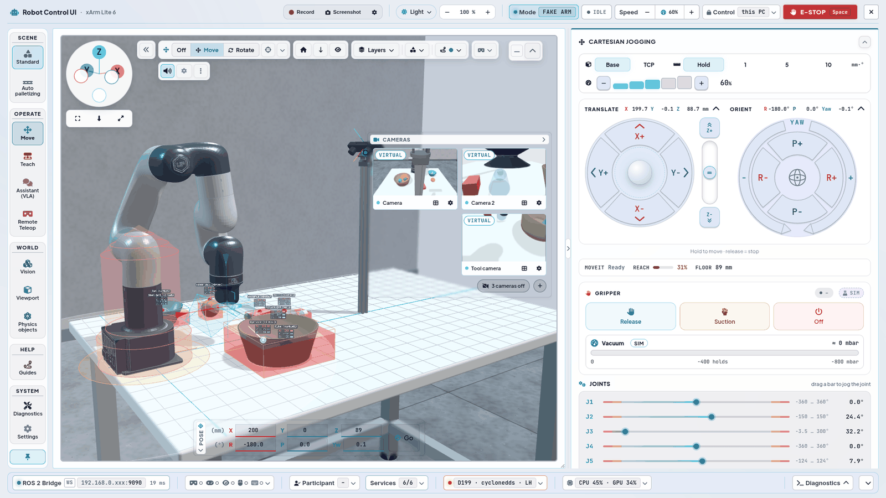
>       <br><sub><i>Helles Theme (Theme-Menü im Header): gleiches Layout, Bereich Move, FAKE-Modus.</i></sub>
>   - 🧊 **Viewport & Digital Twin**
>     - **3D-Centerpiece (WebGL Digital Twin):** Zentraler, offline-fähiger 3D Digital Twin (three.js & urdf-loader) mit Live-Spiegelung von `/joint_states` und der Linearachse, Orbit-Kamera, Navigations-Gizmo oben links (Achskugeln anklicken = Ansicht ausrichten, ziehen = drehen), Reset, Draufsicht, Grid, **Laborraum** (`fa-warehouse`, standardmäßig an: Betonboden, zwei Wände hinter dem Roboter, die in die Theme-Farbe auslaufen, Alu-Profilgestell unter dem 1,20 × 0,80 m Tisch mit dem Roboter an der schmalen Kante; das Grid liegt dann nur auf der Tischplatte; in VR/Passthrough ausgeblendet; statisch, ~12 Draw Calls, keine zusätzlichen Lichter oder Schatten) und CAD-Kanten. Im Layers-Panel (**Environment**, **Objects**, **Safety**) schalten Schalter die Marker der `scene_objects`-Knoten einzeln ein/aus (`fa-cubes` Objekte, `fa-square` Referenzebene, `fa-shield-halved` Safety Zone - rot die vermessene unerreichbare Zone um die Roboterachse als 3D-Körper, orange flach der Bahnabstand der Scans und der leicht transparent weiße Arbeitsbereichskreis mit $r = 420\text{ mm}$ [$3\text{ mm}$ Dicke] auf Bodenhöhe $Z = 0$, `fa-video` ZED-M-Stativ), dazu YOLO-Overlay (mit sauber zentrierter zweizeiliger Klassen- und Koordinatenbeschriftung; **XYZ Coords** blendet die Koordinaten, **Object Label** (`fa-tag`) die Klassennamen aller Objekte inkl. virtueller Objekte ein/aus), Distanzlinie, der Button **Virtual Obj.** (siehe unten) und die MoveIt-Kollisionsschalter.
>     - **Viewport-Leiste (`js/toolbar.js`, `js/layer_bar.js`):** Ausgeklappt hat der 3D-Viewport keine Section-Überschrift. Oben links sitzt der Navigations-Gizmo (144 px; bei niedrigem Viewport 112 px, sehr niedrig 96 px, Größen-Regler 60–125 %), direkt darunter drei gleich breite Kamera-Knöpfe: **Fit view** (Pos1), **Top view** und Gizmo-Größe. Rechts daneben eine Leiste nach Aufgaben: **«** einklappen (nur Gizmo und Fensterknöpfe bleiben; ein gelber Punkt an *Tools* zeigt, dass etwas abweicht: Sicherheitszone ausgeblendet, Kollision aus, Ton aus; je Browser gemerkt) · **TCP-Gizmo** als ein Segment **Off / Move / Rotate** (Tasten G / T / R), ⌖ zurück zum Roboter-TCP (Esc, bei Off gesperrt) und ▾ Gizmo-Aussehen (Linienlänge, Dicke, Deckkraft als Stellvertreter von *Settings › TCP Gizmo*, *Save look*) · **Move** (frühere Section MOTION: Home, Align, Scan pose; `motion-lockable`, id `twin-motion-overlay` bleibt fürs VR-HUD) · **Layers** und **Planning** (Panels, siehe unten) · **XR** (VR direkt, wenn der Browser es meldet, ▾ Passthrough AR und VR-Spiegelfenster) · **App** (Ton, Settings, ⋮) · Fensterknöpfe (`.centerpiece-collapse-stack`: alle HUD-Panels einklappen, Viewport einklappen) ganz rechts. Farben: Gruppen neutral, aktiv = Blau, Gelb nur als Punkt bei Abweichung. Zu eng: erst entfallen die Wörter der Nebenknöpfe (Container ≤ 1440 px), dann Tasten-Hinweise und Zähler (≤ 1100 px), dann die Wörter im Segment (≤ 860 px); danach bricht der Hauptteil in eine zweite Zeile um. Eingeklappt zeigt die Section eine Kopfzeile `Digital Twin - Viewport | xArm Lite 6 (FAKE)` bzw. `...(REAL)` (folgt `ufactory_driver`) mit dem Aufklapp-Pfeil – dort lässt sie sich auch in eine andere Spalte ziehen.
>       <br>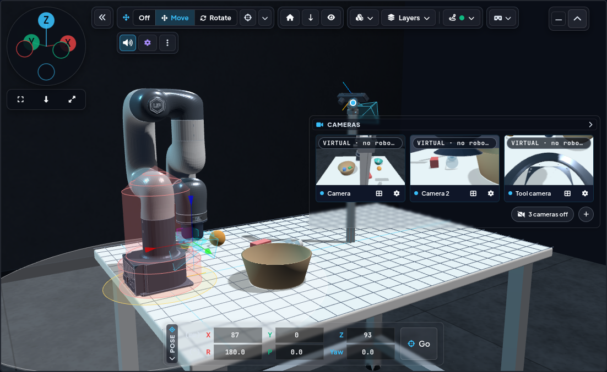
>       <br><sub><i>Viewport: Navigations-Gizmo oben links, Leiste (Gizmo Off/Move/Rotate, Posen Home/Align/Scan/OctoMap, Layers, Planning, XR, Sound, Settings), Tabs OBJECTS (links), CAMERAS (rechts) und POSE (unten).</i></sub>
>     - **Einklappbare Viewport-HUD-Panels:** Der Viewport trägt die Leiste (siehe oben) und zwei einklappbare Glas-Panels — **CAMERAS** und **POSE** (**SEQUENCES** ist eine normale Section, in jede Spalte ziehbar und einklappbar (Standard links); die frühere Section MOTION ist die Gruppe **Move** der Viewport-Leiste; SYSTEM steht in der Statusleiste, SPEED in der Sicherheitsleiste, TELEMETRY ist die Statuszeile in Cartesian Jogging). Die POSE-Felder bleiben immer sichtbar. Jede Panel-Kopfzeile klappt ihren Inhalt zu, ein Button in der Viewport-Tableiste (`fa-window-minimize`) klappt alle gemeinsam zu oder auf; der Zustand wird pro Browser gespeichert. Ein eigener Schalter (`fa-ruler-horizontal`) blendet die Distanzlinie vom TCP zum nächsten Objekt ein oder aus. Die Zielkoordinaten des TCP-Gizmos stehen im MoveIt-Popup (siehe unten).
>     - **Panel Virtual Objects – virtuelle Objekte einzeln (`js/virtual_objects_hud.js`):** Knopf **Virtual Objects** in der Viewport-Leiste zwischen *Layers* und *Planning* (Zähler `6/8` = greifbare Objekte der Szene, die in der Szene sind); öffnet darunter ein Panel wie Layers/Planning (`#layer-fly-vobj`, `js/layer_bar.js`: nur ein Panel offen, Esc / Klick daneben schließt). Die greifbaren Objekte stehen drin, solange *Planning › Simulation › Object detection* an ist (sonst ein Hinweis); **All** (Kästchen an / aus / gemischt, Zähler `6/8`), darunter die acht Objekte in zwei Spalten (Cube, Rectangle, Cylinder, Bottle, Steel Ball, Rubber Ball, Bowl, Basket) mit Kästchen und Farbpunkt; aus = leeres Kästchen, hohler Punkt, Name durchgestrichen. Zeigt nur die Objekte der aktiven Szene (Bereichs-Leiste › Scene); **All** und Alt+Klick wirken innerhalb dieser Szene, Körper der anderen Szene bleiben im Viewport ausgeblendet. Klick = Objekt aus der Szene nehmen bzw. zurückholen, **Alt+Klick** = nur dieses Objekt behalten. Ein abgeschaltetes Objekt verschwindet aus `/zed/bboxes_3d` (kein MoveIt-Hindernis, nicht in *Detected Objects*, nicht in der Szene des VLA-Agenten), sein Körper wird im Viewport ausgeblendet; RViz zeigt den Szenen-Marker weiter. Der Zustand gehört `virtual_object_detections` (`/ui/set_virtual_objects` → latched `/ui/virtual_objects`), alle Browser sehen dasselbe. Höhe: zwei Spalten halten das Panel flach; bei niedrigem Viewport scrollt das Panel. Die Rückfrage *Turn off … collision?* steht in eigener Zeile und bricht um, statt das Panel zu verbreitern.
>       **Environment** (darunter, `js/environment.js`): nicht greifbare Objekte, je mit Kästchen (im Viewport zeigen) und Schild (MoveIt-Hindernis) – Table (Schild = *Floor collision*), Lab room (nur Anzeige), ZED stand (immer Hindernis, `zed_stand` aus `moveit_floor_collision`; mit Schwenk-Neige-Kopf unter der Kamera (Klemmkopf, Drehteller, Gabel mit Achsbolzen; das Profil endet unter dem Kopf). Die Pose der ZED M ist die Kalibrierung `zed_camera_link`, deshalb im Viewport nur verstellbar, solange *Settings › Virtual Objects* mit *Zed M Camera* offen ist: Kamera ziehen = um das Profil schwenken + Höhe, Profil/Kopf ziehen = nur Höhe; beim Überfahren erscheinen am Gelenk **Griffe**: blauer Ring um das Profil = nur Schwenken, Doppelpfeil am Profil = nur Höhe, Wert als Badge am Zeiger; **Neigung** über den kleinen **Neige-Punkt** am Stativgewinde: Klick → Menü mit je einer Zeile pro Achse und eigenem Kreispfeil-Symbol – *Rotate* (Schwenken, 1°), *Height* (Gelenkhöhe über dem Tisch in mm, 5 mm, auch ins Zahlenfeld tippen + Enter; mindestens 50 mm, unter dem Riegel des Palettenmagazins steht der Ständer dann auf dem Boden), *Tilt* (Neigung, 1°, *0°* = gerade, Bereich −30…90°) –, je − / + (gedrückt halten zählt schneller weiter) und Wert (bei geschlossenem Virtual Objects erklärt das Menü, wie man freischaltet); das Stativgewinde bleibt stehen, die Werte gehen wie bei den Reglern in die Seite Virtual Objects (*unsaved* bis *Save*)); in der Szene *Logistik – automatisch palettieren* zusätzlich Conveyors, Safety fence (beide mit Schild; der Zaun ist beim Start ausgeblendet, seine Kollision bleibt an), Stack light & marking (Signalsäule auf Rohr mit Tischklemme an der hinteren Tischkante x+, hinter dem Palettenmagazin) und Info screen (`3d_virtual_infoscreen`, Infoscreen auf Schwenkarm mit Tischklemme an der langen Tischseite, bei x = 0,58 m, zur Perspektive *Fit view* gedreht, Screen senkrecht; beide nur Anzeige; **per Maus verstellbar**: Screen oder Arm ziehen = um die Säule schwenken und auf ihr hoch/runter schieben (0,17–0,43 m über der Tischplatte), Klemmring ziehen = nur Höhe, steil von oben = nur Schwenken; solange der Zeiger über dem Screen ist, erscheinen dieselben **Griffe**: blauer Ring um die Säule = nur Schwenken, Doppelpfeil = nur Höhe (Wert als Badge am Zeiger); **Neigung** über den Neige-Punkt am Klemmring: dasselbe Menü (Rotate 1°, Height 5 mm, Tilt 1°), Neigung −20…+45°, Grundstellung 0°, der Screen neigt sich um die Rückseite seiner VESA-Platte; Doppelklick auf den Screen = Grundstellung; Stellung und Neigung bleiben pro Browser gespeichert, `js/twin/joint_drag.js` + `joint_targets.js` + `tilt_dots.js`). Beide Knöpfe klicken dieselben Schalter wie *Layers › Environment* und *Planning › MoveIt* (Zeilen *Conveyors / Safety fence / Stack light & marking / Info screen* in *Layers › Palletizing* und *Conveyor collision / Fence collision*, nur in dieser Szene sichtbar) – Zustand und Rückfrage sind gemeinsam; Schild aus = gelb mit Warn-Icon. Die Kollision der Anlage gehört `virtual_object_detections`: `/ui/set_virtual_objects` `{"collision": {"conveyors"|"fence": bool}}` → latched `/ui/environment_collision`; jeder Wechsel in die Palettier-Szene schaltet beide wieder ein.
>     - **Panel Library – virtuelle Laborobjekte einfügen (`js/object_library.js`):** Knopf **Library** in der Viewport-Leiste rechts neben *Virtual Objects* (Zähler = eingefügte Objekte der aktiven Szene) öffnet `#layer-fly-lib`. Katalog = `config/object_library.yaml` (einzige Quelle: Form, Maße, Farbe, Greifpunkt, Kategorie, Greifart): Reiter *Shapes & bins* (9), *Lab* (8), *Assembly* (8), *Everyday* (8) mit Zähler, Kacheln in 3 Spalten mit Mini-Render der echten Form (offscreen, `js/twin/library_meshes.js`), Name, Maß und *Grip* / *Suction* / *Target* (Ablagen = gestrichelter Rand). **Klick** auf eine Kachel = am nächsten freien Platz in Reichweite um `link_base` einfügen (Radien 180–330 mm, vorn zuerst, 20 mm Abstand zu jedem Objekt der Szene; Palettieren: nicht auf den Bändern). **Ziehen** in den Viewport = halbtransparenter Geist an der Ablagestelle auf der Tischebene und am Zeiger *in reach* / *out of reach*; Loslassen fügt dort ein (auch außer Reichweite). Danach verschiebt das Objektmenü es (*Translate*) oder dreht es um die Hochachse (*Rotate*, blauer Ring, neu für Bibliotheks-Objekte). Instanzen heißen `Cube 30 #1`, `#2`, … (Frame `lib_<typ>_<n>`, Marker-ID ab 1001) und gehören zur Szene, in der sie eingefügt wurden (alle 4 Szenen; mobile/tiling: Reichweite relativ zur Roboterbasis). Sie verhalten sich wie die festen Greif-Objekte: TF über den TF Tuner, Körper im Twin und in der Physik-Sandbox (greifen + ablegen, offene Ablagen sind hohl), Erkennung auf `/zed/bboxes_3d` → MoveIt-Hindernis, Objektmenü, VLA-Agent, VR. *Virtual Objects* listet sie in der Gruppe **From the library** (Häkchen = in der Szene, × = löschen); ab 40 Objekten ein Hinweis (MoveIt plant langsamer), keine Obergrenze. Node-Seite (`virtual_object_detections.py`): Befehl `/ui/set_library_objects` (JSON `{add: {type, pose?}}` · `{remove: [id]}` · `{on: {id: bool}}`, rosbridge-Whitelist), Zustand latched auf `/ui/object_library` (Katalog + Instanzen); Instanzen und ihre letzte Pose (aus TF, alle 2 s gespeichert) bleiben nach einem Neustart erhalten in `~/.ros/object_library.json` (Parameter `library_state_file`). Objekt-Erkennung bleibt standardmäßig aus – ohne sie werden die Objekte nur angezeigt.
>     - **Layers- und Planning-Panel (`js/layer_bar.js`):** Ersetzen die frühere Ebenen-Leiste mit ihren fünf Flyouts. **Layers** (Taste **L**) = nur Anzeige, fünf Spalten mit eigenem Farbton im Kopf, in den Szenen *Logistik – automatisch palettieren* und *Bau – Fliesenlegen* sechs (Panel breiter; Spalte *Fliesenlegen* siehe unten) (türkis Environment: Bodenraster, Laborraum, CAD-Kanten, Zweiton-Lackierung (Ellbogen link3, Handgelenk link5 und Basis dunkelgrau wie am echten Arm; aus = ganzer Arm weiß), Tisch, ZED-Stativ, virtuelle Kameras, Lineal 5 cm · himmelblau Palletizing (nur in der Palettier-Szene): Förderbänder, Schutzzaun, Signalsäule & Markierung, Info screen · himmelblau Objects: Szenen-Objekte, Greif-Objekte · indigo Vision: *Detection display* (Kennzeichen *GLOBAL* als eigene Zeile unter dem Titel: Box + Greifpunkt aller erkannten Objekte jeder Szene, nur Anzeige) mit den Unterzeilen Object names und XYZ values (Beschriftung der Objekte, Wahl bleibt gespeichert, solange die Anzeige aus ist), Distanzlinie · Gripper: Saugspalt-Strahl, Strahl + Ring, Spalt-Label · violett Safety: Sicherheitszone). Jede Spalte hat eine Checkbox für alle / keine / gemischt und einen Zähler; der Knopf zeigt `an/gesamt`. **Planning** = ändert, wie der Roboter fährt: MoveIt (Confirm path (Ghost), Object collision, Floor collision) mit Status-Chip (grau = läuft nicht + Link zur UX | Nexus Launcher, grün = läuft) und Simulation (SIM physics, Virtual objects, Reset objects; nur FAKE). Eine Kollision **aus**schalten fragt in der Zeile nach (Fokus auf *Keep on*); ist eine Kollision bei laufendem MoveIt aus oder die Sicherheitszone ausgeblendet, wird die Zeile gelb mit Grund und der Knopf bekommt einen gelben Punkt. Die Panels öffnen unter ihrem Knopf und bleiben im Viewport; nur eines ist offen, Esc, ein Klick daneben und jeder Bewegungsstart schließen es. Die Schalter-ids sind unverändert (`.layer-row[id]` spiegelt das VR-HUD). Die HUD-Reiter docken über ihre Kopfzeile an die vier Innenränder; die Belegung überlebt einen Reload (`js/hud_dock.js`). Ist ein Seitenrand für seine Reiter zu kurz (z. B. 1280 × 800), behält jeder Reiter mindestens seine Kopfzeile und der Rand scrollt mit dem Mausrad (`fitSideDocks` in `digital_twin.js`).
>     - **Szene *Bau – Fliesenlegen* (N67, nur FAKE, `js/twin/tiling_hall.js`):** Bereichs-Leiste › Szene **Bau – Fliesenlegen** (*Construction – tiling*) setzt den Lite 6 auf ein AMR mit Hubsäule (Schlitten 0,06 … 1,0 m über Boden) in eine Halle 1:1 mit 12 × 8 m: abgeklebtes Bodenfeld 2,4 × 1,8 m, frei stehende DEMO-Wand 2,4 × 2,0 m mit Startlatte, Materialstation und Linienlaser; virtuelle Objekte, Tisch, ZED M, Lineal, Laborraum und Bodenraster sind aus. Gesperrt, solange ein REAL-Roboter verbunden ist (die mobile Basis mit Hubsäule ist simuliert). Der Twin folgt der Basis (`/odom`) und dem Hub, zeigt die Fliesenablage am Schlitten und die Fliese am Sauger, solange sie gehalten wird. **Layers** bekommt die Spalte **Fliesenlegen** (*Tiling*, `js/environment.js`, nur Anzeige): *Verlegeplan* (blau = legt der Roboter, gelb = Schnittfliese, setzt ein Mensch, gestrichelt = außer Reichweite), *Fugenraster* (3 mm), *Laserlinie* (grüne Bezugslinien), *Kleberbett* (unter den offenen Fliesen des nächsten Halts), *Halte + Reichweite* (AMR-Posen mit 440 mm Reichweite des Arms, standardmäßig aus), *Sperrzone* (gelegte Bodenfliesen + 3 cm, das AMR fährt nie darüber) und *Materialstation*. Die Szene öffnet das Aufgaben-Fenster **Fliesenlegen** (`js/tiling.js`): Einzelschritt / Automatik, *Start*, *Nächste Fliese*, *Pause*, *Abbrechen*, *Zurücksetzen* - Ablauf und Topics in [VLA-M › Fliesenlegen](vla.html).
>     - **Proximity heatmap (Layers › Safety, `js/twin/proximity_heat.js`):** Standard aus (je Browser gemerkt). Eingeschaltet färbt sich jedes Roboterglied nach seinem eigenen Abstand zur Z-Grenze (tiefster Punkt seiner Meshes im Basisrahmen): neutral ab 50 mm, darunter warmgelb → orange, unter 15 mm rot; das Handgelenk (`link4`, `link5`) zusätzlich nach dem Singularitäts-Index aus `safety.js` (REACH %, gleiche Schwellen). Basis und J1 bleiben neutral. Nur Anzeige; gerechnet einmal pro Frame nach neuen Gelenkwerten, umgefärbt nur bei geänderter Stufe. Kollisions- und Singularitäts-Puls haben Vorrang.
>     - **Reachability volume (Layers › Safety, `js/twin/reachability.js`):** Standard aus (je Browser gemerkt). Visualisiert den vorberechneten 3D-Erreichbarkeits- und Manipulierbarkeits-Arbeitsraum des xArm Lite 6 (~440 mm Reichweite, Gelenkgrenzen) als performantes Three.js `InstancedMesh` (35-mm-Voxel-Gitter). Farbverlauf nach dem Yoshikawa-Manipulierbarkeits-Index $\sqrt{\det(J J^T)}$: grün = optimale Manipulierbarkeit / hohe Geschwindigkeitsreserve, gelb/orange = mittlere Mobilität, rot = Singularitätsnähe / gestreckter Randbereich. Halbtransparent (`depthWrite: false`) mit feinem Tisch-Verankerungsring ($r = 440\text{ mm}$), sodass Roboterglieder und Tischobjekte im Inneren des Volumens vollständig erkennbar bleiben.
>       <br>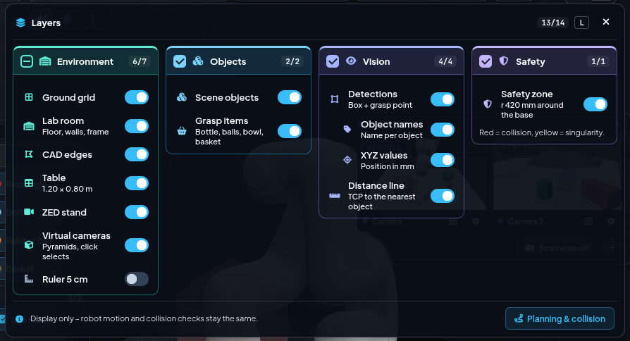
>       <br><sub><i>Layers (Taste L): vier Spalten Environment, Objects, Vision, Safety – nur Anzeige.</i></sub>
>       <br>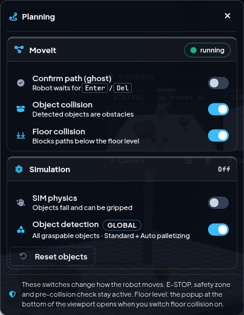
>       <br><sub><i>Planning: MoveIt (Confirm path, Object collision, Floor collision) und Simulation (SIM physics, Object detection, Reset objects).</i></sub>
>     - **Mitwachsende Viewport-Icons:** Die Icon-Leiste im Viewport (54 px, bei weniger Breite 45 bzw. 36 px) und die MOTION-Icons (57/60 px) werden größer, wenn Platz ist. Die Stufe wird gemessen statt geschätzt: Würde MOTION abgeschnitten, greift die nächstkleinere Stufe (auch nach dem Auf-/Zuklappen eines Panels).
>     - **Distanzlinie als Leuchtstrahl:** Die Distanzlinie ist ein animierter Strahl (ein Mesh statt einer 1-px-WebGL-Linie) mit hellem Kern, weichem Glow und Lichtpulsen, die vom TCP zum Ziel laufen, einem Glow-Punkt an beiden Enden und einem sich ausbreitenden Ring am Ziel. Nah am Ziel wechselt die Farbe von Cyan (ab 15 cm) zu Grün (bei 3 cm), und die Pulse werden schneller.
>     - **Systemlast (Statusleiste, früher SYSTEM-Tab):** Der Chip *CPU · GPU* in der Statusleiste öffnet ein Popover mit CPU- und GPU-Last sowie RAM- und VRAM-Belegung des PCs in Prozent, jeweils mit einem 60-s-Verlauf auf fester Skala 0–100 % (wie der Traffic-Graph im Header der UX | Nexus Launcher); ab 90 % wird die Zeile hervorgehoben. Die Werte kommen jede Sekunde von `/api/sys_load` aus `server.py` (`/proc`, `/sys/class/hwmon` bzw. `nvidia-smi`, gemessen nur, solange die UI fragt) - Same-Origin, funktioniert also auch im Quest-Browser (8443). Darunter CPU- und GPU-Temperatur sowie Uptime – dieselbe Karte wie im UX | Compact Interface.
>       <br>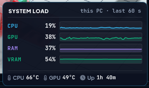
>       <br><sub><i>Popover des Statusleisten-Chips CPU · GPU: Last und Speicher mit 60-s-Verlauf, Temperaturen und Laufzeit.</i></sub>
>     - **Globale Geschwindigkeit (Sicherheitsleiste):** Der Tempo-Override `−` / `60%` / `+` im Header (5 Stufen, Tooltip z. B. `3/5 (60%)`; den SPEED-Tab im Viewport gibt es seit N18.10 nicht mehr) regelt alles: MoveIt Servo/Jogging und Gamepad über `/ui/robot_control/set_speed_index` (Faktoren 0,1–0,5) und zugleich MoveTo, Initialpose und Scans über `/ui/scan_speed` (Stufe 1–2 = Slow, 3 = Normal, 4–5 = Fast).
>     - **Rotationen in Grad:** POSE-Felder (Roll / Pitch / Yaw) und die Gelenkwerte zeigen Winkel in Grad. Die Services (`/ui/execute_move_to_pose` usw.) bekommen weiterhin Radiant; die UI rechnet um.
>     - **Physik-Sandbox (nur FAKE):** *Planning › Simulation › SIM physics* macht die TF-Tuner-Objekte (Würfel, Quader, Zylinder) und die Greif-Objekte (Flasche, Stahlkugel, Gummiball, Schale, Korb) zu Rapier-Physikkörpern (`lib/rapier/`, `js/sandbox.js`); die Roboterglieder schieben sie als kinematische Hüllen. Der Vakuumgreifer (Buttons oder Gamepad A) greift nur bei einem Spalt ≤ 5 mm, einer Neigung ≤ 20° und voll aufliegendem Saugnapf – Ring und mm-Anzeige am Saugnapf zeigen das an. Die Objektposen laufen über den TF-Tuner zurück (TF, RViz, virtuelle Objekte); MoveIt (`move_group` und Servo) bekommt `/planning_scene`-Diffs und das gegriffene Objekt als `AttachedCollisionObject` an `link_eef`. Mit dem VLA-M-Agenten kann der Arm die virtuellen Objekte greifen, tragen, ablegen und stapeln.
>       <br>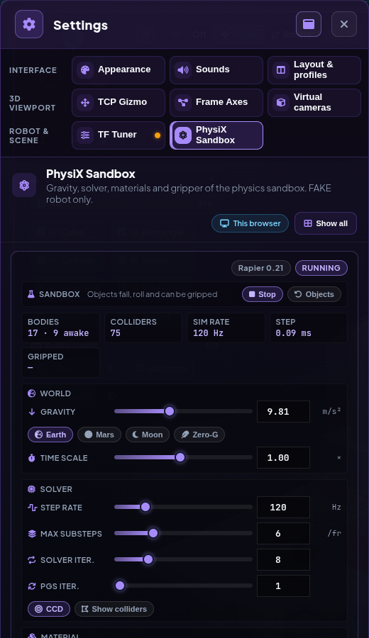
>       <br><sub><i>Settings › PhysiX Sandbox im Lauf: Rapier 0.21, Körper/Collider, Welt (Schwerkraft-Presets, Zeitfaktor), Solver.</i></sub>
>   - 🦾 **Bewegung & Planung**
>     - **Virtuelle Teleoperation & Ergonomischer 1080p-Fit:** Kartesisches Jogging mit **Ringen**: *Translate* = vier X/Y-Segmente um den 2D-Analogstick plus senkrechter **Z-Hebel** (Ziehen = Z-Geschwindigkeit proportional zum Weg, federt beim Loslassen in die Mitte zurück; *Z+* / *Z−* an den Enden fahren wie Tasten, auch im Schrittmodus), *Orient* = Roll/Pitch-Segmente innen, **Yaw** als Außenring (Pfeilspitzen zeigen die Drehrichtung). Gehaltene Segmente leuchten in ihrer Achsfarbe. **Tastatur:** Segmente und *Z+* / *Z−* sind per Tab erreichbar (Fokusring), Enter oder Leertaste gedrückt halten = fahren, loslassen oder Fokus weg = Stopp; Tasten-Wiederholung startet nicht neu, im Schrittmodus ein Schritt pro Druck (`js/jog.js`). Die Kopfzeilen *Translate* / *Orient* zeigen die **Live-Pose** des TCP (X/Y/Z in mm, R/P/Yaw in ° in link_base, Auflösung 0,1; an ±180° zählen Roll und Yaw bis ±190° weiter statt das Vorzeichen zu wechseln; in schmalen Spalten in einer zweiten Zeile). Ein kompakter Kasten oben fasst Frame (Base/TCP), Schrittweite (Hold, 1/5/10 mm bzw. °) und eine schmale **Speed**-Leiste mit 5 Stufen zusammen (antippen = Stufe, −/+; Stufe 5 gelb), die Speed im Header spiegelt - gleicher Wert, der Header bleibt die feste Stelle. Dazu Gelenk-Jogging durch horizontales Ziehen an den Gelenkbalken J1–J6. Unter den Ringen zeigt eine Statuszeile **MoveIt** (Servo-Zustand: Off, Ready, Moving; gelb *Near singularity* / *Near collision*, rot *Stopped: …*), **Reach** (Balken + %, Abstand zur Handgelenk-Singularität J5: gelb unter 50 %, rot unter 20 %) und **Floor** (TCP-Höhe über dem Z Collision Level in mm, gelb knapp darüber, rot auf oder unter dem Level); Normalwerte bleiben neutral. Die ids (`#moveit-badge`, `#hud-manip-*`, `#hud-floor-val`) sind unverändert, das VR-HUD liest sie. Das gesamte Interface ist so ausgelegt, dass alle Steuerelemente auf Standard-1080p-Monitoren ohne vertikales Scrollen Platz finden.
>       <br>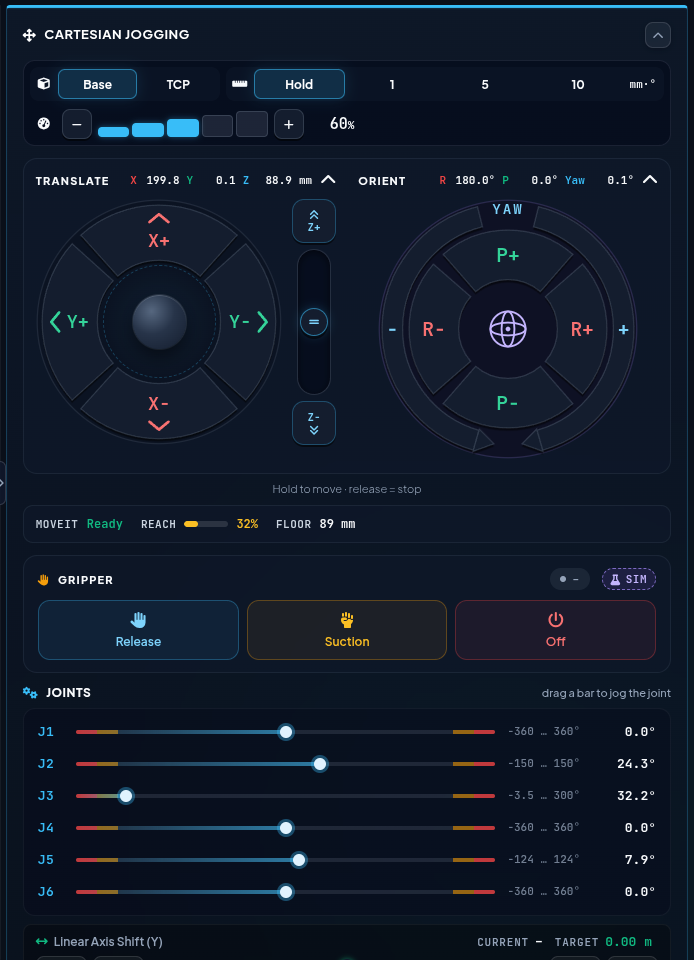
>       <br><sub><i>Rechte Spalte (Bereich Move): Cartesian Jogging mit Frame Base/TCP, Schritt Hold/1/5/10, Tempo-Balken, Translate-Ring mit Joystick und Z-Hebel, Orient-Ring mit Yaw; darunter MoveIt-Status, Greifer und Gelenke J1–J6.</i></sub>
>     - **Strukturiertes Joint-Telemetrie-Grid:** Die Gelenke J1–J6 sind in einem ergonomischen 2-Spalten-Grid mit klaren Headern (`#38bdf8`) und fetten Monospace-Werten angeordnet, ergänzt durch eine optisch separierte Karte für die Verfahrwege der virtuellen Linearachse.
>     - **Bahnvorschau (Geisterroboter):** Der Button **Confirm Path (Ghost)** im Planning-Panel (MoveIt) - oder das Geist-Icon neben Δ im MoveIt-Popup - schaltet die Vorschau an/aus (`/ui/set_moveto_preview`). An: jedes MoveTo (Go, Gizmo, Scan-Position, „Approach from above“) wird nur geplant, ein halbtransparenter Cyan-Klon fährt die Bahn im Twin in Echtzeit in einer Schleife ab, eine Linie zeigt die TCP-Bahn. Im MoveIt-Popup erscheinen *Execute path* / *Discard* mit Countdown bis zum automatischen Verwerfen.
>     - **Ghost-Modus plant sofort:** Mit aktiver Vorschau wird nach dem Loslassen des Gizmos oder dem Klick auf einen Move-Knopf (Viewport-Leiste) sofort geplant und die Geist-Bahn gezeigt; der Execute-Button (Play) fährt dann. Die *Auto-Move*-Checkbox ist im Ghost-Modus ausgeblendet - der Geist selbst ist der Bestätigungsschritt.
>     - **MOTION-Buttons mit Bestätigung:** Ohne Ghost-Modus und mit *Auto-Move* aus verhalten sich Initial Pose, Align TCP und Scan-Position in der Gruppe Move der Viewport-Leiste sowie *Go* im POSE-Panel (zeigt das Ziel X/Y/Z; ungültige Eingaben werden sofort gemeldet) wie das Viewport-Gizmo: Der Klick öffnet das Confirm-Popup („INITIAL POSE“ / „ALIGN TCP“ / „SCAN POSITION“), gefahren wird erst nach *Execute* (X verwirft). Mit *Auto-Move* fahren sie sofort. Im Ghost-Modus zeigen alle drei zuerst eine Geist-Bahn (die Initialpose läuft dann über MoveIt statt über die direkte Gelenktrajektorie). E-STOP und Sprachbefehle wirken immer sofort.
>       <br>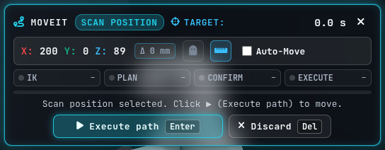
>       <br><sub><i>Scan-Position mit Auto-Move aus geklickt: Ziel X/Y/Z, Schritte IK · PLAN · CONFIRM · EXECUTE, Execute path (Enter) / Discard (Del).</i></sub>
>     - **MoveIt-Popup (Fortschritt, Gizmo-Ziel, Bestätigen & Zielobjekt-Badge):** Das Popup sitzt mittig direkt unter der Viewport-Leiste neben dem Navigations-Gizmo (im Fluss, ohne Überlappung) auf transparentem Hintergrund (kompakt, max. 560 px breit). Es integriert die Live-Zielkoordinaten des TCP-Gizmos (`TARGET X/Y/Z`, Abstand Δ zum realen TCP) direkt samt **Auto-Move**-Schalter und visualisiert während eines MoveTo die Phasen IK → PLAN → EXECUTE mit Live-Timern, Fortschrittsbalken, verworfenen Kandidatenpfaden sowie Ergebnis oder Fehler. Bei Objektauswahl oder Greifanfahrt wird der Name des Zielobjekts prominent im Popup-Kopf eingeblendet (z. B. `📦 SPORTS BALL`). Ist Auto-Move aus, laufen nach dem Loslassen des Gizmos (> 3 mm oder > 2°) sofort IK und Planung; ist die Bahn gültig, zeigt das Popup *CONFIRM PATH* und *Execute path* fährt nur noch (ohne Geist, automatisches Verwerfen nach 15 s; der Countdown steht in einer eigenen Zeile). Erneutes Ziehen verwirft die wartende Bahn und plant das neue Ziel. Bei aktiver Bahnvorschau bestätigt dieselbe Schaltfläche die Geist-Bahn. Nach der Bewegung blendet es sich selbsttätig aus (5 s bei Erfolg, 12 s bei Fehler). Gespeist von `/ui/moveit_motion_state`; die Schritte erscheinen zusätzlich als `[MoveIt]`-Zeilen im Log.
>       <br>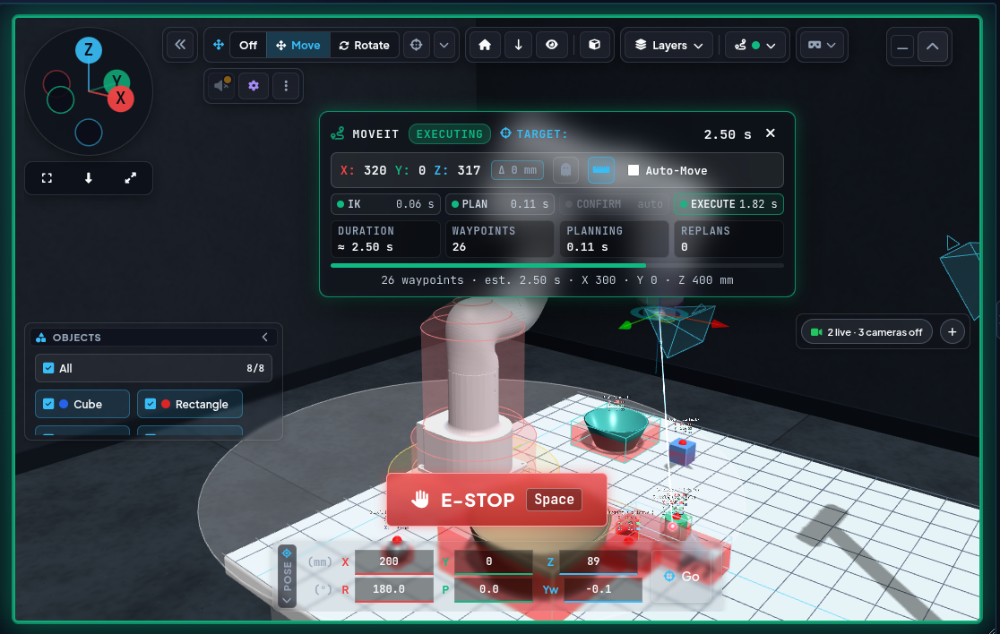
>       <br><sub><i>Während der Ausführung: Status EXECUTING, Zeiten je Schritt, Wegpunkte und Dauer; der Viewport-Rahmen wird grün, unten blendet der E-STOP ein.</i></sub>
>     - **TCP-Gizmo in der gewohnten Optik:** Das Gizmo nutzt weiterhin das TransformControls aus three.js r128 (`lib/three/addons/controls/TransformControls_r128.js`, als ES-Modul), der Rest des Twins läuft auf r186. Die lokale Kopie ergänzt `setAppearance(length, thickness)` und `setOpacity()` für die Settings-Section.
>     - **Zone um die Roboterachse = nur Warnung:** Liegt das Gizmo-Ziel in der vermessenen unerreichbaren Zone, färben sich Koordinaten und Δ rot und das Log warnt - gesperrt wird nicht mehr (auch Auto-Move und *Execute path* nicht), MoveIt entscheidet. Bis 20 mm außerhalb der Zone gibt es eine orange Vorwarnung; die REACH-Anzeige sinkt an der Zonengrenze auf 0 %. Die frühere Live-Meldung „SELF-COLLISION / INNER CYLINDER“ entfällt, Singularitäten und Kollisionen im Betrieb meldet MoveIt Servo.
>     - **Keine Ansage am Ziel:** „robot moves to initial pose / scan position“ entfällt, wenn der Arm schon dort steht (Gelenke höchstens 0,02 rad von der Initialpose, TCP höchstens 3 mm von 300/0/400 mm) und solange der Klick nur eine Vorschau plant.
>     - **SEQUENCES-Section (Wegpunkte & Bewegungsabfolgen):** Nimmt Bewegungsabfolgen auf und spielt sie ab. Schritttypen: *Waypoint* (aktuelle TCP-Pose, angefahren per MoveTo – IK und kollisionsfreie MoveIt-Planung wie beim Gizmo), *Home* (Initialpose), *Gripper* (open / closed / off, wartet auf `/ui/gripper_state`), *Wait* (Sekunden) und *Approach* (erkanntes Objekt von oben anfahren). Ein neuer Wegpunkt kommt hinter den markierten Schritt; Reihenfolge per Ziehen, Umbenennen per Doppelklick. Abgespielt wird erst nach Bestätigung; jede Fahrt gilt erst als fertig, wenn `/ui/moveit_motion_state` für genau diesen Lauf `succeeded` meldet – Fehler, E-STOP oder Zeitüberschreitung beenden die Abfolge, *Stop* beendet sie nach dem laufenden Schritt. Während der Abfolge sind die Motion-Buttons gesperrt. Gespeichert wird auf dem PC (`/api/sequences` → `~/.config/robot_control_ui/sequences.json`), damit Desktop, Quest 3 und UX | Compact Interface dieselben Abfolgen sehen (`js/sequence.js`). Schritt-für-Schritt-Hilfe: Guide **Record & play a sequence** in den *Guides* (Fuß der Bereichs-Leiste, 9 Schritte: anlegen, Startpose, Wegpunkt, Greifer, weitere Schritttypen, nächste Wegpunkte, bearbeiten, verwalten, abspielen); eine leere Schrittliste verlinkt darauf (*Step-by-step guide*). **Ort:** Seite *Sequences* im Aufgaben-Fenster **Teach** (Bereichs-Leiste, `js/task_window.js`).
>       <br>
>       <br><sub><i>Bereich Teach: Sequenz-Auswahl mit PLAY, Add step (Waypoint, Home, Object, Open, Close, Grasp, Wait) und Schrittliste.</i></sub>
>   - 📦 **Objekte, Greifen & Kollision**
>     - **YOLO Grasp Integration:** Direkte Visualisierung der 3D-YOLO-Objektliste samt Eingabefeld zur Auslösung der autonomen Greifsequenz aus der Ferne.
>       <br>
>       <br><sub><i>Bereich Vision › Detected Objects: Quellen-Kacheln Camera (real) / Virtual, darunter jedes Objekt mit Position, Abstand, Move to, Kollisionsschild und Menü.</i></sub>
>     - **Virtuelle Objekte:** Der Schalter **Object detection** im Planning-Panel (Simulation; Kennzeichen *GLOBAL*: gilt für alle greifbaren Objekte jeder Szene, Standard und Auto palletizing) schaltet `virtual_object_detections` über `/ui/set_virtual_detections` (weiß = aus, ausgegraut = Node läuft nicht). Blue Cube, Red Rectangle, Green Cylinder und die Greif-Objekte (Flasche, Stahlkugel, Gummiball, Schale, Korb; IDs 904–908, Schale und Korb mit Greifpunkt am inneren Boden) aus dem TF-Tuner erscheinen dann wie YOLO-Detektionen im Viewport, in der Liste *Detected Objects* und in VR (über `/ui/virtual_bboxes_3d`) - mit Greifkugel, Kontextmenü und MoveIt-Kollisionswänden. Ein Pin-Schalter in der Section *Detected Objects* (Titel und Kachel *Object detection*) legt fest, ob ein `DELETEALL` (z. B. vom YOLO der IP-Kamera) die virtuellen Objekte behält (Standard) oder wie RViz alles löscht.
>     - **Objekt-Kontextmenü & Viewport-Greifkugeln:** Klick auf die rote Greifkugel direkt im 3D-Viewport oder auf einen Eintrag der Objektliste öffnet das einheitliche Kontextmenü: *Approach from above* (kollisionsfreie Fahrt auf eine Vorposition 70 mm über dem Greifpunkt, dann geradliniges Absenken, bis der Saugnapf 2 mm über der Greifkugel (Objektoberseite) steht – kollisionsfrei, und die Physik-Sandbox greift sofort (Spalt ≤ 5 mm), auch bei virtuellen Objekten. Die Höhe richtet sich nach dem Werkzeug, das MoveIt geladen hat (`/ui/tcp_length_mm`, Motion Handler): mit dem Finger-Greifer-URDF (`add_gripper`) fährt der TCP um die Längendifferenz tiefer, damit die Finger um das Objekt fassen, begrenzt durch die Objekthöhe (Finger mind. 5 mm über dem Boden). Das Menü zeigt den Versatz (z. B. `+2 mm`). Die Zielpose darf das Zielobjekt nur mit den Fingern berühren, nie mit dem Saugnapf. Bei Auto-Move aus bleibt der Arm an der Vorposition stehen: das erste *Execute* im MoveIt-Popup fährt nur dorthin, das Absenken braucht ein zweites *Execute*. Bei Auto-Move an läuft alles durch, im Ghost-Modus erscheinen beide Teile als Geist), *Grasp* / *Place … here* / *Put back* (siehe unten); die Kollision ist eine Kachel im Quick Setup (siehe unten, die VR-Objektkarte behält den Eintrag *Disable / Enable collision for this object*, `/ui/set_object_collision`). Virtuelle Objekte (`… (virtual)`, IDs 901–908) haben als letzten Eintrag *Settings*: er öffnet das Settings-Fenster auf der Seite **Virtual Objects**, das passende Element ist schon gewählt (z. B. `Cylinder (virtual)` → *Green Cylinder*); von der Kamera erkannte Objekte haben kein Element im Virtual Objects und deshalb keinen solchen Eintrag. Die Kopfzeile zeigt die Greifpunkt-Koordinaten in den Achsenfarben (X rot, Y grün, Z blau, jeweils mit Einheit `mm`).
>       <br>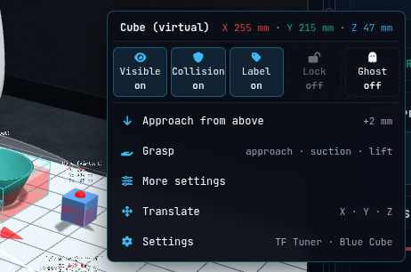
>       <br><sub><i>Objektmenü des Würfels: Quick-Setup-Kacheln (Visible, Collision, Label, Lock, Ghost), Approach from above, Grasp, Translate, Set approach gap, Settings.</i></sub>
>     - **Quick Setup (Objektmenü):** Eine Reihe aus fünf Kacheln unter der Kopfzeile; jede Kachel zeigt Icon, Namen und Zustand (`on`/`off`, durchgezogener bzw. gestrichelter Rahmen), das Menü bleibt offen. *Visible* blendet Rahmen, Kollisionswände, Labels und den Körper dieses Objekts in diesem Viewport aus – die Greifkugel bleibt, damit das Menü erreichbar ist, MoveIt weicht dem Objekt weiter aus. *Collision* schaltet die MoveIt-Kollision des Objekts (`/ui/set_object_collision`); auf REAL braucht jedes Umschalten einen zweiten Klick (`confirm?`), aus = orange Kachel `OFF` plus Zeile *MoveIt ignores this object – the robot may hit it*. *Label* blendet Name und Koordinaten nur dieses Objekts aus. *Lock* sperrt *Translate*, *Approach from above* und *Grasp* für dieses Objekt (*Put back* bleibt möglich). *Ghost* zeigt Rahmen und Körper durchsichtig (25 %). Visible, Label und Ghost gelten pro Browser (localStorage `rcu.objQuickSetup`, Schlüssel = Objektname) und nur in dieser UI. **Lock** und der **Approach gap** gelten für alle Clients und den VLA-Agenten: der Node `object_settings` (startet mit dem Launch der UX | Control Interface, nur auf dem Server) speichert sie in `~/.ros/rcu_object_settings.json`, nimmt Änderungen auf `/ui/set_object_setting` an (JSON `{name, lock}` oder `{name, approach_gap_mm}`, `null` = Standard) und sendet den Stand latched auf `/ui/object_settings`; ohne den Node sind Lock-Kachel und Regler ausgegraut mit Tooltip. `vla_bridge` lehnt *pick* eines gesperrten Objekts ab (Code `locked`, der Agent versucht es nicht erneut).
>     - **Set approach gap (Objektmenü):** Vorletzter Eintrag, direkt über *Settings*; klappt darunter auf. **Approach gap** = Abstand Saugnapf → Greifkugel beim Anfahren von oben, pro Objekt, 2–20 mm in 0,5-mm-Schritten (Standard 2 mm, Knopf *Reset to 2 mm*). Gilt für *Approach from above*, den Sequenzschritt *Approach* und *Grasp* (`vla_bridge` `grasp_pose`). Die Untergrenze bleibt 2 mm – näher berührt der Saugnapf das Objekt in MoveIt (Ziel in Kollision); über ~5 mm hält der Sauger evtl. nicht. Gesperrte Objekte behalten ihren Gap (Regler ausgegraut). Der Eintrag *Set approach gap* zeigt den aktuellen Gap immer als Wert-Badge (`2 mm`).
>     - **Farben im Objektmenü:** Das Icon-Feld zeigt die Art der Aktion – Blau = Roboter fährt (*Approach from above*, *Grasp*, *Put back*, *Place*), Hellblau = Information (*Package information*), Indigo = nur die Szene ändert sich, kein Roboter (*Translate*, Hinweis X · Y · Z in Achsfarben), Lila = Einstellungen (*Set approach gap*, *Settings*, Farbe der Settings-Section), Orange = Kollision aus. Werte (mm, Paket-ID) stehen als Badge.
>     - **Greifen und Ablegen mit einem Klick:** *Grasp* im Objektmenü (und der Knopf **Grasp** neben dem Feld *Manual Grasp Target*, der dasselbe Menü öffnet) greift in einem Zug: Anfahrt von oben (Yaw-Suche des Greifers), Saugen an, Griff prüfen, 80 mm anheben. Solange etwas gehalten wird, bietet das Menü eines anderen Objekts *Place … on here* / *in here* (Behälter wie Schale und Korb), das Menü des gehaltenen Objekts *Put back*, und ein **Klick auf den Tisch** im Viewport öffnet *Place … here* an dieser Stelle. Ausgeführt wird von `vla_bridge` über `/vla/skill` (JSON `{id, skill, object/target/x_mm/y_mm, confirmed, source}`) – dieselben Skills und Prüfungen wie beim VLA-M-Agenten (Reichweite, freier Platz, Platz für den Greiferkörper neben hohen Objekten), ohne Sprachmodell und ohne Neuplanung. Fortschritt und **Abort** erscheinen in der VLA-M-Section, das Ergebnis im Log, eine Ablehnung als Hinweis mit Grund. Beim **REAL**-Roboter fragt der Menüeintrag erst inline nach (zweiter Klick, gelber Rahmen); `vla_bridge` lehnt unbestätigte Befehle ab (`real_require_confirm`) und braucht `allow_real_motion`. Ausgegraut mit Tooltip, wenn die Karte *VLA-M Bridge* nicht läuft oder VLA-M beschäftigt ist.
>     - **Pick & Place to … (Objektmenü):** Solange nichts gehalten wird, bietet das Objektmenü (Klick im Viewport oder Objekt-Card; nicht die VR-Objektkarte) *Pick & Place to …*. Danach wählt man das Ziel: eine Leiste über dem Viewport (`#pp-bar`, im Fluss wie *Looking through*) zeigt *Click the target on the table or on the pallet*, die Schritte *1 Approach · 2 Grasp · 3 Place* und **Cancel (Esc)**, der Zeiger wird zum Fadenkreuz. Klick auf den Tisch = Ziel X/Y in mm, Klick auf ein Objekt (Palette, Schale, Karton) = darauf / hinein. Ein Popover listet dann die drei Schritte und **Start Pick & Place**; `vla_bridge` fährt beides als EINE Aufgabe (`/vla/skill` `{id, actions: [{skill: pick, object}, {skill: place, x_mm, y_mm | target}], confirmed, source}`, höchstens 2 Aktionen): dieselben Prüfungen wie *Grasp* / *Place here*, Fortschritt 1/2 → 2/2 und ein **Abort** in der VLA-M-Section. REAL: *Start* fragt erst inline nach (zweiter Klick); virtuelle Objekte bleiben gesperrt. Test: `tools/grasp_e2e.py --quick`, Fall PP.
>     - **Virtuelles Objekt verschieben (Objektmenü):** Bei virtuellen Objekten bietet das Menü *Translate* (über *Settings*): an der Greifkugel erscheinen X/Y/Z-Pfeile wie beim TCP-Gizmo im Modus *Move*, Ziehen verschiebt das Objekt - der Roboter fährt nicht. Die Position geht in das TF-Tuner-Element des Objekts (an dessen Reglergrenzen gekappt) und von dort an TF, `virtual_object_detections`, MoveIt-Kollision, Physik-Sandbox und die anderen Clients; danach greifen *Approach from above* / *Grasp* an der neuen Stelle. Solange aktiv, nimmt der TCP-Gizmo keine Eingaben an; *Esc* oder *Done translating* im Menü beendet es. Gesperrt, solange das Objekt gehalten wird. Position über einen Reload hinaus behalten: *Settings › Virtual Objects › Save*.
>     - **Paketinformation (Objektmenü, nur Kartons):** In der Palettier-Szene hat das Menü eines Kartons (`Carton L1` … `S3`) den Eintrag *Package information* (Hinweis: Paket-ID). Ein Klick klappt die Daten im Menü auf, ein zweiter wieder zu: Paket-ID (`PKG-L2`), Größenklasse, reale Größe im Euro-Modul-Raster (z. B. 600 × 800 × 400 mm, die Szene zeigt 1:6), Gewicht, Traglast oben (`max_stack_kg`, *none* bei zerbrechlichen Kartons), Handhabung (*fragile* mit Warn-Icon) und der Stand im aktuellen Palettier-Plan (*planned / placing now / placed · step n of N · layer L*, *stays on the conveyor - Grund* oder *No plan yet*). Daten: `CARTON_SPECS` in `js/twin/logistics_cell.js` (wie `CARTONS` in `virtual_object_detections.py`), Plan aus `/vla/pallet/plan` (`palletCartonStatus` in `js/pallet.js`).
>     - **Greifersteuerung (Vakuum- & Lite 6 Greifer):** Die drei Buttons steuern den Greifer jetzt wirklich. Der Befehl geht über `/ui/gripper_cmd` an `joy_to_servo_node`, der auch die Gamepad-Tasten A/B bedient und damit der einzige Besitzer des Greiferzustands ist (`/ui/gripper_state`, latched) - Gamepad-Toggle und UI bleiben synchron. Welcher Greifer angeschlossen ist, kommt aus dem Launch-Argument (`add_vacuum_gripper:=true` → Vakuum über `/ufactory/set_vacuum_gripper`, Buttons *Release / Suction / Off*; `add_gripper:=true` → Lite 6 Greifer über `open/close/stop_lite6_gripper`, Buttons *Open / Close / Off*). Ohne beides sind die Buttons gesperrt. Im FAKE-Modus wird der Greifer simuliert (`simulate_gripper:=true` im FAKE-Launch; `/ui/gripper_simulated` zeigt ein *SIM*-Badge), sodass Buttons, Gamepad A/B, Sequenzen und Physik-Sandbox ohne Hardware funktionieren. Mit echtem Greifer wird der neue Zustand erst gemeldet, wenn der Treiber den Befehl bestätigt (`ret = 0`); lehnt er ab, bleibt der Zustand unverändert und das Log nennt Ursache und Abhilfe (z. B. Roboterfehler quittieren, dann erneut schalten).
>     - **Vakuum-Anzeige (Move › Gripper, `js/vacuum_gauge.js`):** Nur beim Vakuumgreifer: Balken 0 … −800 mbar mit Wert (Mono, Einheit), grün *holding* ab −400 mbar, gelb *no seal*, wenn gesaugt wird, aber kein Unterdruck entsteht. REAL: Wert von `/ui/gripper_vacuum` (`std_msgs/Float32`, mbar, negativ = Unterdruck); der Lite-6-Vakuumgreifer hat keinen Drucksensor (der Treiber meldet nur an / aus), ohne dieses Topic zeigt die Karte *No vacuum sensor*. FAKE: simuliert aus Greiferzustand und Physik-Sandbox (Objekt angesaugt ≈ −620 mbar, Saugen ohne Objekt ≈ −60 mbar), schraffierter Balken, Badge *SIM* und *≈* vor dem Wert.
>     - **MoveIt-Kollisionsschalter:** Zwei Schalter im Planning-Panel (**MoveIt › Object collision**, **MoveIt › Floor collision**; Ausschalten mit Rückfrage) schalten die MoveIt-Kollision der erkannten Objekte (`/ui/set_moveit_collision_objects`) und des Bodens (`/ui/set_moveit_collision_ground`) an und aus. Grün = AN, rot umrandet = AUS, grau = Node läuft nicht. Die Objekte bleiben im Viewport in jedem Fall sichtbar.
>     - **Bodenkollision aus = Z Collision Level aus:** Ist die MoveIt-Bodenkollision im Planning-Panel abgeschaltet, sperren auch UI (Jogging, MoveTo, TCP-Gizmo, Warnbanner) und `teleop_pre_collision_checker` (Gamepad) nicht mehr nach unten. Läuft `moveit_floor_collision` nicht, bleibt die Sperre als Rückfallebene aktiv.
>     - **Bodenkollisions-Popup (`ground_popup.js`):** Erscheint nur beim **Ein**schalten des Schalters Floor collision im Planning-Panel, unten mittig im Viewport in einer eigenen Rasterzeile über dem E-STOP (ohne Überlappung mit POSE & Co.). Das Feld ist mit dem zuletzt bestätigten Z Collision Level (TCP-Höhe, im Browser gespeichert) vorbelegt; +/- und Tippen ändern nur das Feld. Erst **OK** (oder Enter) übernimmt den Wert: sofort für die UI-Bodensperre und über `/ui/set_ground_collision_level` an `moveit_floor_collision`, das die MoveIt-Box nachzieht und den gültigen (geklemmten) Wert latched auf `/ui/ground_collision_level` zurückmeldet. Unverändert und ohne Bedienung blendet sich das Popup nach 10 s wieder aus.
>   - 🛑 **Sicherheit & Steuerung**
>     - **E-STOP im Viewport + Leertaste:** Der E-STOP sitzt unten mittig im Viewport, in einer eigenen Rasterzeile über dem Panel POSE. Standardmäßig ist er ausgeblendet und wird eingeblendet, sobald sich der Roboter bewegt (Gelenkstellungen); 1,5 s nach dem Stillstand blendet er wieder aus. Ist er gedrückt und verriegelt, bleibt er sichtbar, der Viewport bekommt einen pulsierenden roten Rahmen (wie bei einer Kollision) und daneben erscheint der orange *Reset*-Button zum Quittieren. Die **Leertaste** löst den E-STOP jederzeit aus, auch wenn der Button ausgeblendet ist (außer in Textfeldern). Solange er verriegelt ist, sind die Bewegungs-Buttons (Initial Pose, Align TCP, Scan-Position, Go) ausgegraut und deaktiviert - ein Klick spielt weder Klick-Sound noch Ansage -, und `motionAllowed()` blockiert jede Bewegung, auch Sprachbefehle und das Gizmo.
>     - **Totmann-Prinzip beim Jogging:** Jogging-Befehle laufen nur, solange wirklich gedrückt wird. Loslassen irgendwo auf der Seite, Fokusverlust, Tab-Wechsel, Kontextmenü, Schließen der Seite oder Verbindungsverlust stoppen jede Bewegung sofort (Log-Eintrag `Deadman: jog stopped (...)`). MoveIt Servo hält zusätzlich nach 0,2 s ohne Befehl an.
>     - **Kollisionswände & Servo-Haltabstand:** Die Kollisionswände der erkannten Objekte erscheinen im Twin rot transparent (nur bei aktiver Objektkollision, sonst nur der Rahmen). Kommt der TCP einer Wand näher als 2 cm - dem Haltabstand von MoveIt Servo -, leuchten die Wände dieses Objekts gelb-orange und pulsieren.
>     - **Verbindungsabbruch:** Fehlt rosbridge, legt sich ein Overlay über die gesamte Bedienfläche (Header bleibt frei) und alle Bewegungsfunktionen sind gesperrt - mit Offline-Dauer, Reconnect-Versuchen und Reload-Button.
>     - **MoveIt Servo Monitoring & Greifer-Glow:** Dynamische UI-Indikatoren (Grün/Orange/Rot) mit Puls-Animationen, die MoveIt-Kollisions- und Wait-States in Echtzeit spiegeln, sowie persistentes Leucht-Feedback für die Greifer-Zustände (`Open`, `Close`, `Off`).
>     - **Remote-Control-Section:** Client-Seite der Server/Client-Steuerung ([7.5](running.html#75-remote-control-server-client-kommunikation)): Modus-Chip (FAKE / REAL / DETECTING; *WATCHDOG OFF* ohne Watchdog), Standort (*This PC (server)* oder *Remote · IP*), Besitzer mit einem großen, zentrierten Knopf in eigener Zeile (*Take control* / *Request control* blau gefüllt, *Release control* blau umrandet, *Take over* gelb, *Cancel request* neutral; zweite Zeile nennt die Folge), *Arm gamepad* (REAL), Weiterleitung *Remote gamepad* (Browser-Gamepad-API → `/remote/joy`), Tempo-Slider (10–100 %, begrenzt durch das Server-Limit), die Liste offener Clients und die URLs für Clients. Auf dem Roboter-PC öffnet jede Anfrage eines anderen Clients ein Popup **Allow / Deny**; ohne laufenden Watchdog sperrt die UI selbst nichts, Jogging und E-STOP-Quittieren brauchen aber den Watchdog. Auf dem Roboter-PC signiert die UI Heartbeat und Anfragen mit dem Server-Token aus `/api/remote_info` (nur für 127.x, [7.5](running.html#75-remote-control-server-client-kommunikation)) (`js/remote.js`).
>       <br>
>       <br><sub><i>Bereich Remote Teleop › Remote Control: Modus und Standort, Control-Lock (Release control), Remote-Gamepad mit Max. Tempo, Clients und die Adressen fürs Heimnetz.</i></sub>
>   - 🎛️ **Einstellungen, Kameras & Assistenten**
>     - **Settings-Popup (Zahnrad „Settings“ in der Viewport-Leiste):** Alle Einstellungen liegen in einem Popup statt in eigenen Sections. Es wächst aus dem Zahnrad-Knopf heraus und beginnt unter dem Header, E-STOP, Modus und Status bleiben also sichtbar und bedienbar. Links die Navigation - *All settings* (alle Gruppen auf einer Seite, Gruppentitel lassen sich zum Umsortieren ziehen) oder eine einzelne Seite, nach Aufgabe gruppiert: **Interface** - *Appearance* (Theme, UI-Zoom, Bereichs-Leiste Auto-hide / angepinnt, Viewport-Panels zurücksetzen), *Sounds* (alle Sounds und Lautstärke, darunter je Gruppe eine Liste mit An/Aus-Häkchen, Sound-Datei und Abspiel-Knopf - dieselben Häkchen wie im Lautsprecher-Popover) und *Layout & profiles* (Presets, Profile, My view - inkl. *Load My view* / *Save as My view*); **3D viewport** - *TCP Gizmo*, *Frame Axes*, *Virtual cameras*; **Robot & scene** - *Virtual Objects*, *PhysiX Sandbox* (Physik-Parameter, früher die Section „SIM: PhysiX Settings“). Jede Einstellung hat hier ihren festen Platz; die Popover Lautsprecher und Gizmo sind Schnellzugriff mit Link auf ihre Seite. Ein Chip im Seitenkopf zeigt, wo die Werte liegen (PC, dieser Browser oder beides); weicht ein Teil ab (z. B. Sound-Dateien auf dem PC), steht es an der Gruppe. Einzelseiten zeigen keinen zweiten Gruppentitel; ein oranger Punkt an der Navigation und am Zahnrad-Knopf markiert ungespeicherte Gruppen, *Save all* im Fuß speichert sie. Es öffnet standardmäßig angedockt: als Seitenleiste direkt rechts neben der Bereichs-Leiste links, ohne Abdunklung (nicht modal); der Dock-Button im Popup-Kopf wechselt zwischen angedockt und zentriertem Popup - Viewport und Steuerung bleiben sichtbar, z. B. zum Kalibrieren mit dem Virtual Objects. Angedockt steht die Navigation oben als eine Reihe aus drei Gruppen-Kästen (*Interface*, *3D viewport*, *Robot & scene*), je Seite eine Kachel mit Icon über Kurzname (*Theme*, *Sounds*, *Layout*, *Gizmo*, *Axes*, *Cameras*, *Virtual Objects*, *PhysiX*; voller Seitenname als Tooltip und `aria-label`), aktive Kachel violett gefüllt, ungespeicherte Seite = Punkt in der Kachel-Ecke; unter 420 px Dock-Breite stehen die Gruppen untereinander, das zentrierte Popup behält die Liste links; *All settings* ist dann der Umschalter *Show all* im Seitenkopf (nochmal klicken = zurück zur letzten Seite); das Layout-Preset *Calibrate* öffnet es so. Esc, *Done* oder ein Klick neben das Popup schließt es; Seite und Dock-Modus bleiben pro Browser gespeichert (`js/settings_modal.js`).
>       <br>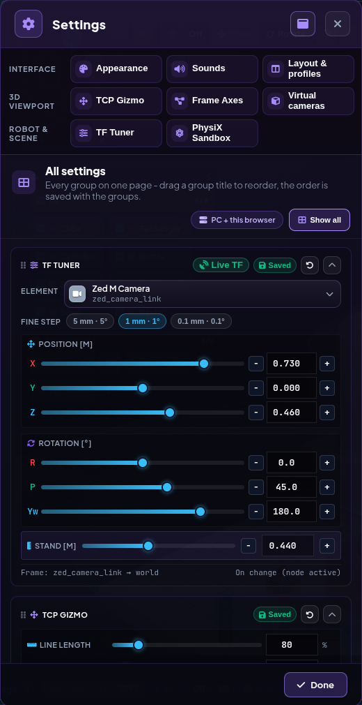
>       <br><sub><i>Settings links neben dem Viewport angedockt: Gruppen Interface / 3D viewport / Robot & scene, hier die Seite Virtual Objects (Zed M Camera) mit Live TF und Saved.</i></sub>
>     - **Settings-Gruppen:** Das Popup enthält drei gespeicherte Gruppen mit jeweils eigenem **Save**-Badge und Reset-Button: den *Virtual Objects* (Transform, früher Virtual Objects; unten), die Darstellung des *TCP-Gizmos* im Viewport - **Linienlänge** (50-250 %, Pfeillänge im Translate-Modus, Ringradius im Rotate-Modus), **Liniendicke** (1-10, 1 = die bisherige dünne Linie; dickere Linien werden als Röhren gezeichnet, da WebGL-Linien immer 1 px breit sind) und **Opacity** (Gizmo samt Ghost-TCP-Markierung) - sowie *Frame Axes*: RGB-Achsenkreuze wie in RViz (X rot, Y grün, Z blau) für beliebig ausgewählte Frames. Per Chip wählbar sind Robot-Frames (URDF-Links `link_base` … `link_tcp`, bewegliche Gelenke mit J1-J6 markiert - der Link-Frame ist der Frame des Gelenks davor) und Scene-Frames (`world` plus die TF-Tuner-Frames, exakt an ihrer TF-Pose). Gemeinsames Aussehen: Achslänge (cm), Dicke (mm, 0 = 1-px-Linie), Opacity, Frame-Namen als Label (bei gleichem Ursprung untereinander) und *On top* (durch das Robotermodell sichtbar); *Visible* blendet alles aus, ohne die Auswahl zu verlieren. Änderungen wirken sofort im Viewport (Desktop und Quest 3); **Save** speichert sie auf dem PC (`/api/settings` → `~/.config/robot_control_ui/settings.json`), sodass jeder Start dieselbe Darstellung lädt.
>     - **Virtual Objects: Transform (Settings-Popup, früher Virtual Objects) - gemeinsam und auf dem PC gespeichert:** Jede Tuner-Änderung geht latched auf `/ui/tf_tuner_state`; alle offenen Clients (Desktop, Quest 3, weitere Tabs) übernehmen den jüngsten Stand und senden identische Transformationen, statt mit eigenen Werten um dieselben Frames zu kämpfen. Die TF-Zeitstempel nutzen die ROS-Serverzeit (Offset über `/rosapi/get_time`), damit ein Client mit vorgehender Uhr (z. B. die Quest) keine Posen mehr sendet, die tf2 ignoriert. Der Badge **Save** in der Gruppe Virtual Objects speichert alle Werte auf dem PC (`/api/tf_tuner` → `~/.config/robot_control_ui/tf_tuner.json`), sodass Desktop und Quest 3 bei jedem Start denselben Stand laden; er zeigt *Save* (ungespeicherte Änderungen), *Saved* oder *Retry* (Fehler). Beim Laden der Seite gewinnt der gespeicherte Stand über den `localStorage` des Browsers, nur ein bereits laufender gemeinsamer Stand ist aktueller. Solange die virtuellen Objekte an sind, sendet der Tuner die Frames der drei Szenenobjekte auch bei ausgeschaltetem „Live TF“. **Size** (nur Würfel, Quader, Zylinder und die Greif-Objekte; 25–300 %, 100 % = Originalmaß, Slider, Zahlenfeld und − / +) skaliert ein Objekt gleichmäßig um seine Unterkante: Digital Twin, Physik-Sandbox (Collider und Masse), RViz-Marker und `virtual_object_detections` (Bounding Box, Greifpunkt, MoveIt-Wände) über `/ui/scene_object_sizes`. Der Wert gehört zum gemeinsamen und gespeicherten Tuner-Stand; *Reset* setzt ihn auf 100 % zurück. **Stand** (nur *Zed M Camera*, 0,02–1,0 m) = Länge der senkrechten Stange vom Fuß bis zum Stativgewinde der Kamera; der Fuß steht auf dem Boden oder, in der Palettier-Szene mit Ausstattung, auf dem Riegel des Palettenmagazins darunter. Kein eigener Wert: der Regler verschiebt die Kamera in Z, Z / Roll / Pitch ändern umgekehrt die Länge (`js/tf_tuner.js`).
>     - **Kamera-Livestreams mit Stream-Details:** Drei Sections: *Live Stream* und *Live Stream 2* (Raspberry-Pi-Kameras 192.168.0.xxx / .123, Einzel-JPEGs von `cam_pic.php`, die nacheinander abgefragt werden) sowie *ZED M Live Stream* (MJPEG über `web_video_server`, Modus per Dropdown). Läuft die Tisch-Kamera-Auswertung (`yolo_3d_bbox_for_ip_cam`, Vision-Bringup mit `zed_m:=false ip_cams:=true`), zeigt *Live Stream 2* automatisch deren Bild mit Overlay (ArUco-Marker mit 6D-Achsen und Tischposition, YOLO-Boxen mit Tischkoordinaten) über `web_video_server`; der Ebenen-Knopf im Panel-Kopf schaltet zwischen Overlay und Rohbild, kommt kein Overlay-Bild, fällt das Panel aufs Pi-Bild zurück. Neben jeder Überschrift steht klein eine Detailzeile: bei den Pi-Kameras `Auflösung · JPEG · gemessene fps · Host` bzw. `offline · Host`, beim ZED-Stream `Auflösung · MJPEG · Quellformat (BGRA8 / MONO8 / 32FC1) · Cam <grab_resolution> @ <grab_frame_rate> fps` (Kameraparameter des ZED-Nodes per `/rosapi/get_param`, alle 15 s). Die Auflösung ist immer die tatsächlich empfangene; ein Tooltip zeigt alle Details inklusive Topic. Liefert ein Stream kein Bild, versuchen es **alle drei Panels** mit wachsendem Abstand (3, 6, 12, 24 s) und geben nach fünf Versuchen auf, statt endlos weiter zu verbinden: Das Overlay zeigt dann **No camera** und einen Button **Try again**. Ins Log geht nur noch ein echter Moduswechsel und die eine Aufgabe-Zeile, nicht mehr jeder einzelne Versuch. Beim ZED-Panel schaltet der 15-s-Topic-Abgleich über `rosapi` den Stream selbsttätig wieder scharf, sobald das Topic zurück ist - eine später angesteckte Kamera wird also ohne Reload erkannt. Alle Texte der UX | Control Interface sind englisch; zweisprachig bleibt nur die Sprachbefehl-Übersicht, weil deren Einträge die tatsächlich gesprochenen Kommandos sind.
>       <br>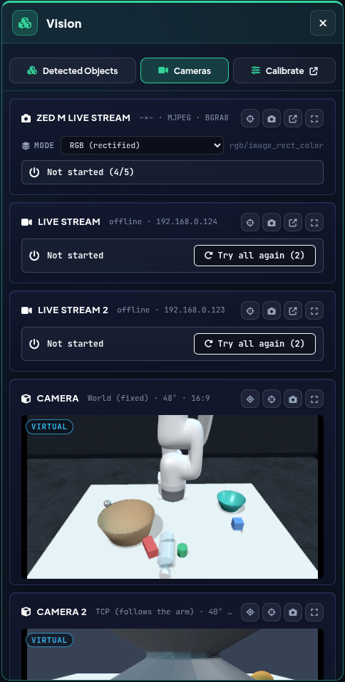
>       <br><sub><i>Bereich Vision › Cameras: ZED-M-Stream mit Modus, beide Raspberry-Pi-Streams (offline, Wiederholzähler) und die virtuellen Kameras des Twins.</i></sub>
>     - **VLA-M-Section (Vision-Language-Action-Chat):** Chat mit dem VLA-Backend `vla_bridge` (siehe [4.3](vla.html#43-vla-m-vision-language-action-chat-in-arbeit)). Status-Chips zeigen den Zustand (`OFFLINE` / `IDLE` / `THINKING` / `RUNNING` / `ERROR`), das Modell und die Rate in Hz; kommt 3 s kein `/vla/status`, zeigt die Section `OFFLINE` und sendet nichts - Nachrichten landen dann nur mit Hinweis im Chat. Darunter: Chatverlauf (solange leer mit Vorschlägen), die Liste **Planned actions** mit **Execute** / **Abort** und Schrittfortschritt (nummerierte runde Marken, Zustands-Pill `waiting for confirmation` / `step 3 / 5` / `plan only`, erledigte Schritte mit Haken und durchgestrichen, aktueller Schritt hervorgehoben; Abort links, Execute rechts - während der Ausführung und bei *plan only* bleibt nur Abort), das Eingabefeld (Enter sendet, Shift+Enter neue Zeile, wächst bis 120 px), ein Mikrofon-Knopf zum **Diktieren** (sendet `dictate` auf `/ui/voice_listen_trigger`: Der Voice Command Listener nimmt bis 8 s über das PC-Mikrofon mit Whisper auf, führt dabei **keine** Sprachbefehle aus und antwortet auf `/ui/voice_dictation`; der Text landet im Eingabefeld und geht erst mit Enter raus; ohne Whisper-Karte sagt ein Hinweis, was zu starten ist), **Confirm before execute** (standardmäßig an - ohne startet der Plan sofort), der Modell-Umschalter **Model: Local strong | Local fast | Claude | Gemini** (sendet `/vla/llm`: starkes lokales Ollama-Modell `qwen3.8:27b`, schnelles lokales Modell `qwen2.5:14b`, Claude API oder Gemini Robotics-ER; in schmaler Spalte bilden die vier Knöpfe ein 2 × 2-Raster; die aktive Wahl hat ein Häkchen, gesperrt solange eine Aufgabe offen ist, der Tooltip nennt das Modell; der Chip im Kopf zeigt `Local · qwen3.8:27b` bzw. `Cloud · <Modell>` mit Chip- oder Wolken-Icon; ein noch nicht eingerichtetes Modell (kein API-Schlüssel, Paket fehlt, Modell nicht heruntergeladen) bekommt ein Warndreieck und ist nicht wählbar; der Tooltip nennt Ursache und Lösung, ein Klick (oder Tippen) öffnet darunter einen kleinen Hinweis mit demselben Text (✕ oder erneuter Klick schließt ihn) - `vla_bridge` prüft das alle 10 s, ein später gespeicherter Schlüssel gilt ohne Neustart) und die Kamera, die der Agent nutzen soll. Unter den Optionen nimmt **Record demo** eine Vorführung für das VLA-Training auf (`demo_recorder`, siehe [VLA-Roadmap Schritt 4](vla.html)): Aufgabe ist der Text im Eingabefeld; während der Aufnahme zeigt die Zeile `● REC` mit Zeit, Schritten und Kamerabildern sowie *Save* / *Discard*; ausgegraut mit Tooltip, wenn der Recorder nicht läuft. Der Agent kann zurückfragen (Zustand `clarify`) oder nach einem fehlgeschlagenen Schritt neu planen (`replan`); ein noch nicht freigegebener Plan verschwindet, sobald eine neue Anweisung gesendet wird, **Clear** publiziert zusätzlich `/vla/reset` (der Agent vergisst das Gespräch), und der Zustands-Chip zeigt `ERROR`, wenn das Sprachmodell fehlt. Modul `js/vla.js`, Topic-Namen in `js/config.js` (`vla*`), Styles `.vla-*` in `style.css` (Rosé-Tönung, nur Flex-Layout - funktioniert in jeder Spalte, bei schmaler Breite und im Light-Theme). In allen Layout-Presets enthalten (rechte Spalte unter Speech Control, in *Laptop* eingeklappt). Chips für **Modus** (FAKE / REAL) und **Szene** (z. B. `3 objects · 3 virtual`, Tooltip mit Liste und Sandbox-Status); die Vorschläge im leeren Chat kommen aus den erkannten Objekten. Ist die Ausführung im REAL-Modus gesperrt, zeigt der Plan *plan only – not executed*; *Execute* läuft zusätzlich durch `motionAllowed` (E-STOP, Verbindung, Control-Lock). **Großes Fenster:** Der Button mit dem Vergrößern-Icon im Section-Kopf öffnet VLA-M als Popup im Stil des Settings-Popups (`js/vla_modal.js`, Markup `#vla-modal` am Ende von `index.html`): links das Gespräch (Chat wächst mit dem Fenster, größeres Eingabefeld), rechts Karten für **Planned actions** (Execute / Abort), **Scene** (Objektliste mit Höhe und `virtual`-Tag - ein Klick setzt „Pick up the …“ ins Eingabefeld), **Backend** (Agent, Modell, Rate, Robotermodus, Bewegung, Greifer, gehaltenes Objekt) und **Options**. Chat, Eingabe, Plan und Optionen wandern ins Popup (gleiche ids, keine Kopie) und beim Schließen zurück; solange zeigt die Section „Show here“. Das Popup beginnt unter dem Header (E-STOP und Modus bleiben sichtbar), Esc / Done / Klick daneben schließt, standardmäßig öffnet es angedockt als nicht-modale Seitenleiste rechts neben der Bereichs-Leiste, der Dock-Button wechselt zum zentrierten Popup (pro Browser gespeichert). Sobald der Agent den Roboter bewegt, dockt ein zentriertes Popup selbst an, damit der Viewport frei bleibt. Es ist immer nur ein Fenster (Settings, VLA-M, Aufgaben-Fenster) offen (`js/app_window.js`).
>       <br>
>       <br><sub><i>Bereich Assistant (VLA): Chips IDLE · Local qwen3.8:27b · FAKE, Chat, geplante Aktionen mit Abort / Execute, Modellwahl und Record demo.</i></sub>
>     - **Akustische Rückmeldung & systemweiter Mute:** Jeder Klick spielt einen kurzen UI-Sound (`sounds/ui_mouse_click.mp3`), Bewegungsbefehle werden von vorgerenderten deutschen Sprachansagen begleitet (z.B. `_voice_robot_moves_to_scan_pos.mp3`). Dedizierte Sprachansagen informieren den Nutzer, wenn ein Ziel unerreichbar ist: `_voice_object_out_of_reach.mp3` bei der Anfahrt eines Objekts (rote Greifkugel oder Eintrag der Objektliste), `_voice_pose_out_of_reach.mp3` bei Zielen über TCP-Gizmo und MoveTo-Pose (IK-Fehler, Kollision/Singularität bei der Planung, Arbeitsbereichsverletzung, abgelehnte Trajektorie). MoveIt-Fehler kommen aus dem strukturierten `/ui/moveit_motion_state` (`phase: failed`), nicht aus dem Wortlaut der Log-Zeilen; E-STOP (`aborted`) und verworfene Pläne bleiben stumm. Eine weitere Ansage bestätigt die gezielte Anfahrt (`_voice_robot_moves_to_selected_object.mp3`, strikt 1x pro Sequenz). Der Lautsprecher-Button in der Viewport-Toolbar öffnet ein kleines Popover: *All sounds* (Taste M) schaltet das gesamte System stumm, je eine Checkbox pro Sound (gruppiert in *Sound effects* und *Voice announcements*, jede Gruppe mit Sammel-Checkbox) schaltet einzelne Sounds für diesen Browser an/aus; *All sound settings* führt zu Settings > Sounds (Lautstärke, Sound-Datei je Sound). Das Icon zeigt den Zustand (`fa-volume-high` alle an, `fa-volume-low` einzelne aus, `fa-volume-xmark` alle aus). Der Zustand von *All sounds* wird pro Browser gespeichert und alle 2 Sekunden auf **`/ui/sound_enabled`** (`std_msgs/Bool`) publiziert, das `robot_motion_handler_movegroup`, `yolo_planned_grasp_executor` und `gaze_grasp_routine_tobii_glasses` abonnieren (durch das regelmäßige Senden bekommen auch später gestartete Nodes den Zustand). Wer die Web-UI stummschaltet, schaltet damit also auch die roboterseitige Sprachausgabe stumm. Schlägt die Wiedergabe fehl (z.B. wegen der Autoplay-Policy des Browsers), wird das im Konsolen-Log ausdrücklich gemeldet statt still zu scheitern. Das Umschalten der MoveIt-Kollisionsicons wird mit „collision detection enabled/disabled“ angesagt, und ein Fehlerton (`sounds/error_sound.mp3`) erklingt, wenn der fahrende Roboter tatsächlich in eine Kollision gerät – Singularitäten bleiben stumm (Live-Telemetrie, nicht die MoveIt-Planung; 2,5 s Abklingzeit). Fahrten über das TCP-Gizmo im Viewport verzichten auf die Ansage „robot moves to absolute pose“. Eingebaute Zustandstöne (Web Audio, ohne Datei, wie alle Sounds einzeln abschaltbar): ein „Ding“ bei erreichtem Ziel, ein weicher Aufwärtston, wenn eine geplante Bahn auf CONFIRM PATH wartet, ein dumpfer fallender Zweiklang, wenn IK oder Planung scheitern (nicht der Fehlerton), ein fallender / steigender Zweiklang, wenn die rosbridge-Verbindung abbricht / zurückkommt, und ein tiefer Doppelton mit der Sprachausgabe des Browsers „REAL robot connected“, sobald der REAL-Roboter erkannt wird. Weitere Töne: ein steigender Dreiklang, wenn der E-STOP quittiert ist, ein fallender Gleitton, wenn ein anderer Nutzer diesem Tab die Steuerung abnimmt, drei kurze Pieps bei einem Heartbeat-Timeout des Remote-Control-Watchdogs (oder wenn der Watchdog bei stehender rosbridge nicht mehr antwortet), ein dumpfer „Bonk“, wenn die Kollisionsvorprüfung einen Befehl stoppt (nicht zusätzlich zum Fehlerton), leise Töne, wenn eine VLA-Aufgabe mit der Ausführung beginnt, fertig ist oder scheitert, ein kurzes Zwitschern / ein flacher Doppelton, wenn ein Sprachbefehl erkannt / nicht verstanden wird (auch bei „no speech“), zwei kurze Pops, wenn ein Gamepad oder Quest-Controller verbunden wird, und ein Ton je Tempowechsel, dessen Tonhöhe der neuen Stufe folgt.
>     - **Farbkodiertes Log (Diagnostics-Schublade):** Live scrollbares Log mit Syntax-Hervorhebung (Achsen, Zahlen, Topics, Einheiten) und dynamisch an die Zeilenart (Erfolg, Warnung, Fehler, Aktion, Info) angepassten Quellen-Tags (`[...]`) für sofortige optische Erfassbarkeit. Es scrollt nur mit, wenn man unten steht, und hält die letzten 500 Einträge.
>       <br>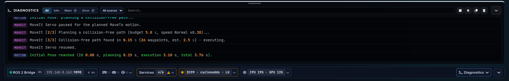
>       <br><sub><i>Diagnostics-Schublade über der Statusleiste: Filter All/Info/Warn/Error, Quelle und Suche, Blackbox/Pause/Kopieren/Leeren; hier das Log einer MoveIt-Fahrt.</i></sub>
>   - 🧱 **Architektur & Webserver**
>     - **Architektur (ES-Module, three.js r186):** Das frühere `app.js` ist in ES-Module unter `js/` aufgeteilt (`ros`, `jog`, `safety`, `motion`, `gizmo`, `grasp`, `audio`, `layout`, `presets`, `theme`, `columns`, `panel_snap`, `persist`, `log`, `logui`, `status`, `header`, `toolbar`, `settings`, `tf_tuner`, `voice`, `streams`, `ground_popup`, `robot_limits`, `uievents`, `util`, `vr_mirror`, `sysload`, `vla`, `vla_modal`, `remote`, `sequence`, `guides`, `guides_data`, `sandbox`, `hud_dock`, `areas`, `layer_bar`, `cam_pip`, `console_drawer`, `palette`, `settings_modal`, `physics_settings`, `usage_stats`, `sound`, `gamepad`), der Digital Twin und die VR-Module (`xr.js`, `xr_hud.js`, `xr_controls.js`, `xr_ui.js`, `xr_moveit.js`, `xr_nozzle_cam.js`, `xr_objcard.js`, `xr_feedback.js`, `xr_mirror_send.js`, `xr_mirror_worker.js`, `lab_room.js`) liegen in `js/twin/`. Statt globaler `window.*`-Funktionen tragen die Elemente `data-action`-Attribute, die `js/main.js` verteilt. Alle Topic- und Service-Namen stehen zentral in `js/config.js`. three.js r186, urdf-loader 0.13 und die Physik-Engine Rapier (`lib/rapier/`) liegen lokal unter `lib/` (Import-Map, offline-fähig); der Twin rendert nur noch bei Änderungen oder laufenden Animationen. Das Log ist auf 500 Zeilen begrenzt, Polling-Intervalle pausieren bei verstecktem Tab.
>     - **Webserver ohne manuelles Cache-Busting:** `server.py` ersetzt `python3 -m http.server`: JS/CSS/JSON/URDF gehen mit `Cache-Control: no-cache` plus ETag raus (Änderungszeit in ns + Größe; unverändert → 304 per `If-None-Match`, ein Reload lädt also z. B. die 2 MB three.js nicht mehr neu), HTML mit `no-store`, und `index.html` bekommt automatisch `?v=<Änderungszeit>` an jede Skript- und Stylesheet-URL. Zusätzlich liefert er kleine JSON-APIs: `/api/header_status` (Header-Badges), `/api/sys_load` (SYSTEM-Tab), `/api/tf_tuner` (gespeicherte TF-Tuner-Werte), `/api/settings` (gespeicherte Werte des Settings-Popups; nur bekannte Felder, auf ihre Bereiche begrenzt), `/api/sequences` (SEQUENCES-Tab), `/api/vcams` (virtuelle Kameras), `/api/vcam_capture` (Einzelbilder und Videos der virtuellen Kameras), `/api/remote_info` (LAN-Adressen für die Remote-Control-Section), `/api/sounds` (Sound-Liste für *Settings › Interface*) und `/api/cam_snapshot` (Einzelbilder für das VR-Kamerafenster). Jede Anfrage wird nach Client-IP gefiltert (`--clients local|subnet|lan|<CIDR>`, aus `remote_access` / `remote_clients`).
>     - **Zentrales Sound-Verzeichnis (`sounds/`):** Alle akustischen Benachrichtigungen und Sprachdateien liegen zentral im Workspace-Hauptverzeichnis `~/dev_ws/sounds/`. Der Webserver (`server.py`) mappt `/sounds/...` direkt auf dieses zentrale Verzeichnis, ohne dass Symlinks oder redundante Kopien im UI-Paket erforderlich sind.
>
>
> 
>
>> | Topic / Interface | Msg Type | Beschreibung |
>> |---|---|---|
>> | **`/joint_states`** | `sensor_msgs/JointState` | *Spiegelt die physischen Gelenke synchron im Dashboard.* |
>> | **`/ui/eef_position`** | `std_msgs/Float32MultiArray` | *TCP-Position und -Orientierung für EEF Telemetry, Z Collision Level und Sicherheitsbewertung.* |
>> | **`/servo_server/status`** | `std_msgs/Int8` | *Steuert die farbigen Alarm-Pulsierungen der Web-UI.* |
>> | **`/zed/bboxes_3d`** | `visualization_msgs/MarkerArray` | *Füllt die Objektliste und zeichnet Rahmen, Greifkugeln und Labels im Digital Twin.* |
>> | **`/ui/voice_feedback`** | `std_msgs/String` | *Blendet per Voice ausgelöste Aktionen live im Web-Log ein.* |
>> | **`/ui/voice_status`** | `std_msgs/String` | *Zeigt den aktiven Status der Sprachaufnahme an.* |
>> | **`/ui/robot_control/current_speed`** | `std_msgs/Float32` | *Gleicht die UI-Speedslider mit dem Backend ab.* |
>> | **`/ui/collision_msg`** | `std_msgs/String` | *Zeigt Kollisionswarnungen im Web-Log an.* |
>> | **`/ui/grasp_status`** | `std_msgs/String` | *Leitet Grasp-Statusmeldungen an die Web-Konsole weiter.* |
>> | **`/ui/motion_status`** | `std_msgs/String` | *Statusmeldungen von `robot_motion_handler_movegroup` (Präfix INFO/WARN/ERR/SUCCESS/ACTION) für das Log.* |
>> | **`/joy`** | `sensor_msgs/Joy` | *Spiegelt den Zustand des physischen Gamepads in die Web-UI.* |
>> | **`/visualization_marker_array`** | `visualization_msgs/MarkerArray` | *Zeichnet die Marker aus `scene_objects` im Digital Twin.* |
>> | **`/zed_visual_markers`** | `visualization_msgs/MarkerArray` | *Zeichnet Kamerastativ und Szenen-Meshes der ZED M im Digital Twin.* |
>> | **`/dashboard/workspace_metadata`** | `std_msgs/String` (JSON) | *ROS_DOMAIN_ID, RMW und ROS_LOCALHOST_ONLY für die Statusleiste.* |
>> | **`/ui/moveit_motion_state`** | `std_msgs/String` (JSON) | *Speist das MoveIt-Fortschritts-Popup im Viewport.* |
>> | **`/ui/moveit_collision_objects_enabled`** | `std_msgs/Bool` | *Zustand des Icons „Collision Objects“.* |
>> | **`/ui/moveit_collision_ground_enabled`** | `std_msgs/Bool` | *Zustand des Icons „Collision Ground“.* |
>> | **`/zed/yolo_collision_markers`** | `visualization_msgs/MarkerArray` | *Kollisionswände der erkannten Objekte (rot transparent im Twin).* |
>> | **`/ui/disabled_collision_objects`** | `std_msgs/String` (JSON) | *Objekte mit abgeschalteter Kollision (Kontextmenü).* |
>> | **`/ui/moveto_preview_enabled`** / **`/ui/moveto_preview_path`** | `std_msgs/Bool` / `std_msgs/String` (JSON) | *Zustand des Geist-Icons und die zu bestätigende Bahn.* |
>> | **`/ui/gripper_state`** / **`/ui/gripper_type`** | `std_msgs/String` | *Greiferzustand und konfigurierter Greifer.* |
>> | **`/ui/joy_button_presses`** | `std_msgs/String` | *Greifer-Rückmeldungen des Gamepad-Nodes im Log.* |
>> | **`/ui/emergency_stop_active`** | `std_msgs/Bool` | *Verriegelter E-STOP (Reset-Button neben dem E-STOP).* |
>> | **`/ui/ground_collision_level`** | `std_msgs/Float64` | *Aktuelles Z Collision Level (mm) für Jogging-/MoveTo-Sperre und Boden-Popup.* |
>> | **`/ui/virtual_bboxes_3d`** | `visualization_msgs/MarkerArray` | *Virtuelle Detektionen von `virtual_object_detections` für Objektliste, Twin und VR.* |
>> | **`/ui/virtual_detections_enabled`** | `std_msgs/Bool` (latched) | *Zustand des Buttons Virtual Obj.* |
>> | **`/ui/tf_tuner_state`** | `std_msgs/String` (JSON, latched) | *Gemeinsamer TF-Tuner-Stand aller Clients (der jüngste gewinnt).* |
>> | **`/ui/scene_object_sizes`** | `std_msgs/String` (JSON) | *Virtual Objects: Größenfaktor je Objekt-Frame, z. B. `{"target_blue_cube": 1.5}` - mit den TF-Frames gesendet (bei Änderung, sonst jede Sekunde).* |
>
>
> 
>
>> | Topic / Interface | Msg Type | Beschreibung |
>> |---|---|---|
>> | **`/remote/twist`**, **`/remote/joint_jog`** | `std_msgs/String` (JSON) | *Kartesisches / Gelenk-Jogging mit Client-id → Twist-Gate des `remote_control_watchdog` → `/servo_server/delta_*_cmds` (nur Besitzer der Steuerung, Bodensperre).* |
>> | **`/servo_server/delta_joint_cmds`** | `control_msgs/JointJog` | *Steuert feine Joint-Jogs per Klick.* |
>> | **`/ui/robot_control/set_speed_index`** | `std_msgs/Int32` | *Sichert die geänderte Geschwindigkeit.* |
>> | **`/ui/scan_speed`** | `std_msgs/Int32` | *Aus dem Tempo-Override abgeleitete Stufe für MoveTo/Scans (0: Slow, 1: Normal, 2: Fast).* |
>> | **`/ui/emergency_stop_topic`** | `std_msgs/Empty` | *Publiziert sofortigen Software-E-STOP (blockierungsfreier Topic-Bypass).* |
>> | **`/linear_axis_cmd`** | `std_msgs/Float64` | *Publiziert den Befehl zur Bewegung der Linearachse.* |
>> | **`/ui/grasp_object_cmd`** | `std_msgs/String` | *Triggert Autonomie-Aktionen per Objekt-Identifikator.* |
>> | **`/ui/voice_listen_trigger`** | `std_msgs/String` | *Startet Audio-Aufnahmen bei Klick auf das Mikrofon-Symbol.* |
>> | **`/ui/safety_zone_params`** | `std_msgs/Float32MultiArray` | *Sendet aktualisierte Parameter für die Safety-Zone.* |
>> | **`/tf_static`** | `tf2_msgs/TFMessage` | *Virtual Objects (Settings-Popup): sendet die eingestellten Transformationen latched und nur bei einer Änderung (plus Auffrischung alle 2 s für später gestartete Nodes), bei „Live TF“; die Frames der Szenenobjekte auch, solange die virtuellen Objekte an sind. Statische Frames veralten nicht – ein Tab im Hintergrund füllt die MoveIt-Logs nicht mehr mit „extrapolation into the past“.* |
>> | **`/ui/tf_tuner_state`** | `std_msgs/String` (JSON, latched) | *Jede Tuner-Änderung, damit alle offenen Clients identische Werte senden.* |
>> | **`/ui/sound_enabled`** | `std_msgs/Bool` | *Publiziert den Mute-Zustand der akustischen Rückmeldung, damit andere Nodes synchron bleiben.* |
>> | **`/ui/gripper_cmd`** | `std_msgs/String` | *Greiferbefehl (`open` / `close` / `off`).* |
>> | **`/ui/set_object_collision`** | `std_msgs/String` (JSON) | *Kollision eines Objekts ab-/einschalten (Kontextmenü).* |
>> | **`/ui/set_ground_collision_level`** | `std_msgs/Float64` | *Z Collision Level (mm) aus dem Boden-Kollisions-Popup.* |
>
>
> 
>
>> | Topic / Interface | Msg Type | Beschreibung |
>> |---|---|---|
>> | **`/ui/execute_initial_pose`** | `std_srvs/srv/Trigger` (Client) | *Fährt den Arm in die Home-Position.* |
>> | **`/ui/execute_move_to_pose`** | `xarm_msgs/srv/MoveCartesian` (Client) | *Fährt eine absolute kartesische Zielpose an.* |
>> | **`/ui/execute_move_to_pose_silent`** | `xarm_msgs/srv/MoveCartesian` (Client) | *Dasselbe MoveTo ohne Sprachansage - genutzt vom TCP-Gizmo im Viewport.* |
>> | **`/ui/set_moveit_collision_objects`** | `std_srvs/srv/SetBool` (Client) | *Schalter „Object collision“ im Planning-Panel (MoveIt).* |
>> | **`/ui/set_moveit_collision_ground`** | `std_srvs/srv/SetBool` (Client) | *Schalter „Floor collision“ im Planning-Panel (MoveIt).* |
>> | **`/ui/set_moveto_preview`** / **`/ui/confirm_moveto_preview`** | `std_srvs/srv/SetBool` (Client) | *Geist-Icon bzw. „Execute path / Discard“ im MoveIt-Popup.* |
>> | **`/remote/control_request`** `reset_estop` | `std_msgs/String` (JSON) | *Reset-Button neben dem E-STOP: der Watchdog ruft `/ui/reset_emergency_stop` für den Besitzer der Steuerung / den Server-PC auf; Antwort in `control_state.results`.* |
>> | **`/ui/approach_from_above`** | `xarm_msgs/srv/MoveCartesian` (Client) | *„Approach from above“ im Objekt-Kontextmenü.* |
>> | **`/ui/plan_move_to_pose_confirm`** / **`/ui/approach_from_above_confirm`** | `xarm_msgs/srv/MoveCartesian` (Client) | *Gizmo loslassen / „Approach from above“ bei Auto-Move aus: erst planen, nach *Execute* fahren.* |
>> | **`/rosapi/nodes`** | `rosapi/Nodes` (Client) | *Erkennt anhand der Node-Liste den aktiven Hardware-Modus (Fake Arm vs. Real Arm).* |
>> | **`/rosapi/get_param`** | `rosapi/GetParam` (Client) | *`robot_ip` des Treibers (Badge „Real Arm“) und `grab_resolution` / `grab_frame_rate` des ZED-Nodes (Stream-Details).* |
>> | **`/rosapi/topics_for_type`** | `rosapi/TopicsForType` (Client) | *Findet die tatsächlich vorhandenen ZED-Bildtopics für das Modus-Dropdown.* |
>> | **`/rosapi/get_time`** | `rosapi/GetTime` (Client) | *ROS-Serverzeit als Offset für die TF-Zeitstempel des Tuners.* |
>> | **`/ui/set_virtual_detections`** | `std_srvs/srv/SetBool` (Client) | *Schalter „Object detection“ im Planning-Panel (Simulation) und in Detected Objects.* |
>
> *Der E-STOP läuft über das blockierungsfreie Topic `/ui/emergency_stop_topic`, nicht über den Service `/ui/emergency_stop`. Die Services `/ui/execute_move_joint` und `/ui/emergency_stop` werden von `robot_motion_handler_movegroup` bereitgestellt und vom RViz-Control-Panel genutzt, nicht von dieser Web-UI.*

</details>

---

<br>

> [!TIP]
> **Bedienhinweise zur UX | Control Interface**
> - **Header = Sicherheitsleiste (N18.8):** rechts eine feste Gruppe, die nie umbricht und auch im eingeklappten Header stehen bleibt: **Modus** (FAKE / REAL) · **Roboterzustand** · **Tempo-Override** (`−` / `60%` / `+`, 5 Stufen, auch Sprachbefehle *faster* / *slower* und VR-HUD) · **Steuerung** · **E-STOP**. *Steuerung* ist das Control-Lock des `remote_control_watchdog`: Der Chip zeigt, wer den Roboter bewegen darf (*free*, *you* / *this PC*, fremder Client gelb, eigene Anfrage blau, *–* ohne Watchdog); ein Klick öffnet genau die Aktionen, die gerade gehen – *Take control* (am Server-PC) bzw. *Request control* (Clients, der Server-PC gibt frei), *Release control*, *Cancel request*, *Take over* (Server, mit Rückfrage). Clients, Gamepad und Zugang bleiben in der Section *Remote Control*. Unter ~1500 px werden Beschriftungen kompakt (Punkt + Kurzwert, Tooltip). **Eine Fahrt zur Zeit (`js/motion_busy.js`):** Solange der Arm belegt ist, zeigt der Roboterzustand **BUSY · Quelle** (z. B. *Home*, *Gizmo target*, *Sequence "Pick" 3/7*, *VLA-M task*, *Palletizing 2/8*) – Quellen sind `/ui/motion_busy` sowie die laufende Sequenz, VLA-M-Aufgabe oder Palettierung, auch in den Lücken zwischen ihren Schritten. Solange ist jeder andere Bewegungsbefehl gesperrt (Leiste *Home* / *Align* / *Scan pose*, *Go*, TCP-Gizmo, Jogging, *Approach* / *Grasp* / *Place*, Greifer, Sequenz *Play*, Palettieren *Start*, Sprache, VR-HUD): Knöpfe sind deaktiviert, der Grund steht im Tooltip; sonst meldet das Log `⏳ … not started - the robot is busy: …` (Warnung, ohne Out-of-reach-Ton; die Backend-Antwort *Already executing* wird genauso angezeigt). Nur die laufende Sequenz sendet ihre eigenen Schritte weiter. Jogging endet, sobald eine Fahrt beginnt, und braucht danach einen neuen Druck (Hinweis unter den Ringen). Eine Bahn, die auf *Execute* wartet, zählt nicht als belegt – ein neues Ziel ersetzt ihn. **Stop** neben *BUSY* beendet die laufende Sequenz / VLA-M-Aufgabe / Palettierung und hält den Arm über `/ui/halt_motion` an (kein E-STOP, kein Quittieren). Links davon als eigene Gruppe die **Ansicht-Schalter** wie im Fuß der UX | Nexus Launcher: **Theme-Pill** (Sonne = Light, Mond = Dark) und **UI-Zoom** `−` / `100 %` / `+` (70–150 % in 10-%-Schritten, wirkt sofort ohne Neuladen, Klick auf den Wert = *Auto*: 100 % am Desktop, 150 % im Quest-Browser); beide gelten nur für diesen Browser und sind dieselben Werte wie *Settings > Appearance*. Unter 860 px ist die Gruppe ausgeblendet, damit der E-STOP sichtbar bleibt.
>   <br>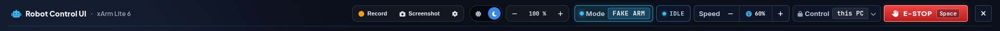
>   <br><sub><i>Header: Record, Screenshot, Theme, Zoom – dann die feste Sicherheitsgruppe Mode FAKE ARM · IDLE · Speed 60 % · Control this PC · E-STOP.</i></sub>
> - **Aufnahme (Header, links der Ansicht-Schalter):** **Record** startet / stoppt ein Video des ganzen UI-Fensters, **Screenshot** speichert ein PNG davon. Chrome fragt je Aufnahme einmal, welcher Tab geteilt wird (diesen Tab wählen; der Screenshot ohne laufende Aufnahme fragt ebenfalls, während einer Aufnahme nimmt er das Bild aus dem laufenden Video). Das **Zahnrad** öffnet die Aufnahme-Einstellungen (nur dieser Browser): Format MP4 / H.264 oder WebM / VP9 (ein Format, das der Browser nicht aufnehmen kann, ist ausgegraut), Auflösung 1280 × 720, 1920 × 1080 (Standard), 2560 × 1440 oder Fenstergröße (Seitenverhältnis des Fensters bleibt), 30 / 60 fps, Qualität 4 / 8 (Standard) / 16 Mbit/s und der Speicherort; während einer Aufnahme gesperrt. Screenshot in voller Fensterauflösung. Gespeichert wird immer lokal auf diesem PC: standardmäßig im Download-Ordner des Browsers, nach **Choose folder** in einem frei gewählten Ordner (Ordnerwahl von Chrome / Edge, wird gemerkt; der Browser zeigt nur den Ordnernamen; ohne Schreibrecht fällt es auf den Download zurück, **Downloads** schaltet zurück) - `rcu_<Datum>_<Zeit>.mp4` / `.webm` / `.png`; das Log nennt Datei, Länge, Größe und Ort. Während der Aufnahme wird die Gruppe rot mit Badge **LIVE**, Stopp-Symbol und Laufzeit; *Freigabe beenden* in der Chrome-Leiste stoppt und speichert ebenfalls. Nur an sicheren Adressen (dieser PC über 127.0.0.x / localhost oder https) - sonst sind die Knöpfe gesperrt und nennen per Tooltip den Grund. Unter 1440 px nur Symbole, unter 860 px ausgeblendet, außer während einer Aufnahme (`js/screen_record.js`).
> - **Statusleiste (N18.8):** Die Technik steht unten im Fluss unter den Spalten: ROS 2 Bridge (Adresse, Antwortzeit), Eingabegeräte, Dienste, DDS, laufender Usability-Test, **Systemlast** (Chip *CPU · GPU*, ab 90 % gelb, Popover mit Verlauf für CPU/GPU/RAM/VRAM, Temperaturen und Uptime – früher SYSTEM-Tab) und die letzte Warnung/der letzte Fehler (Klick öffnet das Log). Popover öffnen nach oben. Der Pfeil rechts klappt die Leiste ein (ROS 2 Bridge, letzte Meldung und Pfeil bleiben), gespeichert pro Browser. Scrollt die Seite (Höhe < 800 px), bleibt die Leiste am unteren Rand.
>   <br>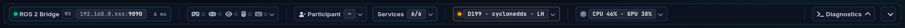
>   <br><sub><i>Statusleiste: ROS 2 Bridge mit Laufzeit, Eingabegeräte, Teilnehmer, Services 6/6, DDS (Domain · RMW · LH), CPU · GPU, Diagnostics.</i></sub>
> - **Diagnostics als Schublade (N18.11, früher *Console*):** Das Log ist keine Section in einer Spalte mehr, sondern eine Schublade direkt über der Statusleiste (im Fluss – die Spalten werden kürzer, nichts wird überdeckt; mit der Statusleiste bleibt sie beim Scrollen am unteren Rand). *Diagnostics* in der Statusleiste öffnet/schließt sie; solange sie zu ist, zählt ein Badge neue Warnungen und Fehler (ohne Browser-Audio-Hinweise und Verbindungsversuche). Höhe über den Griff am oberen Rand (ziehen oder Pfeil hoch/runter bzw. Bild hoch/runter auf dem Griff), 120 px bis 60 % des Fensters. Stufenfilter, Quelle, Suche, Pause, Blackbox, Kopieren und Leeren sitzen in ihrer Kopfzeile; ein Klick auf die letzte Meldung in der Statusleiste öffnet sie gefiltert. Offen/zu und Höhe werden pro Browser und in den Layouts gespeichert (Presets, *Save current layout*, Layouts auf dem PC – `server.py` `/api/layouts` behält `console` und `statusbar`); ohne eigene Wahl startet sie ab 900 px Fensterhöhe offen, darunter zu. *Operate* öffnet sie, *Laptop (compact)* schließt sie und klappt die Statusleiste ein. Modul: `js/console_drawer.js`.
> - **Bereichs-Leiste (N18.9):** Eine schmale Leiste links neben dem Viewport ordnet die Oberfläche nach Aufgabe statt nach Technik; jeder Knopf öffnet oder schließt den Ort seiner Aufgabe, es wird nichts mehr umgeräumt. Jede Gruppe ist eine eigene kleine Section (`.area-sect`: Kachel mit eigenem Hintergrund und gleichem 1-px-Rand rundum, Überschrift oben); zwischen den Gruppen 12 px, bei zu niedrigem Fenster 9 bzw. 6 px, damit die Liste nicht scrollt. **Gruppen umordnen:** Gruppe an der Überschrift ziehen (Hand-Zeiger, gestrichelter Platzhalter am Ziel; Leiste offen oder angeheftet) oder **Alt+Pfeil hoch/runter**, während ein Knopf der Gruppe den Fokus hat; die Gruppen oben und die Gruppen im Fuß (Help, System) werden getrennt sortiert, der Pin bleibt unten. Die Reihenfolge gilt pro Browser (`area_rail_order`), *Settings > Appearance > Area bar order > Reset to default* stellt sie zurück. Standard-Reihenfolge von oben nach unten: **Scene:** **Standard** und **Auto palletizing** (öffnet zusätzlich das Aufgaben-Fenster **Palettieren**; ein zweiter Klick auf die aktive Szene öffnet / schließt das Fenster) - genau eine ist aktiv (gefüllt, `aria-pressed`); wechselt den Satz virtueller Objekte (`/ui/set_virtual_objects` `{"scene": …}`, Zustand latched auf `/ui/virtual_scene`, alle Browser sehen dieselbe Szene) und schaltet die virtuellen Objekte ein, falls sie aus sind. *Auto palletizing* zeigt Europalette, 8 Kartons auf zwei Zuführbändern und die Palettieranlage im Viewport (`js/scenes.js`, `js/twin/logistics_cell.js`; Details in *Vision & Grasping › virtual_object_detections*). **Operate:** **Move** (rechte Spalte mit *Cartesian Jogging*, Gelenken, Linearachse und Greifer - der Knopf klappt die Spalte ein / aus), **Teach**, **Assistant (VLA)** und **Remote Teleop** (Aufgaben-Fenster, siehe unten). **World:** **Vision** (Aufgaben-Fenster, siehe unten), **Viewport** (Aufgaben-Fenster mit den Werkzeugen der Viewport-Leiste, siehe unten) und **Physics objects** (öffnet die Settings-Seite *PhysiX Sandbox* angedockt rechts neben der Leiste: Schwerkraft, Solver, Materialien und Greifer der virtuellen Objekte, nur FAKE; zweiter Klick schließt; *SIM physics* im Viewport bleibt wie bisher). Fester Fuß - **Help:** **Guides** (Spalte rechts, bleibt neben jedem Aufgaben-Fenster sichtbar; unter der Suche *Command palette* (Strg K) und *Keyboard shortcuts* (?)); **System:** **Diagnostics** (Diagnostics-Schublade unter dem Viewport, Statusleiste ausgeklappt), **Settings** (gleiches Popup wie das Zahnrad in der Viewport-Leiste, dort auch *Layout & profiles* mit Presets, Profilen und *My view*; gelber Punkt = ungespeicherte Einstellungen) und der Pin. Die Leiste reicht vom Header bis zur Statusleiste; die Diagnostics-Schublade liegt rechts daneben unter der Arbeitszeile (`.app-body` › `.app-main` in `index.html`), eine offene Schublade kürzt die Leiste also nicht. Passen die Knöpfe nicht, scrollt die Knopf-Liste mit dezenter Scrollbar und weichem Rand an der Seite, an der es weitergeht (`data-more`, `js/areas.js`); der Fuß bleibt immer sichtbar. Scrollt die Seite (Fenster unter 800 px hoch), bleiben Leiste, Schublade und Statusleiste stehen (sticky). **Aufgaben-Fenster** (`js/task_window.js`): aufgebaut wie das Settings-Popup - Kopf mit Logo, Titel und Schließen, Seiten-Knöpfe, darunter die Seite - und im Fluss direkt rechts neben der Leiste (`#task-dock` in `.work-row`), sie schieben den Viewport zusammen statt ihn zu verdecken. Seiten: *Teach* = Sequences · *Vision* = Detected Objects (Liste, *Keep virtual*, *Manual Grasp Target*), Cameras (ZED, Live Stream 1 + 2, virtuelle Kameras), *Calibrate* (öffnet die Seite Virtual Objects in Settings) · *Assistant (VLA)* = VLA-M chat, Speech · *Palettieren* (kein eigener Knopf, öffnet mit *Auto palletizing*) = Palletizing: *Pallet & limits* (Eigenschaften, max. Last / Höhe / Auflage), Plan, Gewichtsbalken, Seitenansicht des Stapels + Draufsicht je Lage, Reihenfolge, *Stays on the conveyor* mit *Take along*, Ghost-Boxen, *Dry run*, **Plan / Start / Abort / Reset** (`js/pallet.js`, siehe *VLA-M › Auto-Palettieren*) · *Remote Teleop* = Remote Control, VR headset (*Enter VR*, *Passthrough AR*, *VR mirror window*; ohne Headset bleiben die Knöpfe gesperrt und nennen den Grund) · *Viewport* = Gizmo (Off / Move / Rotate, *Back to TCP*, *Auto-Move*, Regler fürs Aussehen), Poses (*Home*, *Align TCP*, *Scan pose* - gesperrt bei Bewegung und E-STOP wie in der Leiste), Layers, Planning, Camera (*Fit view*, *Top view*, Größe des Nav-Gizmos, Viewport-Panels einklappen / zurücksetzen). Die Viewport-Leiste bleibt unverändert: die Seiten *Viewport* und *VR headset* bedienen dieselben Original-Knöpfe (`js/viewport_window.js`, `js/mirror.js` - Klick geht ans Original, dessen Zustand kommt zurück), beide Stellen zeigen also immer denselben Zustand; eine Kollisionsprüfung ausschalten fragt auch dort nach. Die Sections wandern beim Start in ihre Seite (gleiche ids, keine Kopie), behalten ihren Kopf mit Werkzeugen, werden dort nie eingeklappt und gehören nicht mehr zu den Spalten; die linke Spalte verschwindet, wenn sie keine Section enthält. Es ist immer nur ein Fenster offen, auch zusammen mit Settings / VLA-M (`js/app_window.js`); Esc (außerhalb von Eingabefeldern) oder × schließt, offenes Fenster und Seite bleiben pro Browser gespeichert. Unter 1100 px Fensterbreite blendet ein offenes Aufgaben-Fenster die Move-Spalte aus (*Move* holt sie zurück und schließt das Fenster), unter 860 px nimmt das Fenster die volle Breite ein, Viewport + Move folgen darunter. **Farbe je Aufgabe** (`data-task` → `--task` in `style.css`, beide Themes): jede Aufgabe hat einen eigenen Farbton, keine zwei gleichen: Move Himmelblau, Teach Orange, Vision Smaragd, Assistant (VLA) Fuchsia, Remote Teleop Pink, Viewport Indigo, Palletizing Hellblau, Physics objects Türkis, Diagnostics neutral (Textfarbe), Guides Lindgrün, Settings Violett - dieselbe Farbe markiert Icon, offenen Knopf (Fläche + Rahmen), Fenster (Rand oben, Kopf, aktive Seite) sowie Move-Spalte / Diagnostics-Schublade / Guides-Spalte; kein Rot oder Gelb (bleiben für Fehler und Warnungen). Die Kamera-Kacheln im Viewport öffnen *Vision > Cameras*; Guides öffnen über *Show me* die passende Aufgabe. **Einklappen:** Ohne Pin zeigt die Leiste nur Icons (48 px, Gruppen-Kacheln ohne Überschrift) und klappt als Overlay auf, sobald Maus oder Tastaturfokus hineinkommt - die Spalten springen nicht; ca. 1,5 s nach dem Verlassen klappt sie wieder zu. Der Pin hält sie offen (88 px, die Spalten rücken zur Seite). Kürzel (fest je Aufgabe, auch nach dem Umordnen): **Alt+Shift+1…4** = Move, Teach, Assistant (VLA), Remote Teleop (auf/zu), **Alt+Shift+5** = Vision, **Alt+Shift+6** = Viewport, **Alt+Shift+7** = My view laden (Alt+Ziffer belegen die Browser-Tabs). Knöpfe mindestens 44 px hoch, freie Höhe macht sie höher (bis 64 px). Module: `js/areas.js` (Leiste), `js/task_window.js` (Fenster, Seiten in `TASKS`), `js/viewport_window.js` (Seiten Viewport / VR headset), `js/mirror.js` (zweite Stelle für Leisten-Werkzeuge).
>   <br>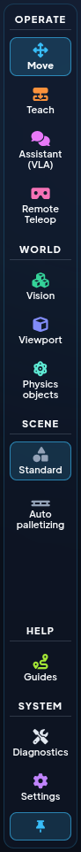
>   <br><sub><i>Bereichs-Leiste angeheftet: Operate, World, Scene, Help, System.</i></sub>
> - **Guides (N18.19):** Der Eintrag **Guides** im Fuß der Bereichs-Leiste (Gruppe *Help*, über *Diagnostics*) öffnet rechts eine eigene Spalte mit Schritt-für-Schritt-Hilfen. Sie schiebt die Sections zusammen statt sie zu verdecken, damit jedes *Show me*-Ziel sichtbar bleibt; unter 1700 px Fensterbreite klappt die linke Spalte ein, solange die Guides offen sind, und kommt beim Schließen zurück. Nicht modal: der Header mit E-STOP, Modus, Tempo und Control-Lock bleibt frei, Aufgaben-Fenster (*Teach*, *Vision*, *Assistant (VLA)*, *Remote Teleop*) und angedockte Popups (*Settings*, *VLA-M*) sitzen links neben der Bereichs-Leiste. 15 Guides in fünf Gruppen – **Operation:** System check, Switch to REAL safely, Recover after E-STOP, Take or hand over control · **Tasks:** Pick & Place, Task with the VLA agent, Record & play a sequence · **Setup:** Calibrate the camera (ZED-Pose mit dem Virtual Objects), Change the tool, Set up test objects, Virtual cameras · **Input methods:** Start VR (Quest 3), Gaze control (Tobii), Voice commands · **Data:** Record a demo. Jeder Schritt zeigt, was zu tun ist, wo es in der UI liegt (technischer Name im Tooltip), **Show me** (öffnet bei Bedarf das passende Aufgaben-Fenster auf der richtigen Seite - z. B. *Assistant (VLA) > Speech* - bzw. den passenden Bereich, klappt die Section auf und legt 8 s lang einen Ring mit Hinweis um das echte Bedienelement) und, wo sinnvoll, einen Knopf, der die vorhandene Funktion aufruft (z. B. *Take control*, *Set 20 %*, *Open Virtual Objects*, *Open UX | Nexus Launcher*) – die Guides haben keine eigene Bewegungslogik. Knöpfe, die einen Ort öffnen (*Open Vision cameras*, *Open Virtual Objects*, *Open Diagnostics*, *Open Virtual cameras*, *New from current 3D view*), markieren ihn danach mit demselben Ring (Feld `show` der Aktion in `guides_data.js`). Jeder Schritt wird per Hand abgehakt (*Done – next*), Checklisten Punkt für Punkt; **Pflichtschritte** (Schild, gelb) lassen sich nicht überspringen, und *Done* bleibt gesperrt, bis alle Punkte abgehakt sind. Suche, *Continue* für einen angefangenen Guide und „done today“ merkt sich der Browser; Esc schließt, der Fortschritt bleibt. Modul: `js/guides.js`, Inhalte in `js/guides_data.js`.
>   <br>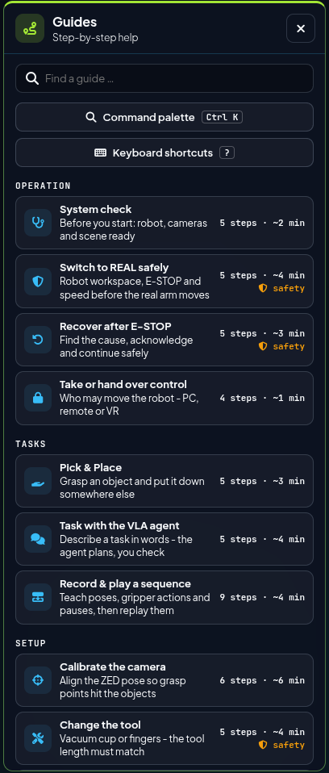
>   <br><sub><i>Guides-Spalte: Suche, Command palette, Keyboard shortcuts und die Anleitungen Operation / Tasks / Setup mit Schritten und Dauer.</i></sub>
> - **Kamera-Kacheln im Viewport (N18.12):** Der Viewport-Reiter **CAMERAS** (oben rechts, wie die anderen Reiter an jeden Rand andockbar) zeigt eine Kachel je *laufendem* Stream, dessen Section nicht offen ist – Tisch-Kamera (cam2) zuerst, dann Kamera 1 und die ZED M. Die Kachel kopiert das Bild der Section etwa 5× pro Sekunde (kein zweiter Stream vom Kamera-PC / `web_video_server`). Klick aufs Bild = größer/kleiner (pro Browser gemerkt), Raster-Knopf oder Rechtsklick = **Kamera-Layout** (Bereich *Vision*, breite Stream-Spalte, Sections mit allen Stream-Einstellungen), Fenster-Knopf = Stream in eigenem Fenster, Zahnrad (nur virtuelle Kameras) = Einstellungen genau dieser Kamera (*Settings > Virtual cameras*, angedockt, Kamera ausgewählt; auf schmalen Kacheln statt des Raster-Knopfs). Nicht laufende Kameras erscheinen nur als grauer Chip *3 cameras off* (gelb *offline*, wenn ein Stream abgerissen ist; Tooltip: Start über die Karte *Robot Vision Cameras* der UX | Nexus Launcher); Klick öffnet das Kamera-Layout. Die Kacheln passen sich dem freien Platz zwischen oberem und unterem Rand an (nebeneinander, dann in Zeilen) und verdecken nie POSE/TELEMETRY; passt nicht einmal eine 96-px-Kachel (z. B. 1080-px-Bildschirm mit offener Diagnostics-Schublade), zählt der Chip sie nur (*2 live · 1 camera off*). Die Stream-Sections starten deshalb eingeklappt (Standard und alle Presets/Bereiche außer Kamera-Layout / *Camera focus*; *Vision* lässt die ZED offen). Ist der Reiter CAMERAS eingeklappt oder ausgeblendet, pausiert jeder Stream, dessen Section eingeklappt oder nicht angezeigt ist (keine Last auf Netz, Kamera-PC und `web_video_server`); Aufklappen startet ihn neu. Modul: `js/cam_pip.js`.
> - **Virtuelle Kameras:** eigene Blickwinkel auf den Digital Twin, nutzbar wie echte Kameras (höchstens 4, jede kostet einen zusätzlichen Render-Durchgang). **Anlegen:** 3D-Ansicht hindrehen, dann **+** neben dem Kamera-Chip im Viewport-Reiter CAMERAS oder *Settings › Virtual cameras › New from current 3D view*; Presets *Top view*, *Front view*, *Side view*, *Tool camera* (an `link_eef` wie die VR-Nozzle-Kamera, 30° zur Werkzeugachse) und *Like ZED M camera* (am TF-Tuner-Objekt *Zed M Camera*, also dessen kalibrierte Lage – die Tisch-Kamera cam2 hat keine 3D-Lage, nur eine Homographie). **Durchschauen:** Leiste über dem Viewport (*Looking through <Name>*) – Orbit, Pan und Zoom bewegen die Kamera, ein heller Rahmen zeigt den Bildausschnitt (Rest abgedunkelt); *Field of view* (5–120°, vertikal, daneben die Brennweite in mm), *Mounted on* (*World (fixed)*, *TCP (follows the arm)*, *Scene object: …*; beim Wechsel bleibt die Lage im Raum), *Format* (16:9, 4:3, 1:1), *Exact values* (X/Y/Z in mm, Yaw/Pitch/Roll in ° im Frame der Befestigung, Pitch positiv = blickt nach unten wie im Virtual Objects); *Save* übernimmt, *Cancel* / Esc verwirft, die eigene 3D-Ansicht kommt in beiden Fällen zurück. **Bild:** nur Roboter, Szenen-Objekte und Raum (kein Gizmo, Raster, Frame-Achsen, keine Erkennungen, Sicherheitszonen, Bahnvorschau), gerendert aus derselben Szene mit demselben Renderer in ein Offscreen-Ziel, nur wenn sichtbar und nach einer Szenenänderung, höchstens 10 Bilder/s für eine Section, 5 nur für die Kachel. Jedes virtuelle Bild trägt das Badge **VIRTUAL** (blau); ohne rosbridge steht dort *VIRTUAL · no robot data* (neutral), weil der Twin dann die letzte bekannte Pose zeigt. **Nutzung:** je Kamera eine Section (`panel-vcam-<id>`, wie *Live Stream*: Fadenkreuz, Einzelbild als PNG (1920 px) mit eingebranntem *VIRTUAL · Name · Zeit*, gespeichert auf dem PC wie *Save frame*, Vollbild, einklappen, in jede Spalte ziehen; standardmäßig und in allen Bereichen außer dem Kamera-Layout eingeklappt, dort unter den Streams) und eine Kachel im Reiter CAMERAS hinter den echten Kameras. **Verwaltung:** *Settings › Virtual cameras* (Gruppe 3D viewport): Liste mit Name, Befestigung, Öffnungswinkel und Format, Schalter *Section* / *Tile*, Knöpfe *Perspektive einstellen*, *Duplicate*, *Delete* (fragt in der Zeile nach); Klick auf eine Zeile öffnet die Details (Name, Befestigung, Öffnungswinkel, Brennweite, Format, X/Y/Z, Yaw/Pitch/Roll – jede Änderung wird sofort gespeichert). **Brennweite:** Kleinbild 36 × 24 mm (Filmbreite 36 mm, Höhe nach Format, wie three.js `filmGauge`), gekoppelt an den Öffnungswinkel (50 mm bei 16:9 ≈ 23°). **Tiefenschärfe:** Block in den Details – Chip *On*, *Aperture* f/1.4–f/22, *Focus distance* in m entlang der Blickachse, *Focus on TCP* (Abstand Kamera → `link_eef`); zweiter Durchgang über Farbe und Tiefe des Offscreen-Ziels, Unschärfe-Kreis nach der Linsengleichung (höchstens 1,5 % der Bildhöhe); wirkt in Section, Kachel, gespeicherten Einzelbildern und Videos, das Bild für ROS bleibt scharf. **Speichern:** *Save frame* (PNG, 1920 px) und *Record video* (1280 px, 30 Bilder/s, MP4/H.264 oder WebM, bis 10 min, eine Aufnahme gleichzeitig, Label eingebrannt; *Stop* zeigt die Laufzeit) → `POST /api/vcam_capture` → `~/Pictures/robot_control_ui/vcam/vcam_<Name>_<Datum-Zeit>.png|mp4|webm` (Ordner wird angelegt, nichts wird überschrieben, `RCUI_CAPTURE_DIR` ändert den Ordner); ist der Server nicht erreichbar, lädt der Browser die Datei stattdessen herunter. **Layers › Environment › Virtual cameras** zeigt die Kameras als Pyramiden in der Szene (Spitze = Kamera, Grundfläche = Bild, Dreieck = Bild oben; nicht in VR); Klick auf eine Pyramide wählt die Kamera und öffnet die Settings angedockt. Gespeichert auf dem PC (`/api/vcams` → `~/.config/robot_control_ui/vcams.json`), jeder Browser sieht dieselben Kameras. **An ROS senden:** Chip *ROS* je Kamera (*Settings › Virtual cameras*, nur FAKE, nach einem Reload wieder aus) → JPEG 640 px mit 15 Bildern/s als `sensor_msgs/CompressedImage` auf `/twin/vcam/<id>/image/compressed` (die Details zeigen den Topic), Badge *VIRTUAL · ROS*, solange gesendet wird; REAL schaltet ab, ohne rosbridge oder bekannten Modus pausiert es (Tooltip am Chip nennt den Grund). Nutzer: `demo_recorder` für VLA-Trainingsdaten (Bildquelle `sim`). Das VR-Kamerafenster bietet sie noch nicht an. Guide **Virtual cameras** (Gruppe *Setup*). Module: `js/vcam.js`, `js/twin/vcam_render.js`.
> - **Befehlspalette Strg+K (N18.16):** **Strg+K** (Mac: Cmd+K, auch *⋮ > Command palette* in der Viewport-Toolbar) öffnet oben mittig eine Suchliste aller Aktionen der Oberfläche: Layout-Presets, Bereiche, Sicherheitsleiste, Statusleiste, Viewport, Viewport-Reiter, alle Sections und die Settings. Aussehen wie die Suche im Handbuch: Filter-Chips mit Zähler (*All*, *Bars*, *Viewport*, *Sections*, *Settings*), jeder Eintrag mit dem Icon seines echten Knopfs, Suchwörter markiert, Bereich als Pille rechts, Tasten und Trefferzahl in der Fußzeile. Ohne Suchbegriff nach Bereich gruppiert, *Recently used* oben; mit Suchbegriff die besten Treffer zuerst. ↑/↓ und Bild auf/ab wählen, **Enter** führt aus, **Tab** / **Shift+Tab** wechselt den Filter, **Esc**, Knopf *Esc* oder Klick daneben schließt. Ausführen klickt den echten Knopf – Bewegungsbefehle laufen so durch dieselben Prüfungen wie mit der Maus (Control-Lock, REAL-Bestätigung, Doppelklick-Sperre). Gerade gesperrte Knöpfe stehen mit Schloss und Grund in der Liste und werden nicht ausgeführt. Während der Roboter fährt, öffnet die Palette nicht (kein Popup über dem Viewport). Vorhandene Tasten stehen rechts (Leertaste = E-STOP, G, M, Esc, ?); neue Einzeltasten-Kürzel gibt es nicht. Modul: `js/palette.js`.
>   <br>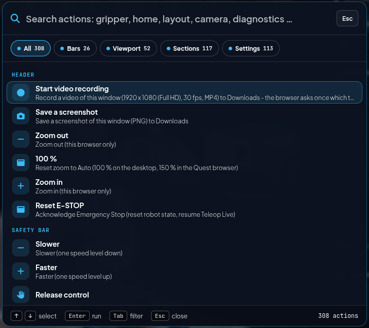
>   <br><sub><i>Strg+K: 308 Aktionen mit den Filtern Bars / Viewport / Sections / Settings.</i></sub>
> - **Viewport bei Laptop-Breite:** Titel in eigener Zeile, Werkzeuge in einer Zeile (Ghost nur als Symbol, Move/Rotate als ein Umschalter); das SYSTEM-Panel startet im schmalen Viewport eingeklappt, bis man es einmal selbst öffnet.
> - **Ansicht einpassen (*Fit view*):** der Kamera-Knopf in der View-Gruppe (oder die Taste **Pos1**) setzt die Standard-Perspektive schräg von vorn links auf Roboter, Bänder, Palette und `3d_virtual_infoscreen` (`DEFAULT_CAM_POS` → `DEFAULT_TARGET` in `js/twin/digital_twin.js`, abgestimmt auf Seitenverhältnis 1,5; schmalere Viewports: Kamera weiter zurück, gleiche Blickrichtung); beim ersten Start automatisch.
> - **Detected Objects** trennt echte und virtuelle Erkennung: zwei Quellen-Kacheln im Kopf der Section - **Camera (real)** (Status aus der Node-Liste: `yolo_3d_bbox_for_zed_m` = ZED M, `yolo_3d_bbox_for_ip_cam` = IP-Kamera; *Live* mit der Rate der Kamera-Nachrichten auf `/zed/bboxes_3d` (Marker-IDs < 901, wie sie in der UI ankommen), *nothing detected*, solange ZED M + YOLO nichts sehen, *No data*, wenn der Node der IP-Kamera 5 s nichts sendet, gedimmt mit *Start in Nexus*, wenn kein Kamera-Node läuft) und **Object detection** (Kennzeichen *GLOBAL*, Unterzeile `n objects · Standard + Auto palletizing`; derselbe Schalter wie *Planning › Simulation › Object detection*, dazu der Pin *Keep virtual*). Beide Quellen dürfen gleichzeitig laufen; die Liste ist in *Camera* und *Virtual* gruppiert, jede Zeile trägt ein Badge **CAMERA** (Kamera-Icon) oder **VIRTUAL** (Formen-Icon, gestrichelter Rand). Jede Gruppe hat einen eigenen Leerzustand mit Ursache → Lösung (keine rosbridge / Kamera läuft nicht / Kamera sendet nichts / virtuelle Objekte aus oder Node fehlt) und *Start in Nexus* bzw. *Switch on object detection*. **REAL-Roboter:** virtuelle Objekte (IDs ab 901) bleiben MoveIt-Hindernisse für jede Bewegung und beim Anfahren echter Objekte; *Grasp*, *Put back* und *Place here* auf ihnen sind gesperrt (Liste, Kontextmenü, VR-Objektkarte; `vla_bridge` lehnt sie ebenfalls ab, `allow_virtual_in_real: false`), *Move to* / *Approach from above* verlangt einen zweiten Klick.
> - **Streams:** *Try all again (n)* startet alle aufgegebenen Streams neu.
> - **Tests:** `?ros=off` lädt die Seite ohne rosbridge (nur Layout), `?ros=ws://host:port` nutzt eine andere rosbridge; `python3 tools/ui_new_code_checker.py` prüft alle Web-UIs isoliert bei 1920/1366/1280 px – UX | Control Interface (inkl. überlappender oder aus dem Viewport ragender HUD-Reiter), UX | Nexus Launcher, UX | Compact Interface und alle Ansichten des UX | Monitoring hell und dunkel (`--pages mon,mon-light`, eigene Datenbank, Domain 97).

###  `blackbox_recorder` (`robot_blackbox_recorder`) &nbsp;&nbsp; <sub><i>`/src/robot_blackbox_recorder/`</i></sub>

**Zweck & Aufgabe:** Flugschreiber für Vorfälle. Hält die letzten 60 s wichtiger Topics serialisiert im RAM; bei einem Auslöser nimmt er noch einige Sekunden danach mit und schreibt einen eigenen rosbag2 nach `~/.ros/blackbox/<Zeit>_<Grund>/`. Auf die Platte kommen also nur Vorfälle – abspielbar in RViz oder Foxglove, statt sie nachzustellen. Auslöser: E-STOP (`/ui/emergency_stop_active` → true), Servo-Halt (`/servo_server/status` 2 = Singularität, 4 = Kollision), Kollisionswarnung (`/ui/collision_msg`) und von Hand über `/blackbox/save` (`std_srvs/Trigger`) – Knopf mit dem Archiv-Symbol in der Kopfzeile von *Diagnostics* (Log-Schublade) der UX | Control Interface und *Save blackbox* in der Log-Ansicht des UX | Compact Interface (freigegeben in `config/network.yaml` → `rosbridge.services`); gleiche Auslöser innerhalb der Sperrzeit zählen einmal. Zustand auf `/diagnostics`.

<details>
<summary><b>🔽 Details anzeigen</b> · Run Command</summary>

> [!NOTE]
> 💻 **Run Command:**
> ```bash
> ros2 launch robot_blackbox_recorder blackbox.launch.py
> ```
> *Startet mit `http_robot_control_ui.launch.py`; `blackbox:=false` schaltet ihn ab.*

</details>

---

<br>

<a name="touch-panel-nexus-webapp-touch"></a>

###  UX | Compact Interface (`/touch`) &nbsp;&nbsp; <sub><i>`/touch_panel/`</i></sub>

**Zweck & Aufgabe:** Kompakte Bedienseite für ein zusätzliches Touch-Display (USB-Touch + HDMI) am Roboter-PC. Das Nexus Web Backend liefert sie als Flask-Blueprint unter `http://127.0.0.1:8080/touch` aus – gleiche Origin wie die UX | Nexus Launcher, daher bestehen Start/Stopp die Zugriffsprüfung „nur lokal“. **Statusleiste (Sicherheitszone, in jeder Ansicht gleich):** Modus *FAKE* / *REAL* (REAL amber mit Rahmen) / *OFFLINE*, Roboterzustand (Ready / Moving / E-Stop latched / Collision near / Servo-Warnung), Tempo `− 60 % +` (Mitte = Stufenwahl, gleicher Wert wie in der UX | Control Interface), Control-Lock (Status in Worten: *You have control* / *Server has control* / *Waiting for approval* / *No control lock* / *Offline*; *Request*, *Cancel*, *Release*; ohne Watchdog kein Knopf), Chips nur bei Abweichung (*ROS* getrennt, *NEXUS* nicht erreichbar), Uhr (ab 1100 px), Menü ☰ und *STOP*. Das Menü ☰ beginnt mit **Language** *Deutsch | English* (Wechsel live, gleiche Einstellung wie die UX | Nexus Launcher in diesem Browser). Unter 560 px bricht die Leiste in zwei Zeilen um (Modus · Zustand · STOP, darunter Tempo · Lock · Menü). Menü links (oben → unten): **Move** (Startansicht) – grüne Leiste *Discard* / *Execute*, solange `/ui/moveit_motion_state` eine Bahnvorschau zur Bestätigung meldet; Karte **Cartesian Jogging** mit denselben Elementen wie in der UX | Control Interface: Bedienkasten (Frame *Base* / *TCP*, Tempo `−` · 5 Balken · `+` · Wert, Spiegel der Statusleiste), *Translate* = Ring mit X±/Y±-Segmenten (halten = fahren) und Joystick in der Mitte (ziehen = analog X/Y) plus Z-Hebel (*Z+* / *Z−* halten, Knopf ziehen = analog Z, federt zurück), darüber Live-Pose X/Y/Z in mm; *Orient* = Ring mit Roll/Pitch innen und Yaw außen, Live-R/P/Yaw in Grad; *Joints* = J1–J6; loslassen = Stopp; rechts daneben **Gripper** (Open/Close/Off bzw. Release/Suction/Off), **Go to pose** (*Home*, *Align* – Position halten, Werkzeug senkrecht nach unten über `/ui/execute_move_to_pose_silent` –, *Scan* – X 300 · Y 0 · Z 400 mm über `/ui/execute_move_to_pose`) und die aktive bzw. zuletzt benutzte Sequenz mit *Play* (Name antippen → Programs); **Programs** (Sequenzen, `/api/touch/sequences` → UX | Control Interface); **Robot** (früher *Safety*: Werkzeugposition X/Y/Z/R/P/Y mit Servo-Status, Gelenke mit Grenzen, *Safety checks* – Objekt-/Tischkollision und Bahnvorschau als Schalter, E-STOP-Zustand mit *Reset* –, *Who can move the robot* – Inhaber des Control-Locks und die Eingabewege UX | Compact Interface, Gamepad `/ui/joy_button_presses`, Voice *Speak* → `/ui/voice_listen_trigger`, VLA-M chat `/vla/status` mit *Abort* → `/vla/abort`, VR Quest 3 `/vr_teleop/controller_active`, Gaze; nicht gestartete haben *Start*, das die passende Karte aus `/api/config` über `/api/run` startet –, MoveIt-Fahrt); **Launch** (*Start*: Kategorie-Segmente *Nodes & Launches* / *System* / *Info & Debugging* / *Topic Pubs* mit Kartenanzahl; Abschnitte mit Badge FAKE/REAL aus `launcher_config.json` als zwei Bringup-Kacheln nebeneinander – die Kachel des aktuellen Modus hat einen Rahmen, *Start REAL…* braucht Halten + Bestätigung; die übrigen Abschnitte als wischbare Chip-Leiste mit Kartenanzahl und *n running*, darunter die Karten des gewählten Abschnitts; läuft der `ros2 launch/run`-Prozess einer Karte, zeigt sie *Running · Zeit* und *Stop* – Abgleich über Paket, Datei/Programm und `key:=value`-Argumente ihres Befehls mit `/api/touch/state`; *Running*: alle `ros2 launch/run`-Prozesse, Stopp wie Strg+C, *Recently started* aus `/api/runs`); **System** (Reiter *Load*, *Network* mit ROS-2-Umgebung, *Services* mit Ports, Health-Liste aus `/diagnostics` und Geräten, *ROS graph*, *Log* mit Blackbox); ganz unten **Monitoring** (↗) holt ein offenes Fenster des UX | Monitoring nach vorn – App-Fenster `--class=monitoring-dashboard` oder ein Chrome-Fenster, dessen aktiver Tab das Dashboard ist –, sonst öffnet es ein eigenes App-Fenster (`POST /api/touch/open_monitoring`, nie ein neuer Tab; Fehler-Toast, wenn Port 8083 nicht läuft). Touch-Ziele 56 px; Nebentext fast in Textfarbe (kein Grau), Kartentitel in normaler Schreibweise; Move passt bei 1280×800, 1024×600 und 800×480 ohne Scrollen (Ringgröße folgt der Fensterhöhe). Meldet `/ui/motion_busy` eine Fahrt (oder läuft die eigene Sequenz, auch zwischen den Schritten), lehnt das UX | Compact Interface weitere Fahr- und Greiferbefehle mit dem Toast *… robot busy – … is running* ab; *Play* ist gesperrt. Bewegungen laufen über dieselbe Steuerungssperre und Server-Freigabe wie bei jedem anderen Client ([7.5](running.html#75-remote-control-server-client-kommunikation)). **Halten statt Dialog:** Riskante oder unumkehrbare Aktionen laufen erst, wenn der Knopf gehalten wird, bis sein Füllbalken voll ist – 1 s für *Start* / *Stop* / *Kill* in Launch, *Reset E-STOP*, *Execute path*, Objekt-/Bodenkollision oder Bahnvorschau ausschalten, Greifer öffnen, solange er etwas hält, Sequenz oder Schritt löschen, *Close panel*; 2 s für *Stop all ROS 2 processes*. Früher loslassen bewirkt nichts (kurzer Hinweis). Bewegungen (*Initial*, *Align TCP*, *Scan*, *Go to*, *Play*) werden in FAKE gehalten, ebenso *Start* eines Eingabewegs; am REAL-Roboter bleibt ihr Bestätigungsdialog. Enter/Leertaste gehalten wirkt wie der Finger; *STOP* wirkt sofort (`js/util.js` `setHold` / `addHoldRule`).

<p align="center">
  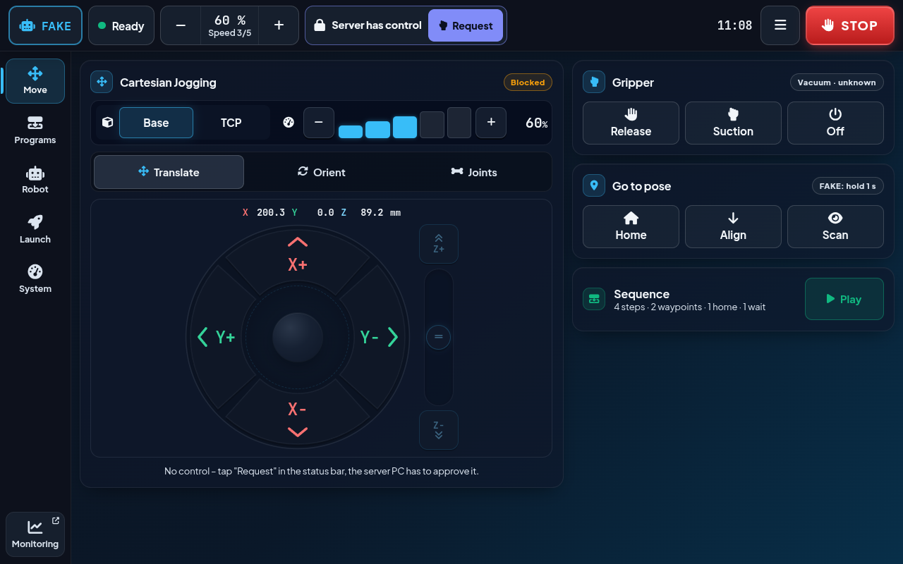
  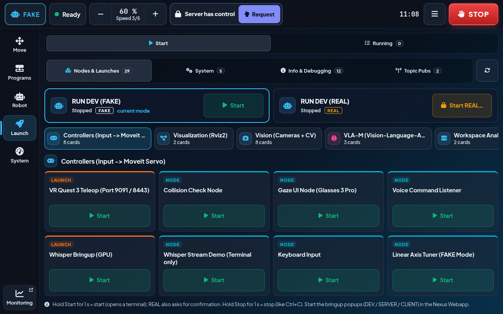
</p>

*UX | Compact Interface bei 1280 × 800 (FAKE). Links: Ansicht **Move** – Statusleiste (FAKE · Ready · Tempo · Control-Lock mit *Request* · Uhr · ☰ · STOP), Cartesian Jogging, Gripper, Go to pose und die letzte Sequenz mit *Play*. Rechts: Ansicht **Launch** – Kategorie-Segmente, Bringup-Kacheln RUN DEV (FAKE) / RUN DEV (REAL) mit *Start REAL…*, Abschnitts-Chips und die Karten mit *Start* (1 s halten).*

<details>
<summary><b>🔽 Details anzeigen</b> · Start · Routen</summary>

> [!NOTE]
> 💻 **Start (Kiosk auf dem Touch-Display):**
> ```bash
> bash touch_panel/touch_panel_start.sh             # findet das HDMI-Touch-Display, mappt den USB-Touch darauf, öffnet /touch als Chrome-Kiosk
> bash touch_panel/touch_panel_start.sh --install   # Eintrag im App-Menü + Autostart beim Login
> ```
> *UX | Nexus Launcher: Karte **UX | Compact Interface (Touch-Display)** im RUN DEV SETUP, angehakt mit EXECUTE gestartet. Optionen: `--output HDMI-1`, `--list`, `--windowed`, `--stop`; schließen über das Menü (☰) auf dem Panel. Ohne Touch-Display (Desktop-PC mit nur einem Monitor) öffnet es statt Vollbild ein schmales Fenster (1024×800) oben rechts.*
>
> **Touch landet auf dem Hauptmonitor?** Dann ist der USB-Touch nicht auf das Touch-Display gemappt. X11 verteilt ihn über den ganzen Desktop (beide Monitore). Die automatische Erkennung nimmt nur Monitore kleiner als 13″. Manche Displays melden per EDID eine falsche Größe und werden nicht gefunden.
> ```bash
> bash touch_panel/touch_panel_start.sh --list          # Monitore (xrandr) + Touch-Geräte (xinput)
> bash touch_panel/touch_panel_start.sh --output DP-5   # Ausgang festlegen, gemerkt in ~/.config/nexus_touch_panel/output
> xinput map-to-output "wch.cn USB2IIC_CTP_CONTROL" DP-5  # nur von Hand mappen (ohne Panel-Start)
> ```
> *Setup am Labor-PC (2026-09): Touch-Display an `DP-5` (1920×1080 bei +0+360, meldet 518×324 mm ≈ 24″), Hauptmonitor `DP-6`, Touch-Controller `wch.cn USB2IIC_CTP_CONTROL`. Unter GNOME speichert der Panel-Start das Mapping zusätzlich per EDID (`gsettings org.gnome.desktop.peripherals.touchscreen`, Pfad `…/touchscreens/1a86:e5e3/`), damit mutter es nach Aus/Ein des Displays, Neu-Einstecken des USB und Neustart selbst wiederherstellt.*
>
>
> 
>
>> | Route | Methode | Beschreibung |
>> |---|---|---|
>> | `/touch` | GET | *Seite (`touch_panel/web/`); Schriften, Font Awesome und roslib kommen aus `ros2_nexus/vendor`.* |
>> | `/api/touch/state` | GET | *Systemlast, Temperaturen, Ports, Geräte (Quest per USB, Gamepad, Touchscreens) und laufende ros2-Prozesse – gemessen nur, solange jemand abfragt.* |
>> | `/api/touch/stop` | POST | *Beendet einen der gelisteten ros2-Prozesse samt Kindprozessen (SIGINT; SIGTERM, wenn SIGINT ignoriert wird; SIGKILL mit `force`).* |
>> | `/api/touch/open_monitoring` | POST | *Monitoring-Knopf: holt ein offenes Fenster des UX \| Monitoring nach vorn (WM-Klasse `monitoring-dashboard` oder Fenstertitel „UX | Monitoring“, `ros2_nexus/nexus_windows.py`), sonst startet es Chrome mit `--app=http://127.0.0.1:8083/` und eigenem Profil; `503`, wenn das Dashboard nicht läuft.* |
>> | `/api/touch/close` | POST | *Schließt das Kiosk-Fenster (Chrome mit dem Panel-Profil).* |
>> | `/api/touch/sequences` | GET/POST | *Bewegungsabfolgen – durchgereicht an `/api/sequences` der UX \| Control Interface (Port 8081), damit alle Clients dieselben sehen.* |


> [!NOTE]
> **Startseite:** Status-Kacheln, Schnellaktionen (≥ 64 px, auch mit Handschuh), System, Services, letzte Meldungen, **Robot live** (sechs Gelenkbalken, TCP, Greifer) und **Recently started** (letzte Starts der UX | Nexus Launcher mit Zustand/Exit-Code aus `/api/runs`). **Robot-Leiste:** bleibt beim Scrollen stehen (ab ca. 550 px Displayhöhe), Tempo per −/+ oder Tipp auf den Wert (Stufe 1–5), der aktuelle Greiferzustand ist mit ✓ markiert. **Robot › Move › Analog stick:** XY-Stick (oben = X+, links = Y+) und Z-Hebel; Auslenkung = Geschwindigkeit (quadratisch, Totzone in der Mitte), loslassen = Stopp – gleiche Totmann-Logik, Bodenschutz und Control-Lock wie die Tasten (`js/jog.js`). Unter **System › Services** zeigt eine **Health**-Liste `/diagnostics` (Watchdog, Kollisions-Check, rosapi, Blackbox). Test ohne rosbridge: `/touch?rosbridge=ws://127.0.0.1:1`.

</details>

---

[⬅ Zurück: VR-Teleoperation (Meta Quest 3)](vr_quest3.html) · [🏠 Übersicht](../readme-de.html) · [⬆ Nach oben](#top) · [Weiter: Digital Twin in NVIDIA Isaac Sim ➡](isaac_sim.html)
