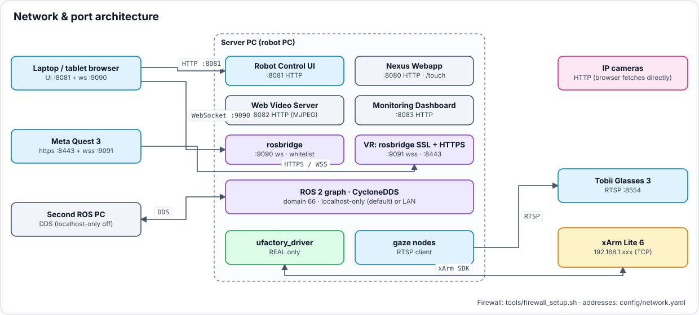
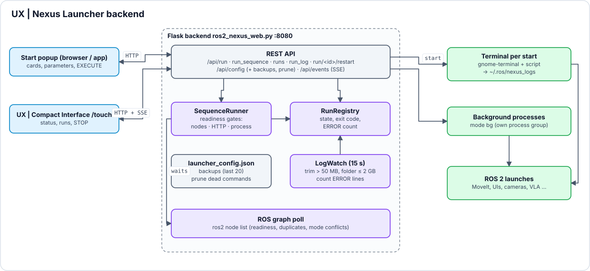

<a name="top"></a>

# 🚀 System starten & betreiben

[🏠 Übersicht](../readme-de.html) · [🇬🇧 English](../en/running.html) · Kapitel 1.1, 7

**Inhalt:** [1.1 ⚡ 5-Minuten Quickstart (Reine Simulation)](#11--5-minuten-quickstart-reine-simulation) · [7. 🚀 Ausführung: Systemstart](#7--ausführung-systemstart)

---

## 1.1 ⚡ 5-Minuten Quickstart (Reine Simulation)

> [!TIP]
> **Kein physischer Roboter oder Hardware erforderlich!** Du kannst den gesamten Software-Stack (Digital Twin in der Simulation, RViz2, Robot Control UI und Monitoring Dashboard) sofort auf deinem lokalen PC bauen, starten und testen.

### 1. Workspace bauen & sourcen
```bash
cd ~/dev_ws
colcon build --symlink-install
source install/setup.bash
```

### 2. Zentrales Prozess-Cockpit starten (Nexus Webapp)
```bash
./ros2_nexus/ros2_nexus_web_start.sh
```
*Dies startet den lokalen Prozess-Manager-Daemon (`http://localhost:8080`) und öffnet die Nexus Webapp als rahmenloses Fenster, das nur das Start-Popup zeigt (Fallback: Chrome-App-Fenster oder Standardbrowser, siehe 7.2).*

### 3. Simulation starten & Web-UIs erkunden
1. Die **Nexus Webapp** öffnet sich direkt mit dem **RUN DEV SETUP**-Popup; wähle im FAKE | REAL-Umschalter des Popup-Headers **FAKE**.
   * **EXECUTE** startet das simulierte xArm Lite 6 `ros2_control` Hardware-Interface, MoveIt 2 Servo + MoveGroup, RViz2, die virtuelle Linearachse und die Robot Control UI inkl. WebSocket ROS Bridge (`ws://localhost:9090`) und Videoserver (8082). Vision, Sprachsteuerung, Eyetracking und VR sind weitere Karten im selben Popup und lassen sich abwählen.
2. Öffne die **Robot Control UI** (`http://localhost:8081`):
   * Teste kartesische XYZ-Jog-Steuerung, bewege die Joint-Slider oder fahre die Home-Initialpose an. *(Die Greifer-Buttons steuern den Greifer direkt — siehe 3.6.)*
3. Öffne das **Monitoring Dashboard** (`http://localhost:8083/`) – eine Karte im RUN DEV SETUP (siehe [8](monitoring.html)).
   * Verfolge Systemlast, den ROS-2-Node-Graphen mit Live-Raten (Hz, Bandbreite), Roboter-Nutzung und Sessions.


---
<br>

## 7. 🚀 Ausführung: Systemstart

Dieser Abschnitt beschreibt Schritt für Schritt den Start der Hardware und Software. Die **Nexus Webapp** dient dabei als zentrale webbasierte Oberfläche, um alle Nodes, Sensoren und Algorithmen mit nur einem Klick hochzufahren.

### ⚡ Quickstart-Entscheidungsbaum ("Was starte ich wann?")

| Use-Case / Szenario | Benötigte Hardware | Empfohlene Start-Sequenz in Nexus | Erreichbare Web-Tools |
| :--- | :--- | :--- | :--- |
| **Reine Simulation / GUI-Test** | Nur PC (Keine Roboter-HW) | 1. `RUN DEV SETUP (FAKE)` (Vision, Eyetracking, VR abwählen, falls nicht gebraucht)<br>2. optional: Karte `Monitoring Dashboard` | Robot Control UI (8081), Monitoring Dashboard (8083) |
| **Gamepad Teleoperation** | xArm Lite 6 + Xbox Controller | 1. Roboter einschalten<br>2. `RUN DEV SETUP (REAL)` | RViz2, Robot Control UI (8081) |
| **3D-Objekterkennung & Greifen** | xArm Lite 6 + ZED Mini | 1. `RUN DEV SETUP (REAL)` mit angehakter Karte `Robot Vision Cameras Bringup` | RViz2, Robot Control UI (8081), Web-Video (8082) |
| **Eye-Tracking Teleoperation** | Tobii Glasses 3 + ArUco-Setup | 1. `RUN DEV SETUP (REAL)` mit der Karte `Eyetracker - Gaze Control` (Real World oder UI Gaze)<br>oder `EXTRAS EXECS` → `RUN DEV + Gaze UI (ZED M) - Exocentric` / `(Rpi Cam) - Egocentric` | Gaze-Fenster, Live-Feedback |
| **Meta Quest 3 VR Teleop** | Meta Quest 3 + PC im selben WLAN | 1. `RUN DEV SETUP (REAL)` mit angehakter Karte `VR Quest 3 Teleop` | WebXR (`https://<IP>:8443`) |

*`RUN DEV SETUP` ist das Start-Popup und – seit die vollständige Seite `/old_index.html` entfernt ist – die einzige Ansicht der Nexus Webapp (siehe 7.3).*

---
<br>


### 7.1 Schritt 1: Hardware vorbereiten
1. **Roboter einschalten:** Schalte den UFactory xArm Lite 6 an und stelle sicher, dass der Not-Aus-Schalter entriegelt ist.
2. **Controller verbinden:** Schalte den Xbox One Elite Series 2 Controller ein und prüfe die Verbindung (Bluetooth oder USB) mit dem Host-PC.


---
<br>


### 7.2 Schritt 2: System starten (Nexus Webapp)
Normalerweise muss in der Robotik jedes Mal eine Vielzahl langer `ros2 run`- oder `ros2 launch`-Befehle in mehreren Terminals parallel ausgeführt werden, um die einzelnen Nodes zu starten. Genau um dieses Problem zu lösen, wurde die **Nexus Webapp** entwickelt: Anstatt komplexe CLI-Befehle auswendig zu lernen, lassen sich alle benötigten Nodes und Launch-Files bequem per Klick direkt aus dem Browser heraus starten. Die Bringup-Sektionen: **AUTOMATED SYSTEM BRINGUP** (`RUN DEV SETUP (FAKE)` / `(REAL)`, lokale Entwicklung an einem PC), **EXTRAS EXECS** (DEV + Gaze UI, Egocentric / Exocentric), **Start Multimodal Setup** (die Aktionen von DEV SETUP FAKE / REAL als einzelne Karten) und **Client / Server Control Bringup** (verteilte Ausführung auf Bediener-PC und Roboter-PC). Die Hintergrund-Startsequenzen wurden stark optimiert: Die Backend-Nodes und MoveIt starten nun mit einer Sekunde Verzögerung dazwischen, während die ROS Bridge und Web UI als Letztes laden. Dies beugt WebSocket-Abbrüchen vor.

**Quick Launch (empfohlen):**
```bash
./ros2_nexus/ros2_nexus_web_start.sh
```
Das Skript prüft Flask, sourct ROS 2 Humble und den Workspace, startet das Nexus Web Backend (Flask, Port 8080), falls es noch nicht läuft, und öffnet die Nexus Webapp: als rahmenloses WebKitGTK-Fenster (`ros2_nexus_popup_window.py`, zentriert, etwa 70 % × 95 % des Bildschirms; benötigt `gir1.2-webkit2-4.0`), sonst Chrome / Chromium im `--app`-Modus oder den Standardbrowser. Das Terminal offen lassen: Schließen des Nexus-Fensters beendet auch Backend und Terminal, Schließen des Terminals beendet das Backend. Stürzt das Backend ab, bleibt das Terminal mit dem Traceback offen.

**Startseite = Start-Popup:** `http://localhost:8080/` zeigt nur noch das Start-Popup (RUN DEV SETUP mit FAKE | REAL-Umschalter, siehe 7.7). Im rahmenlosen Fenster wird das Fenster am Popup-Header verschoben, ein Doppelklick auf den Header maximiert es und das X des Popups beendet die App; in einem normalen Browser-Tab kommt das Popup nach dem Schließen (X, Cancel, Esc) wieder. Die Umgebung steht als eine Zeile unter dem Titel (User @ Host, IP, Domain, RMW, DDS-Scope, LAN-Traffic); **Details** oder der Pfeil rechts im Popup-Header öffnet die volle Netzwerkleiste (Netzwerk-Interface, Traffic-Verlaufsgrafik, Schalter DDS *Localhost only*, Scope mit Guide-Link); der Zustand wird im Browser gespeichert (Standard: eingeklappt).

**Start über Terminal (nur Backend):**
```bash
cd ~/dev_ws
python3 ros2_nexus/ros2_nexus_web.py
# → Öffnet sich unter http://localhost:8080 (auch im LAN erreichbar, z.B. http://192.168.x.x:8080)
```
*Laufzeit-Anzeige: Jede Karte zeigt ihren Zustand (läuft / wartet / bereit / beendet mit Exit-Code), eine Log-Schublade pro Karte die letzten Ausgabezeilen (Filter WARN / ERROR, Datei öffnen, *Follow in terminal*; Logs in `~/.ros/nexus_logs`).*

**Alle ROS 2 Prozesse beenden:** Der Button **Kill Daemon** in der Popup-Toolbar führt nach einer Rückfrage `kill_ros2.sh` aus. Es beendet nur Prozesse des eigenen Benutzers mit derselben `ROS_DOMAIN_ID` wie das Nexus-Backend (Standard 66) – Test-Stacks anderer Domains bleiben unberührt. Es zählen nur echte `ros2 run`- / `ros2 launch`- / `rviz2`-Prozesse (Programm am Anfang der Kommandozeile): Shells von Claude Code oder VS Code, die über `~/.bashrc` ebenfalls in Domain 66 laufen und solche Befehle oft nur als Text enthalten, trifft es nie. Das Skript beendet stufenweise: zuerst SIGINT (wie Strg+C, damit Launch-Files ihre Nodes herunterfahren; wer SIGINT ignoriert, bekommt gleich SIGTERM), dann SIGTERM, Reste per SIGKILL - jede Stufe wartet bis zu 5 s auf `ros2 run`, `ros2 launch` und `rviz2`. Danach schließt es die Terminal-Wrapper der gestarteten Befehle und stoppt den ROS 2 Daemon dieser Domain (veraltete Graph-Infos); das Backend startet danach einen frischen Daemon mit derselben Umgebung wie die Terminals (`ros2 daemon stop` + `start`, Log-Eintrag *ROS 2 daemon restarted*). Anschließend lädt Nexus sich selbst neu. *Stop all & quit* startet keinen neuen Daemon. **Jeder Sequenzstart (EXECUTE)** startet den Daemon der Domain ebenfalls vor dem ersten Schritt neu, mit der *Localhost only*-Einstellung des Starts – `ros2 node list` / `ros2 topic list` in den Terminals zeigen nie veraltete Nodes eines vorherigen Starts (Log-Eintrag *ROS 2 daemon – restarted in n s*).

**Nexus sauber beenden:** Wird das Nexus-Fenster geschlossen (X im Popup, Alt+F4), während noch Starts laufen, fragt **Quit ROS 2 Nexus?** mit der Liste der laufenden Starts: *Stop all & quit* (wie Kill Daemon, danach endet das Backend), *Keep running & quit* oder *Cancel* (Esc); läuft nichts, schließt das Fenster sofort (`POST /api/quit`). Zusätzlich beendet das Backend bei SIGTERM / SIGHUP / Strg+C seine eigenen Hintergrund-Starts (INT → TERM → KILL) – ein geschlossenes Fenster oder Terminal hinterlässt keine Waisen mehr, die beim nächsten Start Ports und ROS-Domain belegen.

**Ubuntu App Integration (1-Klick-Installer):** Sowohl die **Nexus Webapp** als auch die **Robot Control UI** können als native Ubuntu-Desktop-Anwendungen mit hochauflösenden Icons registriert werden. Der Nexus-Eintrag startet `ros2_nexus_web_start.sh` in einem Terminal (rahmenloses Fenster, siehe oben), der Eintrag der Robot Control UI öffnet ein eigenes Chrome-`--app`-Profil. Führe dazu einfach das automatisierte Einrichtungs-Skript aus:
```bash
cd ~/dev_ws/ros2_nexus && bash install_app.sh
```
Dies konfiguriert automatisch die Pfade, kopiert die `.desktop`-Dateien nach `~/.local/share/applications/` und aktualisiert die Desktop-Datenbank. Anschließend können die Nexus Webapp (Menüeintrag **„ROS 2 Nexus"**) und **„Robot Control UI"** direkt über das Aktivitäten-Menü von Ubuntu gestartet oder an das Ubuntu-Dock angeheftet werden.

---
<br>


### 7.3 Schritt 3: Module über die GUI aktivieren
Gestartet wird alles im Start-Popup (7.2, 7.7): Karten einer Sequenz anhaken und **EXECUTE** drücken oder eine einzelne Karte starten. Die frühere vollständige Seite `/old_index.html` mit Tab-Leiste und den Einzel-Buttons aller Sektionen wurde am 28.09.2026 entfernt – Nodes außerhalb der Sequenzen (z. B. Isaac Sim, das alte Dashboard) startet man im Terminal (Befehle in den jeweiligen Kapiteln).

1. **Start im Backend:** EXECUTE übergibt die ganze Sequenz ans Backend, das nach Infrastruktur-Schritten (MoveIt/Servo, rosbridge, Kameras + YOLO: Node `/virtual_object_detections` – läuft auch ohne angeschlossene/gewählte Kamera, ZED allein: `/zed/*`, VLA, Whisper / Voice Listener: Node `/whisper/inference`, Monitoring Dashboard: HTTP-Antwort auf seinem Port, Touch Panel: sein Kiosk-Fenster) auf deren Bereitschaft wartet statt auf feste Pausen. Eigene Regeln je Karte stehen in `launcher_config.json` als `"__ready": {"<Teil des Befehls>": {"nodes": ["/my_node"], "timeout": 60}}` (auch `node_re`, `http`, `proc`; `{}` schaltet die Prüfung ab) – sie gehen den eingebauten vor und werden bei jedem Sequenzstart gelesen. **Pflicht-Karten:** Vor dem Start prüft das Popup, was die aktiven Karten brauchen (VLA-M: MoveIt Servo/MoveGroup und Robot Control UI, in REAL zusätzlich Kameras + YOLO; Voice Command Listener: Whisper; Grasp-Executor: Kameras; VR-Teleop: MoveIt Servo). Erfüllt ist das durch eine aktive Karte oder einen schon laufenden Start. Fehlt etwas, nennt eine gelbe Zeile über dem Footer die Karte mit Grund: *Add … & start* hakt die Karte(n) an und startet, *Start anyway* startet ohne, *Back* kehrt zurück. Eine Fortschrittszeile steht über dem Popup-Footer; die Sequenz läuft weiter, auch wenn das Fenster zugeht. Jede aktive Karte startet in einem eigenen Terminal; wird ein Terminal geschlossen, endet sein Launch sauber (wie Strg+C). Läuft ein Nexus-Launch noch ohne Terminal (Waise), beendet EXECUTE ihn und startet ihn neu in einem Terminal, statt ihn als „läuft schon“ zu überspringen.
2. **Laufzustand und Logs je Karte:** läuft / wartet / bereit / beendet mit Exit-Code; Log-Schublade mit Filter WARN / ERROR, *Datei öffnen*, *Follow in terminal* (`~/.ros/nexus_logs`) und **Restart** (`POST /api/run/<id>/restart`: beendet den Befehl wie Strg+C – SIGINT, dann SIGTERM/SIGKILL – und startet ihn mit demselben Befehl, Titel und Localhost-Wert neu; läuft er noch, fragt der Knopf erst nach, der zweite Klick bestätigt). **Fehler-Hinweis:** Das Backend zählt alle 15 s ERROR/FATAL/Traceback-Zeilen im Log jedes laufenden Starts; der Zustands-Chip zeigt dann ein rotes Badge `N ERROR` (Tooltip mit der letzten Zeile), die Konsole einen **LOG**-Eintrag und das Touch Panel einen Toast (höchstens alle 5 min je Start). Endet ein Start mit einem Exit-Code außer 0 / Strg+C / Kill, erscheint ein Toast im Popup und im Touch Panel. Logs sind begrenzt: Ein laufendes Log über 50 MB wird auf die letzten 20 MB gekürzt (Markerzeile oben, Warnung **LOG** in der Konsole; das Touch Panel zeigt sie als Toast und in seinem Log), der Ordner bleibt unter 2 GB (älteste zuerst, nie Logs laufender Starts). Ändern über `NEXUS_LOG_FILE_MAX_MB` / `NEXUS_LOG_DIR_MAX_MB` (`0` = aus). Die ROS-eigenen Logs in `~/.ros/log` bleiben unberührt.
3. **Deep-Links:** `http://<host>:8080/#start-<begriff>` öffnet das Start-Popup und markiert die passende Karte (z. B. `#start-http_robot_control_ui`).
4. **Launch-Struktur & Parameter:** Die *CMD*-Ansicht jeder Karte zerlegt den Launch-Baum in Sub-Launches, Nodes und Parameter; Wert-Parameter lassen sich vor dem Start ändern (siehe 7.7).
5. **Beenden:** Eine einzelne Karte stoppt sanft (INT → TERM → KILL); **Kill Daemon** beendet alle ROS-2-Prozesse (7.2).
6. **REAL / FAKE getrennt:** Die Linearachse gibt es nur in der Simulation. Das Backend startet einen REAL-Befehl (`lite6_moveit_servo_realmove`, MoveGroup mit `robot_ip:=`) nie mit `attach_to:=linear_axis_link` und blockiert einen REAL-Start, solange noch ein FAKE-Stack (`lite6_moveit_servo_fake`, FAKE-MoveGroup, `fake_linear_axis`) läuft – und umgekehrt. Die Karte nennt den Grund (Stack + PID); zuerst den anderen Stack beenden.
7. **Config-Sicherungen:** Vor jedem Speichern wird der bisherige Stand (`launcher_config.json` + Auswahlen dieses Rechners aus `launcher_state.json`) nach `~/.config/ros2_nexus/backups` kopiert (letzte 20) – nur bei geändertem Inhalt, höchstens alle 10 min, aber immer, wenn der neue Stand deutlich kleiner ist oder ganze Bereiche fehlen (typisch für versehentliches Überschreiben durch einen Test oder einen alten Tab). Test-Instanzen mit `NEXUS_CONFIG` sichern neben ihre Kopie. Im Start-Popup öffnet der Knopf **Backups** (Toolbar neben *Setup - Info Card*) die Liste zwischen Kopf und Karten: Zeit, Alter, Anzahl Bereiche und Größe, neueste zuerst; *Restore* fragt in der Zeile nach (Esc = Abbrechen) und lädt danach die Seite neu (nur am Nexus-PC selbst – anderswo ist der Knopf gesperrt und sagt per Tooltip warum). Per Kommandozeile: Liste `curl http://localhost:8080/api/config/backups`; wiederherstellen (nur lokal, sichert vorher den aktuellen Stand): `curl -X POST -H 'Content-Type: application/json' -d '{"name": "launcher_config_<datum>.json"}' http://localhost:8080/api/config/restore`, danach Nexus Webapp und Touch Panel neu laden – ein offener Tab schreibt sonst seinen alten Stand zurück.
8. **Schalter Terminals:** Der Schalter *Terminals* rechts in der Zeile *Components* schaltet die Terminal-Fenster bei Execute an oder aus (global für alle Popups, Sequenzen und das Touch Panel; gespeichert in `~/.config/ros2_nexus/settings.json`, API `GET/POST /api/settings` `{"open_terminals": false}`). Aus: Karten im Modus `ros` starten ohne gnome-terminal mit derselben ROS-Umgebung (Domain, RMW, Localhost only, `install/setup.bash`); Ausgabe nur in der Log-Schublade (`~/.ros/nexus_logs`, *Follow in terminal* zeigt sie live), Beenden über *Stop* / *Restart* / *Kill all ROS 2* statt Strg+C. Interaktive Befehle (Modus `interactive`) öffnen immer ihr Terminal; Browserfenster sind nicht betroffen. Der Schalter wirkt ab dem nächsten Start; *Restart* entscheidet neu.

---
<br>


### 7.4 Netzwerk- & Port-Architektur

<p align="center"></p>

*Netzwerk- und Port-Architektur · Quelle: `tools/make_diagrams.py`*

**Ports an einer Stelle:** Alle Ports stehen in `config/network.yaml` unter `ports:` (`nexus`, `robot_control_ui`, `web_video`, `monitoring`, `vr_https`, `rosbridge`, `rosbridge_ssl`). Die Nexus Webapp (`NEXUS_PORT` hat weiter Vorrang), die Launch-Dateien der Robot Control UI (Webserver, rosbridge, Video-Server), des Monitoring Dashboards und der VR-Teleoperation lesen sie über `dev_ws_network.port()`; der Server der Robot Control UI und das Touch Panel setzen sie als `window.DEV_WS_PORTS` in die Seite, daraus bauen die Browser ihre rosbridge-URL und Links (`/api/network` liefert `ports` ebenfalls). Fehlt ein Eintrag, gilt der Standard unten. `tools/check_ports.py` (CI und pre-commit) prüft, dass jeder Port gültig und nur einmal vergeben ist und kein JavaScript eine `ws(s)://`-URL mit festem Port baut. Nach einer Änderung: betroffene Karten neu starten, Firewall prüfen (`tools/firewall_setup.sh`); Hinweistexte und diese Doku nennen weiter die Standardports.


Um das komplette System mit beiden Web-Oberflächen (Nexus und Dashboard) zu nutzen, laufen im Hintergrund mehrere Server auf separaten Ports:

<details>
<summary><b>🔽 Tabelle anzeigen</b> · 10 Ports · 8080 · 8081 · 8082 · 8083 · 8443 · 8554 · 9090 · 9091 · xArm · DDS</summary>

| Port | Protokoll | Dienst / Komponente | Verwendung / Zweck |
| :--- | :--- | :--- | :--- |
| **`8080`** | HTTP (Flask) | **Nexus Webapp** (Backend) | *Zentraler Prozess-Starter & Web-Konsole.* |
| **`8081`** | HTTP | **Robot Control UI** | *Eigenständige Web App für Remote-Robotersteuerung.* |
| **`8082`** | HTTP / MJPEG | **Web Video Server** | *Videostreaming von Kamera- und RViz-Window-Feeds.* |
| **`8083`** | HTTP | **Monitoring Dashboard** | *System, ROS-2-Graph, Roboter-Nutzung, Sessions & Evaluierung.* |
| **`8443`** | HTTPS | **WebXR VR Server** | *Meta Quest 3 3D-Browseroberfläche.* |
| **`8554`** | RTSP | **Tobii Glasses 3 Stream** | *Video- & JSON-Gaze-Daten (WLAN `192.168.75.xxx`, Ethernet `192.168.100.xxx`).* |
| **`9090`** | WS (WebSocket) | **ROSBridge Server** | *Telemetrie & Service-Bridge für Web-UIs.* |
| **`9091`** | WSS (Secure WS)| **ROSBridge Secure** | *Verschlüsselte WebSocket-Verbindung für WebXR.* |
| **`502 / 7000`** | TCP/IP | **xArm Lite 6 Controller** | *Modbus TCP & Hardware-Steuerungsschnittstelle.* |
| **`23900+`** | UDP | **CycloneDDS Discovery** | *Discovery & Datenaustausch im lokalen Subnetz. Leitet sich aus der Domain ab: `7400 + 250 x ROS_DOMAIN_ID`, bei `ROS_DOMAIN_ID=66` also 23900 (Discovery) und 23910+ (Unicast).* |

</details>

**Netzwerk-Adressen (`config/network.yaml`):** eine Datei für die Roboter-IP (REAL), die IP-Kameras und die Tobii-Brille – gelesen von Nodes, Web-UIs und der Nexus Webapp über das Paket `dev_ws_network` (`net_get('ip_cams.cam1')`). Umgebungsvariablen wie `TOBII_IP` oder `QUEST_IP` haben weiter Vorrang; nach einer Änderung die betroffenen Nodes und Server neu starten (kein Build nötig). **Tobii:** Die Adresse hängt davon ab, wie die Brille verbunden ist – `tobii.connection: auto` (Standard) nimmt `wlan_ip` (192.168.75.xxx, eigenes WLAN der Brille) oder `lan_ip` (192.168.100.xxx, Ethernet), je nachdem in welchem Netz dieser PC gerade ist; `wlan` / `lan` legen sie fest. Ein in der Nexus-Gaze-Karte gespeichertes `tobii_ip` hat noch Vorrang (TODOS N17).

> **Warum diese strikte Trennung?** Die Ports 8081 und 9090 dienen grundverschiedenen Zwecken. Port 8081 (HTTP) fungiert als Standard-Webserver, um die Oberfläche auszuliefern. Port 9090 (WebSocket via `rosbridge`) ist ein hochspezialisierter Daten-Broker, der ausschließlich Live-Telemetrie streamt und keine Webseiten bereitstellen kann. Port 8080 (Flask) verarbeitet die Logik des Nexus Web Backends völlig unabhängig von ROS.

#### 7.4.1 Nexus Web Backend Architektur

<p align="center"></p>

*Backend der Nexus Webapp · Quelle: `tools/make_diagrams.py`*

Die Nexus Webapp (Port 8080) fungiert als zentraler Befehls-Orchestrator. Sie basiert auf einem Flask (Python) Backend und arbeitet völlig unabhängig vom ROS 2 Netzwerk. Ihre Hauptfunktion besteht darin, Klicks aus der Web-Oberfläche zu interpretieren und native Betriebssystem-Unterprozesse (wie `gnome-terminal -- ros2 launch ...`) zu starten. Da es direkt mit dem Host-Betriebssystem interagiert, um Terminal-Instanzen und Prozess-IDs zu verwalten, muss es nativ auf dem Host-Rechner laufen.

#### 7.4.2 Dashboard & Control Web UI Architektur

> **Nativer ROS 2 Server vs. Statischer Python Webserver:**
> - **Nativer ROS 2 Server (`ros2 run web_video_server ...`):** Dies ist ein nativer C++ ROS 2 Node. Er muss sich tief in das ROS-Netzwerk einklinken (Abonnieren von Topics via `image_transport`), um rohe Kamerabilder zu empfangen, diese in Echtzeit zu komprimieren (z. B. als MJPEG-Stream) und anschließend über HTTP auszuliefern. Da er ROS-Nachrichten direkt im Backend verarbeiten muss, wird er nativ als regulärer ROS 2 Node gestartet.
> - **Statischer Python File-Server (`server.py` für 8081):** Im Gegensatz dazu ist die Robot Control UI (`http_robot_control_ui_p8081`) eine reine Frontend-Webanwendung (HTML, CSS, JS). Das Python-Backend spricht hier *überhaupt kein ROS*; es ist ein extrem leichtgewichtiger, "dummer" Server, der lediglich den Ordner bereitstellt, damit ein Browser die Dateien abrufen kann. Die eigentliche ROS-Kommunikation findet ausschließlich *im Browser des Clients* (über JavaScript und `roslibjs`) via WebSocket auf Port 9090 statt. Diese Trennung hält das Backend schlank, ohne dass komplexe ROS-Abhängigkeiten für das einfache Hosting benötigt werden.


---
<br>


### 7.5 Remote Control (Server-/Client Kommunikation)

Der Roboter-PC ist der **Server**: Dort laufen ROS 2, der Arm und die Nexus Webapp; die Karte *Robot Control UI, WebSocket & Video Server* startet zusätzlich rosbridge, den Webserver und den `remote_control_watchdog`. **Clients** sind Browser auf Laptop, Tablet oder Quest 3 – ohne Installation. Einrichtung, Firewall-Regeln, das Remote-Control-Panel und Fehlerbilder erklärt das [Handbuch](../project_manual.html) (Kapitel *Server/Client-Steuerung*) Schritt für Schritt.

| Client | URL | Steuerung übernehmen |
|---|---|---|
| Roboter-PC selbst | App-Fenster `127.0.0.2:8081` (öffnet beim Start) | Hält nach dem Start die Steuerung; Gamepad über `joy_node` |
| Laptop / Tablet, Maus oder Touch | `http://<Server-IP>:8081` | *Request control* (oder der erste Bewegungsversuch) → Server gibt frei |
| Laptop mit Gamepad | `https://<Server-IP>:8443` – die Gamepad-API gibt es im Browser nur über HTTPS; die Karte *VR Quest 3 Teleop* stellt 8443/9091 bereit | Take control → REAL: *Arm gamepad* → Haken *Remote gamepad* |
| Quest 3 (VR) | `https://<Server-IP>:8443` (USB: `https://localhost:8443`) | VR-Bewegungen laufen durch dieselbe Sperre wie UI-Buttons |
| Zweiter PC mit ROS | Nexus-Sequenz *client*, UI-Karte mit `connect_to:=<Server-IP>` | Eigene RViz- / `joy_node`- / Sprach-Nodes per DDS (siehe unten) |


*Client-Seite in der Robot Control UI (Bereich **Remote Teleop › Remote Control**): Modus-Chip FAKE und Standort *This PC (server)*, Besitzer *Server (you)* mit **Release control**, Remote-Gamepad mit Max. Tempo, verbundene Clients und die Adressen fürs Heimnetz (Control UI 8081, VR/HTTPS 8443, Touch UI 8080/touch).*

**Regeln, die der Watchdog auf dem Server durchsetzt:**
- **Ein Besitzer:** Genau ein Client hat die Steuerung, alle anderen sind Zuschauer (Bewegen gesperrt, Not-Aus geht immer). Der Besitzer drückt *Release*, andere Clients *Request control*; nur der Server-PC kann direkt *Take over* (mit Bestätigung).
- **Freigabe am Server:** Jeder Client außer dem Roboter-PC selbst braucht eine Freigabe. Seine Anfrage öffnet in der Robot Control UI auf dem Roboter-PC ein Popup **Allow / Deny**; unbeantwortete Anfragen verfallen nach 60 s. Das Touch Panel (`/touch`) fragt genauso an.
- **Heartbeat:** Tab zu oder WLAN weg stoppt das Remote-Gamepad sofort (Timeout FAKE 1,0 s, REAL 0,4 s); die Steuerung ist nach 10 s wieder frei.
- **REAL-Grenzen:** Maximal 50 % Tempo (FAKE 100 %) und mit `real_require_arm` eine ausdrückliche Freigabe *Arm gamepad*, die nach 60 s ohne Eingabe und bei jedem Moduswechsel verfällt. Die Werte stehen in der Nexus Webapp (Kartenparameter *Remote Access* / *Remote Safety*) und gelten nach einem Neustart der Karte.
- **Befehlsweg:** Browser-Gamepad → `/remote/joy` → Watchdog (Besitz, Heartbeat, Freigabe, Tempo-Limit) → `/joy` → `teleop_pre_collision_checker` → MoveIt Servo – derselbe Weg wie beim lokalen Gamepad.
- **Jog (Twist-Gate):** Kartesisches und Gelenk-Jogging der Robot Control UI, des Touch Panels, des VR-Nodes und der Blicksteuerung (`gaze_*_tobii_glasses`, eigener Client, Art `gaze`) gehen an `/remote/twist` / `/remote/joint_jog` (JSON mit Client-id); der Watchdog leitet nur für den Besitzer der Steuerung (bzw. den verifizierten Server-PC, solange er hält) an `/servo_server/delta_twist_cmds` / `delta_joint_cmds` weiter, bei frischem Heartbeat (≤ 1 s) und ohne verriegelten Not-Aus. Bodensperre wie im Browser: Abwärtsfahrt wird vor dem *Z Collision Level* gebremst (`/ui/ground_collision_level`, aus mit `/ui/moveit_collision_ground_enabled` = false), ohne aktuelle TCP-Position (`/ui/eef_position`, ≤ 1 s) bleibt abwärts gesperrt. Entfernte Clients joggen höchstens mit dem Tempo-Limit des Modus; bleiben die Befehle aus, folgt ein Null-Befehl. Ohne Watchdog gibt es kein Browser-Jog.
- **Server-Token:** Ob ein Client der Server-PC ist, entscheidet nicht mehr das selbst gemeldete Flag `local`. Der Watchdog legt beim Start ein Geheimnis in `~/.ros/remote_control/server_token_d<ROS_DOMAIN_ID>` (Rechte 0600) ab; `server.py` (8081) gibt es in `/api/remote_info` nur an Aufrufer von 127.x. Die UI signiert damit Heartbeat und Anfragen (HMAC-SHA256 über `id|action|target|ts`, höchstens 5 s alt, `ts` steigend); das Geheimnis selbst geht nie über rosbridge. Erkennt der Watchdog einen Tab nicht als Server, steht ein Hinweis im Log der UI (Seite neu laden).
- **Not-Aus quittieren:** Browser rufen `/ui/reset_emergency_stop` nicht mehr selbst auf, sondern senden `action: reset_estop` auf `/remote/control_request`. Der Watchdog ruft den Service nur für den Besitzer der Steuerung und den Server-PC auf; die Antwort steht in `control_state.results` (Touch Panel und VR-Brille brauchen zum Quittieren also die Steuerung).
- **Grenze:** rosbridge kennt keine Client-Identität. Wer Port 9090 erreicht, kann eine fremde Client-id nachahmen oder die übrigen Bewegungs-Services (`/ui/execute_*`, `/ui/approach_from_above`) aufrufen – gegen gezielte Angreifer schützt die Firewall (unten).

> [!CAUTION]
> **Nur im Heimnetz.** rosbridge (9090/9091) filtert keine IP-Adressen – `tools/firewall_setup.sh --apply` lässt nur das Heimnetz sowie die Roboter-/Tobii-/IP-Kamera-Netze aus `config/network.yaml` herein (ohne Option erst anzeigen, rückgängig mit `--undo`; nach einem Netzwechsel erneut `--apply`). Keine Portweiterleitung im Router, und am echten Arm bleibt immer jemand in Reichweite des Hardware-Not-Aus.
>
> **rosbridge-Whitelist** (`rosbridge:` in `config/network.yaml`): Browser dürfen nur die gelisteten Topics senden (`/ui/*`, `/remote/*`, …), die gelisteten `/ui/…`-Services einzeln aufrufen und über rosapi drei Parameter lesen/setzen; keine Actions, kein `/joy` (läuft über `/remote/joy` → Watchdog), kein `/servo_server/delta_*_cmds` (Jog läuft über `/remote/twist` → Twist-Gate), kein `/ui/reset_emergency_stop` (läuft über den Watchdog). Abonnieren bleibt frei. Abgelehntes steht im rosbridge-Log als `No match found for …`; ein neues Browser-Topic/-Service dort ergänzen (rosbridge neu starten). Kosten: eine Glob-Prüfung je Nachricht, gemessen unter 1 % eines CPU-Kerns bei 600 Nachrichten/s. rosapi läuft als `http_robot_control_ui_p8081/rosapi_node` (Original plus Korrektur: ein nicht freigegebener Parameter liefert den Standardwert, statt rosapi abstürzen zu lassen).

#### Zweiter PC mit ROS: Vorbereitung auf beiden Rechnern
Der ROS 2 DDS-Traffic muss zwingend für das Netzwerk freigegeben werden. Ist in der `~/.bashrc` standardmäßig der Wert `ROS_LOCALHOST_ONLY=1` gesetzt, werden sich Host und Client **niemals** finden.
In **jedem** verwendeten Terminal muss vorab folgendes ausgeführt werden:
```bash
export ROS_DOMAIN_ID=66
export RMW_IMPLEMENTATION=rmw_cyclonedds_cpp
export ROS_LOCALHOST_ONLY=0
source ~/dev_ws/install/setup.bash
```


### 7.6 DDS Multicast Storm Prevention & Loopback Discovery (Kritisch)
> [!CAUTION]
> **Internet-Abbrüche & Netzwerk-Überlastung:** Standardmäßig verwenden ROS 2 DDS-Implementierungen "UDP Multicast", wodurch alle Daten in das gesamte lokale Netzwerk (LAN/WLAN) gefunkt werden. Wenn die ZED-Kamera und YOLO gestartet werden, überflutet dies das Netzwerk mit Gigabit-Mengen an UDP-Paketen. **Das führt meist dazu, dass der Router abstürzt oder die Internetverbindung des PCs sofort getrennt wird.**
>
> Um das zu verhindern und die Systemleistung zu steigern (sofern man **nicht** die Remote-Steuerung aus 7.5 nutzt!), **muss** der ROS 2 Datenverkehr auf den eigenen PC (Localhost) beschränkt werden:
> ```bash
> echo "export ROS_LOCALHOST_ONLY=1" >> ~/.bashrc
> source ~/.bashrc
> ```
>
> **Loopback Discovery Fehler:** Das Setzen von `ROS_LOCALHOST_ONLY=1` zwingt den Traffic auf das interne Loopback-Interface (`lo`). **Allerdings deaktiviert Ubuntu nach jedem Neustart standardmäßig die Multicast-Fähigkeit auf diesem Interface**. Das führt dazu, dass CycloneDDS mit `Failed to find a free participant index` abstürzt, da sich Nodes intern nicht finden.

Um dieses Problem dauerhaft zu beheben, richte folgenden Systemd-Dienst ein, der Multicast auf dem `lo`-Interface beim Booten aktiviert:

```bash
# 1. Die Datei sauber anlegen
sudo bash -c 'cat > /etc/systemd/system/lo-multicast.service <<EOF
[Unit]
Description=Enable Multicast on Loopback interface for ROS 2
After=network.target

[Service]
Type=oneshot
ExecStart=/sbin/ip link set lo multicast on

[Install]
WantedBy=multi-user.target
EOF'

# 2. Systemd neuladen, Dienst aktivieren und sofort starten
sudo systemctl daemon-reload
sudo systemctl enable lo-multicast.service
sudo systemctl start lo-multicast.service
```

**Alternative ohne `sudo` (`ros2_nexus/cyclonedds.xml`):** Wo sich Multicast auf `lo` nicht aktivieren lässt, kann stattdessen das Participant-Limit selbst angehoben werden. Ohne Multicast fällt CycloneDDS auf Unicast-Discovery zurück, wo `MaxAutoParticipantIndex` (Standard 9) eine Domain auf rund acht Participants deckelt - allein der xArm-Servo-Launch bringt zwölf Nodes mit, weshalb alles danach Gestartete stirbt. `ros2_nexus/cyclonedds.xml` hebt diese Grenze an, und die Nexus Webapp exportiert `CYCLONEDDS_URI` automatisch dafür (die generierten Skripte sourcen zwar `~/.bashrc`, die kehrt in nicht-interaktiven Shells aber sofort zurück, sodass die Variable nie ankäme). Für normale Terminals gehört das in die `~/.bashrc` - am besten ganz oben, zu den übrigen ROS-Variablen:

```bash
[ -f "$HOME/dev_ws/ros2_nexus/cyclonedds.xml" ] && \
    export CYCLONEDDS_URI="file://$HOME/dev_ws/ros2_nexus/cyclonedds.xml"
```

> Das hebt lediglich ein Limit an und stellt kein Multicast wieder her. Der systemd-Dienst oben bleibt die bessere Lösung; die Config ist für Rechner ohne Root-Zugriff gedacht.

---
<br>


### 7.7 Launcher-Konfiguration (`launcher_config.json`)

Die Buttons, Kategorien und Befehle in der Nexus Webapp sind vollständig anpassbar.

**Interaktives Drag & Drop:** Das Nexus-Interface verfügt über ein hochgradig responsives, permanentes 3-Spalten-Drag-&-Drop-System. Einzelne Aktions-Buttons können innerhalb ihrer Sektionen frei angeordnet werden. Komplette Kategorie-Sektionen lassen sich nahtlos über drei vertikale Spalten verteilen. Layout-Änderungen werden sofort im Backend gespeichert.

**Hierarchische Launch-Inspektion:** Jeder Action Button in der Nexus Webapp verfügt über einen interaktiven [CMD]-Indikator. Ein Klick darauf öffnet ein detailliertes Modal, welches die exakte hierarchische Struktur des auszuführenden Launch-Files visuell aufschlüsselt. Dies spiegelt tief verschachtelte Sub-Launches und individuelle Nodes (wie z.B. `ros2_control_node`, `spawner`, `robot_state_publisher`) präzise wider. Eine globale 'Select All'-Checkbox ermöglicht das schnelle Umschalten aller Hauptkomponenten der Sequenz. Dynamische Launch-Argumente werden direkt als interaktive Checkboxen neben den entsprechenden Launch-Dateien eingeblendet, wodurch die Parameterisierung zur Laufzeit intuitiv gesteuert werden kann. **Darüber hinaus unterstützen die Action Cards innerhalb dieser Popups permanentes Drag-and-Drop, um die Ausführungsreihenfolge individuell anzupassen. Standardmäßig sind alle Aktionen aktiv (`active: true`). Jede getroffene Checkbox-Auswahl (sowohl Hauptaktionen als auch Parameter-Chips wie YOLO-Modell oder Hardware-Toggle) wird automatisch und persistent pro Karte in `localStorage` und `launcher_config.json` gespeichert und bei jedem erneuten Öffnen des Popups oder nach einem Seiten-Reload exakt wiederhergestellt.** Launch-Argumente mit Standard `true` werden abgewählt ausdrücklich als `:=false` angehängt (`rviz:=true`), sonst gälte weiter der Launch-Standard. Die **Speech-Control**-Karte zeigt statt Parameter-Chips einen Schiebeschalter **Whisper CPU | GPU**: Ein Klick auf die Leiste schaltet um, ein Klick direkt auf „CPU" oder „GPU" wählt gezielt diese Seite, und per Tastatur bedienen ihn Pfeiltasten, Leertaste oder Enter. Der Start hängt immer `use_gpu:=true` oder `use_gpu:=false` an (die CPU-Mode-Karte startet auf CPU, jede Karte merkt sich ihre eigene Wahl). Das wirkungslose Argument `silero_vad_use_cuda` wird nicht mehr angeboten.

**Karten-Hinweise (i):** Rechts neben dem Titel jeder Karte sitzt ein **(i)**-Knopf. Hover (oder Tastaturfokus) zeigt ein Popup mit kurzen Hinweisen zur Karte – z. B. welche URL zu öffnen ist, was REAL/FAKE bedeutet, wie viele Parameter es gibt. Karten mit Ports zeigen zusätzlich die Firewall-Freigabe fürs Heimnetz; ein Klick auf **(i)** kopiert den `ufw`-Befehl. Die Texte stehen in `CARD_HINTS` in `ros2_nexus/js/card_hints.js`; Karten ohne Eintrag bekommen allgemeine Hinweise aus ihrem Befehl.

**Zoom:** − / + im Popup-Footer (oder Strg + / Strg − / Strg 0) skalieren die ganze App – Kopf, Liste, Details und Fußleiste – in 10-%-Schritten von 70 bis 150 % (im Browser gespeichert); das Fenster behält seine Größe, ein Klick auf die Prozentzahl setzt auf 100 % zurück.

**Sequenz-Popups (RUN DEV / SERVER / CLIENT SETUP):**
- **FAKE | REAL-Schalter** im Popup-Kopf wechselt zwischen FAKE- und REAL-Sequenz (DEV und SERVER).
- **Liste + Details:** links eine kompakte Liste aller Karten, jede Kategorie als eigener Block (Häkchen = mit EXECUTE starten, Titel, Node-Zahl bzw. Laufzustand wie *Running*, *Waiting for …*, *Exited · code 1*; die Launch-Datei steht im Tooltip), rechts die markierte Karte mit allem (Parameter, Launch-Struktur, Config-Dateien, Befehl, Log). Auswahl per Klick oder Pfeiltasten ↑ ↓ / Pos1 / Ende, gemerkt je Popup im Browser. Klick auf einen Kategorie-Block hakt ihn an / ab (und zeigt seine Karte); Ziehen des Blocks (ab 3 px Bewegung) ändert die Reihenfolge, alternativ Griff ⋮⋮ fokussieren und ↑ ↓ drücken (gespeichert wie bisher; die Liste ist immer sortierbar, der Schalter *Layout locked* ist in dieser Ansicht ausgeblendet). Die Launch-Struktur zeigt je Eintrag Typ-Badge + Name, darunter die Beschreibung; Sub-Launches klappen über ihren Pfeil ein. Suche, Filter *All / Active / Inactive*, *Select all* und Deep-Links `#start-<begriff>` wirken auf Liste und Karte zugleich. Unter 820 px Popup-Breite stehen Liste und Details untereinander und scrollen gemeinsam.
- **Check (Preflight):** Der Knopf *Check* links neben EXECUTE prüft, was die angehakten Karten brauchen, ohne etwas zu starten (~1 s, `POST /api/preflight`, `ros2_nexus/nexus_preflight.py`): Roboter erreichbar (nur REAL, `robot_ip:=`), IP-Kameras / ZED am USB / Tobii, Ports der Karten frei (belegt von einem laufenden Nexus-Start zählt als in Ordnung), kein zweiter `move_group` / Motion Handler in derselben ROS-Domain (führt zu IK- und Controller-Fehlern), *Localhost only* gegenüber Server/Client, GPU-Speicher für ZED + YOLO / Ollama / Whisper, freier Plattenplatz und bei der VLA-M-Karte das Sprachmodell (Ollama und das Modell aus `llm_model:=` installiert? Sonst Warnung mit `bash src/vla_bridge/scripts/install_ollama.sh` – der Chat plant nicht, Ein-Klick *Grasp* / *Place here* gehen trotzdem). Das Ergebnis steht als Liste über dem Footer, Abweichungen zuerst, jede Zeile mit Ursache und Abhilfe und wo sinnvoll einem Knopf (*Stop stack* / *Stop process*, *Setup card*, *Kill Daemon*, *Details*). Bei mehr als einer solchen Zeile stoppt ***Stop all leftovers (n)*** im Kopf alle auf einmal. *Stop stack* / *Stop process* beendet die gemeldeten PIDs samt ihrem `ros2 launch` und dessen Nodes – sonst startet `respawn=True` den Node sofort neu (nur eigene Prozesse derselben ROS-Domain; INT → TERM → KILL, wer SIGINT ignoriert, bekommt gleich SIGTERM, `POST /api/preflight/stop`) und prüft danach neu. Jede Port-Zeile zeigt die Herkunft als Badge mit Icon und die Domain als zweites Badge: *Nexus* (Umgebungsvariable `NEXUS_PID` des startenden Backends, auch bei Starts ohne Terminal), *Nexus · closed* (dieses Backend läuft nicht mehr), *Claude chat*, *Terminal* oder *Left over*. Die Stack-Prüfung meldet `move_group`, Motion Handler, `ros2_control_node` und den Servo-Container. Typische Ursache: ein Terminal-Fenster mit mehreren Nexus-Tabs wurde geschlossen; Nexus signalisiert dann die Prozessgruppen der Befehle, damit keine Nodes übrig bleiben (`HUP_GUARD_SH` in `nexus_runs.py`); Prüfungen, die die Auswahl nicht braucht, sind eingeklappt, eine geänderte Auswahl markiert das Ergebnis als veraltet. **In REAL prüft EXECUTE automatisch:** ein Fehler stoppt den Start (*Start anyway* / *Back*), Warnungen nicht (ein Toast nennt sie nach dem Start). Tests: `ros2_nexus/test/test_nexus_preflight.py`.
- **Parameter je Modus:** Werte, die nur im anderen Modus wirken, sind ausgegraut und werden nie angehängt (FAKE: *REAL max speed / heartbeat / arm*, *REAL: execute plans / always confirm*; REAL: *FAKE max speed / heartbeat*); der Tooltip nennt den Grund. Karten mit Empfehlung zeigen oben **Recommended for FAKE/REAL**: *✓ … settings set* oder *Apply … settings* mit den abweichenden Werten. Die Empfehlung wird beim ersten Öffnen einer FAKE/REAL-Sequenz einmal gesetzt (Merker `__mode_presets` in `launcher_config.json`), danach bleiben eigene Änderungen. Empfohlen: Servo-Stack *Gamepad + collision checker* und *Table plane* an; REAL zusätzlich *arm before remote gamepad* an; VLA-M FAKE *Dry run* aus, REAL zusätzlich *execute plans* + *always confirm* an. Das **(i)** der Karte nennt kurze FAKE/REAL-Hinweise (`MODE_PRESETS` / `MODE_HINTS` in `ros2_nexus/js/mode_presets.js`).
- **Eyetracker-Karte:** Modus `Real World` (`gaze_grasp_routine_tobii_glasses`) oder `UI Gaze` (`gaze_control_ui_tobii_glasses gaze_ui`) – eine Karte, genau ein Modus.
- **VLA-M-Karte:** eigene Kategorie *VLA-M (Vision-Language-Action)* in RUN DEV SETUP und SERVER SETUP, übersprungen bis angehakt. Parameter: *LLM* (`ollama` / `anthropic`), *Dry run*, *REAL: execute plans*, *REAL: always confirm* (Modell im Bereich „Config Files“); REAL braucht *execute plans* an (Empfehlung), sonst zeigt *Execute* nur den Plan; der Node startet `ollama serve` selbst (einmalig installieren: `bash src/vla_bridge/scripts/install_ollama.sh`); Details unter [VLA-M](vla.html).
- **Touch-Panel-Karte:** *Touch Panel (Touch-Display)* startet angehakt mit EXECUTE den Kiosk auf einem Zusatz-Touch-Display (siehe [Touch Panel](robot_control_ui.html#touch-panel-nexus-webapp-touch)).
- **Wert-Parameter:** Launch-Argumente und Node-Parameter mit Werten (IPs, Zahlen, Auswahllisten) erscheinen als Eingabezeilen mit Quell-Badge `CONFIG` (YAML), `ARG` (Launch-Argument) oder `PARAM` (Node-Parameter). An den Befehl gehängt werden nur Werte, die vom Standard abweichen, Node-Parameter als `--ros-args -p`. Die Launch-Argumente inkl. eingebundener Launches liest das Backend aus (`/api/launch_details`).
- **Bereich „Config Files“:** pro Karte die YAML-Dateien, die der Launch lädt, mit den wichtigen Werten und Einheiten, geladen / nicht geladen für die aktuellen Argumente, überschriebene Werte durchgestrichen, Status `Live` / `Copy` / `Build needed` / `Not built` (`install/` verlinkt oder kopiert), alle Schlüssel und ein Button zum Kopieren des Pfads.
- **Suche & Filter** über Titel, Datei, Kategorie oder Port, **Theme** (Knopf *Dark / Light / Jarvis / Nord Blue ▾* im Footer links neben dem Zoom oder **Alt+T**: Liste mit Live-Vorschau, Enter übernehmen, Esc abbrechen; schaltet auch den Seitenhintergrund um das Popup; gleiche Liste wie Robot Control UI und Monitoring Dashboard, nur dieser Browser) und ein **Localhost only**-Schalter in der DDS-Leiste (`ROS_LOCALHOST_ONLY=1` für diese Sequenz).
- **Toolbar:** Filter *All / Active / Inactive* mit Zählern, Drag-&-Drop-Hinweis und der Button **Kill Daemon** (siehe 7.2).
- **Hilfe (Footer):** Der Button **ⓘ Setup-Info-Karte** (quadratischer Icon-Button ganz rechts im Footer, rechts neben dem Zoom; Übersichtskarte Netzwerk & Hardware-Setup: Systemübersicht Clients → Server → Roboter, IP-Vergabe, Web-Adressen, Ports, Touch-Display, HTTP/HTTPS für VR, VLA-M; Umschalter **DE / EN** – dieselbe Karte wie im Monitoring Dashboard, `ui_shared/net_info.js`; *Als PDF exportieren* speichert sie im Nexus-App-Fenster direkt als `~/Dokumente/Setup_<Datum>.pdf` (eine Seite A4 hoch, hell) und öffnet die Datei); Knopf *Projekt-Doku* in der Fußleiste der Karte öffnet die Projekt-Doku); direkt links daneben öffnet der quadratische Button **Projekt-Doku** (Ebenen-Icon, Tooltip beim Überfahren) die Projekt-Doku `docs/project_docs.html` (`/ws/docs/project_docs.html`, neuer Tab) – einziger Einstieg zu Bedienhandbuch, Setup-Guide, Setup-Karte, Poster und Projektseiten.
- **Optik:** Der Popup-Inhalt wird in 80 % Größe dargestellt (Browser-Popup `min(76vw, 1700px)` breit), eigene 3D-Checkboxen (WebKitGTK zeichnete den nativen Haken riesig und flach) und Sequenz-Karten mit kräftigerem farbigem Rand, dezentem Glow und Tiefe.


*Start-Popup **RUN DEV SETUP** im FAKE: Kopf mit FAKE / REAL, DDS-Leiste (Benutzer, IP, Traffic, Domain, RMW, *localhost only*, *Details*), Suche und Filter *All / Active / Inactive*, *Backups*, *Kill Daemon*; links die Komponenten mit Node-Anzahl, rechts die gewählte Karte (*xArm Lite 6 – Base*) mit Launch-Datei, Parametern & Args, Launch-Struktur und Config-Dateien; Fußzeile mit *Check*, **EXECUTE FAKE**, Theme, Zoom und der Setup-Info-Card.*

**Manuelle Konfiguration:** Karten, Popups und Befehle stehen in `ros2_nexus/launcher_config.json` (im Git). Auswahlen, die sich bei jedem Klick ändern (`__cmd_args`, `__popups_args`, `__popups_active`, `__cards_collapsed`), speichert die Nexus Webapp je Rechner in `~/.config/ros2_nexus/launcher_state.json` (Test-Instanz: neben der `NEXUS_CONFIG`-Kopie); `launcher_config.json` behält davon nur den alten Stand als Startwert für Rechner ohne diese Datei – keine Merge-Konflikte zwischen Laptop, Labor- und Home-PC. Um eigene Skripte oder Nodes manuell hinzuzufügen, muss diese JSON-Datei angepasst werden. Die WebApp lädt die Konfiguration dynamisch – ein Neuladen der Seite im Browser reicht aus.

---
<br>


### 7.8 CycloneDDS UDP Buffer Overflows (Point Cloud Lag)
**Ruckelnde Pointclouds in RViz:** ROS 2 (insbesondere CycloneDDS) versendet große Datenmengen wie Pointclouds (ZED Kamera) über viele kleine UDP-Pakete. Der Standard-Netzwerkpuffer des Linux-Kernels ist mit ca. 200 KB viel zu klein für diese Datenmengen. Wenn der Puffer überläuft, verwirft das Betriebssystem Pakete ("Receive Buffer Errors"), was zu extremen Lags in RViz führt.

Um dieses Problem zu lösen und einen flüssigen Datenstrom zu garantieren, müssen die UDP-Puffergrößen des Systems dauerhaft auf das Maximum (2 GB) erhöht werden:

```bash
# Temporäre Erhöhung (bis zum nächsten Neustart sofort aktiv):
sudo sysctl -w net.core.rmem_max=2147483647
sudo sysctl -w net.core.rmem_default=2147483647
sudo sysctl -w net.core.wmem_max=2147483647
sudo sysctl -w net.core.wmem_default=2147483647

# Dauerhafte Speicherung (überlebt Neustarts):
echo -e "net.core.rmem_max=2147483647\nnet.core.rmem_default=2147483647\nnet.core.wmem_max=2147483647\nnet.core.wmem_default=2147483647" | sudo tee /etc/sysctl.d/60-cyclonedds.conf
sudo sysctl -p /etc/sysctl.d/60-cyclonedds.conf
```

<br>

### 7.9 🔧 Fehlerbehebung & Häufige Fragen (FAQ)

<details>
<summary><b>🔽 Tabelle anzeigen</b> · 9 Symptome · wahrscheinliche Ursache · Diagnose & Lösung</summary>

| Symptom / Fehlermeldung | Wahrscheinliche Ursache | Empfohlene Diagnose & Lösung |
|---|---|---|
| **Roboter reagiert nicht (`Connection refused` / Timeout)** | Subnetz-Fehlkonfiguration oder Controller-Box ausgeschaltet. | Überprüfe, ob die xArm Controller-Box eingeschaltet ist. Stelle sicher, dass die Netzwerkkarte der Workstation eine feste IP im selben Subnetz hat (z. B. `192.168.1.xxx`, Maske `255.255.255.0`). Prüfe die Erreichbarkeit per `ping 192.168.1.xxx`. |
| **Web-UI meldet "DISCONNECTED" (Rote Status-Anzeige)** | `rosbridge_server` (Port 9090) läuft nicht oder ist blockiert. | Überprüfe, ob die WebSocket-Bridge aktiv ist (`ros2 run rosbridge_server rosbridge_websocket`). Kontrolliere die Browser-Entwicklerkonsole (F12) auf abgelehnte Verbindungen. Stelle sicher, dass keine lokale Firewall Port 9090 blockiert. |
| **Gamepad-Eingaben bewegen den Roboter nicht** | Joy-Node ist falschem Eingabegerät zugeordnet oder falscher Modus. | Prüfe, ob der Xbox-Controller erkannt wird (`ls -l /dev/input/js*`). Teste Achsen mit `jstest /dev/input/js0`. Überprüfe, ob MoveIt Servo aktiv ist (Topic `/servo_server/status`). |
| **Punktwolke ruckelt oder friert in RViz2 ein** | UDP-Pufferüberlauf im Linux-Kernel bei hohem DDS-Durchsatz. | Führe die Puffererweiterungs-Befehle aus [Abschnitt 7.8](#78-cyclonedds-udp-buffer-overflows-point-cloud-lag) aus (`sudo sysctl -w net.core.rmem_max=2147483647`). |
| **Roboter stoppt abrupt / Servo verweigert Fahrt** | Kollisionsschutz (Tischplatte) oder Singularitätswächter aktiv. | Kontrolliere `/ui/collision_msg` auf aktive Warnungen. Prüfe die Statuscodes auf `/servo_server/status` (`0` = keine Warnung, `1` = Annäherung an Singularität, `2` = Halt: Singularität, `3` = Annäherung an Kollision, `4` = Halt: Kollision, `5` = Halt: Gelenkgrenze). Bewege den Arm mit dem LT-Trigger nach oben, um den Warnbereich zu verlassen. |
| **Stereolabs ZED Mini Kamera initialisiert nicht** | Kamera an USB 2.0 Port angeschlossen oder unzureichende Bandbreite. | Schließe die ZED Mini zwingend an einen blauen **USB 3.0 / 3.1** Port direkt am PC-Mainboard an (keine passiven USB-Hubs nutzen). Prüfe die Erkennung mit `lsusb` und `ZED_Diagnostic`. |
| **Voice Command Listener bricht mit fehlender IDL ab** | Eigenes ROS 2 IDL-Paket ist im Terminal nicht gesourct. | Führe `source install/setup.bash` im aktuellen Terminal aus, um die Schnittstelle `whisper_idl/action/Inference` verfügbar zu machen. |
| **Ein im Terminal gestarteter Node ist für die Web-UIs unsichtbar (z.B. VLA-M bleibt `OFFLINE`, obwohl `vla_bridge` läuft)** | Andere DDS-Umgebung. Die Nexus Webapp setzt sie je Sequenz über den Schalter **Localhost only** im Popup: an = `ROS_LOCALHOST_ONLY=1` + `CYCLONEDDS_URI=file://$HOME/dev_ws/ros2_nexus/cyclonedds.xml`, aus = `ROS_LOCALHOST_ONLY=0` ohne URI. Ein normales Terminal weicht oft ab. | Node aus der Nexus Webapp starten oder vorher dieselben Variablen setzen. Vergleich: `tr '\0' '\n' < /proc/$(pgrep -f rosbridge_websocket)/environ \| grep -E 'ROS_\|CYCLONE'`. |
| **Robot Control UI zeigt `Mode WAIT`, rosbridge-RTT `–` und keinen Roboter im Twin, obwohl Simulation und rosbridge laufen** | Verwaiste doppelte `rosapi_node`-Prozesse aus früheren Sitzungen (gleicher Knotenname) oder ein zweiter `move_group` – `/rosapi/nodes`-Aufrufe hängen. `rosapi_health` startet nur einen hängenden `/rosapi` aus dem eigenen Launch neu, keine Waisen – meldet Dubletten aber auf `/diagnostics` (Touch Panel › System). | Waisen per PID beenden und rosbridge neu starten. Test: `ros2 service call /rosapi/nodes rosapi_msgs/srv/Nodes`. |

</details>

---

[⬅ Zurück: Installation & Voraussetzungen](installation.html) · [🏠 Übersicht](../readme-de.html) · [⬆ Nach oben](#top) · [Weiter: Betriebsmodi & Gamepad-Teleoperation ➡](teleoperation.html)
