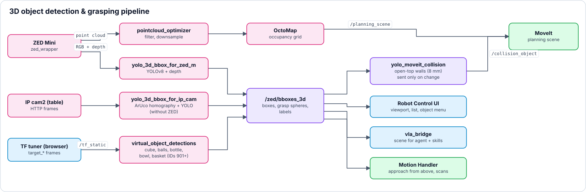
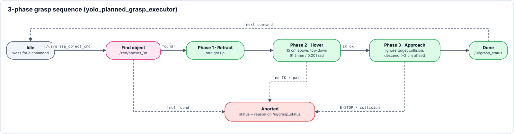

<a name="top"></a>

# 👁️ 3D-Vision & autonomes Greifen

[🏠 Übersicht](../readme-de.html) · [🇬🇧 English](../en/vision_grasping.html) · Kapitel 3.3

---

## 3.3 Funktion: Autonomes Greifen & 3D Objekterkennung (YOLO / ZED)
*Dieses Subsystem ist dafür verantwortlich, Objekte im 3D-Raum zu lokalisieren, virtuelle Hindernisse zu generieren und den Roboter gezielt an das Objekt heranzuführen.*

<p align="center"></p>

*3D-Objekterkennungs- und Greif-Pipeline · Quelle: `tools/make_diagrams.py`*

<p align="center">
  
  
</p>

*Links: Bereich **Vision › Detected Objects** im FAKE-Modus – Quellen-Kacheln *Camera (real)* (läuft nicht) und *Virtual* (8 Objekte), darunter jedes Objekt mit Position in mm, Abstand, *Move to*, Kollisionsschild und Menü. Rechts: Objektmenü an der roten Greifkugel des Würfels – Quick Setup (*Visible*, *Collision*, *Label*, *Lock*, *Ghost*), *Approach from above* (+2 mm), *Grasp* (approach · suction · lift), *Translate*, *Set approach gap*, *Settings*.*

---

<br>

###  `robot_vision_cameras_bringup.launch.py` &nbsp;&nbsp; <sub><i>`/src/robot_vision_cameras_bringup/launch/robot_vision_cameras_bringup.launch.py`</i></sub>

**Zweck & Aufgabe:** Der zentrale Orchestrator für die gesamte 3D-Vision-, Objekterkennungs- und autonome Greif-Pipeline. Die Kameras werden über zwei Schalter gewählt (in der UX | Nexus Launcher (früher „Nexus Webapp“) zwei Checkboxen in der Gruppe *Cameras*): `zed_m` (Standard an) startet den ZED Mini Hardware-Treiber (`zed_wrapper`) zusammen mit `pointcloud_optimizer.py` und `yolo_3d_bbox_for_zed_m.py`; `ip_cams` lässt die beiden Raspberry-Pi-Kameras mitlaufen (cam1 = Nozzle, cam2 = Tisch). **Mit ZED** liefern beide IP-Kameras nur das Live-Bild (die UX | Control Interface (früher „Robot Control UI“) holt es direkt vom Pi). **Ohne ZED** rechnet die Tisch-Kamera: `yolo_3d_bbox_for_ip_cam.py` bestimmt über die ArUco-Marker mit festen Tischpositionen die Lage der Objekte (Homographie + YOLO) und zeigt Marker-6D-Pose und YOLO-Boxen als Overlay in *Live Stream 2*. Das alte `camera:=ip_cam` gilt weiter (= `zed_m:=false ip_cams:=true`). In der Gruppe *YOLO Model* zeigt eine Zeile, auf welcher Kamera YOLO mit dem gewählten Modell läuft (ZED M, Tisch-Kamera cam2 oder Warnung „nicht gestartet“ ohne Kamera); die Konfidenz-Schwelle gilt für beide YOLO-Nodes. Parallel dazu werden stets der MoveIt-Kollisionsgenerator (`yolo_moveit_collision.py`), der Trajektorien-Grasp-Server (`yolo_planned_grasp_executor.py`), die UI-Bridge (`grasp_action_bridge.py`), die virtuelle Objekterkennung (`virtual_object_detections.py`, startet ausgeschaltet), der RViz-Distanz-Visualisierer (`scene_objects_distance_to_tcp.py`) sowie das MoveIt Servo-Warnungs-Status-Overlay (`servo_status.py`) hochgefahren.

<details>
<summary><b>🔽 Details anzeigen</b> · Run Command · Parameters</summary>

> [!NOTE]
> 💻 **Run Command:**
> ```bash
> # Standard: ZED Mini 3D Tiefenkamera-Pipeline
> ros2 launch robot_vision_cameras_bringup robot_vision_cameras_bringup.launch.py
>
> # ZED + IP-Kameras (IP-Kameras nur Live-Bild)
> ros2 launch robot_vision_cameras_bringup robot_vision_cameras_bringup.launch.py ip_cams:=true
>
> # Ohne ZED: Tisch-Kamera mit ArUco + YOLO (Overlay in Live Stream 2)
> ros2 launch robot_vision_cameras_bringup robot_vision_cameras_bringup.launch.py zed_m:=false ip_cams:=true
> ```
>
>
> 
>
>> | Launch-Argument | Standardwert | Beschreibung |
>> |---|---|---|
>> | `zed_m` | `true` | *ZED Mini starten (Treiber, Punktwolke, YOLO 3D-Boxen).* |
>> | `ip_cams` | `false` | *IP-Kameras mitlaufen lassen. Mit ZED nur Live-Bild, ohne ZED rechnet die Tisch-Kamera (cam2) ArUco + YOLO.* |
>> | `camera` | `zed_m` | *Veraltet: `camera:=ip_cam` entspricht `zed_m:=false ip_cams:=true`.* |
>> | `camera_model` | `zedm` | *ZED-Kameramodell (Stereolabs ZED Mini, aktiv bei `zed_m:=true`).* |
>> | `tf_x` | `0.473` | *Kalibrierte Kamera-X-Position relativ zu `link_base` [m] (Stativ-Setup).* |
>> | `tf_y` | `0.0` | *Kalibrierte Kamera-Y-Position relativ zu `link_base` [m] (Stativ-Setup).* |
>> | `tf_z` | `0.368` | *Kalibrierte Kamera-Z-Höhe relativ zu `link_base` [m] (Stativ-Setup).* |
>> | `tf_roll` | `0.0` | *Kamera-Roll-Winkel [rad] (0,0°, Stativ-Kalibrierung).* |
>> | `tf_pitch` | `1.00356` | *Kamera-Pitch-Winkel [rad] (+57,5°, nach unten in den Arbeitsbereich geneigt).* |
>> | `tf_yaw` | `3.14159` | *Kamera-Yaw-Winkel [rad] (180,0°, blickt zum Roboter).* |
>> | `yolo_model` | `yolov8l.pt` | *YOLO-Neuronales-Netzwerk-Gewichtsdatei (Standard: hochpräzises YOLOv8 Large).* |
>> | `confidence_threshold` | `0.35` | *YOLO-Konfidenzschwelle (Standard aus `perception_params.yaml`).* |
>> | `ema_alpha` | `0.4` | *EMA-Glättung der 3D-Boxen (Standard aus `perception_params.yaml`).* |
>> | `safe_z_hover_height` | `0.15` | *Hover-Höhe über dem Objekt [m] (Standard aus `grasping_params.yaml`).* |
>> | `grasp_z_offset` | `0.02` | *Z-Offset auf die Objekt-Oberkante beim Greifen [m] (Standard aus `grasping_params.yaml`).* |
>> | `velocity_scaling` / `acceleration_scaling` | `0.2` / `0.1` | *MoveIt-Skalierung der Greifbewegung (Standard aus `grasping_params.yaml`).* |
>
> *Die YAML-Dateien bleiben die Quelle der Standardwerte; die Launch-Argumente überschreiben sie nur beim Start (z. B. aus der UX | Nexus Launcher).*

</details>

---

<br>

###  `zed_camera.launch.py` (`zed_wrapper`) &nbsp;&nbsp; <sub><i>`/src/zed-ros2-wrapper/zed_wrapper/launch/zed_camera.launch.py`</i></sub>

**Zweck & Aufgabe:** Der native Hardware-Treiber der Stereolabs ZED Mini Kamera (wird von `robot_vision_cameras_bringup.launch.py` automatisch eingebunden, wenn `zed_m:=true`).

<details>
<summary><b>🔽 Details anzeigen</b> · Run Command · Publishes · Parameters</summary>

> [!NOTE]
> 💻 **Run Command:**
> ```bash
> ros2 launch zed_wrapper zed_camera.launch.py camera_model:=zedm
> ```
>
>
> 
>
>> | Topic / Interface | Msg Type | Beschreibung |
>> |---|---|---|
>> | **`/zed/zed_node/rgb/image_rect_color`** | `sensor_msgs/Image` | *Publiziert das 2D-RGB-Kamerabild.* |
>> | **`/zed/zed_node/depth/depth_registered`** | `sensor_msgs/Image` | *Publiziert die registrierte Tiefenkarte (Depth-Map).* |
>> | **`/zed/zed_node/point_cloud/cloud_registered`** | `sensor_msgs/PointCloud2` | *Publiziert die dichte 3D-Punktwolke.* |
>
>
>  **(`config/zed_override.yaml` Parameter-Overrides)**
>
>> | Parameter | Wert | Beschreibung |
>> |---|---|---|
>> | `depth_mode` | `NEURAL` | *KI-gestützte neuronale Tiefenschätzung via TensorRT für maximale Präzision.* |
>> | `grab_resolution` | `HD720` | *Aufnahmeauflösung 1280 × 720.* |
>> | `pub_resolution` | `NATIVE` | *Veröffentlicht in Aufnahmeauflösung ohne Downsampling (HD720: ~921.600 Punkte/Frame).* |
>> | `depth_confidence` | `100` | *100% Konfidenzerhalt; verwirft keine berechneten Tiefenpixel.* |
>> | `depth_texture_conf` | `100` | *Erhält texturlose ebene Flächen (Tischoberflächen, Hallenboden).* |
>> | `remove_saturated_areas` | `false` | *Verhindert Löcher in der Punktwolke durch glänzende Boden-/Tischreflexionen.* |
>> | `min_depth` / `max_depth` | `0.1` / `10.0` | *Großer 10-Meter-Erfassungsbereich für vollständige Tisch- und Bodenerfassung.* |

</details>

---

<br>

###  `yolo_3d_bbox_for_zed_m.py` &nbsp;&nbsp; <sub><i>`/src/robot_vision_cameras_bringup/scripts/yolo_3d_bbox_for_zed_m.py`</i></sub>

**Zweck & Aufgabe:** Verarbeitet parallel den RGB- und Depth-Stream mit GPU-Beschleunigung und dem **YOLOv8 Large (`yolov8l.pt`)** Modell. Isoliert Objekte, filtert Tiefenrauschen und berechnet millimetergenaue, dynamisch an das reale Objekt angepasste 3D-Bounding-Boxen und Greifpunkte.

<details>
<summary><b>🔽 Details anzeigen</b> · Run Command · Subscribes · Publishes · Parameters</summary>

> [!NOTE]
> 💻 **Run Command:**
> ```bash
> ros2 run robot_vision_cameras_bringup yolo_3d_bbox_for_zed_m.py
> ```
>
>
> **Zentrale Kernfunktionen:**
> - **Dynamische Objekthöhenberechnung:** Statt starrer, fixer Box-Höhen berechnet die Node anhand der segmentierten 3D-Punkte der Punktwolke die reale Objekthöhe ($z_{\text{top}} - z_{\text{bottom}}$) direkt aus der realen Punktwolke jedes erkannten Objekts.
> - **Dynamischer roter Greifpunkt (`top_z`):** Platziert einen kleinen roten Kugel-Marker zentriert exakt auf der Oberkante des Objekts ($x_{\text{center}}, y_{\text{center}}, z_{\text{top}}$), der sich automatisch an die echte Höhe jedes Objekts anpasst (essenziell für kollisionsfreies Vakuum-Greifen von oben).
> - **Robuste Oberflächen-Projektion & Zentrierung:** Filtert Tisch- und Bodenrauschen heraus, um die Bounding-Boxen exakt auf das tatsächliche physikalische Volumen der Objekte zu zentrieren, unabhängig vom Blickwinkel der Kamera.
> - **EMA-Tracking & Mehrfachobjekt-Nummerierung:** Nutzt ein Dictionary-basiertes EMA-Tracking-System mit persistenten globalen IDs und einer 30-cm-Schwelle (eine Erkennung, die weiter als 0,3 m von jedem bekannten Objekt liegt, bekommt eine neue ID), um ID-Swapping und Boxen-Jittering sicher zu verhindern. Mehrere Objekte derselben Klasse werden dauerhaft durchnummeriert (z.B. `cup_1`, `cup_2`).
>
>
> 
>
>> | Topic / Interface | Msg Type | Beschreibung |
>> |---|---|---|
>> | **`/zed/zed_node/rgb/image_rect_color`** | `sensor_msgs/Image` | *Bezieht das RGB-Bild für die YOLO-Erkennung.* |
>> | **`/zed/zed_node/depth/depth_registered`** | `sensor_msgs/Image` | *Nutzt die Tiefenwerte für die 3D-Projektion.* |
>> | **`/zed/zed_node/rgb/camera_info`** | `sensor_msgs/CameraInfo` | *Liest Kamera-Intrinsics zur exakten Koordinatenberechnung.* |
>
>
> 
>
>> | Topic / Interface | Msg Type | Beschreibung |
>> |---|---|---|
>> | **`/zed/bboxes_3d`** | `visualization_msgs/MarkerArray` | *Sendet die fertigen 3D-Boxen, Text-Labels und dynamischen Greifpunkt-Marker (`top_z`) zur Visualisierung an RViz und nachgelagerte Nodes.* |
>
>
> 
>
>> | Parameter | Standardwert | Beschreibung |
>> |---|---|---|
>> | `model_path` | `yolov8l.pt` | *Gewichtsdatei des neuronalen Netzes. Wird über das Launch-Argument `yolo_model` oder den Parameter-Chip der UX \| Nexus Launcher gesetzt.* |
>> | `confidence_threshold` | `0.35` | *Mindest-Konfidenz einer YOLOv8-Erkennung; alles darunter wird verworfen.* |
>> | `ema_alpha` | `0.4` | *Glättungsfaktor (Exponential Moving Average) gegen Boxen-Jittering zwischen Frames. Kleiner heißt ruhiger, folgt aber träger.* |
>> | `class_dimension_overrides` | `[]` | *Optional feste metrische Dimensionen (x,y,z) für bekannte Kalibrierziele. Standardmäßig leer, dann wird jedes Objekt aus der 3D-Punktwolke vermessen.* |
>
> *Die Perzentil-Grenzen gegen Tiefenrauschen ("Flying Pixels" an Objektkanten) stecken fest im Node und sind keine Parameter. Die Standardwerte liegen in `config/perception_params.yaml`.*

</details>

---

<br>

###  `yolo_3d_bbox_for_ip_cam.py` &nbsp;&nbsp; <sub><i>`/src/robot_vision_cameras_bringup/scripts/yolo_3d_bbox_for_ip_cam.py`</i></sub>

**Zweck & Aufgabe:** Eine leichtgewichtige Alternative zu `yolo_3d_bbox_for_zed_m.py` für Setups ohne ZED-Tiefenkamera. Läuft über den Bringup bei `zed_m:=false ip_cams:=true`. Holt je Takt ein Einzelbild der Tisch-Kamera (`ip_cams.cam2` aus `config/network.yaml`, Standard 8 Hz), erkennt ArUco-Marker auf dem Tisch, um dynamisch eine **Homografie-Matrix** zu berechnen, und führt **YOLOv8** zur Objekterkennung aus. Das Bild mit Overlay (Marker-Umriss, 6D-Achsen je Marker per `solvePnP`, feste Tischposition, YOLO-Boxen mit Tischkoordinaten, Statuszeile) geht auf `/ip_cam/table/annotated`; *Live Stream 2* der UX | Control Interface zeigt es automatisch, solange der Node läuft (Knopf im Panel-Kopf: Overlay ↔ Rohbild). Der frühere Webcam-Node `ip_cam_aruco_6pose_tf_coord` ist darin aufgegangen und wurde gelöscht. Projiziert die 2D-YOLO-Bounding-Boxen mithilfe der Homografie-Matrix in den 3D-Roboter-Basisrahmen (`link_base`). Generiert und veröffentlicht exakt dasselbe 3D `MarkerArray`-Format auf `/zed/bboxes_3d`, wodurch es zu 100% Plug-and-Play mit dem bestehenden UI und Grasp-Executor ist, ohne echte Tiefen-Hardware zu benötigen.

<details>
<summary><b>🔽 Details anzeigen</b> · Run Command · Subscribes · Publishes</summary>

> [!NOTE]
> 💻 **Run Command:**
> ```bash
> ros2 run robot_vision_cameras_bringup yolo_3d_bbox_for_ip_cam.py
> ```
>
> Parameter: `model_path`, `camera_host` (leer = `ip_cams.cam2`), `rate_hz` (8), `confidence` (0,25), `marker_size` (0,03 m), `overlay_topic`, `overlay_width` (960 px), `show_window` (false, zusätzliches OpenCV-Fenster).
>
>
> **Zentrale Kernfunktionen:**
> - **ArUco-Tischebenen-Homografie:** Berechnet kontinuierlich die perspektivische Entzerrung zwischen 2D-Pixelkoordinaten und der realen Tisch-Koordinatenebene ($Z \approx 0$).
> - **Dynamische 3D-Bounding-Boxen & roter Greifpunkt (`top_z`):** Erzeugt vollständige 3D-Begrenzungswürfel und platziert den roten Greifkugel-Marker (`yolo_object_grasp_center_point`) zentriert oben auf jedem erkannten Objekt.
> - **Nahtlose Pipeline-Integration:** Leitet die Daten direkt an `yolo_moveit_collision.py` (zur Erzeugung von MoveIt-Kollisionsboxen) und `yolo_planned_grasp_executor.py` (zur Ausführung autonomer Pick-and-Place-Trajektorien) weiter.
>
>
> 
>
>> | Topic / Interface | Msg Type | Beschreibung |
>> |---|---|---|
>> | *-* | *-* | *Ruft den HTTP JPEG Stream direkt ab (`http://192.168.0.xxx/...`).* |
>
>
> 
>
>> | Topic / Interface | Msg Type | Beschreibung |
>> |---|---|---|
>> | **`/zed/bboxes_3d`** | `visualization_msgs/MarkerArray` | *Publiziert 3D-Bounding-Boxen, Text-Labels und Greifpunkt-Marker identisch zum ZED-Kamera-Ausgabeformat.* |
>> | **`/ip_cam/table/annotated`** | `sensor_msgs/Image` | *Kamerabild mit Overlay (ArUco 6D-Pose, Tischkoordinaten, YOLO-Boxen), `bgr8`; nur publiziert, wenn jemand zusieht.* |

</details>

---

<br>

###  `pointcloud_optimizer.py` &nbsp;&nbsp; <sub><i>`/src/robot_vision_cameras_bringup/scripts/pointcloud_optimizer.py`</i></sub>

**Zweck & Aufgabe:** Läuft im Hintergrund des 3D Vision Bringups und bereitet die ZED-Punktwolke für zwei Abnehmer auf. Die ZED liefert die Wolke bereits in ROS-Konvention (`X=vorwärts`, `Z=oben`) im Frame `zed_left_camera_frame` - hier wird nichts gedreht, den Rest übernimmt TF. Das Einlesen nutzt die strukturierten numpy-Arrays von `sensor_msgs_py` (Humble), ca. 13 ms pro HD720-Wolke; ohne Abnehmer rechnet der Node gar nicht.

<details>
<summary><b>🔽 Details anzeigen</b> · Run Command · Subscribes · Publishes · Parameters</summary>

> [!NOTE]
> 💻 **Run Command:**
> ```bash
> ros2 run robot_vision_cameras_bringup pointcloud_optimizer.py
> ```
>
> - **MoveIt-OctoMap (`cloud_optimized`):** NaN-Punkte entfernt, Frame unverändert. **Standardmäßig aus** (`publish_moveit_cloud: false`): Eingeschaltet übernimmt MoveIt die gesamte Kamerawolke - inklusive der zu greifenden Objekte - als Hindernis. Kein Zuschnitt: MoveIt nutzt Punkte jenseits von `ros.max_range`, um die OctoMap entlang dieser Strahlen freizuräumen.
> - **Web Digital Twin (`/zed/pointcloud_web`):** auf `web_max_points` ausgedünnt, per TF nach `world` transformiert, höchstens `web_rate_hz` - und nur, solange ein Client abonniert hat. Die UX | Control Interface zeigt die Punktwolke nicht mehr an; ohne Abonnent bleibt der Ausgang untätig.
>
>
> 
>
>> | Topic / Interface | Msg Type | Beschreibung |
>> |---|---|---|
>> | **`/zed/zed_node/point_cloud/cloud_registered`** | `sensor_msgs/PointCloud2` | *Rohe ZED-Punktwolke (Sensor-Data-QoS).* |
>
>
> 
>
>> | Topic / Interface | Msg Type | Beschreibung |
>> |---|---|---|
>> | **`/zed/zed_node/point_cloud/cloud_optimized`** | `sensor_msgs/PointCloud2` | *Dichte Wolke ohne NaN-Punkte für die MoveIt-OctoMap - nur mit `publish_moveit_cloud:=true`.* |
>> | **`/zed/pointcloud_web`** | `sensor_msgs/PointCloud2` | *Ausgedünnte Wolke in `world` (derzeit ohne Abnehmer in den Web-UIs).* |
>
>
> 
>
>> | Parameter | Standard | Beschreibung |
>> |---|---|---|
>> | `publish_moveit_cloud` | `false` | *Wolke für die MoveIt-OctoMap veröffentlichen.* |
>> | `web_max_points` | `12000` | *Maximale Punktzahl der Web-Wolke.* |
>> | `web_rate_hz` | `4.0` | *Maximale Senderate der Web-Wolke.* |
>> | `web_frame` | `world` | *Ziel-Frame der Web-Wolke.* |

</details>

---

<br>

###  `virtual_object_detections.py` &nbsp;&nbsp; <sub><i>`/src/robot_vision_cameras_bringup/scripts/virtual_object_detections.py`</i></sub>

**Zweck & Aufgabe:** Publiziert die drei Szenenobjekte **Blue Cube**, **Red Rectangle** und **Green Cylinder** sowie die fünf Greif-Objekte **Bottle**, **Steel Ball**, **Rubber Ball**, **Bowl** und **Basket** (IDs 904–908; Schale und Korb mit Greifpunkt am inneren Boden – ihr Rand ist für den Saugnapf zu schmal) so auf `/zed/bboxes_3d`, als hätte YOLO sie erkannt - Bounding Box, rote Greifkugel und Labels im exakt gleichen Marker-Format (Marker-IDs ab 901, Namen mit dem Zusatz ` (virtual)`). Alles, was an `/zed/bboxes_3d` hängt, behandelt sie wie echte Detektionen: `yolo_moveit_collision` (MoveIt-Kollisionsobjekt + rote Wände), die UX | Control Interface (Viewport, Liste *Detected Objects*, Kontextmenü, VR) und `robot_motion_handler_movegroup` („Approach from above“). So lässt sich der Greif- und Kollisionsablauf ohne Kamera testen, z. B. im FAKE-Modus. Die Posen kommen aus den TF-Tuner-Frames `target_blue_cube`, `target_red_rectangle`, `target_green_cylinder`, `target_bottle`, `target_ball_small`, `target_ball_large`, `target_bowl_small` und `target_basket_large` (die TF-z ist die Unterkante des Objekts); solange die virtuellen Objekte an sind, publiziert der TF-Tuner der UX | Control Interface diese Frames auch bei ausgeschaltetem „Live TF“. Fehlt ein Frame, bleibt die Standard- bzw. zuletzt gesehene Pose stehen. Gedrehte Objekte bekommen wie eine echte YOLO-Box die achsparallele Hülle. Der **Size**-Regler des TF-Tuners (`/ui/scene_object_sizes`, Faktor je Frame) skaliert Maße und Greifpunkt. Standardmäßig aus, damit virtuelle Kollisionsobjekte nie unbemerkt in MoveIt landen.

**Szene *Logistik – automatisch palettieren*** (Bereichs-Leiste › **Scene**, `js/scenes.js`): jedes Objekt gehört zur Szene `standard` (die acht Objekte oben) oder `palletizing`. Die Palettier-Szene enthält eine **Europalette** `PAL-01` (Klasse `EUR1`, max. Last 80 kg, 1200 × 800 × 144 mm) und **8 Kartons** im Maßstab 1:6, Grundflächen aus dem Euro-Modul, sodass zwei L-Kartons eine Lage füllen: L 800 × 600 × 400 mm (PKG-L1 25 kg, PKG-L2 22 kg), M 600 × 400 × 300 mm (PKG-M1 12 kg, PKG-M2 10 kg, PKG-M3 7 kg *fragile*), S 400 × 300 × 200 mm (PKG-S1 5 kg, PKG-S2 3 kg *fragile*, PKG-S3 4 kg) - zusammen 88 kg, der Planer muss also Kartons liegen lassen. IDs 909–917, Frames `target_pallet`, `target_carton_l1` … `target_carton_s3`; die Kartons stehen auf den beiden Zuführbändern (Oberkante 12 mm) links und rechts vom Roboter, die Palette bei x 300 mm davor. Jedes Objekt dieser Szene trägt `meta` in `/ui/virtual_objects`: Palette `id`, `class`, `max_load_kg`, `scale`, `size_mm`; Karton `id`, `class` (`carton_L/M/S`), `handling` (`standard` / `fragile` = nichts darauf), `weight_kg`, `max_stack_kg` (Last, die er trägt), `size_mm` (reale Maße). Der Viewport zeigt zusätzlich eine kleine Palettieranlage (`js/twin/logistics_cell.js`; solange die Szene aktiv ist, legt `virtual_object_detections.py` die Bänder - Rollenbett 2 mm unter der Kartonunterkante + Seitenprofile - und den Zaun als MoveIt-Kollisionsobjekte `cell_*` auf `/planning_scene` an, alle 5 s erneuert, beim Verlassen der Szene / Abschalten der Erkennung entfernt): Rollenbänder durch den Schutzzaun, Barcode-Scanner-Brücken, Palettenplatz mit gelben Eckmarken, Leerpalettenmagazin, Lichtgitter an den Bandöffnungen, Signalsäule, Schaltschrank mit Bedienpanel und gelb-schwarze Bodenmarkierung. Der Palettier-Planer ist `vla_bridge/palletizing.py`, der Ablauf `vla_bridge/pallet_job.py` (Fenster *Palettieren*, siehe *VLA-M › Auto-Palettieren*). In der **Physik-Sandbox** (FAKE) sind Palette (fest), Kartons (Masse aus dem realen Gewicht / 6³) und die beiden Bänder Körper; mit dabei ist nur, was in `/ui/virtual_objects` *an* ist, die andere Szene ist abgeschaltet (kein Körper, nicht greifbar, nicht in MoveIt).

<details>
<summary><b>🔽 Details anzeigen</b> · Run Command · Publishes · TF2 · Services · Parameters</summary>

> [!NOTE]
> 💻 **Run Command:**
> ```bash
> ros2 run robot_vision_cameras_bringup virtual_object_detections.py
> ```
> *(Wird von `robot_vision_cameras_bringup.launch.py` gestartet, standardmäßig ausgeschaltet. Der Schalter ist **Object detection** (Kennzeichen *GLOBAL*: alle greifbaren Objekte jeder Szene, Standard und Auto palletizing) im Planning-Panel (Simulation) und in *Detected Objects* der UX | Control Interface.)*
>
>
> 
>
>> | Topic / Interface | Msg Type | Beschreibung |
>> |---|---|---|
>> | **`/zed/bboxes_3d`** | `visualization_msgs/MarkerArray` | *Die virtuellen Detektionen im YOLO-Marker-Format (Namespaces `yolo_bboxes`, `yolo_object_grasp_center_point`, `yolo_labels_class`, `yolo_labels_coords`).* |
>> | **`/ui/virtual_bboxes_3d`** | `visualization_msgs/MarkerArray` | *Dieselben Marker exklusiv für die UX \| Control Interface (Desktop, VR, VR-Spiegel), da das gedrosselte Abo von `/zed/bboxes_3d` (Queue 1) sie neben YOLO mit Kamerarate meist verdrängen würde.* |
>> | **`/ui/virtual_detections_enabled`** | `std_msgs/Bool` (latched) | *Aktueller Zustand des Schalters **Object detection** (Tag GLOBAL) in Detected Objects.* |
>> | **`/ui/virtual_objects`** | `std_msgs/String` (latched, JSON) | *Zustand der einzelnen Objekte für das Flyout **Virtual Objects** im Viewport: Liste aus `{frame, name, color, on, scene}`, Objekte der Palettier-Szene zusätzlich mit `meta`.* |
>> | **`/ui/virtual_scene`** | `std_msgs/String` (latched) | *Aktive Szene: `standard` oder `palletizing` (Bereichs-Leiste › Scene).* |
>
>
> 
>
>> | Frame / Transformation | Beschreibung |
>> |---|---|
>> | **`world` ➔ `target_blue_cube` / `target_red_rectangle` / `target_green_cylinder`** | *Pose der drei Szenenobjekte (TF-Tuner-Frames).* |
>
>
> 
>
>> | Topic / Interface | Msg Type | Beschreibung |
>> |---|---|---|
>> | **`/ui/set_virtual_detections`** | `std_srvs/srv/SetBool` (Server) | *Schaltet die virtuellen Detektionen an/aus. Ausschalten löscht die Marker; `yolo_moveit_collision` entfernt die Kollisionsobjekte nach 2 s.* |
>> | **`/ui/set_virtual_objects`** | `std_msgs/String` (Subscriber, JSON) | *Schaltet einzelne Objekte an/aus, z.B. `{"target_bottle": false}` (nur die geänderten Frames). Ein abgeschaltetes Objekt geht nicht mehr auf `/zed/bboxes_3d` → kein MoveIt-Hindernis, nicht in *Detected Objects*, nicht in der Szene des VLA-Agenten. Standard: alle Objekte der Szene `standard` an (nicht über einen Neustart des Nodes gespeichert). `{"scene": "palletizing"}` wechselt die Szene: ihre Objekte an, alle anderen aus.* |
>> | **`/ui/set_library_objects`** | `std_msgs/String` (Subscriber, JSON) | *Objekt-Bibliothek (UX \| Control Interface › Library): `{"add": {"type": "cube_30"}}` fügt am nächsten freien Platz in Reichweite um `link_base` ein, `{"add": {"type": …, "pose": {"x", "y", "z", "yaw"}}}` an einer bestimmten Stelle (m, Grad), `{"remove": [id]}` löscht, `{"on": {"id": bool}}` schaltet an/aus. Typen = `config/object_library.yaml`; Instanzen `Cube 30 #1` … mit Frame `lib_<typ>_<n>` und Marker-ID 1000 + id, gemeldet wie die festen Objekte (nur in der Szene, in der sie eingefügt wurden). Gespeichert mit letzter Pose in `~/.ros/object_library.json` (Parameter `library_state_file`).* |
>> | **`/ui/object_library`** | `std_msgs/String` (Publisher, latched JSON) | *Katalog + Instanzen: `{categories, types, instances: [{id, type, name, frame, marker_id, scene, on, pose}], hint_count}`; nach jeder Änderung und bei wandernden Posen höchstens alle 2 s neu.* |
>
>
> 
>
>> | Parameter | Standardwert | Beschreibung |
>> |---|---|---|
>> | `enabled` | `false` | *Schalterzustand beim Start.* |
>> | `rate_hz` | `5.0` | *Publizierrate der Detektionen [Hz].* |

</details>

---

<br>

###  `yolo_moveit_collision.py` &nbsp;&nbsp; <sub><i>`/src/robot_vision_cameras_bringup/scripts/yolo_moveit_collision.py`</i></sub>

**Zweck & Aufgabe:** Wandelt die erkannten 3D-Boxen nahtlos in dynamische MoveIt `CollisionObject`-Nachrichten um. Statt eines massiven Blocks wird eine **nach oben offene Becher-Form** (5 hauchdünne Wände à 1 mm) in den Planungsraum eingefügt. Dies erlaubt dem Greifer ein ungehindertes Eintauchen von oben (für Top-Down-Grasps), blockiert aber seitliche Kollisionen sicher. Die Seitenwände enden `top_clearance` (Parameter, Standard 0,01 m) unter der Objektoberkante und schützen damit fast die ganze Objekthöhe. Das ist weniger als der Servo-Haltabstand von 2 cm: Beim Herunterjoggen direkt über einem Objekt kann Servo etwas früher stoppen; „Approach from above“ plant über MoveIt und ist nicht betroffen. Da mehrere Quellen auf `/zed/bboxes_3d` publizieren (YOLO und `virtual_object_detections`) und jede Nachricht nur die eigenen Objekte enthält, wird pro Objekt nach Zeit aufgeräumt statt danach, was in der letzten Nachricht fehlt: Ein Objekt verlässt MoveIt nach 2 s ohne Meldung, seine Wände nach 1 s. Ein 0,5-s-Timer erledigt das auch dann, wenn eine Quelle ganz verstummt (Node beendet, virtuelle Objekte ausgeschaltet). Ein Kollisionsobjekt geht nur an MoveIt, wenn sich Lage oder Größe um mehr als `resend_tolerance` (Standard 0,001 m) geändert hat, sonst alle `refresh_period` (Standard 5 s, falls `move_group` neu gestartet wurde). Früher ging es alle 0,4 s neu raus, und MoveIt sah die Wände je nach Zeitpunkt anders (Abstieg mal frei, mal blockiert). `wall_padding` (m je Seite, Standard 0) verbreitert die Wände seitlich; `vla_bridge` rechnet mit demselben Wert (`wall_padding_mm`). Die Seitenwände sind `wall_thickness` dick (Standard 0,008 m, nach innen – das Außenmaß bleibt die erkannte Box, höchstens ein Viertel der Boxbreite); mit 1 mm fand OMPL teils Pfade mitten durch eine Wand, die die Endprüfung dann verwarf.

<details>
<summary><b>🔽 Details anzeigen</b> · Run Command · Subscribes · Publishes · Services</summary>

> [!NOTE]
> 💻 **Run Command:**
> ```bash
> ros2 run robot_vision_cameras_bringup yolo_moveit_collision.py
> ```
>
>
> 
>
>> | Topic / Interface | Msg Type | Beschreibung |
>> |---|---|---|
>> | **`/zed/bboxes_3d`** | `visualization_msgs/MarkerArray` | *Liest die erkannten 3D-Bounding-Boxen von YOLO aus.* |
>> | **`/ui/ignore_collision_object`** | `std_msgs/String` | *Empfängt Namen von Objekten, die temporär ignoriert werden sollen.* |
>> | **`/ui/set_object_collision`** | `std_msgs/String` (JSON) | *`{"name": "cup_3", "enabled": false}` - Kollision eines Objekts dauerhaft aus bzw. wieder an.* |
>
>
> 
>
>> | Topic / Interface | Msg Type | Beschreibung |
>> |---|---|---|
>> | **`/collision_object`** | `moveit_msgs/CollisionObject` | *Sendet die Becher-Formen als `CollisionObjects` direkt an MoveIt.* |
>> | **`/ui/moveit_collision_objects_enabled`** | `std_msgs/Bool` (latched) | *Ob MoveIt die erkannten Objekte gerade berücksichtigt.* |
>> | **`/ui/yolo_collision_toggle`**, **`/zed/yolo_collision_markers`** | `visualization_msgs/MarkerArray` | *Die Kollisionswände (Boden + 4 Seiten, oben offen) als rot transparente `TRIANGLE_LIST` - nur solange die Objektkollision aktiv ist. Jede Nachricht enthält die Wände aller aktuellen Objekte (YOLO und virtuell), damit gedrosselte Abonnenten wie die UX \| Control Interface keine Quelle verpassen. Der Rahmen aus `/zed/bboxes_3d` bleibt immer sichtbar.* |
>> | **`/ui/disabled_collision_objects`** | `std_msgs/String` (JSON, latched) | *Liste der Objekte, deren Kollision per Kontextmenü abgeschaltet ist.* |
>> | **`/ui/grasp_status`** | `std_msgs/String` | *Publiziert Statusmeldungen zu Kollisions-Timeouts.* |
>
>
> 
>
>> | Topic / Interface | Msg Type | Beschreibung |
>> |---|---|---|
>> | **`/ui/set_moveit_collision_objects`** | `std_srvs/srv/SetBool` (Server) | *Schaltet die Objekte als MoveIt-Hindernis an/aus (RViz-Marker bleiben sichtbar). Nach einem Neustart immer AN.* |

</details>

---

<br>

###  `_robot_moveit_common.launch.py` (`octomap_server`) &nbsp;&nbsp; <sub><i>`/src/xarm_ros2/xarm_moveit_config/launch/_robot_moveit_common.launch.py`</i></sub>

**Zweck & Aufgabe:** Dynamische 3D-Umgebungskartierung. Generiert in Echtzeit eine voxelbasierte Kollisionskarte (OctoMap) direkt aus der ZED-Punktwolke. Dadurch kann MoveIt arbiträre, nicht von YOLO erkannte Hindernisse (z. B. menschliche Hände, Werkzeuge) bei der Bahnplanung und im Servo-Betrieb sicher umfahren.

<details>
<summary><b>🔽 Details anzeigen</b> · Run Command · Subscribes · Publishes</summary>

> [!NOTE]
> 💻 **Run Command:** *(Natively injected into MoveIt move_group_node via sensor_manager_parameters)*
>
>  * ⚠️ **Eingang standardmäßig aus:** `pointcloud_optimizer.py` veröffentlicht `cloud_optimized` nur mit `publish_moveit_cloud:=true`. Bis dahin plant MoveIt ohne Kamerawolke.
>  * 🛠️ **Aktivierung:** Im Basis-Repository (`src/xarm_ros2/xarm_moveit_config/launch/_robot_moveit_common.launch.py`) wird die OctoMap über das Dictionary `sensor_manager_parameters` (mit Parametern wie `octomap_resolution: 0.03` und `ros.point_cloud_topic`) konfiguriert und dem `move_group_node` übergeben.
>
>
> 
>
>> | Topic / Interface | Msg Type | Beschreibung |
>> |---|---|---|
>> | **`/zed/zed_node/point_cloud/cloud_optimized`** | `sensor_msgs/PointCloud2` | *Liest die Punktwolke zur Voxel-Generierung ein.* |
>
>
> 
>
>> | Topic / Interface | Msg Type | Beschreibung |
>> |---|---|---|
>> | **`/planning_scene`** | `moveit_msgs/PlanningScene` | *Integriert die generierte OctoMap nativ in die Kollisionswelt.* |

</details>

---

<br>

###  `yolo_planned_grasp_executor.py` &nbsp;&nbsp; <sub><i>`/src/robot_vision_cameras_bringup/scripts/yolo_planned_grasp_executor.py`</i></sub>

**Zweck & Aufgabe:** Die zentrale Steuerungslogik der autonomen Greif-Pipeline. Liest das UI-Feld ("Grasp Object") aus, holt sich die YOLO-Koordinaten und orchestriert eine robuste **Kollisionsfreie 3-Phasen Greif-Sequenz**:

<details>
<summary><b>🔽 Details anzeigen</b> · Run Command · Subscribes · Publishes · Services · Action Server · Action Client · Parameters</summary>

> [!NOTE]
> 💻 **Run Command:**
> ```bash
> ros2 run robot_vision_cameras_bringup yolo_planned_grasp_executor.py
> ```
>
>   - **Phase 1 (Retract):** Fährt den Arm von seiner aktuellen Position exakt nach oben, um eine sichere Überflughöhe zu erreichen.
>   - **Phase 2 (Hover):** Bewegt sich horizontal auf der sicheren Z-Höhe (15cm) exakt über das Zielobjekt. Erzwingt dabei eine strikte Top-Down Orientierung (gerade nach unten) und nutzt sehr enge IK-Toleranzen (5mm Position, 0.001 rad Neigung) für millimetergenaue Ausrichtung.
>   - **Phase 3 (Approach):** Schaltet das anvisierte Objekt kurzzeitig über `/ui/ignore_collision_object` in der globalen MoveIt Kollisionsszene ab, damit der Greifer physisch in die Bounding Box eindringen kann, ohne einen Not-Aus auszulösen, und fährt dann nach unten.
>
>

<p align="center"></p>

*Zustandsdiagramm des 3-Phasen-Greifablaufs · Quelle: `tools/make_diagrams.py`*

> 
>
>> | Parameter | Standardwert | Beschreibung |
>> |---|---|---|
>> | `safe_z_hover_height` | `0.15` | *Z-Höhe [m], auf der der Greifer schwebt, bevor er auf das Objekt absinkt.* |
>> | `grasp_z_offset` | `0.02` | *Zusätzlicher Z-Versatz [m] oberhalb der gemessenen Objektoberkante.* |
>> | `target_roll` | `3.14159` | *Ziel-Roll [rad] der Greif-Orientierung — 180°, also senkrecht von oben.* |
>> | `target_pitch` | `0.0` | *Ziel-Pitch [rad] der Greif-Orientierung.* |
>> | `target_yaw` | `0.0` | *Ziel-Yaw [rad] der Greif-Orientierung.* |
>> | `ik_tolerance_position` | `0.005` | *Positions-Toleranz der IK [m] — Radius der Kugel, in der MoveIt lösen darf.* |
>> | `ik_tolerance_orientation` | `0.001` | *Orientierungs-Toleranz der IK [rad].* |
>> | `velocity_scaling` | `0.2` | *Skaliert die Geschwindigkeit für extrem weiche und vorhersehbare Roboterbewegungen während der Greifsequenz.* |
>> | `acceleration_scaling` | `0.1` | *Skaliert die Beschleunigung für extrem weiche und vorhersehbare Roboterbewegungen während der Greifsequenz.* |
>
> *Die Standardwerte liegen in `config/grasping_params.yaml`.*
>
>
> 
>
>> | Topic / Interface | Msg Type | Beschreibung |
>> |---|---|---|
>> | **`/zed/bboxes_3d`** | `visualization_msgs/MarkerArray` | *Liest die Objektkoordinaten als Ziel für den Greifpfad.* |
>> | **`/ui/sound_enabled`** | `std_msgs/Bool` | *Schaltet die gesprochenen Greif-Ansagen gemeinsam mit dem Sound-Toggle der Web-UI stumm.* |
>
>
> 
>
>> | Topic / Interface | Msg Type | Beschreibung |
>> |---|---|---|
>> | **`/lite6_traj_controller/joint_trajectory`** | `trajectory_msgs/JointTrajectory` | *Publiziert Gelenktrajektorien zur Ausführung.* |
>> | **`/planning_scene`** | `moveit_msgs/PlanningScene` | *Deaktiviert temporär Objekte in der MoveIt-Szene.* |
>> | **`/ui/ignore_collision_object`** | `std_msgs/String` | *Schaltet Objekte temporär kollisionsfrei.* |
>> | **`/ui/grasp_status`** | `std_msgs/String` | *Sendet Fortschrittsmeldungen an die Web-UI.* |
>
>
> 
>
>> | Topic / Interface | Msg Type | Beschreibung |
>> |---|---|---|
>> | **`/ui/grasp_object`** | `robot_vision_cameras_bringup/action/GraspObject` | *Action-Endpunkt zum Starten des Greif-Ablaufs.* |
>
>
> 
>
>> | Topic / Interface | Msg Type | Beschreibung |
>> |---|---|---|
>> | **`/move_action`** | `moveit_msgs/action/MoveGroup` | *Plant und führt die Bewegung über MoveIt (OMPL) aus.* |
>
>
> 
>
>> | Topic / Interface | Msg Type | Beschreibung |
>> |---|---|---|
>> | **`/compute_ik`** | `moveit_msgs/srv/GetPositionIK` (Client) | *Prüft via MoveIt, ob die Zielpose mathematisch erreichbar ist.* |
>> | **`/ui/execute_move_to_pose`** | `xarm_msgs/srv/MoveCartesian` (Client) | *Nutzt MoveIt Servo als Fallback-Bewegung.* |
>> | **`/servo_server/stop_servo`** | `std_srvs/srv/Trigger` (Client) | *Stoppt den Servo Server temporär während der Trajektorienfahrt.* |
>> | **`/servo_server/start_servo`** | `std_srvs/srv/Trigger` (Client) | *Startet den Servo Server nach Abschluss der Fahrt wieder.* |

</details>

---

<br>

###  `grasp_action_bridge.py` &nbsp;&nbsp; <sub><i>`/src/robot_vision_cameras_bringup/scripts/grasp_action_bridge.py`</i></sub>

**Zweck & Aufgabe:** Übersetzer-Node zwischen der Web UI und dem Action Server. Nimmt den simplen String des Zielobjekts aus dem UI entgegen und wandelt ihn in ein blockierungsfreies ROS 2 Action Goal (`robot_vision_cameras_bringup/action/GraspObject`) um.

<details>
<summary><b>🔽 Details anzeigen</b> · Run Command · Subscribes · Action Client</summary>

> [!NOTE]
> 💻 **Run Command:**
> ```bash
> ros2 run robot_vision_cameras_bringup grasp_action_bridge.py
> ```
>
>
> 
>
>> | Topic / Interface | Msg Type | Beschreibung |
>> |---|---|---|
>> | **`/ui/grasp_object_cmd`** | `std_msgs/String` | *Empfängt den String-Befehl (z. B. "cup_1") aus dem UI.* |
>
>
> 
>
>> | Topic / Interface | Msg Type | Beschreibung |
>> |---|---|---|
>> | **`/ui/grasp_object`** | `robot_vision_cameras_bringup/action/GraspObject` | *Ruft den Grasp Action Server auf.* |

</details>

---

<br>

###  `yolo_grasp_executor.py` &nbsp;&nbsp; <sub><i>`/src/robot_vision_cameras_bringup/scripts/yolo_grasp_executor.py`</i></sub>

**Zweck & Aufgabe:** Direkter kartesischer Greif-Executor als Fallback. Hört auf Zielobjekt-Identifikatoren auf `/ui/grasp_object_cmd`, ruft die aktuellen 3D-Koordinaten aus `/zed/bboxes_3d` ab und verfährt den Arm direkt an die berechnete Greifpose durch Aufruf des kartesischen `/ui/execute_move_to_pose` Services von `robot_motion_handler_movegroup`.

<details>
<summary><b>🔽 Details anzeigen</b> · Run Command · Subscribes · Services</summary>

> [!NOTE]
> 💻 **Run Command:**
> ```bash
> ros2 run robot_vision_cameras_bringup yolo_grasp_executor.py
> ```
>
>
> 
>
>> | Topic / Interface | Msg Type | Beschreibung |
>> |---|---|---|
>> | **`/ui/grasp_object_cmd`** | `std_msgs/String` | *Empfängt den Zielobjekt-String aus dem UI.* |
>> | **`/zed/bboxes_3d`** | `visualization_msgs/MarkerArray` | *Liest Live-3D-Bounding-Box-Koordinaten ein.* |
>
>
> 
>
>> | Topic / Interface | Msg Type | Beschreibung |
>> |---|---|---|
>> | **`/ui/execute_move_to_pose`** | `xarm_msgs/srv/MoveCartesian` (Client) | *Sendet kartesische Bewegungsbefehle an den zentralen Motion Handler.* |

</details>

---

<br>

###  `zed_cam_eef_rviz_octomap_yolo.launch.py` &nbsp;&nbsp; <sub><i>`/src/robot_vision_cameras_bringup/launch/zed_cam_eef_rviz_octomap_yolo.launch.py`</i></sub>

**Zweck & Aufgabe:** Dedizierte Bringup-Launch-Datei für Setups, bei denen die Stereolabs ZED Mini Kamera direkt am Endeffektor des Roboters (`link_tcp` / Eye-in-Hand) montiert ist. Publiziert statisches TF relativ zu `link_tcp`, führt Punktwolken-Filterung aus, baut 3D-OctoMaps in Echtzeit auf und startet die YOLOv8-Erkennung zur visuellen Inspektion aus Roboter-Hand-Perspektive.

<details>
<summary><b>🔽 Details anzeigen</b> · Run Command</summary>

> [!NOTE]
> 💻 **Run Command:**
> ```bash
> ros2 launch robot_vision_cameras_bringup zed_cam_eef_rviz_octomap_yolo.launch.py
> ```

</details>

---

<br>

###   `tf_control_tuner.py` (`tf_control_tuner`) &nbsp;&nbsp; <sub><i>`/src/tf_control_tuner/tf_control_tuner/tf_control_tuner.py`</i></sub>

**Zweck & Aufgabe:** Ein dediziertes ROS 2 Paket, das ein Live-Tuner-Interface (PyQt5) bereitstellt, um dynamisch Kamera-Offsets (Punktwolke) sowie die Positionierung interaktiver 3D-Szenenelemente (Würfel, Rechteck, Zylinder, Greif-Objekte Bottle/Steel Ball/Rubber Ball/Bowl/Basket, Palette und Kartons der Palettier-Szene) und einer anpassbaren zylindrischen **Safety Zone** (mit einstellbarem Radius und XY-Zentrum) in RViz ohne Neustart zu justieren. Ein **Size**-Regler (25–300 %, 100 % = Originalmaß) skaliert die Szenen- und Greif-Objekte gleichmäßig um ihre Unterkante.

<details>
<summary><b>🔽 Details anzeigen</b> · Run Command · Publishes · Defaults</summary>

> [!NOTE]
> 💻 **Run Command:**
> ```bash
> ros2 run tf_control_tuner tf_control_tuner
> ```
>
>
> 
>
>> | Topic / Interface | Msg Type | Beschreibung |
>> |---|---|---|
>> | **`/tf`** | `tf2_msgs/TFMessage` | *Aktualisiert dynamisch räumliche Koordinatentransformationen für kalibrierte Kamera- und Szenen-Frames.* |
>> | **`/ui/safety_zone_params`** | `std_msgs/Float32MultiArray` | *Publiziert dynamische Safety-Zone-Parameter `[x, y, radius]` an den Motion Handler.* |
>> | **`/ui/scene_object_sizes`** | `std_msgs/String` (JSON) | *Größenfaktor je Objekt-Frame, z. B. `{"target_blue_cube": 1.5}` (bei Änderung, sonst jede Sekunde).* |
>
>
>  **(Kalibrierte Kamera- & Szenen-Standardwerte)**
>
>> | Element | Frame-ID | X [m] | Y [m] | Z [m] | Roll | Pitch | Yaw |
>> |---|---|---|---|---|---|---|---|
>> | **Zed M Camera** | `zed_camera_link` | `0.473` | `0.000` | `0.368` | `0.0°` | `57.5°` | `180.0°` |
>> | **Blue Cube** | `target_blue_cube` | `0.300` | `0.085` | `0.002` | `0.0°` | `0.0°` | `0.0°` |
>> | **Red Rectangle** | `target_red_rectangle` | `0.305` | `-0.080` | `0.002` | `0.0°` | `0.0°` | `45.0°` |
>> | **Green Cylinder** | `target_green_cylinder` | `0.350` | `0.025` | `0.002` | `0.0°` | `0.0°` | `0.0°` |
>> | **Safety Zone** | `target_safety_zone` | `0.000` | `0.000` | `0.000` | `0.0°` | `0.0°` | `0.0°` |
>
> *Standardradius der Safety Zone: 200 mm (geht zusammen mit X/Y über `/ui/safety_zone_params`).*

</details>

---

<br>

###  `fake_linear_axis_node.py` (`fake_linear_axis`) &nbsp;&nbsp; <sub><i>`/src/fake_linear_axis/fake_linear_axis/fake_linear_axis_node.py`</i></sub>

**Zweck & Aufgabe:** Headless ROS 2 Node zur Steuerung des virtuellen 7. Freiheitsgrades (Linearschiene) in der Simulation. Abonniert den Verschiebungsbefehl `/linear_axis_cmd` (vom Web-UI-Schieberegler oder Gamepad-D-Pad), broadcastet dynamisch den TF-Frame `world` ➔ `linear_axis_link` und rendert realistische 3D-RViz-Visualisierungsmarker (Hauptschiene, Führungsschienen und Schlittenplatte) auf `/visualization_marker_array`.

<details>
<summary><b>🔽 Details anzeigen</b> · Run Command · Subscribes · Publishes · TF2</summary>

> [!NOTE]
> 💻 **Run Command:**
> ```bash
> ros2 run fake_linear_axis fake_linear_axis
> ```
> *(Wird im FAKE-Modus-Bringup automatisch mitgestartet)*
>
>
> 
>
>> | Topic / Interface | Msg Type | Beschreibung |
>> |---|---|---|
>> | **`/linear_axis_cmd`** | `std_msgs/Float64` | *Ziel-Verschiebung der Linearschiene in Metern.* |
>
>
> 
>
>> | Topic / Interface | Msg Type | Beschreibung |
>> |---|---|---|
>> | **`/visualization_marker_array`** | `visualization_msgs/MarkerArray` | *Publiziert 3D-RViz-Marker für die physische Linearschiene und Schlittenelemente.* |
>
>
> 
>
>> | Frame / Transformation | Beschreibung |
>> |---|---|
>> | **`world` ➔ `linear_axis_link`** | *Broadcastet dynamisch die Translation der Roboterbasis entlang der Y-Achse.* |

</details>

---

[⬅ Zurück: Betriebsmodi & Gamepad-Teleoperation](teleoperation.html) · [🏠 Übersicht](../readme-de.html) · [⬆ Nach oben](#top) · [Weiter: Sprach- & Blicksteuerung ➡](voice_gaze.html)
