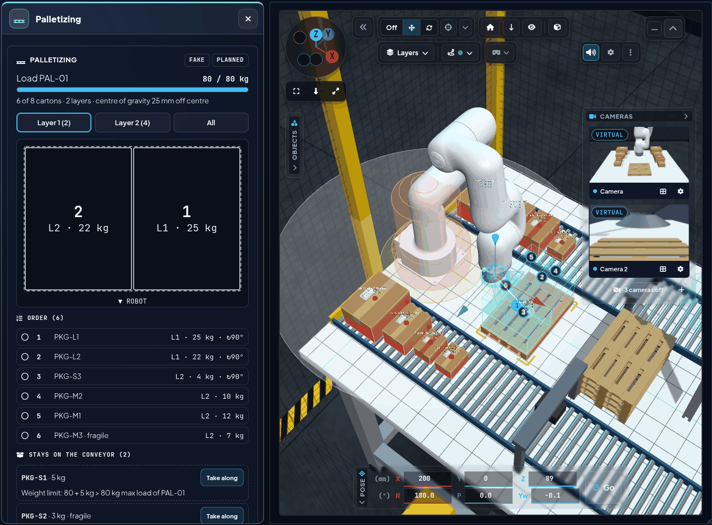

<a name="top"></a>

# 🤖 VLA-M: Vision-Language-Action-Chat

[🏠 Übersicht](../readme-de.html) · [🇬🇧 English](../en/vla.html) · Kapitel 4.3

---

## 4.3 VLA-M: Vision-Language-Action-Chat (In Arbeit)
KI-gestützte Ausführung von Aufgaben durch *Vision-Language-Action*-Modelle (VLA): Der Bediener tippt (später: spricht) eine Anweisung wie *„Nimm den roten Becher und leg ihn in die blaue Kiste“*. Ein VLA-Agent macht aus Szene, Roboterzustand und Anweisung einen Plan aus Roboter-Skills, führt ihn aus, nachdem der Bediener bestätigt hat (Human-in-the-Loop), und plant neu, wenn ein Schritt fehlschlägt; ein trainiertes VLA-Modell ist als zusätzlicher Skill geplant.

**Auf einen Blick:**

| | |
|---|---|
| **Wirkungsbereich (Skills)** | `pick` (Greifer auf → *Approach from above* mit Yaw-Suche → greifen → anheben → Greifprüfung) · `place` (auf / in / neben ein Objekt, an einen x/y-Punkt auf dem Tisch, `back` = zurück an den Ursprungsort) · `home` (Ausgangspose) · `gripper` (Greifer / Sauger auf oder zu, ohne Bewegung) · `palletize` (Auto-Palettieren, nur in der Szene *Logistik – automatisch palettieren*) · `tile` (Bodenfliesen legen, nur in der Szene *Bau – Fliesenlegen*, nur Robot | Digital Twin) |
| **Nicht abgedeckt** | Jogging, Servo / Gamepad, VR-Teleoperation; Drehen, Gießen, Schieben beantwortet der Agent mit dem, was er kann |
| **Einstiegswege** | Chat in der Section **VLA-M** (`/vla/instruction`, mit LLM) · Ein-Klick *Grasp* / *Place here* im Objektmenü bzw. in VR (`/vla/skill`, **ohne LLM**, gleiche Planprüfung) · Aufgaben-Fenster *Palettieren* (*Plan* / *Start*, `/vla/skill` `palletize`; im Chat startet „belade die Palette“ denselben Ablauf) · Aufgaben-Fenster *Fliesenlegen* (*Start* / *Nächste Fliese*, `/vla/skill` `tile`; nicht im Chat) |
| **Ablauf** | Plan → Planprüfung auf einer simulierten Szene → Selbstkorrektur (≤ 2 Runden) → Plan in der UI → *Execute* → Schritt für Schritt (`skills.py`); Fehler (`unreachable` / `collision` / `slipped`) → Rettungsplan oder Begründung |
| **Sicherheit** | Modell wählt nur Skill + Objekt, Posen rechnet der Code · jede Fahrt über den Motion Handler · Robot | Hardware ohne `allow_real_motion` nur Plan, jeder Plan wartet auf *Execute*, keine virtuellen Objekte · *Abort* stoppt nach dem laufenden Schritt, beim Palettieren sofort (`/ui/halt_motion`, E-STOP nicht verriegelt) · `dry_run:=true` bewegt nie |

**Stand (September 2026):**
- **UI:** Section **VLA-M** in der UX | Control Interface (früher „Robot Control UI“) (Port 8081, siehe [3.6](robot_control_ui.html#36-funktion-gui---grafische-robotersteuerung--visuelles-feedback)) und ihr großes Popup-Fenster: Chat, Liste *Planned actions* mit **Execute** / **Abort** und Schrittfortschritt, Mikrofon-Knopf (vorbereitet), Kamerawahl und **Confirm before execute**; **Model: Local strong | Local fast | Claude | Gemini** schaltet das Sprachmodell zur Laufzeit um (`/vla/llm`, Modelle aus `llm_local_model` (stark, `qwen3.8:27b`) / `llm_local_fast_model` (schnell, `qwen2.5:14b`; das vorige lokale Modell wird beim Umschalten entladen) / `llm_cloud_model` / `llm_google_model`; Claude braucht `python3 -m pip install --user anthropic` und einen Schlüssel von platform.claude.com in `ANTHROPIC_API_KEY` oder `~/.config/vla_bridge/anthropic_api_key`, Gemini Robotics-ER einen Schlüssel aus Google AI Studio in `GEMINI_API_KEY` oder `~/.config/vla_bridge/gemini_api_key`; die Schlüsseldatei greift auch beim Start aus der UX | Nexus Launcher, früher „Nexus Webapp“), der Chip im Kopf zeigt lokal oder Cloud und das Modell; noch nicht eingerichtete Modelle tragen ein Warndreieck (Tooltip und Klick zeigen Ursache + Lösung); Chips für Modell, Modus (Robot | Digital Twin / Robot | Hardware) und Szene (z. B. `8 objects · 8 virtual`); Backend-Karte mit Agent-Zustand (`ollama · ready`) und gehaltenem Objekt. *Clear* setzt auch das Gespräch des Agenten zurück.
- **Backend:** ROS-2-Paket `vla_bridge` – ein **VLA-Agent**. Ein Sprachmodell (lokal über Ollama, `qwen3.8:27b` auf der RTX A5000, offline; optional Claude über die Anthropic API) bekommt Anweisung, Szene (Objekte in `link_base`-mm), gehaltenes Objekt, Greifer und Modus und antwortet mit strukturiertem JSON: einer **Antwort**, einer **Rückfrage** oder einem **Plan** aus Skills (`pick`, `place` auf / in / neben / an eine Stelle / zurück, `home`, `gripper`).
  - Der Code **prüft jeden Plan**, bevor sich etwas bewegt (Objekte vorhanden, Greifer frei / belegt, Reichweite, freier Platz neben einem Ziel, Platz für den Greiferkörper neben hohen Objekten), und gibt Fehler an das Modell zurück, das den Plan korrigiert.
  - **Ausführung** wie *Approach from above* der UI: `/ui/approach_from_above` (kollisionsfrei auf eine Vorposition 70 mm über der Greifkugel, dann gerade nach unten, Kollision des Ziels freigegeben), Greifpose mit dem Saugnapf 2 mm über der Kugel (`cup_gap_mm`; mit dem Finger-Greifer-URDF fährt der TCP um die Differenz der Werkzeuglänge tiefer, `/ui/tcp_length_mm`); bei runden oder schräg liegenden Objekten wird der Greifer gedreht, bis eine kollisionsfreie Greifpose gefunden ist (Yaw-Suche). Ein Schritt ist erst fertig, wenn `/ui/moveit_motion_state` `succeeded` meldet.
  - **Greifprüfung** nach dem Anheben (Physik-Sandbox: `held` / `held_id` in `/ui/physics_sandbox_state` nach dem Anheben muss genau dieses Objekt sein; echte Objekte: die Greifkugel muss mit hochkommen). Umgekippte Objekte (Greiffläche > `max_grip_tilt_deg`, 20°) greift der Agent nicht; nach dem Greifen hebt er das Objekt über den höchsten Nachbarn (`transit_clearance_mm`) - Anheben und Wegfahren nach dem Ablegen gehen gerade nach oben (kollisionsgeprüfte gerade Bahn wie beim Absenken, ein geplanter freier Weg nur, wenn sie blockiert ist; so fährt jedes senkrechte MoveTo; wie beim Absenken wird die Kollision vor der Fahrt geprüft, während der Fahrt halten nur Stop / E-STOP den Arm an). Schlägt ein Schritt fehl, sieht der Agent Fehler und neue Szene und schlägt einen **Rettungsplan** vor (z. B. neu greifen, Objekt zurücklegen) oder erklärt, warum er aufgibt (`max_recoveries`: 2).
  - **Gemessen statt geschätzt:** `python3 tools/vla_eval.py` spielt 57 feste Anweisungen (einfach, Beziehungen, mehrere Schritte, Rückfrage, Antwort, Folgebefehl, Zustand, Neuplanung, Sitzung über mehrere Runden) gegen das echte Modell durch und meldet Trefferquote je Kategorie, LLM-Aufrufe und Dauer; jede Runde echter Sitzungen landet in `~/.ros/vla_logs` (`session_log`) und kann ein neuer Testfall werden (`--from-log`). Musterdialoge (`few_shot`), vorgerechnete Fakten in der Szenenbeschreibung (liegt auf / trägt / freie Seiten) und eine Planprüfung auf einer simulierten Szene lassen das lokale `qwen3.8:27b` zuverlässiger planen; mit `llm_escalate:=true` gehen Korrekturrunden und Rettungspläne an Claude.
  - Er merkt sich das Gespräch (*„und jetzt auf den Zylinder“*, Antworten auf seine Rückfragen) und versteht Deutsch und Englisch, z. B. *„Stapel den blauen Würfel auf den Zylinder und leg danach die Stahlkugel in den Korb“*, *"Put the rubber ball into the bowl"*, *„Nimm die Kugel“* → *„Welche Kugel – die silberne oder die orangene?“*, *„Was siehst du?“*.
  - `dry_run:=true`: nur Plan und Fortschritt, **der Roboter bewegt sich nie**.
- **Virtuelle Objekte:** Mit der Physik-Sandbox der UX | Control Interface (nur Robot | Digital Twin) greift, trägt und stapelt der Agent sie wirklich und legt sie in Schale und Korb (durchgängig in Robot | Digital Twin getestet).
- **Sicherheit:** Das Modell wählt nur Skills und Objekt-IDs – Posen kommen aus der Szene, jede Fahrt läuft durch den Motion Handler (IK, Kollisionsprüfung, Bodenschutz, E-STOP). Im Modus (Robot | Hardware, `ufactory_driver` läuft) werden Pläne nur mit `allow_real_motion:=true` ausgeführt (Standard: nur Plan), jeder Plan und jeder Rettungsplan wartet auf *Execute* (`real_require_confirm:=true`), und virtuelle Objekte werden nie angefahren (`allow_virtual_in_real:=false`). Der E-STOP bricht die Aufgabe ab, *Abort* stoppt nach dem laufenden Schritt. *Execute* in der UI läuft zusätzlich durch `motionAllowed` (E-STOP, Verbindung, Control-Lock).
- **Noch nicht:** ein trainiertes VLA-Modell (Demonstrationen lassen sich aufnehmen, siehe Roadmap Schritt 4); Reinforcement Learning in der Simulation ist geplant (Schritt 8).

### 🧠 Agentic ROS: der Agenten-Regelkreis
Das VLA-M-Backend ist ein **Agentic-ROS**-Node: Das Sprachmodell steuert den Roboter nicht direkt, sondern plant innerhalb eines geschlossenen Regelkreises aus ROS-Services und Prüfungen.

```
Anweisung ─► Plan (LLM: Skills + Objekt-IDs) ─► Prüfung (Code: Objekte, Greifer, Reichweite, freier Platz)
   ▲  ▲                     ▲   Fehler zurück ans LLM (max. 2×)    │ ok
   │  │                     └───────────────────────────────────────┤
   │  └─ Rückfrage (clarify) / nur Antwort                          ▼
   │                                          Bestätigen (Execute) ─► Ausführen über Motion Handler
   │                                                                   │ (IK, Kollisionsprüfung, Bodensperre, E-STOP) 
   └── Rettungsplan ◄── LLM sieht Fehler + neue Szene ◄── Greifprüfung ┘
```

- **Was das Modell entscheidet:** nur *welche* Skills mit *welchen* Objekten (greifen, ablegen auf / in / neben, Home, Greifer) – alle Posen berechnet der Code aus der Szene, jede Bewegung läuft durch die bestehende Sicherheitskette.
- **Werkzeuge = ROS-Schnittstellen:** Szene aus `/zed/bboxes_3d`, Bewegung über `/ui/approach_from_above` und den Motion Handler, Greifer über `/ui/gripper_cmd`, Greifprüfung über die Physik-Sandbox oder die Greifkugel.
- **Gedächtnis & Dialog:** Der Gesprächsverlauf bleibt erhalten (*„und jetzt auf den Zylinder“*), mehrdeutige Anweisungen führen zu einer Rückfrage, *Clear* (`/vla/reset`) setzt ihn zurück.
- **Offline zuerst:** lokales Modell über Ollama auf der GPU; Claude über die Anthropic-API optional.
  - **Lokales Modell:** `qwen3.8:27b` = Qwen 3.8 von Alibaba Cloud, 27 Mrd. Parameter (Q4_K_M), offene Gewichte unter der Lizenz Apache 2.0 (kommerziell nutzbar), Denkmodus aus (`think: false`); ~18 GB Download, ~16 GB Grafikspeicher.


*VLA-M-Popup im Modus (Robot | Digital Twin): Der Agent (`qwen3.8:27b`, Dry Run) hat „Stapel den blauen Würfel auf den Zylinder und leg danach die Stahlkugel in den Korb“ in vier Schritte geplant und wartet auf **Execute**.*


```bash
bash src/vla_bridge/scripts/install_ollama.sh        # einmalig je PC: Ollama (~/.local, ohne sudo) + qwen3.8:27b (~18 GB)
# fehlt es, warnen Check (Preflight) der UX | Nexus Launcher und die Setup-Karte (Log: "Ollama not found")
ros2 launch vla_bridge vla_bridge.launch.py          # Agent; startet `ollama serve` bei Bedarf selbst
# weitere Argumente: llm_backend (ollama | anthropic), llm_model, dry_run, allow_real_motion, real_require_confirm, config_file
# sie überschreiben src/vla_bridge/config/vla_bridge.yaml (Sprachmodell, Szenen-Topic, Sicherheit, Greifhöhen, Zeitgrenzen)
```

*UX | Nexus Launcher: **VLA-M Bridge** im RUN DEV SETUP und SERVER SETUP (eigene Kategorie *VLA-M (Vision-Language-Action)*, übersprungen bis angehakt; Parameter *LLM*, *Dry run*, *Robot | Hardware: execute plans*, *Robot | Hardware: always confirm*; *Recommended for Robot | Digital Twin / Robot | Hardware* setzt sie je Sequenz, Robot | Hardware = execute plans + always confirm an) sowie die Karte **VLA-M (Vision-Language-Action)** mit der Bridge, *Virtual objects ON* (`/ui/set_virtual_detections`) und *VLA-M status (live)*. Bedienung: [Handbuch](../operate_manual.html), Kapitel *Den Roboter per Chat anweisen*.*

**Topics** (`/vla/*` als `std_msgs/String` mit JSON; Details in der Paket-README):

| Topic | Richtung | Inhalt |
|---|---|---|
| `/vla/instruction` | UI → `vla_bridge` | `{id, text, camera, confirm, source}` - `source` = `voice` nach Diktat, sonst `chat` (nur fürs UX \| Monitoring) |
| `/vla/response` | `vla_bridge` → UI | `{id, text?, plan?, awaiting?, step?, total?, state?}` - `state` auch `clarify` (Rückfrage) und `replan` (Schritt fehlgeschlagen, Agent plant neu) |
| `/vla/status` | `vla_bridge` → UI (1 Hz) | `{state, model, llm, executes, pending, mode, sandbox, gripper, held, objects}` - die UI zeigt `OFFLINE` nach 3 s ohne Status |
| `/vla/execute` | UI → `vla_bridge` | `{id}` - gibt den wartenden Plan frei |
| `/vla/metrics` | `vla_bridge` → UX \| Monitoring | je LLM-Runde (`event: round` - task, attempt, backend, model, latency_s, errors, usage) und je Ausgang (`event: outcome` - state, text, note) mit der Auftrags-`id`; dasselbe wie das Sitzungsprotokoll `~/.ros/vla_logs`, ohne Anfrage-/Antworttext. Seite *VLA-M* im UX \| Monitoring ([Monitoring](monitoring.html)) |
| `/vla/abort` | UI → `vla_bridge` | `{id}` - stoppt die laufende Aufgabe |
| `/vla/reset` | UI → `vla_bridge` | `{}` - Gespräch vergessen (*Clear*) |
| `/vla/skill` | UI (Objektmenü) → `vla_bridge` | `{id, skill: pick\|place, object?, target?, relation?, side?, x_mm?, y_mm?, confirmed, source}` - *Grasp* / *Place here* mit einem Klick ohne Sprachmodell, gleiche Prüfungen und Skills, keine Neuplanung; Robot | Hardware nur mit `confirmed` |
| `/vla/skill` `{actions: [{skill: pick, object}, {skill: place, …}]}` | UI (Objektmenü *Pick & Place to …*) → `vla_bridge` | Pick + Place als EINE Aufgabe (höchstens 2 Aktionen, `MAX_DIRECT_ACTIONS`): eine Prüfung des ganzen Ablaufs, Fortschritt 1/2 → 2/2, ein Abort; Robot | Hardware nur mit `confirmed` |
| `/ui/emergency_stop_active` | → `vla_bridge` | `std_msgs/Bool` (latched) - der E-STOP bricht jede Aufgabe ab |
| `/zed/bboxes_3d` | YOLO / `virtual_object_detections` → `vla_bridge` | `visualization_msgs/MarkerArray` - die Szene (Label, Farbe, Greifkugel, Box) |
| `/ui/approach_from_above`, `/ui/execute_move_to_pose`, `/ui/execute_initial_pose`, `/ui/gripper_cmd` | `vla_bridge` → Motion-Stack | dieselben Services / dasselbe Topic wie die UI |
| `/ui/moveit_motion_state` | Motion Handler → `vla_bridge` | ein Fahrschritt ist bei `succeeded` fertig |
| `/ui/physics_sandbox_state` | UX \| Control Interface → `vla_bridge` | Sandbox an/aus und gehaltenes Objekt (`held`, `held_id`) - Greifprüfung |
| `/vla/skill` `{skill: palletize, mode: plan\|run, must?, limits?, dry_run?, confirmed?}` | UI (Fenster *Palettieren*) → `vla_bridge` | Auto-Palettieren: `plan` rechnet und meldet den Plan, `run` belädt die Palette Karton für Karton (`pallet_job.py`); `must` = bewusst mitgenommene Kartons (*Take along*); `limits` = eigene Grenzen `{max_load_kg, max_load_height_mm, min_support}` (`{}` = Szenen-Standard) |
| `/vla/pallet/plan` | `vla_bridge` → UI (latched) | `{task_id, state: idle\|planned\|running\|done\|aborted\|error, step, total, dry_run, message, loaded, ik, plan}` - Plan (`Plan.to_dict` mit Weltposen, `must`, `pallet_pose`) und Fortschritt |
| `/ui/virtual_objects` | `virtual_object_detections` → `vla_bridge` | latched Liste mit `meta` von Palette + Kartons - Eingabe des Palettier-Planers |
| `/ui/halt_motion` | `vla_bridge` → Motion Handler | `std_srvs/Trigger` - *Abort* beim Palettieren: hält die laufende Fahrt sofort an, **ohne** den E-STOP zu verriegeln |
| `/vla/skill` `{skill: tile, mode: plan\|run\|next\|auto\|pause\|resume\|reset, control_id?, auto?, dry_run?}` | UI (Fenster *Fliesenlegen*) → `vla_bridge` | Fliesenlegen: `plan` meldet den Verlegeplan (`tiling.py`), `run` legt den Boden (`tile_job.py`, nur Robot | Digital Twin, im Node geprüft), `next` = nächste Fliese im Einzelschritt, `auto` schaltet Automatik, `pause` / `resume` vor der nächsten Fliese, `reset` = von vorn; `run`, `next`, `resume`, `reset` und `auto` an nur mit der `control_id` des Browsers mit Steuerung (`/remote/control_state`), während eines Laufs nur der Starter |
| `/vla/tile/plan` | `vla_bridge` → UI (latched) | `{task_id, state: planned\|running\|done\|aborted\|error, message, plan, step, total, stop, stops, phase, held, auto, paused, waiting, lift, bed_since}` - Verlegeplan + Fortschritt (`step` = gelegte Fliesen, `phase` 0 = Fahrt, 1-6 = Schritt der Fliese) |
| `/mobile_base/goal`, `/mobile_base/stop`, `/mobile_base/keepout` | `vla_bridge` → `mobile_base_bridge` | `goal` = Fahrt zum nächsten Halt (mit der Lock-id der UI) · `stop` = Basis anhalten · `keepout` (latched `{rects: [[x0, y0, x1, y1]]}`) = gelegte Bodenfliesen als Sperrzone der Nav2-Karte |
| `/mobile_base/status`, `/mobile_base/moving` | `mobile_base_bridge` → `vla_bridge` (latched) | tatsächliche Pose der Basis nach der Ankunft; die nächste Armfahrt wartet, bis die Basis still steht |

**Auto-Palettieren (N57, Szene *Logistik – automatisch palettieren*):** Der Knopf *Auto palletizing* der Bereichs-Leiste schaltet die Szene und öffnet das Aufgaben-Fenster **Palettieren** der UX | Control Interface (`js/pallet.js`). **Plan** → `vla_bridge/palletizing.py` wählt die Kartons unter der 80-kg-Grenze (schwer und groß unten, nichts auf fragile) und zeigt Gewichtsbalken (`80 / 80 kg`), oben die Lagen-Knöpfe, darunter Seitenansicht des Stapels (vom Roboter aus, gewählte Lage kräftig, Nummern verdeckter Kartons im sichtbaren Teil) und Draufsicht je Lage (*All* = oberste Lage über der gedimmten Lage darunter mit `L1·n`), Roboter-Reihenfolge, *Stays on the conveyor* mit Grund (*Take along* plant mit diesem Karton neu) und durchsichtige **Ghost-Boxen** der geplanten Posen im Viewport (abschaltbar) mit Schritt-Nummer je Box und, mittig über der Palette knapp über ihrer max. Ladehöhe, dem Live-Ladegewicht `PAL-01 load · 51 / 80 kg` (Summe der schon abgelegten Kartons, `plan.pallet.max_top_z`). **Start** → je Karton *pick* (wie *Grasp*) → `place_at` auf die exakte Pose inkl. yaw (+90° bei gedrehten Kartons, Loslassen 3 mm darüber, `pallet_release_clearance_mm`) → Prüfung: der Karton muss bis 6 mm / 8° genau liegen (Pose über Physik-Sandbox → Virtual Objects → TF), sonst hält der Ablauf mit der Abweichung an. Robot | Digital Twin nur mit Physik-Sandbox (die Kartons sind Rapier-Körper; ohne sie lehnt `vla_bridge` ab, und der Hinweis *Grasp / Place not possible* bietet **Show setting** - öffnet *Viewport › Planning*, die Zeile *SIM physics* pulst - und **Start SIM physics**; *Start* bleibt ein eigener Klick, der Hinweis bleibt bis Klick, Esc oder Klick daneben); Robot | Hardware lehnt virtuelle Kartons ab (`allow_virtual_in_real`). **Dry run** prüft die Armposen (IK) ohne Bewegung. **Abort** hält sofort über `/ui/halt_motion` an (ein gehaltener Karton bleibt am Sauger, E-STOP nicht verriegelt). **Reset** legt Palette und Kartons zurück auf die Bänder. **Pallet & limits** (aufklappbarer Block oben, Zusammenfassung `EUR1 · 80 kg · 900 mm`, Badge *edited* bei eigenen Werten): Paletten-ID, Klasse, Maße, Szenen-Maßstab und Raster; einstellbar sind **max. Last** (1-500 kg), **max. Ladehöhe** (100-2000 mm) und **min. Auflage je Karton** (50-100 %) - *Apply & plan* plant damit neu, *Scene defaults* geht zurück; gesperrt, solange palettiert wird. Die Werte gelten pro Browser (`rcui_pallet_limits`), gehen mit jedem Plan / Start mit und werden beim (Neu-)Start von `vla_bridge` von selbst erneut gesendet (Hinweis im Block); Gewichtsbalken und Viewport-Label zeigen die eingestellte max. Last. Start lehnt eine nicht leere Palette ab. Im Chat plant „belade die Palette“ / „load the pallet“ den Skill `palletize` - derselbe Planer und Ablauf. Bänder und Zaun der Anlage sind MoveIt-Hindernisse, solange die Szene aktiv ist (`virtual_object_detections.py`, Objekte `cell_*`). Test: `tools/grasp_e2e.py --pallet` (Robot | Digital Twin, Domain 94).

**Palettenwechsel + Block *Cell & magazine*:** Jede volle Palette verlässt die Zelle: `pallet_job.py` meldet Zustand `changing` und `/vla/pallet/event` `{type: pallet_full}`, die startende UX | Control Interface (`js/pallet_flow.js`) fährt die Palette samt Ladung über den Auslauf hinaus, das Magazin gibt eine Leerpalette ab (der Pneumatik-Pusher taktet sie ein), die Kartons laufen auf den Bändern ein, danach `/vla/skill` palletize `mode: changed`. Mit **Endless cycle** startet der nächste Plan selbst, ohne meldet `vla_bridge` den Plan für die Leerpalette (*Start* sofort bereit). Bewegt werden nur Szenen-Objekte, nie der Roboter; ein Dry run ohne Endlos-Zyklus lässt die Palette stehen. Der Aufklappblock **Cell & magazine** im Fenster *Palettieren* (`js/pallet_cell.js`) zeigt den Magazin-Bestand (`4 / 5 empty pallets`, auch auf dem Infoscreen und als Stapel im Twin) und enthält *Endless cycle*, *Refill the magazine automatically when empty*, *Conveyor speed* (0,05–0,40 m/s), *Magazine capacity* (1–5), **Refill magazine** und **Simulate jam**. Magazin leer ohne Auto-Nachfüllen: der Wechsel wartet (Signalsäule gelb, Infoscreen `MAGAZINE EMPTY`, `mode: change_wait` verlängert die 90-s-Frist) bis *Refill magazine*, danach erneut *Start* (kein Selbststart nach dem Warten); ein E-STOP während des Wechsels beendet den Endlos-Zyklus ebenfalls; *Reset* füllt ebenfalls auf.

**Stationen der Zelle (N66, nur Darstellung + Ablauf, nichts greifbar):** Jedes Zuführband hat eine Kontrollwaage (x 0,88 m, die Anzeige zeigt das Gewicht jedes durchlaufenden Kartons) und einen NIO-Pusher (x 0,66 m) mit Rutsche und NIO-Kiste; hinter dem Zaun geht der Auslauf als gerade Linie bis x 2,84 m weiter mit Konturenkontrolle (Lichtvorhang-Portal), Stretchwickler, Etikettierer (Print & Apply, SSCC) und einem FTS (AMR), das die volle Palette wegfährt und leer zurückkommt. Volle Palette auf der Linie und NIO-Karton sind Kopien nur im Twin – Szenen-Objekte, MoveIt und `vla_bridge` bleiben unverändert. **Reject a carton** (und Zufall 10 % je Palettenwechsel) lässt einen Zusatz-Karton einlaufen, die Waage meldet NIO (Gewicht ≠ Etikett oder Etikett unlesbar), der Pusher schiebt ihn in die Kiste; der Infoscreen zählt NIO-Kartons mit Grund. **Simulate contour fault** stoppt die Linie, schaltet die Signalsäule rot (`CONTOUR FAULT`) und lässt den nächsten Palettenwechsel warten (`mode: change_wait`) bis **Acknowledge contour fault**. Der Infoscreen listet alle 13 Stationen in zwei Spalten.



*Bereichs-Leiste › Scene **Auto palletizing**: Fenster *Palettieren* (Beladung PAL-01 80 / 80 kg, Lagenplan, Reihenfolge mit sechs Paketen, Kartons, die mit *Take along* auf dem Band bleiben) und die Zelle im Viewport mit Förderband, Palette, nummerierten Ablageplätzen und dem Infoscreen `3d_virtual_infoscreen` an der Tischkante.*

**Fliesenlegen (N67, Szene *Bau – Fliesenlegen*, nur Robot | Digital Twin):** Bereichs-Leiste › Szene **Tiling** (*Construction – tiling*) schaltet die Szene (Lite 6 auf einem AMR mit Hubsäule in einer Halle 1:1, siehe [UX \| Control Interface](robot_control_ui.html)) und öffnet das Aufgaben-Fenster **Fliesenlegen** (*Tiling*, `js/tiling.js`); ist Robot | Hardware verbunden, ist die Szene gesperrt. Der Verlegeplan braucht keinen Knopf: `vla_bridge` meldet ihn beim Start latched auf `/vla/tile/plan`, das Fenster fordert ihn beim Wechsel in die Szene nach, falls keiner da ist (`/vla/skill` `tile` `plan`); `vla_bridge/tiling.py` plant, es fährt nichts: Bodenfliese 30 × 30 cm, Wandfliese 15 × 15 cm (nur Darstellung - der Lite 6 trägt 0,6 kg), Fuge 3 mm; Bodenfeld 2,4 × 1,8 m mit 30 ganzen Fliesen aus 18 Halten, Reihe für Reihe von der Laserlinie am hinteren Feldrand zum Tor; Randfliesen mit Schnitt werden nur markiert (*Schnitt – von Hand*), die setzt zuletzt ein Mensch. Halt = Pose der Basis (x, y, Hub), von der aus der Arm (Reichweite 440 mm) die meisten Fliesen am Stück legt. Der Aufklappblock *Fläche, Fliese & Plan* zeigt Bodenfeld, Fliesenformat und die Zähler *Roboter*, *Schnitt – von Hand*, *Außer Reichweite* und *Halte*. **Verlegen**: *Einzelschritt* (Standard, der Roboter wartet nach jeder Fliese auf **Nächste Fliese**) oder *Automatik* (Fliese um Fliese). **Start** (nach einem Abbruch **Weiterlegen**, ab der nächsten offenen Fliese) → je Halt: Arm in die Ausgangspose → gelegte Bodenfliesen werden Sperrzone → die Basis fährt über `mobile_base_bridge` zum Halt (Totmann + Control-Lock wie beim Fahren aus der UI) → je Fliese sechs Schritte *Zur Ablage* · *Aufnehmen* · *Anheben* · *Legen* · *Loslassen* · *Zurückziehen* (Fliese von der Ablage am Schlitten, gerade ins Kleberbett abgesenkt). Jedes Ziel geht vor dem Start und noch einmal direkt vor der Fahrt durch `/compute_ik`. Das Fenster zeigt `Halt k / n · Fliese t: Schritt i von m`, die sechs Schritte, *Kleber offen* (Zeit, seit das Kleberbett des Halts aufgezogen wurde) und *Magazin* (restliche Fliesen). **Pause** hält vor der nächsten Fliese, **Abbrechen** hält Arm und Basis sofort an (E-STOP bleibt davon unabhängig; eine Fliese am Sauger legt der nächste Start zuerst zurück auf die Ablage), **Zurücksetzen** beginnt von vorn und löscht die Sperrzone (nicht während Fliesenlegen läuft). Warum *Start* gesperrt ist, steht im Fenster: vla_bridge offline, kein Plan, Robot | Hardware, Szene nicht aktiv, kein rosbridge, E-STOP verriegelt, keine Steuerung (anfordern unter Remote-Teleop › Remote Control) oder eine andere Bewegung läuft. Nach *Start* lehnt `vla_bridge` mit Meldung im Fenster ab, wenn der Fingergreifer statt des Saugers geladen ist, die Basis (Robot | Digital Twin) nicht läuft oder nicht in der Fliesen-Halle steht, der Roboter belegt ist oder der Boden fertig ist. Im Chat wird Fliesenlegen nicht angeboten. MoveIt nutzt den Hallenboden als Bodenkollision (nur Robot | Digital Twin). Wand (Etappe 4): Fliesenspiegel aus 5 × 4 ganzen Wandfliesen 15 × 15 cm, mittig auf der DEMO-Wand ab der Startlatte nach oben, 20 Fliesen aus 4 Halten (2 Fahrten, die oberen Reihen fährt nur die Hubsäule an), von unten nach oben, jede entlang der Werkzeugachse angesetzt. Tests: `test_tiling.py`, `test_tile_job.py` (pytest von `vla_bridge`).

**Zielarchitektur:** Der VLA-Agent bleibt der Planer; ein trainiertes VLA-Modell wird einer seiner Skills (für Griffe und Bewegungen, die das geometrische Pick / Place nicht kann).
```
UX | Control Interface (VLA-M) --/vla/*--> vla_bridge: VLA-Agent (Plan, Prüfung, Recovery)
                                        |  Skills heute: pick / place / home / gripper (Motion Handler)
                                        |  VLA-Skill: Beobachtung ZED-Bild (+ Handgelenk-Kamera), /joint_states, Greifer
                                        v  gRPC / WebSocket
                          Policy-Server (LeRobot, eigene venv oder Docker, GPU)
                                        |  Aktions-Chunks: Gelenkziele 6 + Greifer, 10-30 Hz
                                        v
     vla_bridge -> Sicherheitskette (robot_limits, Floor Guard, teleop_pre_collision_checker)
                -> MoveIt Servo (/servo_server/delta_joint_cmds)
```

**Modellwahl** für den xArm Lite 6 mit einer RTX A5000 (24 GB VRAM). Alle Kandidaten gibt es in [LeRobot](https://github.com/huggingface/lerobot) - ein Datensatzformat, austauschbare Policies und ein Policy-Server:

| Modell | Größe | Rolle | Begründung |
|---|---|---|---|
| **SmolVLA** | ~450 M | erste Wahl | Lässt sich auf der A5000 nachtrainieren, schnelle Inferenz. Schwächer beim Sprachverständnis - davor sitzt ein Chat-Planer. |
| **π0.5** ([openpi](https://github.com/Physical-Intelligence/openpi)) | ~3 B | Ausbaustufe | Verallgemeinert besser auf neue Objekte und Anweisungen. Inferenz passt in 24 GB, LoRA-Nachtraining wird knapp. |
| OpenVLA | 7 B | nicht empfohlen | 2024, langsam. |
| GR00T N1.x | ~3 B | nicht empfohlen | Auf humanoide Roboter ausgerichtet. |

> [!IMPORTANT]
> Kein VLA arbeitet auf dem xArm Lite 6 mit unseren Kameras ohne Nachtraining zuverlässig. Einplanen: grob **50-200 Demonstrationen pro Aufgabe**. Das Werkzeug dafür ist die VR-Quest-3-Teleoperation ([3.5](vr_quest3.html#35-funktion-vr-quest-3-teleoperation)).

**Roadmap:**
1. ✅ UI-Section, Topic-Vertrag, Eintrag in der UX | Nexus Launcher.
2. ✅ VLA-Agent in `vla_bridge` (Ollama / Claude): Planprüfung mit Selbstkorrektur, sauberes Greifen über *Approach from above* mit Yaw-Suche, Greifprüfung, Rettungspläne, Rückfragen, Gesprächsverlauf; durchgängig mit virtuellen Objekten und der Physik-Sandbox getestet. Ersetzt die früheren regelbasierten Policies `mock` / `skills` (`dry_run:=true` statt `mock`).
3. ✅ Spracheingabe: Mikrofon-Knopf der VLA-M-Section → Whisper auf dem Roboter-PC (Diktat, keine Sprachbefehle) → Eingabefeld.
4. ✅ **Demonstrationen aufnehmen** (*Record demo* in der VLA-M-Section, Node `demo_recorder` in `robot_blackbox_recorder`, startet mit der Karte UX | Control Interface, `demo_recorder:=false` schaltet ab): Aufgabe ins Eingabefeld tippen, *Record demo* drücken, Aufgabe per VR, Gamepad oder UI ausführen, dann *Save* oder *Discard*. Je Episode liegen in `~/.local/share/vla_demos/<Datensatz>/episode_NNNNNN/` `meta.json` (Aufgabe, fps, Modus, Erfolg), `data.npz` (`observation.state` = joint1..6 + Greifer, `action` = nächster Zustand, Servo-Twist) und je Kamera ein MP4 (`demo_cameras`, Standard ZED-RGB und `/twin/vcam/*/image/compressed`: im Robot | Digital Twin wird eine virtuelle Kamera des Twins mit Chip *ROS* wie eine Kamera aufgenommen, siehe [UX | Control Interface](robot_control_ui.html); `meta.json` kennzeichnet `image_source` `sim`/`real`/`mixed`). `tools/demos_to_lerobot.py` macht daraus im LeRobot-venv ein LeRobotDataset (`--check` prüft ohne LeRobot). Ende zu Ende im Robot | Digital Twin getestet (`tools/grasp_e2e.py`; mit Twin-Kamera: 3 Episoden + `--check`); die Umwandlung selbst braucht das LeRobot-venv und lief hier noch nicht.
5. SmolVLA auf eine Aufgabe nachtrainieren (z.B. Becher in die Kiste). Das Modell läuft in einer **eigenen venv oder einem Docker-Container**, nie im colcon-Python - so kommen torch / numpy nicht mit ZED, YOLO und ROS Humble in Konflikt.
6. VLA als Skill des Agenten: `vla_bridge` wird Client des Policy-Servers. Aktionen laufen durch die vorhandene Sicherheitskette; liefert der Server länger als ~200 ms nichts, bleibt der Arm stehen. Modus (Robot | Hardware): reduzierte Geschwindigkeit und Steuerung nur mit dem Control-Lock des `remote_control_watchdog` ([7.5](running.html#75-remote-control-server-client-kommunikation)). Zuerst im Modus (Robot | Digital Twin) testen.
7. π0.5, falls SmolVLA nicht gut genug verallgemeinert.
8. **Reinforcement Learning (geplant):** die nachtrainierte Policy in der Simulation nachschärfen (Physik-Sandbox des Robot | Digital Twin oder paralleler Simulator wie MuJoCo / Isaac Lab). Belohnung: Objekt nach dem Anheben gehalten und am Ziel abgelegt; Abzug für Kollision, Abbruch im Motion Handler und Zeit. Ausprobieren nur in der Simulation, nie im Modus (Robot | Hardware); die verbesserte Policy läuft danach durch dieselbe Sicherheitskette.

---

[⬅ Zurück: Digital Twin in NVIDIA Isaac Sim](isaac_sim.html) · [🏠 Übersicht](../readme-de.html) · [⬆ Nach oben](#top) · [Weiter: UX | Monitoring ➡](monitoring.html)
