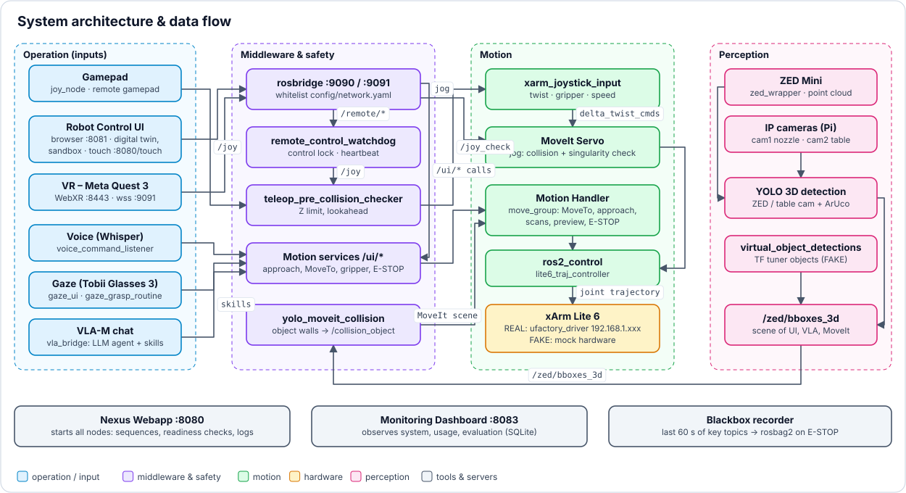
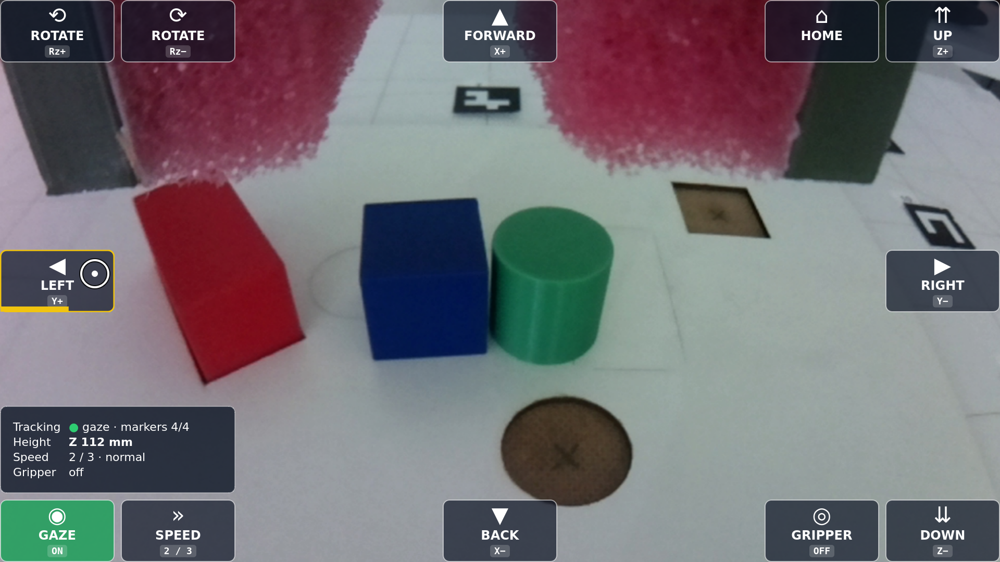

# 🔬 Concept & Architecture

[🏠 Overview](../readme-en.html) · [🇩🇪 Deutsch](../de/concept.html) · Chapter 1, 2, 4

**Contents:** 1. 📋 Project Overview · 2. 🔬 Architecture & Guiding Principles · 4. 🕹️ Multimodal Technologies & Interaction Concepts

---

## 1. 📋 Project Overview

### 🎯 Concept: An Integrated, Multimodal Teleoperation Platform
A modular control and interaction platform for the UFactory xArm Lite 6. It brings heterogeneous input methods together in one software environment with a consistent focus on usability: the system computes complex robot motion in the background, so the interface can translate the user's intention directly into robot actions.

### 💡 Motivation: Assistance, Inclusion and Participation (Industry 5.0)
Classic teleoperation is error-prone and demands fine motor control and expert knowledge – barriers that exclude many people. In line with Industry 5.0, which puts people, sustainability and resilience at the centre of production, the project aims at:

- **Lower technical barriers:** from low-level joint coordination to intuitive high-level commands.
- **Inclusion:** productive, equal participation at work – also for people with different physical or cognitive abilities.
- **Human-machine synergy:** the robot as an assistive tool that relieves people instead of replacing them.

### ⚙️ Operating Principle: Shared Control & Human-in-the-Loop
Human and machine act cooperatively. The user stays in the control loop as supervisor (*human-in-the-loop*) and works on three complementary levels:

- **High-level commands:** start actions or set targets via natural modalities such as gaze or voice.
- **Low-level corrections:** switch without delay to manual devices (gamepad / MoveIt Servo) for fine adjustments.
- **Context-sensitive assistance:** collision-free path planning in the background protects the operator during execution.

### 🏆 Objective: A Valid, Cost-Effective Proof of Concept
A fully functional, reproducible and affordable proof of concept for research and practical inclusion projects – an open evaluation platform on which new assistive robotics systems are developed, tested and validated empirically under realistic conditions.

### 📊 Evaluation Logic: From Research to Industrial Practice
Beyond being a demonstrator, the system produces transferable knowledge about interaction quality:

- **Evaluation logic:** systematic measurement of usability, cognitive load and system performance.
- **Recommendations:** standardized guidelines that help companies introduce modern robot systems.
- **Transformation question:** *"How can processes and workplaces be designed to measurably meet the human-centred requirements of Industry 5.0?"*
- **Service potential:** the frameworks and guidelines can become a validated consulting offer for industry in times of digital and demographic change.

## 2. 🔬 Architecture & Guiding Principles

### 🗺️ System Architecture & Data Flow

*System architecture and data flow · source: `tools/make_diagrams.py`*

### 2.1 The System Concept: An Integrated Development, Evaluation and Validation Platform
A modular software architecture for multimodal teleoperation and AI-assisted robotics. As an integration layer (middleware level) it unifies heterogeneous subsystems in one runtime environment. With a distributed server/client setup and a real-time **Digital Twin** (WebGL in the Robot Control UI, optionally NVIDIA Isaac Sim) it serves as development environment and as reproducible test environment – a closed loop of development and empirical validation:

- **Sensors & perception:** depth cameras (YOLO object detection, marker tracking) and tactile or physiological sensors for state estimation.
- **Multimodal control:** eye tracking for target selection, voice control (OpenAI Whisper) and classic controllers (gamepads, 3D mice) in parallel.
- **Cognitive robotics:** Vision-Language-Action (VLA) models that turn abstract verbal and visual commands into robot action sequences.
- **Integrated data acquisition:** time-synchronous logging of technical performance data and human interaction data.

### 🧊 Digital Twin: First Virtual, Then Real
The **Digital Twin** is the live 3D model of the xArm Lite 6 and its workcell. It is the common picture for human, planner and AI: every motion appears in the Digital Twin before and while it happens.

- **What it is:** WebGL model (three.js + URDF of the xArm Lite 6) in the Robot Control UI (port 8081), runs in any browser, offline-capable.
- **Live mirror:** follows `/joint_states` and the linear axis in real time – in FAKE mode the simulated arm, in REAL mode the physical arm.
- **Workcell in the Digital Twin:** table, lab room, safety zones, camera stand, detected objects as 3D boxes with grasp spheres (`/zed/bboxes_3d`), virtual objects and scenes (Standard, Auto palletizing).
- **Plan in the Digital Twin:** drag the target with the TCP gizmo → MoveIt plans → ghost preview of the path (`/ui/moveto_preview_path`) → human confirms → only then the arm moves.
- **Act in the Digital Twin:** click an object → *Grasp*; click the table → *Place here*.
- **Test in the Digital Twin:** FAKE mode + virtual objects + physics sandbox → new functions are tried without risk, then run on the real arm with the same UI.
- **See from any angle:** up to 4 virtual cameras = own views of the Digital Twin, used like real camera tiles.
- **Immersive:** the same Digital Twin in the Meta Quest 3 (WebXR) for VR teleoperation.
- **High-fidelity:** NVIDIA Isaac Sim runs optionally as a passive shadow Digital Twin ([Isaac Sim](isaac_sim.html)).
- **Why it matters:** transparency (no black box), safety (preview before execution), lower barrier for novices, reproducible tests and studies.

### 🧑‍💻 Human-Centred Automation
The operator is at the centre of the interaction design: the state of automation stays understandable and the next system action predictable – no black box.

- **Cognitive transparency:** system states stay comprehensible, also while gaze patterns and sensor feedback are processed in parallel.
- **Informed intervention:** the operator can step in safely and precisely in critical or unforeseen situations.
- **Calibrated trust:** a reliable basis for building *trust in automation*, evaluated in user studies.

### 🤝 Shared Control & Cognitive Relief
Control authority moves with low latency between manual guidance, gaze interaction and AI-assisted, semi-automated functions:

- **Seamless handover:** between manual input (MoveIt Servo / gamepad) and autonomous actions (e.g. gaze-based grasping).
- **Less mental workload:** during complex or long manipulation tasks.
- **Automatic error compensation:** the system takes over error-prone low-level corrections and frees attention for supervising the process.
- **Empirical validation:** the actual relief is measured throughout the project with standardized psychometric methods.

### 📈 HCI, Usability & Empirical Evaluation
The GUI follows established HCI principles: instead of coordinating single degrees of freedom or starting terminal processes by hand, users complete tasks by intention. Systematic user studies evaluate the interfaces:

- **Intention-based control:** abstract intents (voice, gaze target, high-level controller) become precise trajectories.
- **Usability metrics:** subjective usability via the *System Usability Scale* (SUS).
- **Performance parameters:** *task completion time*, error rates and gaze paths.
- **Load analysis:** cognitive load via the *NASA-TLX* for iterative optimization.

### 🔓 Reproducible & Open Source
The open code base makes all algorithms, configurations and data flows methodologically transparent:

- **Transparency:** all algorithms, URDF models and MoveIt configurations are visible.
- **Replication:** independent groups can repeat studies under identical conditions.
- **Verifiability:** recorded sensor data and control inputs can be traced and validated.
- **Benchmark:** a reliable baseline for comparative studies in assistive and inclusive robotics.

### 💶 Cost-Effective Hardware
Mostly affordable off-the-shelf components (COTS) – without sacrificing precision or reliability:

- **Wider access:** lower investment barriers for multimodal robotics.
- **Transfer:** into inclusion projects, schools and smaller research labs (e.g. via the xArm Lite 6 and consumer controllers).
- **Reliability check:** scientific comparison of low-cost hardware with expensive industrial systems.

### 🧩 Modular & Industry Standard
Fully integrated into ROS 2 Humble; standard communication primitives keep the platform interoperable with industrial ecosystems:

- **Native ROS 2:** nodes, topics, services and actions – compatible with MoveIt 2 and current sensor SDKs.
- **Encapsulated subsystems:** modules such as VLA pipelines or eye-tracking drivers can be replaced or extended on their own.
- **Portability:** easy migration to future ROS 2 LTS distributions.

## 4. 🕹️ Multimodal Technologies & Interaction Concepts

### 4.1 Robot Control Methods (Inputs)
- **Gamepad:** low-latency, continuous fine control with an Xbox One Elite Series 2 controller, including haptic feedback (vibration on collision risk) → [Modes & gamepad](teleoperation.html).
- **VR (Meta Quest 3):** immersive 6-DoF Cartesian control with the Quest 3 controllers via WebXR and ADB tunnelling → [VR teleoperation](vr_quest3.html).
- **Web UI:** mouse or touch in the Robot Control UI – on the robot PC, from a laptop or tablet in the home network, or on the Touch Panel → [Robot Control UI](robot_control_ui.html).
- **Voice & gaze:** Whisper voice commands and Tobii eye tracking → [Voice & gaze](voice_gaze.html).
- **VLA chat:** instructions in plain language → [VLA-M](vla.html).

### 4.2 Perception & Assistance
- **Computer vision:** 2D object detection with *YOLO* on the Raspberry Pi IP camera plus ArUco homography (`zed_m:=false ip_cams:=true`, `yolo_3d_bbox_for_ip_cam.py`) – the lightweight alternative without a ZED. The ZED Mini (default) detects natively in 3D.
- **Stereo vision:** true 3D depth data from a *ZED Mini* (Stereolabs), mounted **stationary** (tripod) or **on the end effector**.

### 4.4 User Interfaces (UI/GUI)
A central user interface bundles all system states to relieve the operator:

- **Telemetry & status:** real-time telemetry of the robot arm.
- **System feedback & intent recognition:** visual and acoustic feedback for manual inputs and recognized voice commands.
- **Preventive collision warnings:** as soon as a software safety measure triggers (e.g. the Z limit).
- **Visual monitoring & object detection:** video streams with live overlays of detected objects (YOLO boxes) and a synchronized 3D **Digital Twin**.
- **OBS Studio:** combines all components into one GUI for teleoperation.

**Gaze Control User Interface** ([details](voice_gaze.html))

- **Safety boundary:** soft-landing brake zone from Z = 40.0 mm (quadratic slowdown), hard stop for downward motion at Z = 33.0 mm.
- **Layout:** gaze direction = motion direction; all buttons flush with the screen edge, centre free for the scene.
- **Speed levels:** slow / normal / fast = 50 / 100 / 150 % of the previous speed, switched by looking at SPEED; DOWN never faster than normal.
- **Gaze-loss stop:** no gaze data for > 300 ms → motion stops; status card shows tracking, Z height, speed, gripper.
- **Vacuum gripper:** one toggle button (GRIPPER) via the `VacuumGripperCtrl` service.

---

[🏠 Overview](../readme-en.html) · ⬆ Top · [Next: Installation & Requirements ➡](installation.html)
