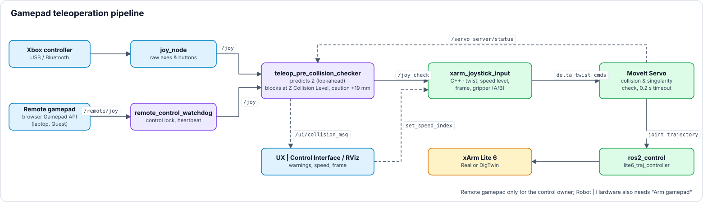

<a name="top"></a>

# 🎮 Operating Modes & Gamepad Teleoperation

[🏠 Overview](../readme-en.html) · [🇩🇪 Deutsch](../de/teleoperation.html) · Chapter 3.1, 3.2, 5

**Contents:** [3.1 Operating Modes: FAKE vs. REAL (Hardware Interfaces)](#31-operating-modes-fake-vs-real-hardware-interfaces) · [3.2 Feature: Gamepad Teleoperation & Hard Collision Protection](#32-feature-gamepad-teleoperation--hard-collision-protection) · [5. 🎮 Gamepad Control — Deep Dive](#5--gamepad-control--deep-dive)

---

## 3.1 Operating Modes: FAKE vs. REAL (Hardware Interfaces)
The platform strictly distinguishes between two operating modes for the robot arm. This distinction refers **exclusively to the `ros2_control` hardware interface** and is independent of sensors (like the camera or YOLO, which can run live in both modes):

-blue?style=for-the-badge)<br>
The robot runs via the `mock_components/GenericSystem` (or FakeSystem) hardware interface within `ros2_control`. There is no physical controller connection. Commands to the `/lite6_traj_controller` or `/servo_server` are purely virtually rendered in RViz2 by mirroring the joint states. Proprietary UFactory API calls (like Mode/State switches) intentionally lead nowhere in this mode or are bypassed in software.

-red?style=for-the-badge)<br>
The `ros2_control` framework integrates the real `xarm_api` hardware interface, which communicates directly via TCP/IP with the physical controller of the xArm Lite 6. In this mode, hardware limits, physical safety stops, and the exclusive switching of proprietary xArm hardware modes (e.g., Mode 0 for pose control vs. Mode 1 for Servo/jogging) take effect via the UFactory API.

> [!NOTE]
> **Virtual Linear Axis (Simulation Only):** In FAKE mode, it is possible to mount the robot on a virtual linear axis without affecting the MoveIt planning group (`lite6`).
> - **Activation:** With `attach_to:=linear_axis_link` the FAKE launch (`lite6_moveit_servo_fake.launch.py`) starts the `fake_linear_axis` node by itself. **RUN DEV SETUP (FAKE)** passes this argument; when starting manually, append it to the launch command.
> - **Control:** The GUI slider in the Web UI (Port 8081) or gamepad D-Pad (Left/Right) controls the horizontal translation by publishing `/linear_axis_cmd`. The headless node `fake_linear_axis` (`ros2 run fake_linear_axis fake_linear_axis`) translates this into the dynamic TF and visual rail markers.
> - **MoveIt Architecture:** The axis is shifted purely via dynamic TF (`world` -> `linear_axis_link`), completely decoupled from the URDF joints. This ensures MoveIt automatically recognizes the new base pose for planning/collision detection without needing a 7-DoF IK solver.
> - **URDF Modification:** To prevent parsing errors with dynamic `attach_to` arguments, `xarm_description/urdf/xarm_device_macro.xacro` was modified. The `create_attach_link` condition now generates a root link for *any* custom `attach_to` string, rather than being hardcoded to only `"world"`.

<br>

### 3.1.1 📊 Simulation (FAKE) vs. Real Hardware (REAL) Matrix
The table below illustrates which project modules can be evaluated in pure software simulation on a standard PC versus which features require physical hardware devices:

<details>
<summary><b>🔽 Show table</b> · 16 subsystems · FAKE vs. REAL · required hardware</summary>

| Feature / Subsystem | Pure Simulation (FAKE) | Real Hardware (REAL) | Required Hardware / Peripheral |
|---|:---:|:---:|---|
| **Robot Control UI (Port 8081)** | ✅ Functional (RViz Mirror) | ✅ Functional (Hardware Motion) | Host PC & Web Browser |
| **Physics Sandbox (virtual grasping)** | ✅ Functional | ➖ Simulation Only | Host PC |
| **Remote Control (client / server)** | ✅ Functional | ✅ Functional (stricter limits) | Laptop, tablet or Quest 3 in the home network |
| **Touch Panel (`/touch`)** | ✅ Functional | ✅ Functional | Extra touch display (USB + HDMI) |
| **Monitoring Dashboard (Port 8083)** | ✅ Functional | ✅ Functional | Host PC & Web Browser |
| **MoveIt 2 Cartesian Path Planning & IK** | ✅ Functional | ✅ Functional | Host PC |
| **Virtual Linear Rail Axis** | ✅ Functional | ➖ Simulation Only | Host PC |
| **Gamepad Teleoperation (MoveIt Servo)** | ✅ Functional | ✅ Functional | Xbox One / Series Controller |
| **Predictive Hard Collision Guard** | ✅ Functional | ✅ Functional | Host PC |
| **Acoustic Speech Interaction (Whisper AI)** | ✅ Functional | ✅ Functional | Standard USB / Laptop Microphone |
| **VLA-M Chat (Vision-Language-Action)** | 🧪 LLM agent plans and moves the arm (pick & place, also virtual objects with the physics sandbox) | 🧪 Plan only (execution with `allow_real_motion:=true`) | Host PC, NVIDIA GPU for the local language model (Ollama, ~10 GB VRAM) |
| **3D YOLO Object Detection & Clustering** | ❌ *(or via Rosbag replay)* | ✅ Functional | Stereolabs ZED Mini (USB 3.0) |
| **Dynamic MoveIt Collision Objects** | ❌ *(or via Rosbag replay)* | ✅ Functional | Stereolabs ZED Mini (USB 3.0) |
| **Autonomous 3D Grasp Routine** | ❌ *(Needs 3D Camera)* | ✅ Functional | xArm Lite 6 & ZED Mini |
| **Tobii Eye-Tracking Interaction** | ❌ *(Needs Glasses)* | ✅ Functional | Tobii Pro Glasses 3 (Wi-Fi / LAN) |
| **Meta Quest 3 WebXR Teleoperation** | ❌ *(Needs VR Headset)* | ✅ Functional | Meta Quest 3 (Wi-Fi, Port 8443) |

</details>

---
<br>


## 3.2 Feature: Gamepad Teleoperation & Hard Collision Protection
*This subsystem manages the manual jogging of the robot via the Xbox controller and actively prevents the robot from colliding with the workspace surface due to operator error.*

---

<br>

###  `xarm_joystick_input.cpp` &nbsp;&nbsp; <sub><i>`/src/xarm_ros2/xarm_moveit_servo/src/xarm_joystick_input.cpp`</i></sub>

**Purpose & Task:** Translates the sanitized gamepad signals (analog sticks & triggers) into Cartesian velocity commands (`TwistStamped`) for MoveIt Servo. Applies exponential smoothing and handles all button mappings.

<details>
<summary><b>🔽 Show details</b> · Run Command · Subscribes · Publishes · TF2 · Services · Action Client</summary>

> [!NOTE]
> 💻 **Run Command:**
> ```bash
> # Real Hardware MoveIt Servo (with vacuum gripper & 3D scene objects):
> ros2 launch xarm_moveit_servo lite6_moveit_servo_realmove.launch.py robot_ip:=192.168.1.xxx add_vacuum_gripper:=true report_type:=dev static_objects:=true
>
> # Simulation / Fake Hardware (with virtual linear axis & 3D scene objects):
> ros2 launch xarm_moveit_servo lite6_moveit_servo_fake.launch.py add_vacuum_gripper:=true attach_to:=linear_axis_link static_objects:=true
> ```
> *`rviz:=false` starts MoveIt Servo without the RViz window (default `true`; in the Nexus Webapp as the `rviz:=true` checkbox on the servo action card).*
> *Further arguments of both launch files: `joystick_and_checker:=false` starts neither `joy_node` nor `teleop_pre_collision_checker` (used by the server sequences, where the gamepad sits on the client PC); `floor_collision:=false` skips `moveit_floor_collision`. Both launches also include `standalone_move_group.launch.py`.*
> *(Loaded natively as Component inside the MoveIt Servo bringup)*
>
>
> **🎮 Controller Mapping (Quick Reference):**
>> | Input | Action | Details |
>> | :--- | :--- | :--- |
>> | **Left Stick** (↕️/↔️) | **Translate (X / Y)** | *Moves the robot forward/backward (X) and left/right (Y)* |
>> | **LT / RT** (Triggers) | **Translate (Z)** | *Moves the robot arm up (LT) and down (RT)* |
>> | **LB / RB** (Bumpers) | **Rotate (Yaw)** | *Rotates the end effector around its vertical axis* |
>> | **D-Pad** (↕️) | **Speed Control** | *Cycles through 5 speed levels* |
>> | **D-Pad** (↔️) | **Linear Axis** | *Moves the robot along the rail (Base Y-Shift)* |
>> | **START / BACK** | **Reference Frame** | *Toggles between base (`link_base`) and tool coordinates (`link_tcp`)* |
>> | **Button A** (🟢) | **Gripper Open / Close or Vacuum On / Off** | *Depends on the launch argument: `add_gripper:=true` toggles the Lite 6 gripper open/closed, `add_vacuum_gripper:=true` toggles the vacuum on/off. Without either (`gripper_type: none`) the button does nothing.* |
>> | **Button B** (🔴) | **Gripper Off** | *Lite 6 gripper: stops immediately and releases the holding force. Vacuum: switches off.* |
>> | **Button X** (🔵) | **Microphone (Voice)** | *Starts/Stops recording for Whisper AI* |
>> | **Button Y** (🟡) | **Initial Pose** | *Moves the robot to the safe home position* |
>
>
> 
>
>> | Topic / Interface | Msg Type | Description |
>> |---|---|---|
>> | **`/joy_check`** | `sensor_msgs/Joy` | *Reads the sanitized controller inputs from the guardian node.* |
>> | **`/ui/robot_control/set_speed_index`** | `std_msgs/Int32` | *Receives speed setting adjustments from UI or gamepad.* |
>> | **`/ui/gripper_cmd`** | `std_msgs/String` | *Gripper command from the Robot Control UI (`open` / `close` / `off` / `toggle`) - runs through the same logic as buttons A/B.* |
>
>
> 
>
>> | Topic / Interface | Msg Type | Description |
>> |---|---|---|
>> | **`/servo_server/delta_twist_cmds`** | `geometry_msgs/TwistStamped` | *Sends Cartesian velocity commands to the Servo Server.* |
>> | **`/ui/eef_position`** | `std_msgs/Float32MultiArray` | *Publishes the live end-effector pose at 10 Hz for the Web UI: `[x, y, z]` in mm plus the orientation quaternion `[qx, qy, qz, qw]` (`link_base` ➔ `link_tcp`).* |
>> | **`/ui/robot_control/current_speed`** | `std_msgs/Float32` | *Publishes the current speed factor for the UI.* |
>> | **`/ui/joy_button_presses`** | `std_msgs/String` | *Publishes human-readable UI button events from gamepad.* |
>> | **`/ui/gripper_state`** | `std_msgs/String` (latched) | *Gripper state (`open` / `closed` / `off`) - keeps the gamepad toggle and the UI buttons in sync.* |
>> | **`/ui/gripper_type`** | `std_msgs/String` (latched) | *Configured gripper (`vacuum` / `gripper` / `none`) from the launch argument.* |
>> | **`/ui/robot_control/current_frame`** | `std_msgs/String` | *Publishes the current reference frame (e.g. World, TCP).* |
>> | **`/linear_axis_cmd`** | `std_msgs/Float64` | *Publishes the command to move the linear axis.* |
>
>
> 
>
>> | Frame / Transformation | Description |
>> |---|---|
>> | **`link_base` ➔ `link_tcp`** | *Listens to the current TCP position for live telemetry computation.* |
>
>
> 
>
>> | Topic / Interface | Msg Type | Description |
>> |---|---|---|
>> | **`/servo_server/start_servo`** | `std_srvs/srv/Trigger` (Client) | *Starts the MoveIt Servo engine on bringup.* |
>> | **`/servo_server/stop_servo`** | `std_srvs/srv/Trigger` (Client) | *Safely stops the MoveIt Servo engine.* |
>> | **`/ufactory/set_vacuum_gripper`** | `xarm_msgs/srv/VacuumGripperCtrl` (Client) | *Vacuum on/off (Button A, Button B = off) with `add_vacuum_gripper:=true`.* |
>> | **`/ufactory/open_lite6_gripper`** | `xarm_msgs/srv/Call` (Client) | *Opens the Lite 6 gripper (Button A, with `add_gripper:=true`).* |
>> | **`/ufactory/close_lite6_gripper`** | `xarm_msgs/srv/Call` (Client) | *Closes the Lite 6 gripper (Button A, with `add_gripper:=true`).* |
>> | **`/ufactory/stop_lite6_gripper`** | `xarm_msgs/srv/Call` (Client) | *Stops the Lite 6 gripper immediately, releasing the holding force (Button B, with `add_gripper:=true`).* |
>> | **`/ufactory/get_position`** | `xarm_msgs/srv/GetFloat32List` (Client) | *Queries the current Cartesian controller position from the xArm driver.* |
>> | **`/ui/execute_initial_pose`** | `std_srvs/srv/Trigger` (Client) | *Triggers initial/home pose sequence via central motion handler (Button Y).* |
>
>
> 
>
>> | Topic / Interface | Msg Type | Description |
>> |---|---|---|
>> | **`/whisper/inference`** | `whisper_idl/action/Inference` | *Starts/cancels Whisper AI speech recognition on button press (Button X).* |

</details>

---

<br>

###  `teleop_pre_collision_checker.py` (`teleop_pre_collision_checker`) &nbsp;&nbsp; <sub><i>`/src/teleop_pre_collision_checker/teleop_pre_collision_checker/teleop_pre_collision_checker.py`</i></sub>

**Purpose & Task:** Acts as a transparent guardian *before* movement execution. Predictively computes the future Z-coordinate (0.1 sec lookahead). If the robot would violate the safety barrier ($Z \le 91.0\text{ mm}$), the downward command is hard-overridden and zeroed out. Triggers gamepad rumble feedback (vibration via `pygame`) on collision risk.

<details>
<summary><b>🔽 Show details</b> · Run Command · Subscribes · Publishes · Parameters</summary>

> [!NOTE]
> 💻 **Run Command:**
> ```bash
> ros2 run teleop_pre_collision_checker teleop_pre_collision_checker
> ```
>
>
> 
>
>> | Topic / Interface | Msg Type | Description |
>> |---|---|---|
>> | **`/joy`** | `sensor_msgs/Joy` | *Raw gamepad inputs from `joy_node`.* |
>> | **`/servo_server/status`** | `std_msgs/Int8` | *MoveIt Servo warning codes (approaching/halt collision/singularity).* |
>> | **`/ui/eef_position`** | `std_msgs/Float32MultiArray` | *Live end-effector pose for real-time Z-height checking.* |
>> | **`/ui/robot_control/current_speed`** | `std_msgs/Float32` | *Current velocity scaling factor for accurate lookahead prediction.* |
>> | **`/ui/moveit_collision_ground_enabled`** | `std_msgs/Bool` (latched) | *Follows the ground collision switch of the Robot Control UI: when it is OFF, downward motion is no longer blocked. Without a message (node not running) the block stays active.* |
>
>
> 
>
>> | Topic / Interface | Msg Type | Description |
>> |---|---|---|
>> | **`/joy_check`** | `sensor_msgs/Joy` | *Sanitized gamepad signal forwarded to `xarm_joystick_input`.* |
>> | **`/ui/collision_msg`** | `std_msgs/String` | *Publishes collision warnings to RViz overlay and Web UI.* |
>
> *The haptic rumble feedback of the Xbox controller is not sent over ROS but triggered directly on the joystick device via `pygame` (`joystick.rumble(...)`).*
>
> *Browser-side feedback in the Robot Control UI (port 8081), only while this client holds the control lock (`hasControlLock()` in `js/remote.js`):*
> - *`js/gamepad.js`: gamepad connected to the browser rumbles (Gamepad API `vibrationActuator.playEffect('dual-rumble')`) while the robot moves within 20 mm of the Z Collision Level, within 20 mm of the unreachable zone around the axis, within 30 mm of the 440 mm reach (measured from the shoulder, Z 243.5 mm), in the outer 10 % of a joint range or on a Servo singularity / joint-limit / collision status; strength grows towards the limit.*
> - *`js/twin/xr_feedback.js`: Quest 3 controllers pulse on grasp contact (vacuum `closed` or object held in the physics sandbox) and repeatedly near the same limits.*
> - *`js/sound.js`: synthesized tones (Web Audio API, no audio files) for vacuum ON/OFF, limit warning and E-STOP; muted together with the sound switch in the header.*
>
>
> 
>
>> | Parameter | Default | Description |
>> |---|---|---|
>> | `LOOKAHEAD_TIME` | `0.1` | *Prediction horizon (seconds) for velocity lookahead.* |
>> | `Z_LIMIT` | `91.0` | *Hard table barrier on the Z-axis (World-Frame) in millimeters.* |
>> | `CAUTION_ZONE_START` | `110.0` | *Z-height (mm) where downward velocity starts being restricted.* |
>> | `CAUTION_ZONE_SPEED` | `0.25` | *Maximum allowed downward speed factor within the caution zone.* |
>> | `MAX_LINEAR_VELOCITY_MM_S` | `75.0` | *Baseline linear velocity (mm/s) for the lookahead.* |
>> | `ACCELERATION_FACTOR` | `0.9` | *Damping factor applied during lookahead calculation.* |
>> | `DOWN_TRIGGER_AXIS` | `5` | *Joy axis index of the right trigger (RT, downward).* |
>> | `EEF_TIMEOUT` | `1.0` | *Seconds without a new `/ui/eef_position` after which the position counts as unknown and downward motion is blocked.* |

</details>

---

<br>

###  `laser_pointer_node.py` (`tcp_laser_pointer`) &nbsp;&nbsp; <sub><i>`/src/tcp_laser_pointer/tcp_laser_pointer/laser_pointer_node.py`</i></sub>

**Purpose & Task:** Continuously monitors the real Cartesian Z-height of the Tool Center Point (`link_tcp`) relative to the robot base (`link_base`) via TF2 at 10 Hz. Whenever the TCP reaches a height of $50\text{ mm}$ ($0.05\text{ m}$) or below, it automatically turns ON the hardware laser pointer mounted on the gripper via the digital tool output (TGPIO Digital Out 0). Once the height exceeds this threshold, the node immediately switches the laser pointer OFF.

<details>
<summary><b>🔽 Show details</b> · Run Command · TF2 · Services</summary>

> [!NOTE]
> 💻 **Run Command:**
> ```bash
> ros2 run tcp_laser_pointer laser_pointer_node
> ```
>
>
> 
>
>> | Frame / Transformation | Description |
>> |---|---|
>> | **`link_base` ➔ `link_tcp`** | *Monitors the live Cartesian TCP position at 10 Hz.* |
>
>
> 
>
>> | Topic / Interface | Msg Type | Description |
>> |---|---|---|
>> | **`/xarm/set_tgpio_digital`** | `xarm_msgs/srv/SetDigitalIO` (Client) | *Controls Tool Digital Output 0 (TGPIO) on the gripper to switch the laser pointer ON (1) or OFF (0).* |

</details>

---

<br>

###  `_robot_moveit_servo_fake.launch.py` / `_robot_moveit_servo_realmove.launch.py` (`xarm_moveit_servo`) &nbsp;&nbsp; <sub><i>`/src/xarm_ros2/xarm_moveit_servo/launch`</i></sub>

**Purpose & Task:** The real-time motion engine from MoveIt. Checks every command against the planning scene (YOLO collision objects, floor) and slows down / halts the arm before it collides with objects.

<details>
<summary><b>🔽 Show details</b> · Subscribes · Publishes · Parameters</summary>

> [!NOTE]
> 
>
>> | Topic / Interface | Msg Type | Description |
>> |---|---|---|
>> | **`/servo_server/delta_twist_cmds`** | `geometry_msgs/TwistStamped` | *Reads incoming Cartesian velocity commands.* |
>> | **`/planning_scene`** | `moveit_msgs/PlanningScene` | *Reads the current 3D scene for obstacle avoidance.* |
>
>
> 
>
>> | Topic / Interface | Msg Type | Description |
>> |---|---|---|
>> | **`/lite6_traj_controller/joint_trajectory`** | `trajectory_msgs/JointTrajectory` | *Sends safe, collision-free joint trajectories to the arm.* |
>
>
>  **(`xarm_moveit_servo_config.yaml`)**
>
>> | Parameter | Default | Description |
>> |---|---|---|
>> | `check_collisions` / `collision_check_rate` | `true` / `10.0` | *Collision checking of the whole robot body at 10 Hz.* |
>> | `self_collision_proximity_threshold` / `scene_collision_proximity_threshold` | `0.01` | *Below these distances (1 cm) Servo slows down exponentially in all directions.* |
>> | `collision_check_type` | `stop_distance` | *Setting of the stop-distance mode (slow down from ~5 cm, halt at 2 cm via `min_allowable_collision_distance: 0.02`). According to the comment in the config, MoveIt Servo in Humble only evaluates the threshold mode, so the proximity thresholds above decide in practice.* |
>> | `collision_distance_safety_factor` | `0.5` | *Safety factor of the stop-distance mode.* |

</details>

---
<br>


## 5. 🎮 Gamepad Control — Deep Dive

This section provides a full technical reference for the two-node gamepad pipeline that enables real-time, collision-safe teleoperation of the xArm Lite 6 using an Xbox One Elite Series 2 Controller.

---
<br>


### 5.1 Pipeline Architecture

The gamepad signal is processed in two sequential stages before reaching the MoveIt Servo server. This two-node design cleanly separates **safety enforcement** (Python) from **motion translation** (C++):

<p align="center"></p>

*Gamepad teleoperation pipeline · source: `tools/make_diagrams.py`*

---
<br>


### 5.2 `teleop_pre_collision_checker.py` — Collision Guard (Python Node)

**File:** `src/teleop_pre_collision_checker/teleop_pre_collision_checker/teleop_pre_collision_checker.py`

This node acts as a transparent **safety proxy** between the raw joystick driver and the motion controller. It is **100% hardware-agnostic** (works identically in REAL and FAKE modes). It continuously subscribes to the live Z height from `/ui/eef_position` and predictively checks with every incoming `/joy` message whether the robot approaches the table. If a limit is breached, the signal is blocked. It also actively provides **haptic feedback** (gamepad vibration) whenever the robot approaches the table or encounters a dynamic YOLO bounding box obstacle via MoveIt Servo.


#### 5.2.1 Predictive Collision Algorithm

The node does not simply check the current Z position — it **predicts where the end-effector will be** within the next `LOOKAHEAD_TIME` seconds and blocks movement if that predicted position violates the safety limit:

```
trigger_intensity = clamp(axes[LT] - axes[RT], 0, 1) # as in xarm_joystick_input: half press = full speed
if current_z < CAUTION_ZONE_START: # caution zone: really slower
 trigger_intensity = min(trigger_intensity, CAUTION_ZONE_SPEED / speed_factor)
 axes[RT] = axes[LT] - trigger_intensity # reduced trigger is forwarded
target_z_velocity = V_max × speed_factor × trigger_intensity
effective_velocity = target_z_velocity × α # α = ACCELERATION_FACTOR = 0.9
predicted_z = current_z − (effective_velocity × Δt)

if predicted_z < Z_LIMIT:
 axes[RT] = 1.0 # set downward command to 0.0
```

<details>
<summary><b>🔽 Show table</b> · 8 parameters · Z limit · caution zone · lookahead</summary>

| Parameter | Value | Description |
|---|---|---|
| `Z_LIMIT` | `91.0 mm` | *Absolute Z-limit — downward motion is blocked at this height* |
| `CAUTION_ZONE_START` | `110.0 mm` | *Caution zone entry — the right trigger is reduced so that speed level × down share ≤ `CAUTION_ZONE_SPEED`* |
| `CAUTION_ZONE_SPEED` | `0.25` | *Max downward speed factor inside the caution zone* |
| `MAX_LINEAR_VELOCITY_MM_S` | `75.0 mm/s` | *Assumed max linear velocity for prediction* |
| `LOOKAHEAD_TIME` | `0.1 s` | *Prediction horizon* |
| `ACCELERATION_FACTOR` (α) | `0.9` | *Velocity damping factor applied to prediction* |
| `DOWN_TRIGGER_AXIS` | `5` (RT) | *Joy axis index for the downward trigger* |
| `EEF_TIMEOUT` | `1.0 s` | *Without a new `/ui/eef_position` the position counts as unknown afterwards — downward motion blocked* |

</details>


---
<br>


#### 5.2.2 Two-Tier Safety Model

```
Z > 110 mm → Full speed, no restrictions
110 mm ≥ Z > 91.0 mm → ⚠️ CAUTION ZONE: speed clamped to 25%
Z ≤ 91.0 mm → 🛑 HARD STOP: downward axis zeroed, rumble triggered
```


### 5.3 `xarm_joystick_input.cpp` — Motion Controller (C++ Node)

**File:** `src/xarm_ros2/xarm_moveit_servo/src/xarm_joystick_input.cpp` 
**Class:** `xarm_moveit_servo::JoyToServoPub` 
**Registered as:** ROS 2 Component (`RCLCPP_COMPONENTS_REGISTER_NODE`)

This node receives the already-sanitized `/joy_check` signal and translates it into `geometry_msgs/TwistStamped` messages for the MoveIt Servo server — enabling smooth, real-time Cartesian velocity control.


#### 5.3.1 Full Controller Button Mapping

<details>
<summary><b>🔽 Show table</b> · 16 inputs · sticks · triggers · bumpers · D-Pad · buttons · speed levels</summary>

| Input | Function | ROS Action | Technical Detail |
|-------|----------|-----------|-----------------|
| **Left Stick ↑↓** | Move X-axis (forward/back) | `TwistStamped.linear.x` | *`axes[1] × speed_scale`* |
| **Left Stick ←→** | Move Y-axis (left/right) | `TwistStamped.linear.y` | *`axes[0] × speed_scale`* |
| **LT (Left Trigger)** | Move Z **up** (Z+) | `TwistStamped.linear.z` | *`clamp(LT−RT, -1,1) × −speed_scale` → LT pressed: negative z value × −scale = **positive Z*** |
| **RT (Right Trigger)** | Move Z **down** (Z−) | `TwistStamped.linear.z` | *`clamp(LT−RT, -1,1) × −speed_scale` → RT pressed: positive z value × −scale = **negative Z*** |
| **LB (Left Bumper)** | Rotate wrist CCW (Z-) | `TwistStamped.angular.z` | *`buttons[LB] - buttons[RB]`* |
| **RB (Right Bumper)** | Rotate wrist CW (Z+) | `TwistStamped.angular.z` | *`buttons[LB] - buttons[RB]`* |
| **D-Pad ↑** | Speed level UP | Publishes to `/ui/robot_control/current_speed` | *Cycles through 5 speed levels* |
| **D-Pad ↓** | Speed level DOWN | Publishes to `/ui/robot_control/current_speed` | *Cycles through 5 speed levels* |
| **D-Pad ←** | Linear Axis Left | Publishes to `/linear_axis_cmd` | *Moves the robot along the rail* |
| **D-Pad →** | Linear Axis Right | Publishes to `/linear_axis_cmd` | *Moves the robot along the rail* |
| **Back (⊞)** | Reference frame → `link_base` | Publishes to `/ui/joy_button_presses` + `/ui/robot_control/current_frame` | *World coordinate mode* |
| **Start (≡)** | Reference frame → `link_tcp` | Publishes to `/ui/joy_button_presses` + `/ui/robot_control/current_frame` | *End-effector relative mode* |
| **A (green)** | Gripper toggle / vacuum on-off | Service: `open/close_lite6_gripper` or `set_vacuum_gripper` | *Depends on `gripper_type` (from `add_gripper` / `add_vacuum_gripper`)* |
| **B (red)** | Gripper off | Service: `/ufactory/stop_lite6_gripper` or `set_vacuum_gripper(on=false)` | *Release holding force / vacuum off* |
| **X (blue)** | Whisper AI voice record | Action: `/whisper/inference` (max 5 sec) | *Toggle: press once to start, again to stop* |
| **Y (yellow)** | Move to home position | Service: `/ui/execute_initial_pose` | *Calls the `robot_motion_handler_movegroup`* |

**Speed Levels (D-Pad):**

| Level | Factor (`speed_levels_`) | UI display | Description |
|-------|--------|--------|-------------|
| 1 | `0.1` | 20 % | *Ultra-precise — fine positioning* |
| 2 | `0.2` | 40 % | *Slow — near-target approach* |
| 3 | `0.3` | 60 % | *Normal — default start level* |
| 4 | `0.4` | 80 % | *Fast — long-range traversal* |
| 5 | `0.5` | 100 % | *Maximum* |

</details>


#### 5.3.2 Signal Flow & Exponential Smoothing

All continuous axes are passed through an **exponential low-pass filter** to prevent jerky, discontinuous movements from stick input noise:

```
// Applied every callback cycle:
smoothed_value += (target_value - smoothed_value) × smoothing_factor

// Example for X-axis:
smoothed_twist_.linear.x += (target_twist.linear.x - smoothed_twist_.linear.x) × 0.5
```

The full signal chain from hardware to servo:

```
Hardware Input
 └─ /joy (raw axes & buttons)
 └─ teleop_pre_collision_checker.py (safety filter, async position check)
 └─ /joy_check (sanitized signal)
 └─ xarm_joystick_input.cpp
 ├─ Deadzone filter: |val| < 0.1 → 0.0
 ├─ Speed scale: val × speed_levels_[index]
 ├─ Exponential smooth: smoothed += (target - smoothed) × 0.5
 └─ /servo_server/delta_twist_cmds (TwistStamped)
```


#### 5.3.3 Whisper AI Integration (X Button)

The X button integrates **OpenAI Whisper** via a ROS 2 **Action Client** (`rclcpp_action`) — not a simple service. This enables non-blocking, cancellable, real-time speech recording:

```
Press X → async_send_goal (max_duration = 5s)
 ├─ Goal accepted → is_whisper_listening_ = true
 │ → wall_timer starts (5s auto-timeout)
 │ → UI: "✅ EIN - lauscht (5sek)"
 ├─ Press X again → async_cancel_goal()
 │ → UI: "❌ AUS"
 └─ Timeout fires → async_cancel_goal() automatically
 → UI: "❌ AUS (Timeout)"
```

Status feedback is published to `/ui/joy_button_presses` after every state transition, allowing the dashboard to display real-time microphone status.


#### 5.3.4 Topics & Services Reference

<details>
<summary><b>🔽 Show table</b> · 20 entries · Subscribers · Publishers · Service Clients · Action Client</summary>

| Type | Name | Message Type | Description |
|------|------|-------------|-------------|
| **Subscriber** | `/joy_check` | `sensor_msgs/Joy` | *Sanitized joy signal from `teleop_pre_collision_checker.py`* |
| **Subscriber** | `/ui/robot_control/set_speed_index` | `std_msgs/Int32` | *Speed level from the Robot Control UI / RViz panel* |
| **Publisher** | `/ui/eef_position` | `std_msgs/Float32MultiArray` | *10 Hz live pose (x, y, z in mm + quaternion qx, qy, qz, qw) for telemetry* |
| **Publisher** | `/servo_server/delta_twist_cmds` | `geometry_msgs/TwistStamped` | *Cartesian velocity command to MoveIt Servo* |
| **Publisher** | `/servo_server/delta_joint_cmds` | `control_msgs/JointJog` | *Joint-space command (initialization only)* |
| **Publisher** | `/ui/robot_control/current_speed` | `std_msgs/Float32` | *Current speed factor (latched QoS)* |
| **Publisher** | `/ui/robot_control/current_frame` | `std_msgs/String` | *Active reference frame (`link_base` or `link_tcp`)* |
| **Publisher** | `/linear_axis_cmd` | `std_msgs/Float64` | *Linear axis position (D-Pad ←/→)* |
| **Publisher** | `/ui/joy_button_presses` | `std_msgs/String` | *Human-readable button feedback for dashboard* |
| **Service Client** | `/servo_server/start_servo` | `std_srvs/srv/Trigger` | *Activates MoveIt Servo on startup* |
| **Service Client** | `/servo_server/stop_servo` | `std_srvs/srv/Trigger` | *Stops MoveIt Servo* |
| **Service Client** | `/ufactory/get_position` | `xarm_msgs/srv/GetFloat32List` | *Current Cartesian position from the xArm driver* |
| **Service Client** | `/ufactory/open_lite6_gripper` | `xarm_msgs/srv/Call` | *Opens the Lite 6 gripper* |
| **Service Client** | `/ufactory/close_lite6_gripper` | `xarm_msgs/srv/Call` | *Closes the Lite 6 gripper* |
| **Service Client** | `/ufactory/stop_lite6_gripper` | `xarm_msgs/srv/Call` | *Stops the Lite 6 gripper and releases the holding force* |
| **Service Client** | `/ufactory/set_vacuum_gripper` | `xarm_msgs/srv/VacuumGripperCtrl` | *Vacuum on/off* |
| **Subscriber** | `/ui/gripper_cmd` | `std_msgs/String` | *Gripper commands from the Robot Control UI* |
| **Publisher** | `/ui/gripper_state` / `/ui/gripper_type` | `std_msgs/String` (latched) | *Gripper state and type for the UI* |
| **Service Client** | `/ui/execute_initial_pose` | `std_srvs/srv/Trigger` | *Triggers home position sequence via motion handler* |
| **Action Client** | `/whisper/inference` | `whisper_idl/action/Inference` | *Starts/cancels Whisper voice recording* |

</details>

---

[⬅ Previous: Running the System](running.html) · [🏠 Overview](../readme-en.html) · [⬆ Top](#top) · [Next: 3D Vision & Autonomous Grasping ➡](vision_grasping.html)
