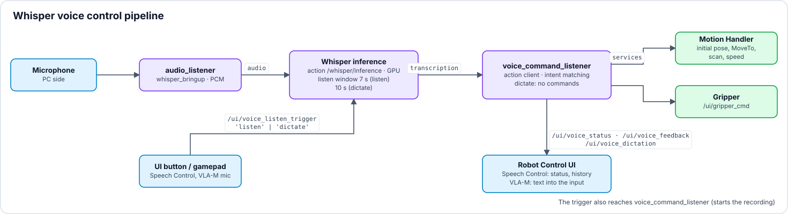
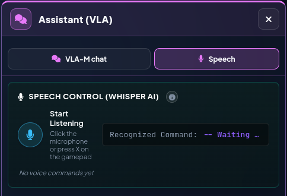
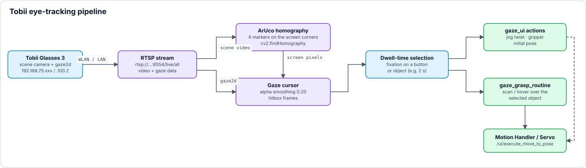

<a name="top"></a>

# 🗣️ Voice & Gaze Control

[🏠 Overview](../readme-en.html) · [🇩🇪 Deutsch](../de/voice_gaze.html) · Chapter 3.4

---

## 3.4 Feature: Multimodal Interaction (Voice & Gaze Control)
*These experimental modules allow for "hands-free" control of the system.*

### Whisper AI Voice Control Pipeline
<p align="center"></p>

*Whisper voice control pipeline · source: `tools/make_diagrams.py`*



*UX | Control Interface (formerly Robot Control UI), area **Assistant (VLA) › Speech**: **Start Listening** (click the microphone or press X on the gamepad → `/ui/voice_listen_trigger`), the recognized command (`/ui/voice_status`) and the list of the last voice commands.*

### Tobii Eye-Tracking Pipeline
<p align="center"></p>

*Tobii eye-tracking pipeline · source: `tools/make_diagrams.py`*

---

<br>

###  `bringup.launch.py` (`whisper_bringup`) &nbsp;&nbsp; <sub><i>`/src/ros2_whisper/whisper_bringup/launch/bringup.launch.py`</i></sub>

**Purpose & Task:** Local Speech-to-Text AI. Transcribes the microphone stream with Whisper and publishes the spoken words as text.

<details>
<summary><b>🔽 Show details</b> · Run Command · Action Server</summary>

> [!NOTE]
> 💻 **Run Command:**
> ```bash
> # GPU Acceleration (CUDA - Default):
> ros2 launch whisper_bringup bringup.launch.py use_gpu:=true
> 
> # CPU Fallback:
> ros2 launch whisper_bringup bringup.launch.py use_gpu:=false
> ```
>
> - **Listen Window Instead of Continuous Operation:** Inference only runs for `listen_window_ms` (default 7000 ms) after a `listen` trigger on `/ui/voice_listen_trigger` (the listener's recording lasts 5 s), or `dictation_window_ms` (default 10000 ms) after a `dictate` trigger (dictation from the VLA-M section: the listener records up to `dictation_max_s` = 8 s, executes no voice commands and publishes `Listening...` / `Dictation: <text>` / `-- No speech detected --` / `Error: …` on `/ui/voice_dictation`). Before, Whisper transcribed the full buffer every 250 ms even in silence (constant GPU load, log flood). `listen_window_ms: 0` restores continuous mode.
> - **Model & Decoding (`whisper_server/config/whisper.yaml`):** Multilingual `small` model (EN/DE, noticeably cleaner than `base`, ~50-120 ms per pass on the RTX A5000; downloaded to `~/.cache/whisper.cpp` on first start), `language: "auto"`, greedy decoding (`beam_size: 1`), `temperature: 0.0`, `no_context: true`. `initial_prompt` stays empty on purpose: with a command prompt Whisper hallucinated text in silence and ran slower (tested). The bundled whisper.cpp version has no VAD - the old `silero_vad_use_cuda` argument has no effect.
> - **GPU / CPU:** `use_gpu:=true|false`. In the UX | Nexus Launcher (formerly Nexus Webapp) the Speech Control card has a **Whisper CPU | GPU** toggle in the launch popup. With `use_gpu:=false` the launch file additionally loads the **CPU profile** `whisper_cpu.yaml`: `small` needs ~11 s per pass on the CPU - longer than the listener's 5 s recording - so the CPU profile uses `base`, 12 threads and `audio_ctx: 320` (encoder over 6.4 s instead of 30 s): ~0.35-0.75 s per pass, commands recognized after ~3 s (measured on the i9-12900K). The `ggml_cuda_init … found 1 CUDA devices` lines also appear in CPU mode (the library is built with CUDA); what matters is `use gpu = 0` and the `Decoding: … CPU` log line.
> - **Launch arguments (`bringup.launch.py`):** `use_gpu` (default `true`), `active` (default `true`, start with the whisper node active), `device_index` (PyAudio device, `-1` = default), `model_name` and `language` (empty = value from `whisper.yaml` or the CPU profile; applied after the CPU profile).
> - **Performance & Thread-Safety:** The underlying C++ Action Server (`TranscriptManager`) has been heavily fortified with a strict `std::mutex` locking mechanism to entirely eliminate parallel data-race crashes during high-frequency token generation. Additionally, the `Inference` node features a hardened buffer clearing strategy (`audio_ring_->clear()`) which physicaly purges stale audio residuals from the microphone Ring Buffer the exact millisecond the user activates the UI button, mathematically guaranteeing zero "ghost commands" from previous speech.
>
>
> 
>
>> | Topic / Interface | Msg Type | Description |
>> |---|---|---|
>> | **`/whisper/inference`** | `whisper_idl/action/Inference` | *Action Server providing real-time text transcriptions.* |

</details>

---

<br>

###  `audio_listener.py` &nbsp;&nbsp; <sub><i>`/src/ros2_whisper/audio_listener/audio_listener/audio_listener.py`</i></sub>

**Purpose & Task:** Handles microphone input for the voice command system. Features an automatic, system-aware fallback logic that explicitly scans for and prioritizes the system-default `pulse` or `default` audio devices, guaranteeing reliable voice capture across different hardware environments.

<details>
<summary><b>🔽 Show details</b> · Run Command · Publishes</summary>

> [!NOTE]
> 💻 **Run Command:**
> ```bash
> ros2 launch whisper_bringup bringup.launch.py use_gpu:=true
> ```
>
>
> 
>
>> | Topic / Interface | Msg Type | Description |
>> |---|---|---|
>> | **`~/audio`** | `std_msgs/Int16MultiArray` | *Publishes the raw audio stream from the microphone.* |

</details>

---

<br>

###  `voice_command_listener.py` &nbsp;&nbsp; <sub><i>`/src/voice_command_listener/voice_command_listener/voice_command_listener.py`</i></sub>

**Purpose & Task:** Analyzes discrete single-shot raw text using regex patterns to extract defined action intents: stop ("Stop", "Halt", "Cancel" – halts the motion, discards anything pending), emergency stop ("Emergency stop", "E-stop"), initial pose, absolute target pose, scan pose ("Scan the scene"), align tool ("Align TCP"), approach object (object in the manual grasp target field), confirm / discard (path in the MoveIt popup, VLA-M plan; only as a short phrase of up to 3 words and only if exactly one waits; negated – "Don't execute" – it becomes discard; other negated commands such as "Don't go home" trigger nothing), open / close gripper ("Suction off / on"; opening only after "Confirm" unless the gripper reports *open*/*off*), speed level ("Speed three" → `Speed: 3`, "Minimum speed" → `Speed: 1`; raises by one level at most), faster, slower. The patterns live in `COMMAND_PATTERNS` (`voice_command_listener.py`, matched on the normalized text: lower case, ae/oe/ue/ss, no punctuation); the UX | Control Interface executes them via `VOICE_COMMANDS_DATA` (`js/voice.js`); stop and emergency stop win over any other command in the sentence ("Stop, do not approach the object" = stop), also pass during the cooldown (`cooldown_sec`, 3 s) and the node triggers them itself as well (`/ui/emergency_stop_topic`, `/ui/halt_motion`), so they work without an open UX | Control Interface. All other commands run only in a visible tab. Initial pose, absolute target pose, scan pose and align tool go through `requestMotion` (`js/motion.js`) like the buttons: with Auto-Move off the motion waits in the MoveIt popup and starts only after "Confirm" (or ▶); "Discard", "Stop", an emergency stop and a lost connection discard it. Test: `src/voice_command_listener/test/test_commands.py`. Home needs a clear phrase ("go home", "home position", "reset pose", "initial pose"); a lone "home" or "reset" triggers nothing. Features high tolerance for similar-sounding Whisper outputs (e.g. recognizing "pause" or "power" as "pose"). Implements a robust **3-layer deduplication state machine** to guarantee exactly-once command execution. Whisper noise tags such as `[BLANK_AUDIO]`, `(sighs)` or `*music*` are stripped before matching. The node plays **no sound of its own**: the "robot moves to ..." announcement comes from `robot_motion_handler_movegroup` only once the motion really starts.

<details>
<summary><b>🔽 Show details</b> · Run Command · Subscribes · Publishes · Services · Action Client</summary>

> [!NOTE]
> 💻 **Run Command:**
> ```bash
> # Whisper + listener together (UX | Nexus Launcher card "Speech Control"):
> ros2 launch voice_command_listener voice_listener.launch.py use_gpu:=true
>
> # Listener only (Whisper already running):
> ros2 run voice_command_listener voice_command_listener
> ```
>
>
> 
>
>> | Topic / Interface | Msg Type | Description |
>> |---|---|---|
>> | **`/ui/voice_listen_trigger`** | `std_msgs/String` | *Starts one recording from the Web UI or Gamepad (X): `listen` = voice command, `dictate` = dictation for VLA-M (longer, executes no commands).* |
>
>
> 
>
>> | Topic / Interface | Msg Type | Description |
>> |---|---|---|
>> | **`/ui/voice_feedback`** | `std_msgs/String` | *Recognised voice command (e.g. `Home`, `Stop`); the UX \| Control Interface executes it.* |
>> | **`/ui/voice_status`** | `std_msgs/String` | *Status for the UI: `Listening...`, `Transcription: <text>`, `-- No speech detected --`, `Error: …`.* |
>> | **`/ui/voice_dictation`** | `std_msgs/String` | *Dictation text and status for the VLA-M input field (trigger `dictate`).* |
>> | **`/ui/emergency_stop_topic`** | `std_msgs/Empty` | *Voice command `E-Stop` triggers the emergency stop directly.* |
>
>
> 
>
>> | Topic / Interface | Msg Type | Description |
>> |---|---|---|
>> | **`/whisper/inference`** | `whisper_idl/action/Inference` | *Calls Whisper AI speech recognition Action Server.* |
>> | *-* | *-* | *⚡ **Early Cancellation:** If a valid voice command is identified within the intermediate feedback, the listener instantly triggers the action and sends an early cancel command (`cancel_goal_async()`).* |
>> | *-* | *-* | *🛡️ **3-Layer Deduplication:** **(1)** Feedback text dedup, **(2)** Residual audio detection, **(3)** Global cooldown (parameter `cooldown_sec`, default 3 s).* |
>> | *-* | *-* | *🔒 **Singleton Lock:** Uses `/tmp/voice_command_listener.lock` to prevent duplicate instances.* |
>
>
> 
>
>> | Topic / Interface | Msg Type | Description |
>> |---|---|---|
>> | **`/voice_cmd/last`** | `std_srvs/srv/Trigger` (Server) | *Returns the last successfully recognized voice command.* |
>> | **`/ui/halt_motion`** | `std_srvs/srv/Trigger` (Client) | *Voice command `Stop` halts the current motion.* |
>
> The `whisper_server` runs the multilingual `small` model with `language: "auto"` for English and German commands (see `whisper.yaml`; no `initial_prompt`, it causes hallucinations in silence).

</details>

---

<br>

###   `gaze_ui_node_tobii_glasses.py` / `gaze_ui_node_tobii_glasses_zedm.py` (`gaze_control_ui_tobii_glasses`) &nbsp;&nbsp; <sub><i>`/src/gaze_control_ui_tobii_glasses/gaze_control_ui_tobii_glasses`</i></sub>

**Purpose & Task:** A master control user interface (PyQt5). Maps eye-tracking gaze points (via RTSP gaze data) to button clicks (e.g., at 1 sec fixation time) and sends movement and gripper commands through the safety chain: own client of `remote_control_watchdog` (kind `gaze`). **GAZE ON** requests control (approve in the UX | Control Interface on the robot PC), **GAZE OFF** releases it; without control no driving, HOME or gripper. Two variants of the script exist for different camera setups:

<details>
<summary><b>🔽 Show details</b> · Features · Run Command · Subscribes · Publishes · Services</summary>

> [!NOTE]
> 💻 **Run Command:**
> ```bash
> # Legacy (Raspberry Pi Camera):
> ros2 run gaze_control_ui_tobii_glasses gaze_ui
> 
> # ZED Mini Camera:
> ros2 run gaze_control_ui_tobii_glasses gaze_ui_zedm
> ```
>
> - **`gaze_ui_node_tobii_glasses.py` (Raspberry Pi):** The classic variant. Utilizes a full-screen Chromium web browser (`QWebEngineView`) in the background to display the HTTP livestream (MJPEG) of the Raspberry Pi camera.
> - **`gaze_ui_node_tobii_glasses_zedm.py` (ZED M):** The modern variant for the 3D Vision setup. Drops the memory-intensive web browser for the main stream. Instead, the node directly subscribes to the ZED camera's ROS topic (`/zed/zed_node/rgb/image_rect_color`), thread-safely converts the ROS image messages (`bgra8`) into native `QImage`/`QPixmap` objects, and renders them as a resource-efficient background label (`bg_label`). The Picture-in-Picture (PiP) view still uses a small web browser for the Pi stream and hides disruptive RPi Cam Control UI elements via JavaScript injection (DOM manipulation).
> 
> **Shared core `gaze_ui_core.py`** (both scripts only provide the camera background; `gaze_ui_zedm --legacy-cam` = background from IP camera cam1; picture-in-picture cam2 top right below HOME/UP):
> - **RTSP & Data Processing:** Connects to the Tobii glasses via the Real-Time Streaming Protocol (RTSP) at `rtsp://192.168.75.xxx:8554/live/all` (`self.g3_ip` = `net_get('tobii.ip')` from `config/network.yaml`: `tobii.connection: auto` picks the Wi-Fi IP `192.168.75.xxx` or, via Ethernet, `192.168.100.xxx`, whichever network is present on the PC) to receive two streams simultaneously. The video stream is processed with OpenCV to detect the ArUco markers, while the data stream (JSON) provides the raw, normalized `gaze2d` coordinates in real-time. 
> - **Homography Mapping:** Detects 4 ArUco markers on the screen corners via the scene camera. Uses `cv2.findHomography` to precisely project the 3D gaze vector (`gaze2d`) from the RTSP stream onto the 2D UI screen absolute pixels.
> - **Subpixel Accuracy:** Applies `cv2.cornerSubPix` during ArUco marker detection to dramatically reduce camera jitter and stabilize the Homography matrix calculation.
> - **Soft-Landing Brake Zone (Z-Axis):** Implements a dedicated safety logic when moving down. A quadratic brake zone starts at `Z = 40.0 mm` to slow down the arm, and a hard stop is enforced at `Z = 33.0 mm` to prevent any table collisions.
> - **Layout "gaze direction = motion direction":** all buttons flush with the screen edge (220 × 120 px at 1920 × 1080, scaled with the window). FORWARD/BACK top/bottom centre, LEFT/RIGHT left/right centre, UP top right, DOWN bottom right, ROTATE Rz+/Rz− top left, HOME top right, GRIPPER bottom right, GAZE + SPEED + status card bottom left. The centre stays free for the scene.
> - **Hit test & dwell:** 40 px tolerance margin around every button (on overlap the nearest wins), gaze point up to 40 px outside the window clamped to the edge, further out = no button (stop); alpha smoothing 0.20. Dwell time 1.0 s with yellow border + fill bar, triggering plays a click (`ui_mouse_click.mp3`, Pygame). Moving = green button, looking away = stop.
> - **Gaze-loss stop:** no `gaze2d` data for > 300 ms (blink, tracker dropout) or a marker homography older than 1 s hides the cursor and stops any motion. Without glasses (no gaze data ever received) the mouse steers (test mode).
> - **Speed levels (SPEED):** 1 / 2 / 3 = 0.05 / 0.10 / 0.15 servo scale, rotation = 5 × translation (level 2 = 0.5 rad/s); starts at level 2; DOWN moves at level 2 at most.
> - **Status card:** control (`yours`, `waiting for approval in Robot Control UI`, `request denied`, `held by …`, `watchdog offline`), tracking (markers 4/4, gaze lost, mouse mode), Z height from `/ui/eef_position`, speed, gripper. DOWN shows the height as a badge from 40 mm `STOP` from 33 mm and `NO Z` without a Z pose younger than 0.5 s (neither can be triggered).
> - **Buttons:** GAZE (gaze control ON/OFF, starts OFF; while OFF all other buttons are dashed and locked), SPEED, HOME ⌂ (initial pose), GRIPPER (one toggle, vacuum ON/OFF); 1 s lock after switch buttons.
>
>
> 
>
>> | Topic / Interface | Msg Type | Description |
>> |---|---|---|
>> | **`/ui/eef_position`** | `std_msgs/Float32MultiArray` | *Receives the current end-effector position for the Z-axis brake logic.* |
>> | **`/remote/control_state`** | `std_msgs/String` (JSON) | *Control lock of `remote_control_watchdog`: owner, open requests, answers.* |
>> | **`/zed/zed_node/rgb/image_rect_color`** | `sensor_msgs/Image` | *(ZED M variant only) Receives the camera feed.* |
>
>
> 
>
>> | Topic / Interface | Msg Type | Description |
>> |---|---|---|
>> | **`/remote/twist`** | `std_msgs/String` (JSON) | *Cartesian jog to the watchdog's twist gate (control lock, heartbeat, E-stop, floor guard, `max_speed`); no commands → zero twist.* |
>> | **`/remote/heartbeat`** | `std_msgs/String` (JSON) | *Heartbeat every 250 ms, kind `gaze`.* |
>> | **`/remote/control_request`** | `std_msgs/String` (JSON) | *`request` on GAZE ON, `release`/`cancel` on GAZE OFF and on close.* |
>
>
> 
>
>> | Topic / Interface | Msg Type | Description |
>> |---|---|---|
>> | **`/ufactory/set_vacuum_gripper`** | `xarm_msgs/srv/VacuumGripperCtrl` (Client) | *Toggles the vacuum gripper state (only with control).* |
>> | **`/ui/execute_initial_pose`** | `std_srvs/srv/Trigger` (Client) | *Triggers the robot to move to its home pose (only with control).* |

</details>

---

<br>

###  `gaze_grasp_routine_tobii_glasses.py` (`gaze_grasp_routine_tobii_glasses`) &nbsp;&nbsp; <sub><i>`/src/gaze_grasp_routine_tobii_glasses/gaze_grasp_routine_tobii_glasses/gaze_grasp_routine_tobii_glasses.py`</i></sub>

**Purpose & Task:** Enables "telepathic" hands-free object selection and grasping via Tobii Glasses 3.

<details>
<summary><b>🔽 Show details</b> · Run Command · Services · Subscribes · Publishes · Parameters</summary>

> [!NOTE]
> 💻 **Run Command:**
> ```bash
> # Part of RUN DEV SETUP (FAKE and REAL) in the UX | Nexus Launcher:
> # card "Eyetracker - Gaze Control", mode Real World (mode UI Gaze starts gaze_ui instead)
> ros2 run gaze_grasp_routine_tobii_glasses gaze_grasp_routine_tobii_glasses --ros-args -p tobii_ip:=192.168.100.xxx -p dwell_threshold:=2.0
> ```
>
> - **Dwell-Time Selection:** Connects to the Tobii glasses RTSP stream. A background process runs YOLOv8 object detection on the live video stream. If the user's eye-gaze fixates on a recognized object's bounding box for **2.0 seconds** (Dwell-Time, parameter `dwell_threshold`), the system automatically locks onto the target and triggers the grasp sequence.
> - **Homography-based Precision Localization:** After selection, the robot moves to a central "Show Scene" position. The End-Effector (EEF) camera scans the table for 12 known ArUco markers to compute a highly precise `cv2.findHomography` transformation matrix. It then finds the selected object again using YOLO and maps its exact pixel coordinates perfectly into the robot's 3D base reference frame (`cv2.perspectiveTransform`), moving the EEF to hover exactly above the target.
> - **Robust ArUco Tracking:** Detects the markers twice - in the normal and in the horizontally mirrored image - so a calibration board that was accidentally printed mirrored still works. Detection deliberately runs on the raw grayscale image (CLAHE amplified noise inside the markers).
> - **Safety Verification Delay:** Waits 3 seconds after calculating the target coordinates before moving (timer in the hover state). This allows the operator to visually confirm the computed grasping point in the EEF camera before the robot commits to the movement.
> - **Visual Feedback:** Displays two live OpenCV windows: One showing the Tobii stream (with YOLO boxes, gaze point, and dwell-time progress) and a second continuous live-feed ("EEF Debug View") streaming the robot's end-effector camera instantly upon startup via a dedicated background thread.
>
> > [!CAUTION]
> > **Critical Hardware Setup: ArUco Marker Grid**
> > For the homography transformation to work and prevent dangerous collisions, exactly 12 ArUco markers (Size: 3x3 cm, Dictionary: DICT_4X4_50) must be permanently fixed flat on the table (Z=0). The center of each marker must be placed exactly at these coordinates in the robot's base frame:
> > - **ID 0:** X=150mm, Y=150mm  |  **ID 1:** X=150mm, Y=0mm
> > - **ID 2:** X=150mm, Y=-150mm |  **ID 3:** X=150mm, Y=-250mm
> > - **ID 4:** X=250mm, Y=200mm  |  **ID 5:** X=400mm, Y=200mm
> > - **ID 6:** X=425mm, Y=100mm  |  **ID 7:** X=425mm, Y=0mm
> > - **ID 8:** X=425mm, Y=-100mm |  **ID 9:** X=425mm, Y=-200mm
> > - **ID 10:** X=350mm, Y=-200mm|  **ID 11:** X=250mm, Y=-200mm
>
>
> 
>
>> | Topic / Interface | Msg Type | Description |
>> |---|---|---|
>> | **`/ui/execute_move_to_pose`** | `xarm_msgs/srv/MoveCartesian` (Client) | *Commands the robot to execute scan poses and hover over detected targets. Every move only with control: own watchdog client `Gaze Grasp (Tobii)`; a dwell without control sends a request (approve in the UX \| Control Interface), the window shows `NO CONTROL: …`. A running move is not aborted on losing control (E-stop stops it).* |
>
>
> 
>
>> | Topic / Interface | Msg Type | Description |
>> |---|---|---|
>> | **`/ui/sound_enabled`** | `std_msgs/Bool` | *Mutes the acoustic feedback together with the Web UI sound toggle.* |
>> | **`/remote/control_state`** | `std_msgs/String` (latched) | *Control lock of the watchdog (who has control).* |
>
> 
>
>> | Topic / Interface | Msg Type | Description |
>> |---|---|---|
>> | **`/remote/heartbeat`** · **`/remote/control_request`** | `std_msgs/String` | *Watchdog client `Gaze Grasp (Tobii)`: heartbeat and control request.* |
>
> 
>
>> | Parameter | Default | Description |
>> |---|---|---|
>> | `tobii_ip` | `net_get('tobii.ip')` | *IP of the Tobii Glasses 3 from `config/network.yaml` (`tobii.connection: auto`): `192.168.100.xxx` via Ethernet (LAN), `192.168.75.xxx` via Wi-Fi; fallback `192.168.100.xxx`.* |
>> | `dwell_threshold` | `2.0` | *Fixation time [s] on an object before it is selected.* |
>
> *The gaze data does not arrive over a ROS topic — it is read straight from the Tobii Glasses 3 RTSP stream (`rtsp://<tobii-ip>:8554/live/all`, JSON field `gaze2d`). Object detection runs node-internally via YOLOv8 on that same stream.*

</details>

---

[⬅ Previous: 3D Vision & Autonomous Grasping](vision_grasping.html) · [🏠 Overview](../readme-en.html) · [⬆ Top](#top) · [Next: VR Teleoperation (Meta Quest 3) ➡](vr_quest3.html)
