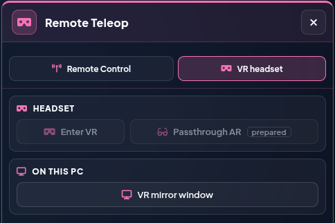

<a name="top"></a>

# 🥽 VR Teleoperation (Meta Quest 3)

[🏠 Overview](../readme-en.html) · [🇩🇪 Deutsch](../de/vr_quest3.html) · Chapter 3.5

---

## 3.5 Feature: VR Quest 3 Teleoperation
*Immersive 6DoF Cartesian teleoperation utilizing Meta Quest 3 VR controllers and WebXR.*

---

<br>

###  `vr_quest3_teleop_node.py` (`vr_quest3_teleop`) &nbsp;&nbsp; <sub><i>`/src/vr_quest3_teleop/vr_quest3_teleop/vr_quest3_teleop_node.py`</i></sub>

**Purpose & Task:** Provides immersive 6DoF Cartesian teleoperation using the Meta Quest 3 VR headset. Translates the VR controller's spatial movements via WebXR into smooth `TwistStamped` velocity commands for MoveIt Servo.

<details>
<summary><b>🔽 Show details</b> · Run Command · Subscribes · Publishes · Services</summary>

> [!NOTE]
> 💻 **Run Command:**
> ```bash
> ros2 launch vr_quest3_teleop vr_quest3_teleop.launch.py
> ```
>
> - Uses a web-based local UI served via **HTTPS** on port `8443` (from `https_vr_webxr_p8443/` inside the `vr_quest3_teleop` package).
> - The launch file **automatically starts a secure ROSbridge instance (WSS)** on port `9091` using SSL certificates (`~/dev_ws/certs/cert.pem`). This is strictly required since WebXR (for spatial 6DoF tracking) mandates a Secure Context (HTTPS/WSS).
> - The WSS bridge runs as its own node `rosbridge_websocket_ssl_9091` with service threads and a 10 s timeout (like the 9090 bridge). It does **not** start its own `/rosapi`: two `/rosapi` nodes (Robot Control UI + VR) made `/rosapi/nodes` hang, which blocked the whole bridge (no joint states in the twin, buttons without effect). `rosapi_guard` starts one only if none is running and stops it again once a second one appears.
> - `vr_quest3_teleop_node` calls `start_servo` on every new grip (servo may have been stopped by a MoveIt path, scan or E-stop in the meantime) and ignores grip, trigger and linear axis while `/ui/emergency_stop_active` is latched.
> - Over HTTPS the UI's ROS-offline dialog shows a link **"Zertifikat für Port 9091 freigeben"** – the Quest has to accept every newly generated certificate once for 8443 **and** 9091. If the PC's IP changes (e.g. another network), the launch adds the new IP to the certificate and keeps the known ones, so the Quest only has to accept each address once. `localhost` is always included (USB with `adb reverse`).
> - Features an integrated WebGL rendering engine (`XRWebGLLayer`) to bypass the native Quest 3 "loading screen" (flying stars) and unlock the controller data streams.
> - **Grip Trigger (middle finger):** Acts as a "clutch". Holding it maps the controller's exact positional delta directly to the robot's end effector (dynamically tracks whichever controller pressed the button).
> - **Index Trigger (index finger):** Toggles the gripper. The node fires both end effectors in one go — the vacuum gripper via `/ufactory/set_vacuum_gripper` and the Lite 6 gripper via `open`/`close_lite6_gripper` — so the same trigger works whichever one is mounted.
> - **Watchdog:** If controller data stops arriving for more than 0.3 s while grip is held (tracking lost, browser stalled, Wi-Fi drop), the node immediately sends a zero twist.
>
> 🥽 **VR viewport (Robot Control UI in the headset):** The `8443` server also serves the complete **Robot Control UI** over HTTPS (`https://<PC-IP>:8443/`), where it connects to the WSS rosbridge on `9091`. Entry points: the VR button 🥽 **Enter VR** in the viewport toolbar with its menu ⌄ (👓 **Passthrough AR**, prepared · 🖥️ **VR mirror window**) and the same three buttons in area **Remote Teleop › VR headset** (groups *Headset* and *On this PC*).
>
> 
>
> *Area Remote Teleop › VR headset on the desktop: Enter VR and Passthrough AR are greyed out until a WebXR browser (Quest 3) opens the page; VR mirror window works on the PC.*
>
> The headset renders the same Digital Twin (`js/twin/xr.js`): live robot, objects, collision objects, ghost and MoveIt plan. In the Quest browser the page starts scaled up – at 100 % browser zoom it looks like it otherwise does at 150 % (CSS zoom, detected via the user agent; `?uizoom=1` turns it off, `?uizoom=auto` back on).
> - **HUD (`js/twin/xr_hud.js`) – cockpit like the desktop:** **safety bar** on top in the order of the desktop header: `TELEOP LIVE | PLAN` · **Mode** FAKE/REAL (REAL filled yellow, the whole bar framed yellow) · robot state (IDLE / MOVING / E-STOP / OFFLINE) · speed `−` `60 %` `+` (repeats while held) · **Control** (click = the same action as the header chip: take/request, cancel, release; someone else's control on the server PC only after a **1 s hold**) · **E-STOP**. Below it the **NOW line** shows what grip, trigger and B do in the current mode; the held button lights up green. Under the bar a **message line** appears only when needed (cause → effect → fix): no ROS connection, E-STOP with *Reset*, collision warning, viewer without control (with *Request control* / *Hold: take over*), warnings (6 s) and errors (until *OK*). **Left column:** MOTION (poses, gripper) and SEQUENCES (selection, last three steps, *Waypoint*, open/close/wait/home, undo, *PLAY*; while running only *Stop sequence*). **Right column = context:** on top, only when something must be decided, the confirmation card – MoveIt path (target, Δ, IK · PLAN · EXECUTE, countdown, *Discard* / *Execute*), *Play sequence?* (cancels itself after 10 s) or the selected object; below TELEMETRY (reach, TCP, floor, joints with limit warning), POSE and, if switched on, the camera window. While a card waits for a decision, TELEMETRY and POSE fold to their header. Nothing covers the robot and the table in the middle. **POSE** is editable: pick the axis (X Y Z in mm, R P Yw in °, the button shows the value), change it with − / + (repeats while held, 10 steps after ~1 s), *Move* goes there like *Go* on the desktop (same fields `#inp-*`). Colours like the desktop: neutral = normal, blue = action/active, green = running, yellow = warning/REAL, red = stop/error only; the function group shows as a thin line on each card header. Collapsed tabs match the desktop; clicking a header toggles both. The bar and both columns can be moved: hold the right trigger on a header or an empty spot and drag – if it would touch another surface, it snaps to the nearest free spot on release. The layout is saved, *Default layout* in the VIEW tab restores it. The HUD stays put while you glance at a column and follows smoothly once you turn further; surfaces stay level. **Y** (left) hides the cards – the safety bar always stays; **A** (right) brings the HUD in front of you. Holding up the wrist panel fades the HUD surfaces behind it (never the safety bar).
> - **VR ⇄ Passthrough inside the session:** if the headset supports `immersive-ar`, every session runs as AR; the VR view covers the camera completely with an opaque backdrop. Switching stops servo/ghost drag first (the rig jumps: VR and passthrough keep separate placements).
> - **Colour groups (`GROUP` in `js/twin/xr_ui.js`):** related functions keep one colour as a thin line on the wrist panel tab and the HUD card header, and on the button map badges: **blue** robot (TELEOP LIVE, poses, speed, linear axis), **violet** planning (PLAN, ghost, TCP gizmo, sequences), **amber** grasping (gripper, objects), **teal** scene (overlays, MoveIt collision, sound), **pink** VR (view, rig, HUD, camera). Surfaces and buttons stay neutral like on the desktop.
> - **Wrist panel (left controller, hidden by default):** header with *Robot Control*, FAKE/REAL and robot state; six tabs `MOTION · PLAN · OBJECTS · SCENE · VIEW · HELP` (active blue, group colour as a thin line), every tab split into labelled sections; the **E-STOP** sits at the bottom in the same place in every tab (with *Reset* next to it when latched). Switches show their state as a slide switch, MoveIt collision and unknown nodes as ON / OFF / INACTIVE; a switched-off entry stays clickable, only what is locked on the desktop too is locked here. Entries mirror the real DOM buttons (state and click). Operated with the right controller's laser + trigger; **X** shows/hides it.
>   - `MOTION`: control mode TELEOP LIVE/PLAN, poses (home, align TCP, scan position, OctoMap), gripper (open, close, off), target pose (same as POSE on the HUD).
>   - `PLAN`: MoveIt phase/target/steps, execute/discard (only when shown on the desktop), TCP gizmo, path preview (ghost), auto-move, gizmo mode, reset gizmo to TCP, last messages.
>   - `OBJECTS`: selected object, Approach from above, Grasp / Place here, collision on/off, list of detected objects.
>   - `SCENE`: overlays (scene objects, safety zone, ZED stand, table, YOLO, virtual objects, distance line, grid, CAD edges), MoveIt collision (objects/ground), sound, viewport panels, test warnings.
>   - `VIEW`: `VIEW` (VR / Passthrough / Nozzle cam), `ALIGN ROBOT` (X/Y/Z/Yaw steppers, base = controller, reset, save) and, pinned at the bottom, `HUD & SESSION` (HUD cards, camera window, button help, default layout, center view, *Hold 1 s: exit VR*).
> - **Button map (`js/twin/xr_controls.js`):** look at a controller and a card appears next to it (outside, facing you) with its current mapping: badges like on the controller (**X/Y/A/B** round, **TRIGGER/GRIP/STICK** as pills, E-stop red) plus action and a short explanation. The rows follow the state (SERVO/PLAN, VR/Passthrough/Kamera Nozzle, laser on UI or a grasp sphere, E-stop latched): anything unavailable right now is dimmed with the reason, each button's badge and accent bar carry the colour of its function group (legend in tab `HELP`), pressed buttons light up in that colour; the card frame keeps the controller's colour. The card stays while you read it, fades when you look away, never covers the laser point, and the left one is hidden while the wrist panel is open. Tab `HELP` in the wrist panel shows both controllers side by side, both modes (click a card to switch) and the on/off switch (also in the VIEW tab, saved per headset).
> - **Kamera Nozzle (`js/twin/xr_nozzle_cam.js`):** button in the VIEW tab. The view sits in the camera on the end effector (on the flange `link_eef`, 7.5 cm behind the nozzle axis, tilted towards +X) and follows the robot while the button is active: the nozzle at the top of the image, the area below the gripper underneath. The tilt (default 30° to the nozzle axis) can be adjusted in the headset and is saved; **A** or “Zentrieren” aligns the camera view with the current gaze direction. Walking/flying are off in this view; servo and ghost drag use the rig from the start of the grip so the moving view cannot drag the robot further. Choosing VR or Passthrough ends the view.
> - **Modes (B, right):** `SERVO` – grip drives MoveIt Servo, trigger toggles the gripper, right stick X **with grip held** moves the linear axis. `PLAN` – the right laser operates the TCP gizmo like the mouse on the desktop: aim at an arrow, plane or ring (it lights up), hold the trigger and drag along it; release runs the same flow as on the desktop (Auto-Move, plan + *Execute*, ghost). The grip additionally drags the ghost freely (1:1 to the hand, orientation too in rotate mode). Execute/discard on the confirmation card at the top of the HUD's right column or in the PLAN tab. Every switch is announced ("Servo" / "Planning Path") – in the headset and in every open desktop UI (topic `/ui/vr_ctrl_mode`).
> - **Select objects:** point the laser at the red grasp sphere + trigger → Target Object; the sphere locks on with the same animation as on the desktop (reticle, rings) and the **object card** (`js/twin/xr_objcard.js`) appears at the top of the HUD's right column, a blue line leads from the object to it; same entries as the same entries as the viewport object menu (`objectMenuSpec` in `js/grasp.js`): *Approach from above* (the path then waits for confirmation on the same card position), *Grasp* or *Put back* / *Place … here* (VLA-M Bridge), *Collision ON/OFF* and *Close*. With REAL, *Grasp*/*Place* ask for a second click like on the desktop. The OBJECTS tab in the wrist panel offers the same actions.
> - **E-stop:** red panel button **or** both grips + both triggers at once. Session end, hidden session (Quest menu) or tracking loss stop servo immediately.
> - **Placement:** left stick = walk (VR only). Right stick **without grip** = fly around the robot (VR only): X orbits around the robot base with the view following, Y raises/lowers. VIEW tab: nudge robot X/Y/Z/Yaw, “Basis = Controller” puts the robot base at the right controller, saved per headset (`localStorage`). Passthrough calibration against the real robot is prepared but not yet tested on hardware.
> - Not in the headset: camera/RViz streams (MJPEG over HTTP is blocked as mixed content on an HTTPS page).
> - **VR mirror on the PC (`vr_mirror.html`, `js/vr_mirror.js`):** the VR mirror button (`fa-display`) in the viewport toolbar of the Robot Control UI opens a window showing what the Quest 3 currently sees. The headset only sends its head pose, controllers, UI panels and twin state (`js/twin/xr_mirror_send.js`, topics `/vr_teleop/mirror_pose`, `/vr_teleop/mirror_state`, `/vr_teleop/mirror_ui`); the PC renders the same digital twin from that position itself. Detections, point cloud and path preview come straight from ROS. The window is passive: it moves nothing and only publishes a heartbeat / resend request on `/vr_teleop/mirror_request`; the headset sends only while a mirror window is open. Mouse wheel = zoom, double-click or `0` = reset zoom, `F` = full screen.
>
>
> 
>
>> | Topic / Interface | Msg Type | Description |
>> |---|---|---|
>> | **`/vr_teleop/controller_data`** | `std_msgs/String` | *Receives JSON-encoded 6DoF controller poses, buttons, and joystick states from WebXR.* |
>
>
> 
>
>> | Topic / Interface | Msg Type | Description |
>> |---|---|---|
>> | **`/remote/twist`** | `std_msgs/String` (JSON) | *Cartesian velocity with the headset's client id (`client` in `controller_data`) → twist gate of `remote_control_watchdog` → MoveIt Servo; gripper and linear axis only while the headset has control (`/remote/control_state`).* |
>> | **`/linear_axis_cmd`** | `std_msgs/Float64` | *Commands linear axis displacement from VR controller thumbsticks.* |
>
>
> 
>
>> | Topic / Interface | Msg Type | Description |
>> |---|---|---|
>> | **`/servo_server/start_servo`** | `std_srvs/srv/Trigger` (Client) | *Ensures MoveIt Servo is active before motion.* |
>> | **`/ufactory/set_vacuum_gripper`** | `xarm_msgs/srv/VacuumGripperCtrl` (Client) | *Toggles the vacuum gripper via index trigger.* |
>> | **`/ufactory/open_lite6_gripper`** | `xarm_msgs/srv/Call` (Client) | *Fallback gripper open command.* |
>> | **`/ufactory/close_lite6_gripper`** | `xarm_msgs/srv/Call` (Client) | *Fallback gripper close command.* |
>
> 🛠️ **System Setup & Usage:**
> 1. **Network & Firewall:** The PC and Quest 3 must be on the same Wi-Fi/Network. If your Ubuntu uses a firewall (UFW), you MUST open the ports for the headset, otherwise the web interface and WebSocket connections will be blocked:
>    ```bash
>    sudo ufw allow 8443/tcp
>    sudo ufw allow 9091/tcp
>    ```
>    *(Alternatively, the headset can be connected via USB-C; ADB port-forwarding bypasses the firewall automatically).*
> 2. **Generate Certificates:** Ensure `cert.pem` and `key.pem` are located in the `~/dev_ws/certs/` folder, otherwise the secure ROSbridge will fail to start.
> 3. **Launch Node:** Start via the **"VR Quest 3 Teleop"** button in the Nexus Webapp or via the launch command above.
> 4. **Accept SSL Certificates in VR (Critical!):** Because self-signed certificates are used, the Meta Quest Browser blocks the connection by default. You MUST manually open and accept **two addresses** sequentially in the headset's browser:
>    - Navigate to `https://<PC-IP>:9091` -> Click "Advanced" -> "Proceed (unsafe)". (You will see a blank page or an error after, this is normal! The WebSocket certificate is now accepted).
>    - Navigate to `https://<PC-IP>:8443/controller_reader.html` -> Click "Advanced" -> "Proceed (unsafe)".
> 5. **Connect VR:** Wait until the webpage displays **"ROS Connected! ✅"** (Port 9091), then click **"Enter VR"**.
> 6. **Control:** Inside the dark VR environment, hold the Grip trigger and move your hand — the robot will follow your movements in real-time with zero latency.
>
> ⚠️ **Troubleshooting:**
> - **Stuck seeing flying stars in VR?** → You might be in the wrong room or started the VR session too early. Reload the page (`https://<PC-IP>:8443/controller_reader.html`).
> - **Webpage says "ROS Connection Closed"?** → You forgot Step 4. You must manually accept the SSL certificate for the WebSocket port `9091` in the browser!
> - **"Input Sources: 0" / No movement?** → Controllers are asleep. Press any button to wake them up.
> - **ADB Error in the terminal?** → If you are using Wi-Fi, you can safely ignore the `adb reverse` error in the terminal. It only appears when no USB cable is connected.

</details>

---

[⬅ Previous: Voice & Gaze Control](voice_gaze.html) · [🏠 Overview](../readme-en.html) · [⬆ Top](#top) · [Next: Robot Control UI & Motion Backend ➡](robot_control_ui.html)
