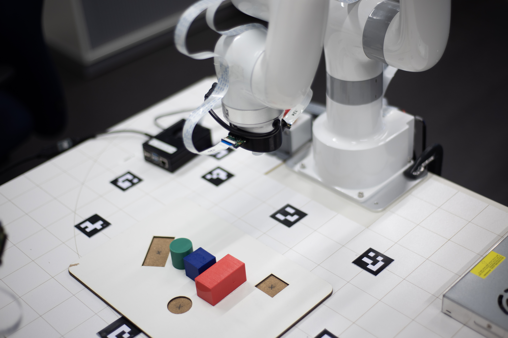
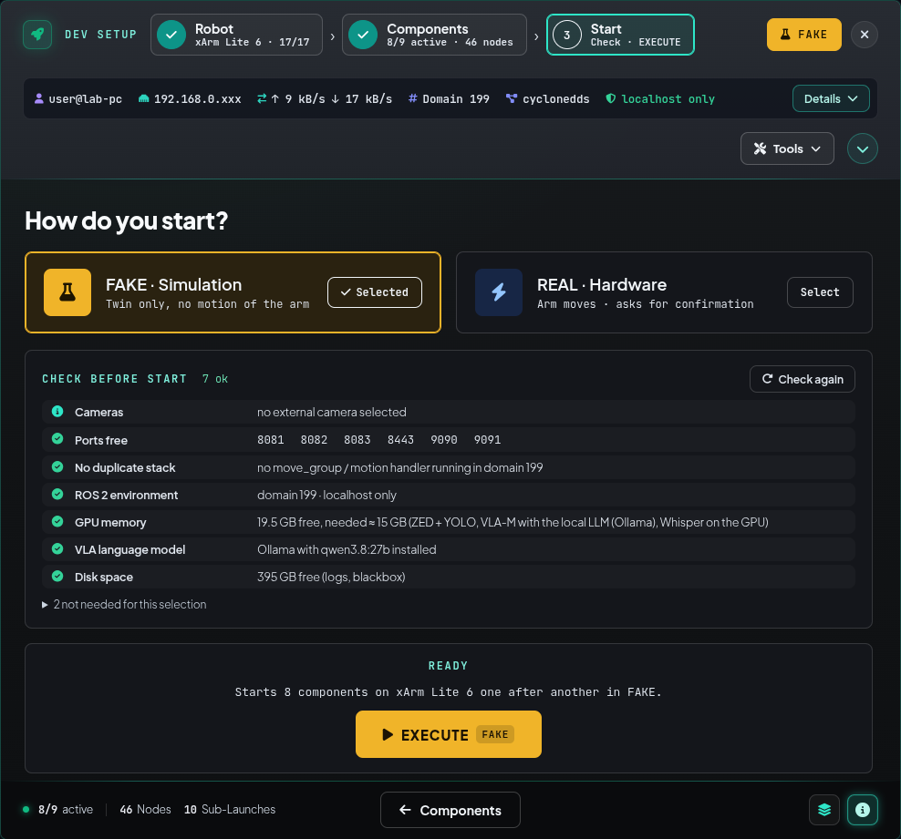
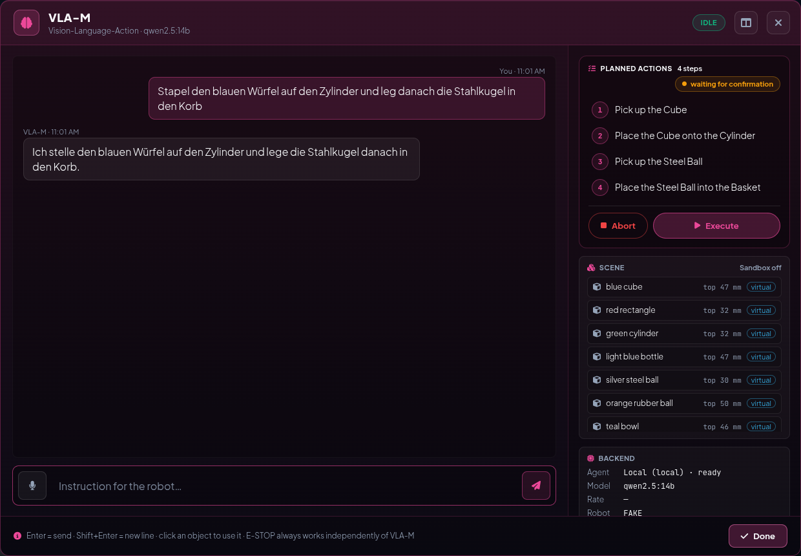
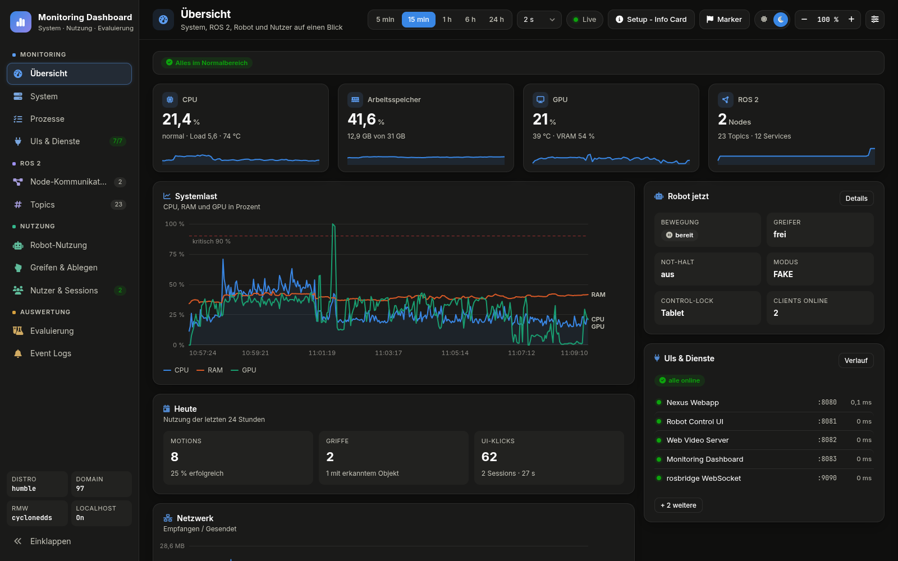

<a name="top"></a>

# Assistive Arm Platform

<p align="center"><b>The human leads. The AI assists.</b><br>Assistive robotics platform for the xArm Lite 6, built on ROS 2 Humble.</p>

<p align="center">
  
  &nbsp;&nbsp;&nbsp;
  
  &nbsp;&nbsp;&nbsp;
  
  &nbsp;&nbsp;&nbsp;
  
</p>

<p align="center">
  <a href="readme-de.html">🇩🇪 <b>Auf Deutsch lesen</b></a> &nbsp;·&nbsp;
  <a href="project_docs.html">📚 <b>Project docs</b></a> &nbsp;·&nbsp;
  <a href="operate_manual.html">📘 <b>Manual</b></a> &nbsp;·&nbsp;
  <a href="operate_setup_guide.html">🛠️ <b>Setup guide</b></a> &nbsp;·&nbsp;
  <a href="poster/poster_a2.pdf">🖼️ <b>Poster (A2)</b></a> &nbsp;·&nbsp;
  🗺️ <b>TODOs</b>
</p>

> [!TIP]
> **📘 Manual (German):** [`docs/operate_manual.html`](operate_manual.html) – system map, safety chain, ports, server/client control, VLA chat.
> [View rendered online](operate_manual.html) · locally via the **Manual** button in the Nexus Webapp (`http://localhost:8080/manuals/operate_manual.html`).
> **🛠️ Setup guide (DE/EN):** [`docs/operate_setup_guide.html`](operate_setup_guide.html) – commissioning step by step, for a pre-installed PC or from bare Ubuntu 22.04 (linked from the project docs, Nexus Webapp footer button **Project docs**).

A research and evaluation platform for **multimodal teleoperation** of the UFactory xArm Lite 6. Eye tracking, voice, gamepad, VR and web UIs – combined with assistive automation – lower the barrier to robot control. The platform follows the *shared control* paradigm (Industry 5.0): the human stays in the loop while the system plans collision-free motion in the background. The system proposes, the human decides (human-in-the-loop). At its centre is a live **Digital Twin**: every motion is shown in 3D before the real arm moves.

<p align="center">
  
</p>

> [!IMPORTANT]
> This is an **extension workspace** on top of the official [xarm_ros2 repository (branch `humble`)](https://github.com/xArm-Developer/xarm_ros2/tree/humble) by UFactory. Its structure and system dependencies are the mandatory baseline.

## ✨ Highlights

| | Feature | Details |
|---|---|---|
| 🎮 | **Teleoperation** – gamepad via MoveIt Servo with a predictive collision guard; remote control from a laptop in the home network (control lock, approval on the robot PC) | [Modes & gamepad](en/teleoperation.html) · [Remote control](en/running.html#75-remote-control-server-client-communication) |
| 🥽 | **VR (Meta Quest 3)** – 6-DoF WebXR teleoperation, Robot Control UI inside the headset, VR mirror on the PC | [VR teleoperation](en/vr_quest3.html) |
| 👁️ | **3D vision & grasping** – ZED Mini + YOLOv8 3D boxes, MoveIt collision objects, OctoMap, collision-free 3-phase grasp, virtual objects for tests without a camera | [Vision & grasping](en/vision_grasping.html) |
| 🗣️ | **Voice & gaze** – Whisper voice commands (EN/DE), Tobii Pro Glasses 3 gaze UI and dwell-time grasping | [Voice & gaze](en/voice_gaze.html) |
| 🧊 | **Digital Twin** – live 3D model of the arm and workcell in the browser (three.js + URDF, `/joint_states`); plan in the Digital Twin with TCP gizmo and ghost preview, then confirm; detected and virtual objects, safety zones, scenes; test new functions risk-free in FAKE mode with the physics sandbox; same Digital Twin in VR and in up to 4 virtual cameras; Isaac Sim as optional shadow Digital Twin | [Concept: Digital Twin](en/concept.html#-digital-twin-first-virtual-then-real) · [Robot Control UI](en/robot_control_ui.html) |
| 🖥️ | **Robot Control UI** (port 8081) – WebGL Digital Twin, jogging, MoveIt planning with ghost preview and TCP gizmo, physics sandbox (robot simulation), motion sequences, dockable HUD, area bar per work step (Move, Teach, Vision, Assistant (VLA), Remote Teleop) with step-by-step guides and settings, camera tiles and virtual cameras (own views of the Digital Twin) in the viewport, command palette (Ctrl+K), Diagnostics drawer (log); all four web UIs in German or English (live switch at the bottom of the theme list, Alt+T) | [Robot Control UI](en/robot_control_ui.html) |
| 🚀 | **Nexus Webapp** (port 8080) – one-click launcher with setups for robot simulation and real robot hardware, launch-tree and config inspection, preflight check before EXECUTE, readiness checks per step, log per start, run restart, config backups, setup info card (network, IPs, ports, PDF export), Touch Panel for an extra touch display | [Running the system](en/running.html) |
| 🤖 | **VLA-M chat – agentic ROS** *(in progress)* – instructions in plain language → LLM agent (local Ollama or Claude) plans pick & place with the scene → execute, grasp check, re-planning; dictation via microphone, one-click *Grasp* / *Place here* from the object menu, auto palletizing (skill `palletize`), *Record demo* for training; LeRobot (SmolVLA / π0.5) planned | [VLA-M](en/vla.html) |
| 📊 | **Monitoring Dashboard** (port 8083) – system load, ROS 2 graph with live rates, robot usage, VLA-M tasks with model comparison (success rate, time to plan, corrections), sessions and evaluation of user studies; **Isaac Sim** as shadow Digital Twin | [Monitoring](en/monitoring.html) · [Isaac Sim](en/isaac_sim.html) |

<p align="center">
  
  
</p>

<p align="center">
  
  
  
</p>

*Top: **Robot Control UI** (area Move: header with E-STOP, area bar, Digital Twin viewport, Cartesian jogging) and **Nexus Webapp** (start popup RUN DEV SETUP, FAKE). Bottom: **VLA-M** with a plan of four steps waiting for *Execute*, **Touch Panel** (view Move) and **Monitoring Dashboard** (overview). All in FAKE mode – more screenshots next to each function in `docs/en/`.*

## 🧱 Built on

| Layer | Software |
|---|---|
| Interfaces | three.js · Rapier · urdf-loader · WebXR · SortableJS · Flask · SQLite · GTK/WebKit · PyQt5 · pygame |
| AI & voice | Ollama (Qwen 3.8) · Claude API · Gemini API · whisper.cpp · LeRobot |
| Perception | ZED SDK 4.1 · CUDA 12 · PyTorch · YOLOv8 · OpenCV · OctoMap · web_video_server |
| Motion | MoveIt 2 · MoveIt Servo · OMPL · xarm_ros2 · ros2_control · joy · Nav2 · RViz 2 |
| Foundation | Ubuntu 22.04 · ROS 2 Humble · Cyclone DDS · rosbridge · roslibjs · rosbag2 · tf2 |
| Tools | colcon · pytest · Headless Chrome · Blender · ffmpeg |

| Role | Hardware |
|---|---|
| Input | Xbox Elite 2 · Meta Quest 3 · touch display |
| Sensors | ZED Mini · 2× Raspberry Pi camera · Tobii Pro Glasses 3 · microphone |
| Workstation | Dell Precision 3660 · CPU Intel Core i9-12900K · GPU NVIDIA RTX A5000 · RAM 32 GB · VRAM 24 GB |
| Robot | UFactory xArm Lite 6 · vacuum gripper |

## 🚀 Quickstart (simulation, no hardware)

```bash
cd ~/dev_ws
colcon build --symlink-install
source install/setup.bash
./ros2_nexus/ros2_nexus_web_start.sh     # Nexus Webapp on http://localhost:8080
```

In the **RUN DEV SETUP** popup choose **FAKE** and press **EXECUTE**: simulated arm, MoveIt Servo + MoveGroup, RViz2 and the Robot Control UI (`http://localhost:8081`) start together. Step-by-step guide: [1.1 Quickstart](en/running.html#11--5-minute-quickstart-pure-simulation).

| UI / service | Port | UI / service | Port |
|---|---|---|---|
| Nexus Webapp (+ `/touch`, `/manuals/…`) | `8080` | Monitoring Dashboard | `8083` |
| Robot Control UI | `8081` | rosbridge WS / WSS | `9090` / `9091` |
| Web Video Server | `8082` | VR WebXR (Robot Control UI via HTTPS) | `8443` |

All ports: [7.4 Network & ports](en/running.html#74-network--port-architecture).

## 📚 Documentation

| Page | Chapter | Content |
|---|---|---|
| [🔬 Concept & architecture](en/concept.html) | 1, 2, 4 | Motivation, shared control, guiding principles, interaction concepts |
| [📦 Installation](en/installation.html) | 6 | Requirements, hardware BOM, Tobii and ZED setup, build |
| [🚀 Running the system](en/running.html) | 1.1, 7 | Quickstart, Nexus Webapp, ports, remote control, DDS tuning, FAQ |
| [🎮 Modes & gamepad](en/teleoperation.html) | 3.1, 3.2, 5 | FAKE vs. REAL, collision guard, gamepad pipeline in depth |
| [👁️ Vision & grasping](en/vision_grasping.html) | 3.3 | ZED / IP camera, YOLO 3D, MoveIt collision, grasp executors |
| [🗣️ Voice & gaze](en/voice_gaze.html) | 3.4 | Whisper pipeline, voice intents, Tobii gaze UI and grasp routine |
| [🥽 VR Quest 3](en/vr_quest3.html) | 3.5 | WebXR teleoperation, VR HUD, setup and troubleshooting |
| [🖥️ Robot Control UI & motion](en/robot_control_ui.html) | 3.6 | Web UI features, Touch Panel, motion handler, RViz overlays and markers |
| [🧊 Isaac Sim](en/isaac_sim.html) | 3.7 | Shadow-mode Digital Twin |
| [🤖 VLA-M chat](en/vla.html) | 4.3 | LLM agent (agentic ROS): plan → check → execute → recover, safety, roadmap |
| [📊 Monitoring](en/monitoring.html) | 8 | Monitoring Dashboard: system, usage and evaluation |
| [🗂️ Repository structure](en/repository_structure.html) | 9 | Annotated file tree |
| [🗄️ Archive](en/archive.html) | 10 | Deprecated concepts and why |

## 🗂️ Repository at a glance

| Path | Content |
|---|---|
| `src/` | Own ROS 2 packages (UIs, vision, motion, teleoperation, gaze, voice, VLA, blackbox and demo recorder) plus vendored `xarm_ros2`, `zed-ros2-*`, `ros2_whisper`, `web_video_server` |
| `ros2_nexus/` | Nexus Webapp (Flask, not a ROS package) and `launcher_config.json` |
| `touch_panel/` | Touch Panel for an additional touch display (served by the Nexus Webapp at `/touch`) |
| `docs/` | This documentation (EN / DE) and its screenshots |
| `docs/{project,present,operate,develop}_*.html` · `poster/` | Project pages with area prefix (present_ · operate_ · develop_): docs hub, presentation, control modes & safety chain, function atlas, setup guide, operator manual, workflow (HTML) · A2 project poster (HTML/PDF) |
| `config/` · `tools/` · `ui_shared/` | Central network addresses (`network.yaml`) · checks and helpers (`ui_new_code_checker.py`, `grasp_e2e.py`, `vla_eval.py`, `check_ws.py`, `check_ports.py`, `make_diagrams.py`, `pre-commit` hook, `firewall_setup.sh`) · shared UI tokens |
| `_imgs/` · `sounds/` · `isaacsim/` | Images and icons · UI sounds and voice prompts · NVIDIA Isaac Sim checkout with `start_isaac_sim.sh` (local per PC, not in Git) |
| `video/` · `references/` | Presentation videos (templates, sources) · external sources: datasheets, manuals, papers (index `references/README.md`) |

## 📈 Status

- **Ready:** gamepad, VR and web teleoperation, MoveIt planning with preview, 3D vision and grasping (ZED Mini), voice and gaze control, Nexus Webapp, remote control in the home network, blackbox recorder (last 60 s as rosbag2 on E-STOP/collision).
- **In progress:** VLA-M chat (LLM agent, tested in the robot simulation with the physics sandbox; demos are recorded, model training planned), physics sandbox.
- **Open decisions:** TODOS.md (German).

## ⚖️ License

Apache License 2.0 for the own packages, the Nexus Webapp, the Touch Panel and the tools. Vendored code (`xarm_ros2`, `zed-ros2-*`, `ros2_whisper`, `web_video_server`, libraries under `lib/` and `vendor/`) keeps its own license.
